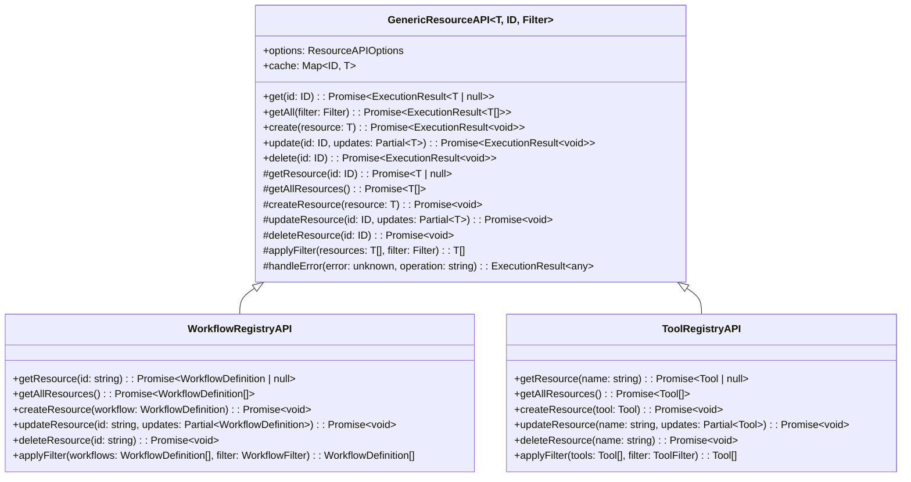

# SDK API 层重构设计文档

## 1. 背景与目标

### 1.1 当前问题
- **代码重复**: 各个 `*RegistryAPI` 类中存在大量重复的 CRUD 方法实现
- **职责不清**: 资源管理 API 与 Command/Query 模式并存，用户需要在两种风格间切换
- **配置分散**: 构造函数参数和配置选项在不同 API 类中不一致
- **错误处理不统一**: 各个 API 类的错误处理方式和格式不一致
- **缓存策略不一致**: 有些 API 有缓存，有些没有，缓存逻辑重复实现

### 1.2 改进目标
- **提高内聚性**: 通过通用基类减少重复代码，提高模块内聚性
- **增强清晰度**: 统一 API 风格和错误处理，提高易用性
- **提升可维护性**: 通过设计模式降低耦合度，便于后续维护和扩展
- **保持向后兼容**: 确保现有代码无需修改即可继续使用

## 2. 设计模式应用

### 2.1 Generic Repository 模式 + Template Method 模式

#### 2.1.1 核心思想
- 创建通用的 `GenericResourceAPI<T, ID, Filter>` 基类
- 通过模板方法定义通用流程，具体实现由子类提供
- 统一处理缓存、错误处理、日志等横切关注点

#### 2.1.2 类图


### 2.2 Factory 模式

#### 2.2.1 核心思想
- 创建 `APIFactory` 工厂类统一管理 API 实例创建
- 支持全局配置和依赖注入
- 提供一致的 API 创建接口

#### 2.2.2 工厂类设计
```typescript
interface SDKAPIConfig {
  workflow?: ResourceAPIOptions;
  tool?: ResourceAPIOptions;
  thread?: ResourceAPIOptions;
  // ... 其他资源配置
}

class APIFactory {
  static getInstance(): APIFactory;
  configure(config: SDKAPIConfig): void;
  createWorkflowAPI(): WorkflowRegistryAPI;
  createToolAPI(): ToolRegistryAPI;
  // ... 其他API创建方法
}
```

### 2.3 Decorator 模式

#### 2.3.1 核心思想
- 通过装饰器动态添加功能（缓存、日志、验证等）
- 支持运行时功能组合
- 保持核心逻辑的纯净性

#### 2.3.2 装饰器示例
```typescript
// 缓存装饰器
function withCache<T extends GenericResourceAPI<any, any, any>>(
  target: T,
  options?: { ttl?: number }
): T;

// 日志装饰器  
function withLogging<T extends GenericResourceAPI<any, any, any>>(
  target: T
): T;

// 使用示例
const workflowAPI = withCache(withLogging(new WorkflowRegistryAPI()));
```

### 2.4 Strategy 模式

#### 2.4.1 核心思想
- 将过滤和验证逻辑提取为独立的策略类
- 支持运行时策略切换
- 提高算法的可复用性

#### 2.4.2 策略接口
```typescript
interface FilterStrategy<T, Filter> {
  apply(items: T[], filter: Filter): T[];
}

interface ValidationStrategy<T> {
  validate(item: T): ValidationResult;
}
```

## 3. 详细接口设计

### 3.1 通用资源 API 基类

```typescript
interface ResourceAPIOptions {
  enableCache?: boolean;      // 是否启用缓存
  cacheTTL?: number;          // 缓存过期时间（毫秒）
  enableValidation?: boolean; // 是否启用验证
  enableLogging?: boolean;    // 是否启用日志
}

abstract class GenericResourceAPI<T, ID extends string | number, Filter = any> {
  // 抽象方法 - 子类必须实现
  abstract getResource(id: ID): Promise<T | null>;
  abstract getAllResources(): Promise<T[]>;
  abstract createResource(resource: T): Promise<void>;
  abstract updateResource(id: ID, updates: Partial<T>): Promise<void>;
  abstract deleteResource(id: ID): Promise<void>;
  abstract applyFilter(resources: T[], filter: Filter): T[];

  // 通用方法 - 提供标准实现
  async get(id: ID): Promise<ExecutionResult<T | null>>;
  async getAll(filter?: Filter): Promise<ExecutionResult<T[]>>;
  async create(resource: T): Promise<ExecutionResult<void>>;
  async update(id: ID, updates: Partial<T>): Promise<ExecutionResult<void>>;
  async delete(id: ID): Promise<ExecutionResult<void>>;
  
  // 受保护的辅助方法
  protected isCacheValid(id: ID): boolean;
  protected updateCache(id: ID, resource: T): void;
  protected clearRelatedCache(): void;
  protected handleError(error: unknown, operation: string): ExecutionResult<any>;
}
```

### 3.2 统一错误处理系统

```typescript
enum APIErrorCode {
  // 资源相关错误
  RESOURCE_NOT_FOUND = 'RESOURCE_NOT_FOUND',
  RESOURCE_ALREADY_EXISTS = 'RESOURCE_ALREADY_EXISTS',
  RESOURCE_VALIDATION_FAILED = 'RESOURCE_VALIDATION_FAILED',
  
  // 权限相关错误
  UNAUTHORIZED = 'UNAUTHORIZED',
  FORBIDDEN = 'FORBIDDEN',
  
  // 系统错误
  INTERNAL_ERROR = 'INTERNAL_ERROR',
  SERVICE_UNAVAILABLE = 'SERVICE_UNAVAILABLE',
  
  // 参数错误
  INVALID_PARAMETER = 'INVALID_PARAMETER',
  MISSING_PARAMETER = 'MISSING_PARAMETER'
}

interface APIErrorDetails {
  code: APIErrorCode;
  message: string;
  details?: Record<string, any>;
  timestamp: number;
  requestId?: string;
}

class APIError extends Error {
  public readonly code: APIErrorCode;
  public readonly details?: Record<string, any>;
  public readonly timestamp: number;
  public readonly requestId?: string;
}
```

### 3.3 API 工厂

```typescript
interface SDKAPIConfig {
  workflow?: ResourceAPIOptions;
  tool?: ResourceAPIOptions;
  thread?: ResourceAPIOptions;
  script?: ResourceAPIOptions;
  profile?: ResourceAPIOptions;
  nodeTemplate?: ResourceAPIOptions;
  triggerTemplate?: ResourceAPIOptions;
}

class APIFactory {
  private static instance: APIFactory;
  private config: SDKAPIConfig = {};

  private constructor() {}

  public static getInstance(): APIFactory;
  public configure(config: SDKAPIConfig): void;
  
  public createWorkflowAPI(): WorkflowRegistryAPI;
  public createToolAPI(): ToolRegistryAPI;
  public createThreadAPI(): ThreadRegistryAPI;
  public createScriptAPI(): ScriptRegistryAPI;
  public createProfileAPI(): ProfileRegistryAPI;
  public createNodeTemplateAPI(): NodeRegistryAPI;
  public createTriggerTemplateAPI(): TriggerTemplateRegistryAPI;
  
  public createAllAPIs(): {
    workflows: WorkflowRegistryAPI;
    tools: ToolRegistryAPI;
    threads: ThreadRegistryAPI;
    scripts: ScriptRegistryAPI;
    profiles: ProfileRegistryAPI;
    nodeTemplates: NodeRegistryAPI;
    triggerTemplates: TriggerTemplateRegistryAPI;
  };
}
```

## 4. 迁移策略

### 4.1 分阶段迁移

#### 阶段1: 引入通用基类 (1-2周) ✅ 已完成
- 创建 `GenericResourceAPI` 基类
- 重构一个 API 类作为试点（如 `WorkflowRegistryAPI`）
- 验证功能正确性和性能影响

#### 阶段2: 批量重构 (2-3周) ✅ 已完成
- 逐个重构其他 API 类
- 更新单元测试
- 确保向后兼容性

#### 阶段3: 引入工厂和装饰器 (1-2周) ✅ 已完成
- 实现 `APIFactory` ✅
- 实现装饰器模式 ✅
- 更新 SDK 入口 ✅

**实现内容：**
- 创建了 `APIFactory` 工厂类，支持统一配置和实例管理
- 实现了装饰器模式：`withCache`、`withLogging`、`withPerformance`、`withRetry`
- 更新了 `SDK` 类以使用工厂模式
- 更新了 `SDKOptions` 类型以支持API配置选项
- 更新了 `index.ts` 导出新的工厂和装饰器功能

#### 阶段4: 增强错误处理和事件系统 (1周) ✅ 已完成
- 实现统一错误处理 ✅
- 增强事件驱动架构 ✅
- 添加操作审计日志 ✅

**实现内容：**
- 创建了 `APIError` 错误类和 `APIErrorCode` 错误码枚举
- 实现了 `DefaultErrorHandler` 和 `ErrorHandlerRegistry`
- 创建了 `APIEventBus` 事件总线，支持事件订阅和发布
- 实现了 `APIEventBuilder` 事件构建器
- 创建了 `AuditLogger` 审计日志系统
- 实现了 `InMemoryAuditLogStorage` 内存存储
- 编写了完整的单元测试
- 创建了使用指南文档

### 4.2 向后兼容性保证

#### 4.2.1 接口兼容
- 保持所有公共方法签名不变
- 保持构造函数参数兼容（支持旧参数）
- 保持返回值类型兼容

#### 4.2.2 行为兼容
- 保持相同的错误抛出行为
- 保持相同的缓存行为
- 保持相同的性能特征

#### 4.2.3 渐进式采用
- 新功能通过新接口提供
- 旧接口标记为 deprecated 但继续工作
- 提供迁移指南和工具

### 4.3 测试策略

#### 4.3.1 单元测试
- 为通用基类编写全面的单元测试
- 为每个重构后的 API 类编写集成测试
- 验证向后兼容性

#### 4.3.2 集成测试
- 验证端到端工作流
- 验证性能影响
- 验证错误处理场景

#### 4.3.3 回归测试
- 运行现有的所有测试用例
- 确保没有破坏现有功能
- 验证边界条件处理

## 5. 预期收益

### 5.1 代码质量提升
- **减少重复代码**: 预计减少 60-70% 的重复代码
- **提高内聚性**: 每个模块职责更加单一和清晰
- **降低耦合度**: 通过接口和抽象类降低模块间依赖

### 5.2 开发体验改善
- **统一 API 风格**: 用户只需学习一种 API 使用模式
- **更好的错误信息**: 统一的错误码和详细的错误信息
- **灵活的配置**: 支持细粒度的配置选项

### 5.3 可维护性增强
- **易于扩展**: 新的资源类型只需继承基类并实现抽象方法
- **易于调试**: 统一的日志和错误处理便于问题定位
- **易于测试**: 通用的测试框架可以复用

### 5.4 性能优化
- **智能缓存**: 统一的缓存策略避免重复实现
- **批量操作**: 支持更高效的批量操作
- **资源管理**: 更好的资源清理和内存管理

## 6. 风险评估与缓解

### 6.1 技术风险
- **性能影响**: 通用基类可能引入额外的开销
  - **缓解措施**: 性能基准测试，优化关键路径
- **复杂性增加**: 抽象层次增加可能使代码更难理解
  - **缓解措施**: 完善文档，提供清晰的使用示例

### 6.2 兼容性风险
- **破坏现有代码**: 重构可能意外破坏现有功能
  - **缓解措施**: 全面的回归测试，渐进式发布
- **API 行为变化**: 缓存或错误处理行为可能发生变化
  - **缓解措施**: 严格的行为兼容性测试

### 6.3 项目风险
- **开发周期延长**: 重构工作量可能超出预期
  - **缓解措施**: 分阶段实施，优先处理高价值模块
- **团队适应成本**: 团队需要学习新的设计模式
  - **缓解措施**: 提供培训和文档，逐步引入

## 7. 实施计划

### 7.1 时间线
- **第1-2周**: 阶段1 - 通用基类实现和试点
- **第3-5周**: 阶段2 - 批量重构
- **第6-7周**: 阶段3 - 工厂和装饰器
- **第8周**: 阶段4 - 错误处理和事件系统
- **第9周**: 测试、文档和发布

### 7.2 资源需求
- **开发人员**: 2-3 名开发人员
- **测试人员**: 1 名测试人员
- **文档**: 技术文档和迁移指南

### 7.3 里程碑
- **M1**: 通用基类完成，Workflow API 重构完成
- **M2**: 所有资源 API 重构完成
- **M3**: 工厂模式和装饰器模式完成
- **M4**: 统一错误处理完成，全面测试通过
- **M5**: 正式发布

## 8. 结论

通过引入 Generic Repository、Factory、Decorator 和 Strategy 等设计模式，可以显著提高 SDK API 层的清晰度、内聚性和可维护性。该方案在保持向后兼容性的同时，为未来的功能扩展和性能优化奠定了良好的基础。