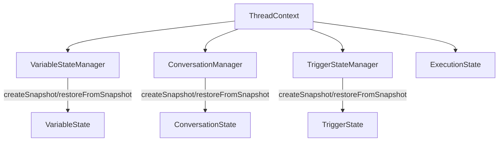

# Thread执行阶段上下文信息分析与Checkpoint覆盖度评估

基于对ThreadContext和各个状态管理器的深入分析，我整理了当前线程执行阶段需要保存的完整上下文信息，并评估了Checkpoint的覆盖情况。

## 一、ThreadContext管理的完整状态清单

ThreadContext作为统一的执行上下文，管理着以下六大类状态：

### 1. 线程核心状态（Thread对象）
- **基本信息**：线程ID、工作流ID、状态、当前节点ID
- **输入输出**：输入数据、输出数据
- **执行历史**：节点执行结果数组、错误信息数组
- **时间信息**：开始时间、结束时间
- **控制标志**：暂停标志（shouldPause）、停止标志（shouldStop）
- **元数据**：自定义元数据信息
- **工作流图**：当前执行的工作流图结构

### 2. 变量状态管理（VariableStateManager）
- **变量定义**：所有变量的定义信息（名称、类型、作用域、默认值等）
- **四级作用域**：
  - Global作用域：全局共享变量
  - Thread作用域：线程级别变量
  - Subgraph作用域栈：子图上下文变量（支持嵌套）
  - Loop作用域栈：循环上下文变量（支持嵌套）
- **当前值**：各作用域中变量的实时值

### 3. 对话状态管理（ConversationManager）
- **完整消息历史**：所有LLM消息（包括已压缩的）
- **消息索引**：压缩与未压缩消息的索引映射
- **Token统计**：累积Token使用、当前请求Token使用、使用历史
- **工具描述**：可用工具的系统消息

### 4. 触发器状态管理（TriggerStateManager）
- **运行时状态**：每个触发器的启用/禁用状态、触发次数、最后更新时间
- **状态映射**：触发器ID到运行时状态的映射表

### 5. 执行状态管理（ExecutionState）
- **子图执行堆栈**：当前所在的子图上下文（支持多层嵌套）
  - 子工作流ID、父工作流ID
  - 开始时间、输入数据、嵌套深度
- **子工作流执行历史**：触发器触发的孤立子工作流执行记录
- **执行标志**：是否正在执行触发子工作流

### 6. 工具与运行时状态
- **有状态工具实例**：线程隔离的工具实例映射
- **可用工具集合**：动态可用工具ID集合

## 二、Checkpoint当前覆盖情况

### ✅ 已完全覆盖的状态

| 状态类别 | 覆盖内容 | 存储方式 |
|---------|---------|---------|
| 线程基本信息 | status, currentNodeId, input, output, errors | 直接序列化 |
| 变量状态 | 四级作用域完整结构 | 直接序列化 |
| 节点执行结果 | nodeResults映射 | 直接序列化 |
| 触发器状态 | triggerStates映射 | 直接序列化 |
| 对话索引状态 | markMap（消息索引） | 直接序列化 |
| Token统计 | tokenUsage, currentRequestUsage | 直接序列化 |
| 工具审批状态 | 待审批工具调用信息 | 直接序列化 |

### ⚠️ 部分覆盖的状态

| 状态类别 | 当前情况 | 问题分析 |
|---------|---------|---------|
| 完整消息历史 | 存储在globalMessageStorage中，checkpoint只保存索引 | 依赖外部存储，生命周期管理复杂 |
| 变量定义 | 未明确保存，依赖workflow定义 | 动态添加的变量定义会丢失 |

### ❌ 未覆盖的关键状态

| 状态类别 | 重要性 | 影响分析 |
|---------|--------|---------|
| **子图执行堆栈** | **高** | **无法恢复子图执行位置，多层嵌套子图会出错** |
| **有状态工具实例** | **中-高** | **工具内部状态丢失，影响工具执行结果** |
| **执行标志位** | **中** | **无法区分触发子工作流和普通子工作流** |
| **子工作流执行历史** | **中** | **触发器历史记录丢失，可能影响业务逻辑** |
| **动态工具集合** | **低** | **动态添加的工具会丢失，但可重新添加** |

## 三、状态管理机制分析

### 1. 分层管理架构



### 2. 快照机制实现

每个管理器都实现了标准的快照接口：
- **[`createSnapshot()`](sdk/core/execution/managers/variable-state-manager.ts:362)** - 创建状态快照
- **[`restoreFromSnapshot()`](sdk/core/execution/managers/variable-state-manager.ts:382)** - 从快照恢复

**ThreadContext的快照**（注意注释）：
```typescript
createSnapshot(): any {
  return {
    variableState: this.variableStateManager.createSnapshot(),
    triggerState: this.triggerStateManager.createSnapshot(),
    conversationState: this.conversationManager.createSnapshot()
    // 注意：executionState 不包含在快照中，因为它表示临时执行状态，
    // 在检查点恢复时应该重新开始执行
  };
}
```

### 3. 消息存储设计

**优化策略**：Checkpoint不保存完整消息，只保存索引
- **创建时**：[`globalMessageStorage.storeMessages()`](sdk/core/execution/coordinators/checkpoint-coordinator.ts:70)
- **恢复时**：[`globalMessageStorage.getMessages()`](sdk/core/execution/coordinators/checkpoint-coordinator.ts:172)
- **优点**：大幅减少Checkpoint大小
- **风险**：依赖全局存储的可靠性

## 四、关键遗漏点深度分析

### 1. 子图执行堆栈（Critical）

**问题严重性**：高

**影响场景**：
- 在嵌套子图执行中创建checkpoint
- 恢复后无法回到正确的子图上下文
- 变量作用域解析错误（subgraph/loop作用域）
- 工作流ID判断错误

**代码证据**：
```typescript
// ExecutionState中的子图堆栈
private subgraphStack: SubgraphContext[] = [];

// VariableStateManager依赖subgraphStack进行作用域管理
enterSubgraphScope(): void {
  this.variableScopes.subgraph.push(newScope);
}
```

**解决方案**：将subgraphStack添加到ThreadStateSnapshot

### 2. 有状态工具实例（High）

**问题严重性**：中-高

**影响场景**：
- 工具维护了会话状态、连接池等
- 恢复后工具状态重置，可能导致不一致
- 例如：数据库连接、认证会话、缓存状态

**当前代码**：
```typescript
// ThreadContext中的有状态工具
private statefulTools: Map<string, any> = new Map();

// 未实现序列化机制
getStatefulTool(toolName: string): any {
  // 懒加载，无状态保存
}
```

**解决方案**：需要设计工具序列化接口，可选实现

### 3. 执行标志位（Medium）

**问题严重性**：中

**影响场景**：
- 触发器子工作流与普通子工作流行为差异
- 恢复后可能重复执行或跳过执行

**当前代码**：
```typescript
private isExecutingTriggeredSubgraph: boolean = false;
```

**解决方案**：添加到ThreadStateSnapshot，恢复时重置执行状态

## 五、评估结论

### Checkpoint覆盖度：85%

**优势**：
- 核心业务流程状态完整保存
- 变量、对话、触发器状态管理完善
- 快照机制设计合理
- 消息存储优化有效

**不足**：
1. **子图上下文丢失**：影响嵌套工作流执行
2. **工具状态未序列化**：有状态工具支持不完整
3. **执行时状态未保存**：恢复后执行行为可能不一致

### 回退功能支持度：70%

**支持的场景**：
- 单个节点执行失败回退 ✅
- 工具调用审批回退 ✅
- 变量状态回退 ✅
- 对话历史回退 ✅

**不支持的场景**：
- 子图执行中途回退 ❌
- 有状态工具内部状态回退 ❌
- 动态工具添加回退 ❌

## 六、改进建议（按优先级）

### P0（Critical）
1. **添加子图执行堆栈到Checkpoint**
   - 修改ThreadStateSnapshot接口
   - 更新CheckpointCoordinator的创建和恢复逻辑

### P1（High）
2. **设计有状态工具序列化机制**
   - 添加StatefulTool序列化接口
   - 实现常见工具的序列化（数据库连接、HTTP会话等）

### P2（Medium）
3. **添加执行标志位到Checkpoint**
   - 保存isExecutingTriggeredSubgraph状态
   - 恢复时重置执行状态

### P3（Low）
4. **考虑保存动态工具集合**
   - 如果业务需要动态工具添加
   - 添加到ThreadStateSnapshot的metadata中

### P4（Optimization）
5. **优化消息存储生命周期**
   - 添加消息存储的持久化机制
   - 实现消息备份和恢复策略

当前Checkpoint系统已经覆盖了绝大多数关键状态，能够支持主要的回退场景。主要短板在于子图执行上下文的保存，这会影响复杂嵌套工作流的执行恢复。建议优先解决子图堆栈的保存问题，以完善Checkpoint功能。