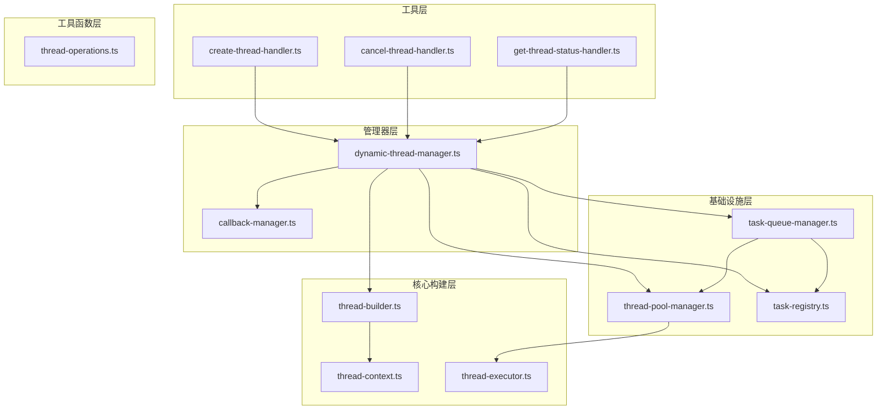
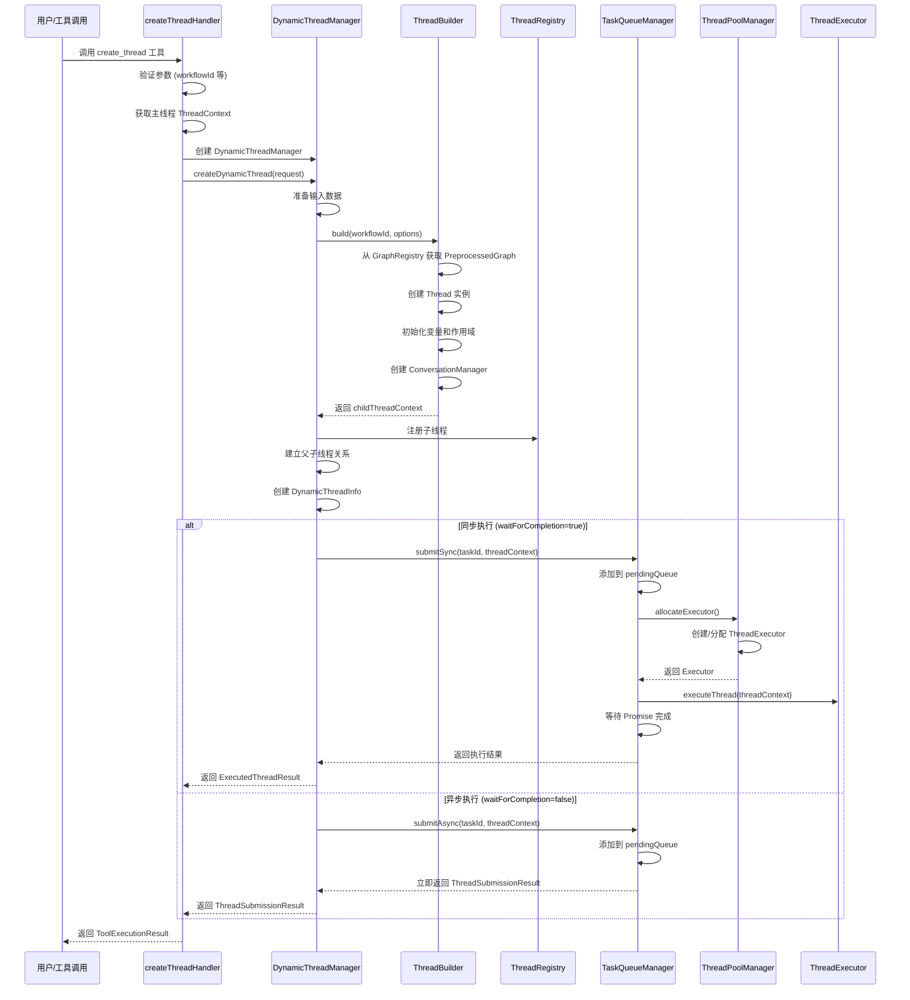
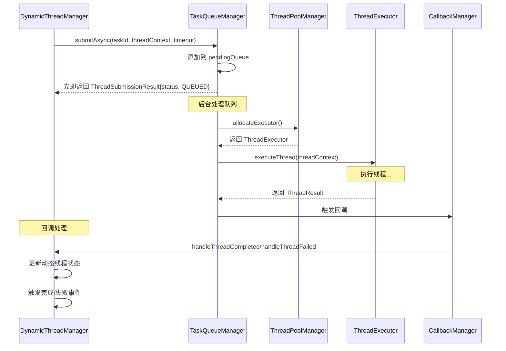
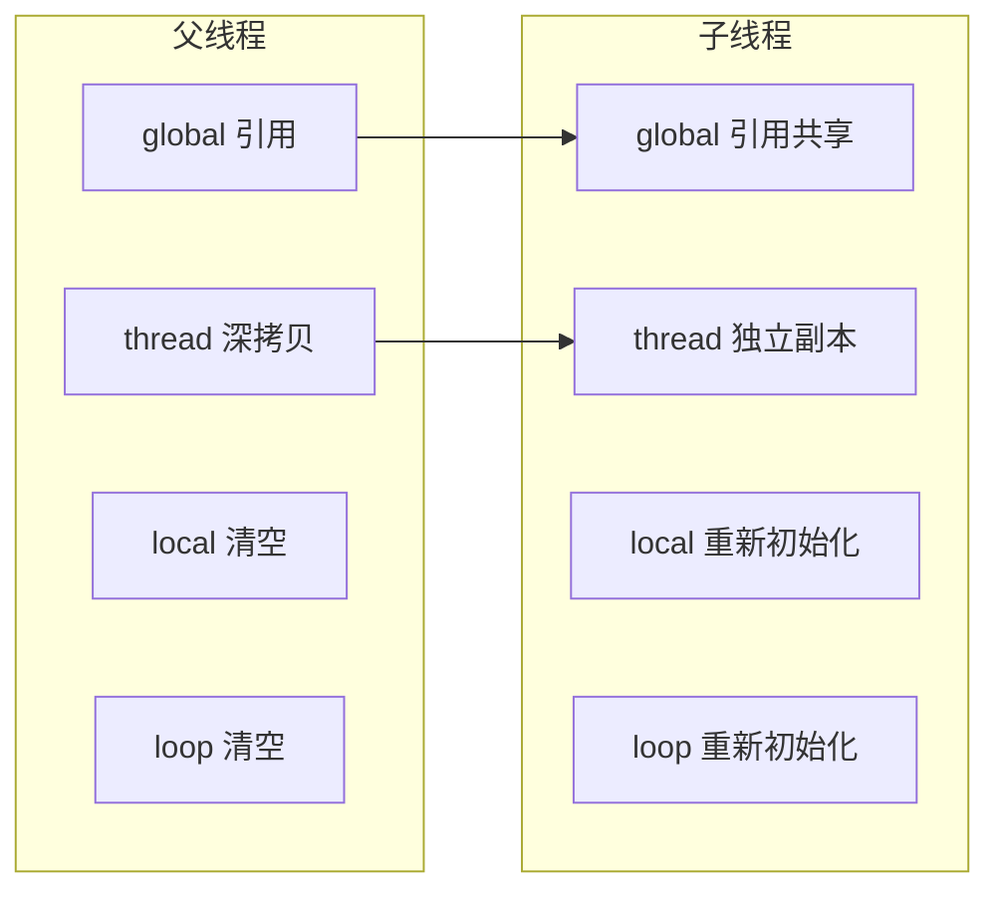

# 动态 Thread 创建功能实现分析

## 1. 概述

本项目中的动态 Thread 创建功能主要用于在运行时动态创建和执行子工作流线程。该功能支持两种执行模式：**同步执行**（阻塞等待完成）和**异步执行**（立即返回，后台执行）。

## 2. 核心组件架构

### 2.1 组件关系图



### 2.2 核心组件职责

| 组件 | 文件路径 | 职责 |
|------|----------|------|
| **CreateThreadHandler** | [`sdk/core/execution/handlers/tool-handlers/create-thread-handler.ts`](sdk/core/execution/handlers/tool-handlers/create-thread-handler.ts:1) | 接收工具调用请求，解析参数并创建 DynamicThreadManager |
| **DynamicThreadManager** | [`sdk/core/execution/managers/dynamic-thread-manager.ts`](sdk/core/execution/managers/dynamic-thread-manager.ts:1) | 动态线程管理器，负责创建和管理动态子线程 |
| **CallbackManager** | [`sdk/core/execution/managers/callback-manager.ts`](sdk/core/execution/managers/callback-manager.ts:1) | 管理异步回调和事件监听器 |
| **TaskQueueManager** | [`sdk/core/execution/managers/task-queue-manager.ts`](sdk/core/execution/managers/task-queue-manager.ts:1) | 管理待执行的线程队列，协调任务分配 |
| **ThreadPoolManager** | [`sdk/core/execution/managers/thread-pool-manager.ts`](sdk/core/execution/managers/thread-pool-manager.ts:1) | 管理 ThreadExecutor 实例池，实现动态扩缩容 |
| **ThreadBuilder** | [`sdk/core/execution/thread-builder.ts`](sdk/core/execution/thread-builder.ts:1) | 负责从 WorkflowRegistry 获取 WorkflowDefinition 并创建 ThreadContext 实例 |
| **ThreadOperations** | [`sdk/core/execution/utils/thread-operations.ts`](sdk/core/execution/utils/thread-operations.ts:1) | 提供无状态的 Fork/Join/Copy 等线程操作工具函数 |

## 3. 动态 Thread 创建流程

### 3.1 完整调用链



### 3.2 核心代码流程

#### 3.2.1 CreateThreadHandler 入口

```typescript
// sdk/core/execution/handlers/tool-handlers/create-thread-handler.ts:65-158
export async function createThreadHandler(
  action: CreateThreadRequest,
  triggerId: string,
  executionContext: ExecutionContext
): Promise<ToolExecutionResult> {
  // 1. 验证参数
  if (!action.workflowId) {
    throw new ToolError('workflowId is required', 'create-thread');
  }

  // 2. 获取主线程 ThreadContext
  const threadRegistry = executionContext.getThreadRegistry();
  const currentThreadId = executionContext.getCurrentThreadId();
  const mainThreadContext = threadRegistry.get(currentThreadId);

  // 3. 创建 DynamicThreadManager
  const taskRegistry = executionContext.getTaskRegistry();
  const dynamicThreadManager = new DynamicThreadManager(executionContext, taskRegistry);

  // 4. 创建线程请求
  const request: CreateDynamicThreadRequest = {
    workflowId: action.workflowId,
    input: action.input || {},
    triggerId: action.triggerId || triggerId,
    mainThreadContext,
    config: action.config
  };

  // 5. 调用 DynamicThreadManager 创建线程
  const result = await dynamicThreadManager.createDynamicThread(request);

  // 6. 处理返回结果（区分同步/异步）
  if ('threadContext' in result) {
    // 同步执行结果
    return { success: true, result: {...}, executionTime };
  } else {
    // 异步执行结果
    return { success: true, result: {...}, executionTime };
  }
}
```

#### 3.2.2 DynamicThreadManager.createDynamicThread

```typescript
// sdk/core/execution/managers/dynamic-thread-manager.ts:124-175
async createDynamicThread(request: CreateDynamicThreadRequest): Promise<ExecutedThreadResult | ThreadSubmissionResult> {
  // 1. 验证参数
  if (!request.workflowId || !request.mainThreadContext) {
    throw new Error('workflowId and mainThreadContext are required');
  }

  // 2. 准备输入数据
  const input = this.prepareInputData(request);

  // 3. 创建子线程 ThreadContext
  const childThreadContext = await this.createChildThreadContext(request, input);

  // 4. 注册到 ThreadRegistry
  this.threadRegistry.register(childThreadContext);

  // 5. 建立父子线程关系
  const parentThreadId = request.mainThreadContext.getThreadId();
  const childThreadId = childThreadContext.getThreadId();
  request.mainThreadContext.registerChildThread(childThreadId);
  childThreadContext.setParentThreadId(parentThreadId);

  // 6. 创建动态线程信息
  const dynamicThreadInfo: DynamicThreadInfo = {
    id: childThreadId,
    threadContext: childThreadContext,
    status: 'QUEUED',
    submitTime: now(),
    parentThreadId
  };
  this.dynamicThreads.set(childThreadId, dynamicThreadInfo);

  // 7. 触发开始事件
  await this.emitStartedEvent(request, childThreadContext);

  // 8. 根据配置选择执行方式
  const waitForCompletion = request.config?.waitForCompletion !== false;
  const timeout = request.config?.timeout || this.threadPoolManager.getConfig().defaultTimeout;

  if (waitForCompletion) {
    return await this.executeSync(childThreadContext, timeout);
  } else {
    return this.executeAsync(childThreadContext, timeout);
  }
}
```

#### 3.2.3 ThreadBuilder.build

```typescript
// sdk/core/execution/thread-builder.ts:57-163
async build(workflowId: string, options: ThreadOptions = {}): Promise<ThreadContext> {
  // 1. 从 graph-registry 获取已预处理的图
  const graphRegistry = container.get(Identifiers.GraphRegistry);
  const preprocessedGraph = graphRegistry.get(workflowId);

  if (!preprocessedGraph) {
    throw new ExecutionError(`Workflow '${workflowId}' not found`);
  }

  // 2. 从 PreprocessedGraph 构建 ThreadContext
  return this.buildFromPreprocessedGraph(preprocessedGraph, options);
}

private async buildFromPreprocessedGraph(
  preprocessedGraph: PreprocessedGraph, 
  options: ThreadOptions = {}
): Promise<ThreadContext> {
  // 1. 验证预处理后的图（必须有 START 和 END 节点）
  
  // 2. 创建 Thread 实例
  const threadId = generateId();
  const thread: Partial<Thread> = {
    id: threadId,
    workflowId: preprocessedGraph.workflowId,
    status: 'CREATED',
    currentNodeId: startNode.id,
    graph: threadGraphData,
    variables: [],
    variableScopes: {
      global: {},
      thread: {},
      local: [],
      loop: []
    },
    input: options.input || {},
    output: {},
    nodeResults: [],
    startTime: now(),
    errors: [],
    shouldPause: false,
    shouldStop: false
  };

  // 3. 从 PreprocessedGraph 初始化变量
  this.variableCoordinator.initializeFromWorkflow(thread as Thread, preprocessedGraph.variables || []);

  // 4. 创建 ConversationManager 实例
  const conversationManager = new ConversationManager({...});

  // 5. 创建 ThreadContext
  const threadContext = new ThreadContext(
    thread as Thread,
    conversationManager,
    this.executionContext.getThreadRegistry(),
    this.workflowRegistry,
    this.executionContext.getEventManager(),
    this.executionContext.get('toolService'),
    this.executionContext.get('llmExecutor')
  );

  // 6. 初始化变量和工具可见性
  threadContext.initializeVariables();
  threadContext.initializeToolVisibility();

  return threadContext;
}
```

## 4. 同步/异步执行模式

### 4.1 同步执行流程

```mermaid
sequenceDiagram
    participant DTManager as DynamicThreadManager
    participant TaskQM as TaskQueueManager
    participant PoolM as ThreadPoolManager
    participant TExecutor as ThreadExecutor
    participant CallbackMgr as CallbackManager

    DTManager->>TaskQM: submitSync(taskId, threadContext, timeout)
    TaskQM->>TaskQM: 创建 Promise
    TaskQM->>TaskQM: 添加到 pendingQueue
    TaskQM->>PoolM: allocateExecutor()
    PoolM-->>TaskQM: 返回 ThreadExecutor
    TaskQM->>TaskQM: 更新任务状态为 RUNNING
    TaskQM->>TExecutor: executeThread(threadContext)
    
    Note over TExecutor: 执行线程...
    
    TExecutor-->>TaskQM: 返回 ThreadResult
    TaskQM->>CallbackMgr: 触发回调 resolve
    TaskQM-->>DTManager: 返回 ExecutedSubgraphResult
    DTManager->>DTManager: 注销父子关系
    DTManager-->>调用者：返回 ExecutedThreadResult
```

### 4.2 异步执行流程



## 5. ThreadBuilder 的三种创建方法

### 5.1 createFork - 创建 Fork 子线程

用于 Fork/Join 模式，创建并行执行的子线程。

```typescript
// sdk/core/execution/thread-builder.ts:302-370
async createFork(parentThreadContext: ThreadContext, forkConfig: any): Promise<ThreadContext> {
  const parentThread = parentThreadContext.thread;
  const forkThreadId = generateId();

  // 1. 分离 thread 和 global 变量
  const threadVariables: any[] = [];
  for (const variable of parentThread.variables) {
    if (variable.scope === 'thread') {
      threadVariables.push({ ...variable });
    }
    // global 变量不复制到子线程，而是通过引用共享
  }

  const forkThread: Partial<Thread> = {
    id: forkThreadId,
    workflowId: parentThread.workflowId,
    status: 'CREATED',
    currentNodeId: forkConfig.startNodeId || parentThread.currentNodeId,
    variables: threadVariables,
    // 四级作用域：global 通过引用共享，thread 深拷贝，local 和 loop 清空
    variableScopes: {
      global: parentThread.variableScopes.global,  // 引用共享
      thread: { ...parentThread.variableScopes.thread },  // 深拷贝
      local: [],  // 清空
      loop: []  // 清空
    },
    input: { ...parentThread.input },
    output: {},  // 重置输出
    nodeResults: [],  // 清空执行历史
    threadType: 'FORK_JOIN',
    forkJoinContext: {
      forkId: forkConfig.forkId,
      forkPathId: forkConfig.forkPathId
    }
  };

  // 2. 复制 ConversationManager 实例
  const forkConversationManager = parentThreadContext.conversationManager.clone();

  // 3. 创建并返回 ThreadContext
  const forkThreadContext = new ThreadContext(forkThread as Thread, forkConversationManager, ...);
  forkThreadContext.initializeVariables();
  forkThreadContext.initializeToolVisibility();

  return forkThreadContext;
}
```

### 5.2 createCopy - 创建 Thread 副本

用于创建 Thread 的完整副本（如 Triggered Subworkflow 场景）。

```typescript
// sdk/core/execution/thread-builder.ts:235-294
async createCopy(sourceThreadContext: ThreadContext): Promise<ThreadContext> {
  const sourceThread = sourceThreadContext.thread;
  const copiedThreadId = generateId();

  const copiedThread: Partial<Thread> = {
    id: copiedThreadId,
    workflowId: sourceThread.workflowId,
    status: 'CREATED',
    currentNodeId: sourceThread.currentNodeId,
    variables: sourceThread.variables.map((v: any) => ({ ...v })),
    // 四级作用域：global 通过引用共享，thread 深拷贝，local 和 loop 清空
    variableScopes: {
      global: sourceThread.variableScopes.global,
      thread: { ...sourceThread.variableScopes.thread },
      local: [],
      loop: []
    },
    input: { ...sourceThread.input },
    output: { ...sourceThread.output },
    nodeResults: sourceThread.nodeResults.map((h: any) => ({ ...h })),
    threadType: 'TRIGGERED_SUBWORKFLOW',
    triggeredSubworkflowContext: {
      parentThreadId: sourceThread.id,
      childThreadIds: [],
      triggeredSubworkflowId: ''
    }
  };

  // 复制 ConversationManager 实例
  const copiedConversationManager = sourceThreadContext.conversationManager.clone();

  // 创建并返回 ThreadContext
  const copiedThreadContext = new ThreadContext(copiedThread as Thread, copiedConversationManager, ...);
  copiedThreadContext.initializeVariables();
  copiedThreadContext.initializeToolVisibility();

  return copiedThreadContext;
}
```

### 5.3 build - 从 Workflow 构建新 Thread

用于从预处理的图构建全新的 ThreadContext。

```typescript
// sdk/core/execution/thread-builder.ts:57-74
async build(workflowId: string, options: ThreadOptions = {}): Promise<ThreadContext> {
  // 1. 从 graph-registry 获取已预处理的图
  const preprocessedGraph = graphRegistry.get(workflowId);

  if (!preprocessedGraph) {
    throw new ExecutionError(`Workflow '${workflowId}' not found`);
  }

  // 2. 从 PreprocessedGraph 构建 ThreadContext
  return this.buildFromPreprocessedGraph(preprocessedGraph, options);
}
```

## 6. 变量作用域处理

### 6.1 四级作用域设计

| 作用域 | 生命周期 | Fork 处理 | Copy 处理 |
|--------|----------|-----------|-----------|
| **global** | 应用级 | 引用共享 | 引用共享 |
| **thread** | 线程级 | 深拷贝到子线程 | 深拷贝到副本线程 |
| **local** | 节点级 | 清空 | 清空 |
| **loop** | 循环级 | 清空 | 清空 |

### 6.2 作用域继承规则



## 7. ThreadPoolManager 和 TaskQueueManager 协作

### 7.1 线程池管理

```typescript
// sdk/core/execution/managers/thread-pool-manager.ts
class ThreadPoolManager {
  private allExecutors: Map<string, ExecutorWrapper> = new Map();
  private idleExecutors: string[] = [];
  private busyExecutors: Set<string> = new Set();
  private waitingPromises: Array<{resolve, reject}> = [];

  // 分配执行器（线程安全）
  async allocateExecutor(): Promise<any> {
    // 1. 检查是否有空闲执行器
    if (this.idleExecutors.length > 0) {
      const executorId = this.idleExecutors.shift()!;
      const wrapper = this.allExecutors.get(executorId)!;
      wrapper.status = 'BUSY';
      return wrapper.executor;
    }

    // 2. 检查是否可以创建新执行器
    if (this.allExecutors.size < this.config.maxExecutors) {
      const wrapper = this.createExecutor();
      wrapper.status = 'BUSY';
      return wrapper.executor;
    }

    // 3. 等待空闲执行器
    return new Promise((resolve, reject) => {
      this.waitingPromises.push({ resolve, reject });
    });
  }

  // 释放执行器
  async releaseExecutor(executor: any): Promise<void> {
    // 1. 从忙碌集合移除
    this.busyExecutors.delete(executorId);
    
    // 2. 如果有等待的执行器，唤醒第一个
    if (this.waitingPromises.length > 0) {
      const { resolve } = this.waitingPromises.shift()!;
      resolve(wrapper.executor);
    } else {
      // 3. 否则加入空闲队列
      this.idleExecutors.push(executorId);
    }
  }
}
```

### 7.2 任务队列处理

```typescript
// sdk/core/execution/managers/task-queue-manager.ts
class TaskQueueManager {
  private pendingQueue: QueueTask[] = [];
  private runningTasks: Map<string, QueueTask> = new Map();

  // 处理队列
  private async processQueue(): Promise<void> {
    if (this.isProcessing || this.pendingQueue.length === 0) {
      return;
    }

    this.isProcessing = true;

    try {
      while (this.pendingQueue.length > 0) {
        // 从队列取出第一个任务
        const queueTask = this.pendingQueue.shift()!;
        
        // 分配执行器
        const executor = await this.threadPoolManager.allocateExecutor();
        
        // 更新任务状态
        this.taskRegistry.updateStatusToRunning(queueTask.taskId);
        this.runningTasks.set(queueTask.taskId, queueTask);
        
        // 执行任务
        this.executeTask(executor, queueTask);
      }
    } finally {
      this.isProcessing = false;
    }
  }

  // 执行任务
  private async executeTask(executor: ThreadExecutor, queueTask: QueueTask): Promise<void> {
    try {
      const threadResult = await executor.executeThread(queueTask.threadContext);
      await this.handleTaskCompleted(queueTask, threadResult);
    } catch (error) {
      await this.handleTaskFailed(queueTask, error);
    } finally {
      await this.threadPoolManager.releaseExecutor(executor);
      this.processQueue();  // 继续处理队列
    }
  }
}
```

## 8. ThreadOperations 工具函数

### 8.1 Fork 操作

```typescript
// sdk/core/execution/utils/thread-operations.ts:68-99
export async function fork(
  parentThreadContext: ThreadContext,
  forkConfig: ForkConfig,
  threadBuilder: ThreadBuilder,
  eventManager?: EventManager
): Promise<ThreadContext> {
  // 1. 验证 Fork 配置
  if (!forkConfig.forkId) {
    throw new RuntimeValidationError('Fork config must have forkId');
  }

  // 2. 触发 THREAD_FORK_STARTED 事件
  const forkStartedEvent = buildThreadForkStartedEvent(parentThreadContext, forkConfig);
  await safeEmit(eventManager, forkStartedEvent);

  // 3. 创建子线程
  const childThreadContext = await threadBuilder.createFork(parentThreadContext, forkConfig);

  // 4. 触发 THREAD_FORK_COMPLETED 事件
  const forkCompletedEvent = buildThreadForkCompletedEvent(parentThreadContext, [childThreadContext.getThreadId()]);
  await safeEmit(eventManager, forkCompletedEvent);

  return childThreadContext;
}
```

### 8.2 Join 操作

```typescript
// sdk/core/execution/utils/thread-operations.ts:119-235
export async function join(
  childThreadIds: string[],
  joinStrategy: JoinStrategy,
  threadRegistry: ThreadRegistry,
  mainPathId: string,
  timeout: number = 0,
  parentThreadId?: string,
  eventManager?: EventManager
): Promise<JoinResult> {
  // 1. 验证 Join 配置

  // 2. 触发 THREAD_JOIN_STARTED 事件

  // 3. 等待子 thread 完成（支持多种策略）
  const result = await waitForCompletion(childThreadIds, joinStrategy, threadRegistry, timeoutMs, ...);

  // 4. 根据策略判断是否继续
  if (!validateJoinStrategy(completedThreads, failedThreads, childThreadIds, joinStrategy)) {
    throw new ExecutionError(`Join condition not met: ${joinStrategy}`);
  }

  // 5. 合并子 thread 结果
  const output = mergeResults(completedThreads, joinStrategy);

  // 6. 合并主线程对话历史到父线程
  if (parentThreadId && mainPathId) {
    const mainThread = completedThreads.find(thread =>
      thread.forkJoinContext?.forkPathId === mainPathId
    );
    const mainThreadContext = threadRegistry.get(mainThread.id);
    const clonedMessages = MessageArrayUtils.cloneMessages(mainThreadContext.conversationManager.getMessages());
    for (const msg of clonedMessages) {
      parentThreadContext.conversationManager.addMessage(msg);
    }
  }

  return {
    success: true,
    output,
    completedThreads,
    failedThreads
  };
}
```

### 8.3 Copy 操作

```typescript
// sdk/core/execution/utils/thread-operations.ts:243-265
export async function copy(
  sourceThreadContext: ThreadContext,
  threadBuilder: ThreadBuilder,
  eventManager?: EventManager
): Promise<ThreadContext> {
  // 1. 验证源 thread 存在
  if (!sourceThreadContext) {
    throw new ExecutionError('Source thread context is null or undefined');
  }

  // 2. 触发 THREAD_COPY_STARTED 事件
  const copyStartedEvent = buildThreadCopyStartedEvent(sourceThreadContext);
  await safeEmit(eventManager, copyStartedEvent);

  // 3. 调用 ThreadBuilder 复制 thread
  const copiedThreadContext = await threadBuilder.createCopy(sourceThreadContext);

  // 4. 触发 THREAD_COPY_COMPLETED 事件
  const copyCompletedEvent = buildThreadCopyCompletedEvent(sourceThreadContext, copiedThreadContext.getThreadId());
  await safeEmit(eventManager, copyCompletedEvent);

  return copiedThreadContext;
}
```

## 9. 触发动态 Thread 创建的 Handler

### 9.1 Node Handler - FORK 节点

```typescript
// sdk/core/execution/handlers/node-handlers/fork-handler.ts
export async function forkHandler(thread: Thread, node: Node, context?: any): Promise<any> {
  // Fork 节点作为占位符，实际的 Fork 操作由 ThreadExecutor 调用 ThreadCoordinator 处理
  return {
    nodeId: node.id,
    status: 'SKIPPED',
    step: thread.nodeResults.length + 1,
    executionTime: 0
  };
}
```

### 9.2 Node Handler - JOIN 节点

```typescript
// sdk/core/execution/handlers/node-handlers/join-handler.ts
export async function joinHandler(thread: Thread, node: Node, context?: any): Promise<any> {
  // Join 节点作为占位符，实际的 Join 操作由 ThreadExecutor 处理
  return {
    nodeId: node.id,
    status: 'SKIPPED',
    step: thread.nodeResults.length + 1,
    executionTime: 0
  };
}
```

### 9.3 Tool Handler - create_thread 工具

```typescript
// sdk/core/execution/handlers/tool-handlers/create-thread-handler.ts
export async function createThreadHandler(
  action: CreateThreadRequest,
  triggerId: string,
  executionContext: ExecutionContext
): Promise<ToolExecutionResult> {
  // 完整的动态线程创建逻辑（见上文详细分析）
}
```

### 9.4 Trigger Handler - execute_triggered_subgraph

```typescript
// sdk/core/execution/handlers/trigger-handlers/execute-triggered-subgraph-handler.ts
export async function executeTriggeredSubgraphHandler(
  action: TriggerAction,
  triggerId: string,
  executionContext: ExecutionContext
): Promise<TriggerExecutionResult> {
  // 1. 获取主工作流线程上下文
  const threadRegistry = context.getThreadRegistry();
  const threadId = context.getCurrentThreadId();
  const mainThreadContext = threadRegistry.get(threadId);

  // 2. 准备输入数据
  const input: Record<string, any> = {
    triggerId,
    output: mainThreadContext.getOutput(),
    input: mainThreadContext.getInput()
  };

  // 3. 创建 TriggeredSubworkflowManager 并执行
  // ...
}
```

## 10. 数据类型定义

### 10.1 DynamicThreadConfig

```typescript
// sdk/core/execution/types/dynamic-thread.types.ts:83-96
export interface DynamicThreadConfig {
  /**
   * 是否等待完成
   * - true: 同步执行，调用者会阻塞直到线程完成
   * - false: 异步执行，调用者立即返回，线程在后台执行
   */
  waitForCompletion?: boolean;
  /** 超时时间（毫秒） */
  timeout?: number;
  /** 是否记录历史 */
  recordHistory?: boolean;
  /** 元数据 */
  metadata?: any;
}
```

### 10.2 DynamicThreadInfo

```typescript
// sdk/core/execution/types/dynamic-thread.types.ts:17-36
export interface DynamicThreadInfo {
  /** 线程 ID */
  id: string;
  /** 线程上下文 */
  threadContext: ThreadContext;
  /** 线程状态 */
  status: TaskStatus;
  /** 提交时间 */
  submitTime: number;
  /** 开始执行时间 */
  startTime?: number;
  /** 完成时间 */
  completeTime?: number;
  /** 执行结果（成功时） */
  result?: ThreadResult;
  /** 错误信息（失败时） */
  error?: Error;
  /** 父线程 ID */
  parentThreadId?: string;
}
```

### 10.3 ForkConfig

```typescript
// sdk/core/execution/utils/thread-operations.ts:35-44
export interface ForkConfig {
  /** Fork 操作 ID */
  forkId: string;
  /** Fork 策略（serial 或 parallel） */
  forkStrategy?: 'serial' | 'parallel';
  /** 起始节点 ID（可选，默认使用父线程的当前节点） */
  startNodeId?: string;
  /** Fork 路径 ID（用于标识子线程路径） */
  forkPathId?: string;
}
```

### 10.4 JoinStrategy

```typescript
// sdk/core/execution/utils/thread-operations.ts:49
export type JoinStrategy = 
  | 'ALL_COMPLETED'        // 等待所有线程完成
  | 'ANY_COMPLETED'        // 等待任意线程完成
  | 'ALL_FAILED'           // 等待所有线程失败
  | 'ANY_FAILED'           // 等待任意线程失败
  | 'SUCCESS_COUNT_THRESHOLD';  // 成功数量达到阈值
```

## 11. 事件系统

### 11.1 动态线程事件类型

```typescript
// sdk/core/execution/types/dynamic-thread.types.ts:115-121
export type DynamicThreadEventType =
  | 'DYNAMIC_THREAD_SUBMITTED'   /** 线程已提交 */
  | 'DYNAMIC_THREAD_STARTED'     /** 线程已开始 */
  | 'DYNAMIC_THREAD_COMPLETED'   /** 线程已完成 */
  | 'DYNAMIC_THREAD_FAILED'      /** 线程失败 */
  | 'DYNAMIC_THREAD_CANCELLED'   /** 线程已取消 */
  | 'DYNAMIC_THREAD_TIMEOUT';    /** 线程超时 */
```

### 11.2 Thread 事件类型

```typescript
// sdk/core/execution/utils/event/event-builder.ts
- THREAD_FORK_STARTED
- THREAD_FORK_COMPLETED
- THREAD_JOIN_STARTED
- THREAD_JOIN_CONDITION_MET
- THREAD_COPY_STARTED
- THREAD_COPY_COMPLETED
```

## 12. 总结

### 12.1 设计特点

1. **模块化设计**：各组件职责清晰，Handler 负责参数解析，Manager 负责业务逻辑，Builder 负责对象创建
2. **同步/异步支持**：通过 `waitForCompletion` 配置灵活选择执行模式
3. **线程池复用**：ThreadPoolManager 实现执行器的动态扩缩容和空闲回收
4. **事件驱动**：完整的事件通知机制，支持事件监听和回调
5. **作用域隔离**：四级变量作用域设计，支持 global 引用共享和 thread 独立副本

### 12.2 使用场景

| 场景 | 推荐方式 | 说明 |
|------|----------|------|
| **动态子工作流** | create_thread 工具 | 通过工具调用动态创建子线程 |
| **Fork/Join 并行** | FORK/JOIN 节点 | 工作流定义中的并行分支 |
| **触发子工作流** | execute_triggered_subgraph | 触发器驱动的子工作流执行 |
| **Thread 模板** | ThreadBuilder.buildFromTemplate | 从缓存模板快速创建 Thread |

### 12.3 关键文件清单

| 文件 | 路径 | 作用 |
|------|------|------|
| create-thread-handler.ts | [`sdk/core/execution/handlers/tool-handlers/create-thread-handler.ts`](sdk/core/execution/handlers/tool-handlers/create-thread-handler.ts:1) | 工具调用入口 |
| dynamic-thread-manager.ts | [`sdk/core/execution/managers/dynamic-thread-manager.ts`](sdk/core/execution/managers/dynamic-thread-manager.ts:1) | 动态线程管理器 |
| thread-builder.ts | [`sdk/core/execution/thread-builder.ts`](sdk/core/execution/thread-builder.ts:1) | Thread 构建器 |
| thread-operations.ts | [`sdk/core/execution/utils/thread-operations.ts`](sdk/core/execution/utils/thread-operations.ts:1) | Fork/Join/Copy 工具函数 |
| task-queue-manager.ts | [`sdk/core/execution/managers/task-queue-manager.ts`](sdk/core/execution/managers/task-queue-manager.ts:1) | 任务队列管理器 |
| thread-pool-manager.ts | [`sdk/core/execution/managers/thread-pool-manager.ts`](sdk/core/execution/managers/thread-pool-manager.ts:1) | 线程池管理器 |
| thread-context.ts | [`sdk/core/execution/context/thread-context.ts`](sdk/core/execution/context/thread-context.ts:1) | Thread 上下文封装 |
| dynamic-thread.types.ts | [`sdk/core/execution/types/dynamic-thread.types.ts`](sdk/core/execution/types/dynamic-thread.types.ts:1) | 类型定义 |
