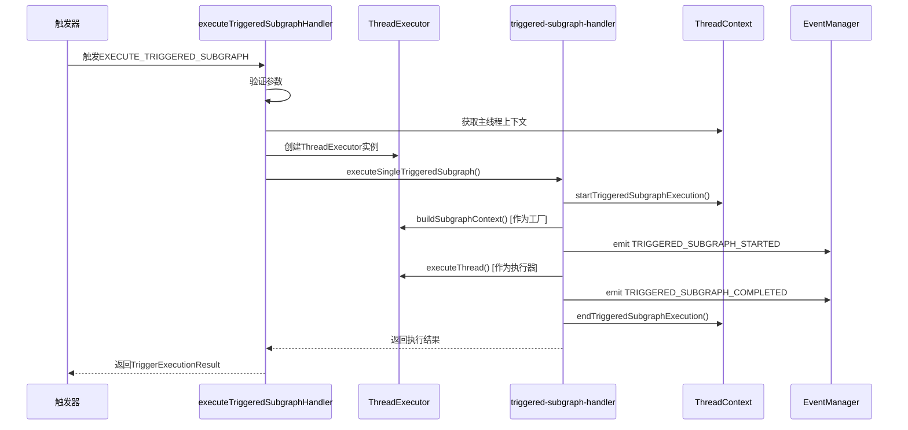
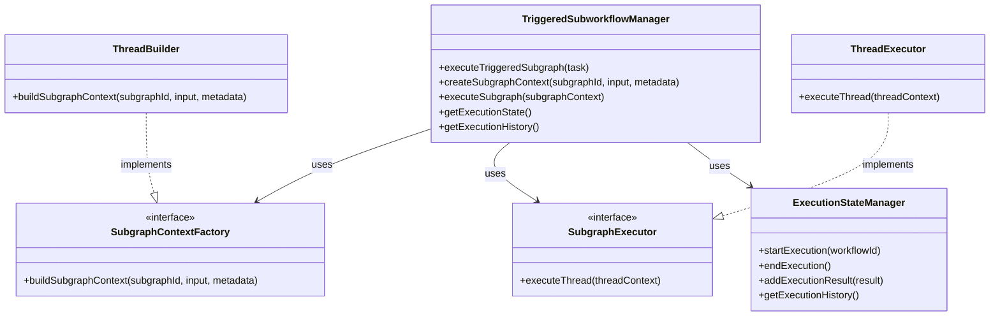

# Triggered子工作流设计分析报告

## 执行摘要

本报告对当前triggered子工作流的设计进行了全面分析，识别了多个架构问题，并提出了改进建议。当前设计存在职责混乱、状态管理分散、类型不清晰等问题，建议引入专门的管理器模式来重构。

---

## 1. 当前设计概述

### 1.1 核心组件

当前triggered子工作流实现涉及以下核心组件：

| 组件 | 文件路径 | 职责 |
|------|---------|------|
| **executeTriggeredSubgraphHandler** | `sdk/core/execution/handlers/trigger-handlers/execute-triggered-subgraph-handler.ts` | 处理EXECUTE_TRIGGERED_SUBGRAPH触发动作 |
| **triggered-subgraph-handler** | `sdk/core/execution/handlers/triggered-subgraph-handler.ts` | 提供无状态的子工作流执行功能 |
| **ExecutionState** | `sdk/core/execution/context/execution-state.ts` | 管理执行状态，包含isExecutingTriggeredSubgraph标记 |
| **ThreadContext** | `sdk/core/execution/context/thread-context.ts` | 线程上下文，包含triggeredSubworkflowContext |
| **ThreadExecutor** | `sdk/core/execution/thread-executor.ts` | 同时扮演SubgraphContextFactory和SubgraphExecutor角色 |

### 1.2 设计模式

当前实现使用了以下设计模式：

1. **Handler模式** - `executeTriggeredSubgraphHandler`处理特定的触发动作
2. **函数式设计** - `triggered-subgraph-handler`使用纯函数，无内部状态
3. **状态标记模式** - 使用`isExecutingTriggeredSubgraph`布尔标记来跟踪执行状态
4. **接口适配模式** - `ThreadExecutor`同时实现`SubgraphContextFactory`和`SubgraphExecutor`接口

### 1.3 执行流程



---

## 2. 设计问题分析

### 2.1 职责混乱（严重）

**问题描述：**
`ThreadExecutor`同时承担了两个完全不同的职责：
- 作为`SubgraphContextFactory`：负责创建子工作流上下文
- 作为`SubgraphExecutor`：负责执行子工作流

**影响：**
- 违反了单一职责原则（SRP）
- 增加了类的复杂度
- 使得`ThreadExecutor`的职责不清晰
- 难以理解和维护

**代码示例：**
```typescript
// ThreadExecutor同时扮演两个角色
const threadExecutor = new ThreadExecutor(context);

// 作为工厂使用
const subgraphContext = await threadExecutor.buildSubgraphContext(...);

// 作为执行器使用
const threadResult = await threadExecutor.executeThread(subgraphContext);
```

### 2.2 状态管理分散（严重）

**问题描述：**
triggered子工作流的状态分散在多个地方：
- `ExecutionState.isExecutingTriggeredSubgraph` - 执行标记
- `ExecutionState.subgraphExecutionHistory` - 执行历史
- `ThreadContext.triggeredSubworkflowContext` - 线程关系上下文
- `ThreadExecutor.isExecutingTriggeredSubgraph` - 执行器内部标记

**影响：**
- 状态同步困难
- 容易出现状态不一致
- 增加了调试难度
- 违反了单一数据源原则

**代码示例：**
```typescript
// ExecutionState中的状态
private isExecutingTriggeredSubgraph: boolean = false;
private subgraphExecutionHistory: any[] = [];

// ThreadContext中的状态
triggeredSubworkflowContext?: TriggeredSubworkflowContext;

// ThreadExecutor中的状态
private isExecutingTriggeredSubgraph: boolean = false;
```

### 2.3 类型不清晰（中等）

**问题描述：**
`ThreadExecutor`被当作两个不同的接口使用，但类型系统无法清晰区分：
- 调用`buildSubgraphContext()`时，它作为工厂
- 调用`executeThread()`时，它作为执行器

**影响：**
- 类型安全性降低
- IDE提示不清晰
- 容易误用
- 代码可读性差

**代码示例：**
```typescript
// 类型系统无法区分这两个不同的用途
await executeSingleTriggeredSubgraph(
  task,
  threadExecutor, // 作为SubgraphContextFactory
  threadExecutor, // 作为SubgraphExecutor
  eventManager
);
```

### 2.4 缺乏抽象（中等）

**问题描述：**
没有专门的`TriggeredSubworkflowManager`来管理triggered子工作流的完整生命周期。

**影响：**
- 职责分散在多个组件中
- 难以统一管理triggered子工作流
- 扩展性差
- 代码重复

### 2.5 测试困难（中等）

**问题描述：**
由于`ThreadExecutor`的多重角色，测试时需要mock多个接口。

**影响：**
- 测试代码复杂
- 测试覆盖率难以保证
- 测试维护成本高

**代码示例：**
```typescript
// 测试中需要mock ThreadExecutor的多个接口
const mockThreadExecutor = {
  buildSubgraphContext: jest.fn(),
  executeThread: jest.fn(),
  // ... 其他方法
};
```

### 2.6 扩展性受限（低）

**问题描述：**
当前设计难以支持新的子工作流类型或执行模式。

**影响：**
- 添加新功能需要修改多个组件
- 违反了开闭原则（OCP）
- 代码耦合度高

---

## 3. 替代设计模式研究

### 3.1 方案一：管理器模式（推荐）

**设计思路：**
引入专门的`TriggeredSubworkflowManager`来统一管理triggered子工作流的完整生命周期。

**优点：**
- 职责清晰，符合单一职责原则
- 状态集中管理
- 易于测试和维护
- 扩展性好

**缺点：**
- 需要新增一个类
- 增加了一定的复杂度

**架构图：**


### 3.2 方案二：策略模式

**设计思路：**
为不同类型的子工作流定义不同的执行策略。

**优点：**
- 支持多种执行策略
- 易于扩展新的策略
- 符合开闭原则

**缺点：**
- 增加了类的数量
- 策略选择逻辑可能复杂

### 3.3 方案三：命令模式

**设计思路：**
将子工作流执行封装为命令对象。

**优点：**
- 支持命令队列
- 支持撤销/重做
- 易于记录执行历史

**缺点：**
- 增加了命令对象的复杂度
- 可能过度设计

### 3.4 方案四：观察者模式

**设计思路：**
通过事件驱动的方式管理子工作流执行。

**优点：**
- 松耦合
- 易于扩展监听器
- 支持异步执行

**缺点：**
- 调试困难
- 事件顺序难以保证

---

## 4. 推荐改进方案

### 4.1 核心改进：引入TriggeredSubworkflowManager

**设计目标：**
1. 统一管理triggered子工作流的完整生命周期
2. 集中管理执行状态
3. 清晰分离工厂和执行器职责
4. 提高可测试性和可维护性

**实现方案：**

```typescript
/**
 * TriggeredSubworkflowManager - 触发子工作流管理器
 * 
 * 职责：
 * - 管理triggered子工作流的完整生命周期
 * - 协调子工作流的创建和执行
 * - 管理执行状态和历史
 * - 提供统一的执行接口
 */
export class TriggeredSubworkflowManager {
  private executionStateManager: ExecutionStateManager;
  private contextFactory: SubgraphContextFactory;
  private executor: SubgraphExecutor;
  private eventManager: EventManager;

  constructor(
    contextFactory: SubgraphContextFactory,
    executor: SubgraphExecutor,
    eventManager: EventManager
  ) {
    this.contextFactory = contextFactory;
    this.executor = executor;
    this.eventManager = eventManager;
    this.executionStateManager = new ExecutionStateManager();
  }

  /**
   * 执行触发子工作流
   */
  async executeTriggeredSubgraph(
    task: TriggeredSubgraphTask
  ): Promise<ExecutedSubgraphResult> {
    const startTime = Date.now();
    
    // 开始执行
    this.executionStateManager.startExecution(task.subgraphId);
    
    try {
      // 创建上下文
      const subgraphContext = await this.createSubgraphContext(task);
      
      // 触发开始事件
      await this.emitStartedEvent(task);
      
      // 执行子工作流
      const threadResult = await this.executeSubgraph(subgraphContext);
      
      const executionTime = Date.now() - startTime;
      
      // 触发完成事件
      await this.emitCompletedEvent(task, subgraphContext, executionTime);
      
      return {
        subgraphContext,
        threadResult,
        executionTime
      };
    } catch (error) {
      const executionTime = Date.now() - startTime;
      
      // 触发失败事件
      await this.emitFailedEvent(task, error, executionTime);
      
      throw error;
    } finally {
      // 结束执行
      this.executionStateManager.endExecution();
    }
  }

  private async createSubgraphContext(
    task: TriggeredSubgraphTask
  ): Promise<ThreadContext> {
    const metadata = createSubgraphMetadata(
      task.triggerId,
      task.mainThreadContext.getThreadId()
    );
    
    return await this.contextFactory.buildSubgraphContext(
      task.subgraphId,
      task.input,
      metadata
    );
  }

  private async executeSubgraph(
    subgraphContext: ThreadContext
  ): Promise<ThreadResult> {
    const result = await this.executor.executeThread(subgraphContext);
    
    // 记录执行结果
    this.executionStateManager.addExecutionResult(result);
    
    return result;
  }

  private async emitStartedEvent(task: TriggeredSubgraphTask): Promise<void> {
    await this.eventManager.emit({
      type: EventType.TRIGGERED_SUBGRAPH_STARTED,
      threadId: task.mainThreadContext.getThreadId(),
      workflowId: task.mainThreadContext.getWorkflowId(),
      subgraphId: task.subgraphId,
      triggerId: task.triggerId,
      input: task.input,
      timestamp: now()
    });
  }

  private async emitCompletedEvent(
    task: TriggeredSubgraphTask,
    subgraphContext: ThreadContext,
    executionTime: number
  ): Promise<void> {
    await this.eventManager.emit({
      type: EventType.TRIGGERED_SUBGRAPH_COMPLETED,
      threadId: task.mainThreadContext.getThreadId(),
      workflowId: task.mainThreadContext.getWorkflowId(),
      subgraphId: task.subgraphId,
      triggerId: task.triggerId,
      output: subgraphContext.getOutput(),
      executionTime,
      timestamp: now()
    });
  }

  private async emitFailedEvent(
    task: TriggeredSubgraphTask,
    error: Error,
    executionTime: number
  ): Promise<void> {
    await this.eventManager.emit({
      type: EventType.TRIGGERED_SUBGRAPH_FAILED,
      threadId: task.mainThreadContext.getThreadId(),
      workflowId: task.mainThreadContext.getWorkflowId(),
      subgraphId: task.subgraphId,
      triggerId: task.triggerId,
      error: getErrorMessage(error),
      executionTime,
      timestamp: now()
    });
  }

  /**
   * 获取执行状态
   */
  getExecutionState(): TriggeredSubworkflowExecutionState {
    return this.executionStateManager.getState();
  }

  /**
   * 获取执行历史
   */
  getExecutionHistory(): any[] {
    return this.executionStateManager.getHistory();
  }
}

/**
 * ExecutionStateManager - 执行状态管理器
 * 
 * 职责：
 * - 管理triggered子工作流的执行状态
 * - 记录执行历史
 * - 提供状态查询接口
 */
class ExecutionStateManager {
  private isExecuting: boolean = false;
  private currentWorkflowId: string = '';
  private executionHistory: any[] = [];

  startExecution(workflowId: string): void {
    this.isExecuting = true;
    this.currentWorkflowId = workflowId;
    this.executionHistory = [];
  }

  endExecution(): void {
    this.isExecuting = false;
    this.currentWorkflowId = '';
  }

  addExecutionResult(result: any): void {
    this.executionHistory.push(result);
  }

  getState(): TriggeredSubworkflowExecutionState {
    return {
      isExecuting: this.isExecuting,
      currentWorkflowId: this.currentWorkflowId,
      executionHistory: [...this.executionHistory]
    };
  }

  getHistory(): any[] {
    return [...this.executionHistory];
  }
}

/**
 * TriggeredSubworkflowExecutionState - 执行状态接口
 */
interface TriggeredSubworkflowExecutionState {
  isExecuting: boolean;
  currentWorkflowId: string;
  executionHistory: any[];
}
```

### 4.2 重构ThreadExecutor

**目标：**
- 移除`SubgraphContextFactory`接口实现
- 专注于线程执行职责
- 简化类的复杂度

**重构后的ThreadExecutor：**
```typescript
/**
 * ThreadExecutor - Thread 执行器
 * 
 * 职责：
 * - 执行单个 ThreadContext
 * - 节点导航和路由
 * - 协调各个执行组件
 * 
 * 不再负责：
 * - 创建子工作流上下文（由ThreadBuilder负责）
 */
export class ThreadExecutor {
  // ... 现有代码保持不变
  
  /**
   * 执行 ThreadContext
   */
  async executeThread(threadContext: ThreadContext): Promise<ThreadResult> {
    // ... 现有实现保持不变
  }
  
  // 移除 buildSubgraphContext 方法
  // 移除 implements SubgraphContextFactory
}
```

### 4.3 更新executeTriggeredSubgraphHandler

**目标：**
- 使用新的`TriggeredSubworkflowManager`
- 简化处理逻辑

**重构后的Handler：**
```typescript
export async function executeTriggeredSubgraphHandler(
  action: TriggerAction,
  triggerId: string,
  executionContext?: ExecutionContext
): Promise<TriggerExecutionResult> {
  const startTime = Date.now();
  const context = executionContext || ExecutionContext.createDefault();

  try {
    const parameters = action.parameters as ExecuteTriggeredSubgraphActionConfig;
    const { triggeredWorkflowId, waitForCompletion = true } = parameters;

    if (!triggeredWorkflowId) {
      throw new RuntimeValidationError('Missing required parameter: triggeredWorkflowId', 
        { operation: 'handle', field: 'triggeredWorkflowId' });
    }

    // 获取主工作流线程上下文
    const threadRegistry = context.getThreadRegistry();
    const threadId = context.getCurrentThreadId();
    const mainThreadContext = threadRegistry.get(threadId);

    if (!mainThreadContext) {
      throw new ThreadContextNotFoundError(`Main thread context not found: ${threadId}`, threadId);
    }

    // 准备输入数据
    const input: Record<string, any> = {
      triggerId,
      output: mainThreadContext.getOutput(),
      input: mainThreadContext.getInput()
    };

    // 创建管理器
    const threadBuilder = new ThreadBuilder(context.getWorkflowRegistry(), context);
    const threadExecutor = new ThreadExecutor(context);
    const manager = new TriggeredSubworkflowManager(
      threadBuilder,  // 作为SubgraphContextFactory
      threadExecutor, // 作为SubgraphExecutor
      context.getEventManager()
    );

    // 创建任务
    const task: TriggeredSubgraphTask = {
      subgraphId: triggeredWorkflowId,
      input,
      triggerId,
      mainThreadContext,
      config: {
        waitForCompletion,
        timeout: 30000,
        recordHistory: true,
      }
    };

    // 执行子工作流
    const result = await manager.executeTriggeredSubgraph(task);

    const executionTime = Date.now() - startTime;

    return createSuccessResult(
      triggerId,
      action,
      {
        message: `Triggered subgraph execution completed: ${triggeredWorkflowId}`,
        triggeredWorkflowId,
        input,
        output: result.subgraphContext.getOutput(),
        waitForCompletion,
        executed: true,
        completed: true,
        executionTime: result.executionTime,
      },
      executionTime
    );
  } catch (error) {
    const executionTime = Date.now() - startTime;
    return createFailureResult(triggerId, action, error, executionTime);
  }
}
```

### 4.4 清理ExecutionState

**目标：**
- 移除triggered子工作流相关的状态管理
- 专注于子图栈管理

**重构后的ExecutionState：**
```typescript
/**
 * ExecutionState - 执行状态管理器
 * 
 * 核心职责：
 * - 管理子图执行栈
 * - 提供当前工作流ID（考虑子图上下文）
 * - 管理执行时的临时状态
 * 
 * 不再负责：
 * - 管理triggered子工作流执行状态（由ExecutionStateManager负责）
 */
export class ExecutionState {
  /**
   * 子图执行堆栈
   */
  private subgraphStack: SubgraphContext[] = [];

  // 移除以下字段
  // private subgraphExecutionHistory: any[] = [];
  // private isExecutingTriggeredSubgraph: boolean = false;

  // 移除以下方法
  // startTriggeredSubgraphExecution()
  // endTriggeredSubgraphExecution()
  // isExecutingSubgraph()
  // addSubgraphExecutionResult()
  // getSubgraphExecutionHistory()

  // 保留子图栈相关方法
  enterSubgraph(workflowId: ID, parentWorkflowId: ID, input: any): void {
    this.subgraphStack.push({
      workflowId,
      parentWorkflowId,
      startTime: Date.now(),
      input,
      depth: this.subgraphStack.length
    });
  }

  exitSubgraph(): void {
    this.subgraphStack.pop();
  }

  getCurrentSubgraphContext(): SubgraphContext | null {
    return this.subgraphStack.length > 0
      ? this.subgraphStack[this.subgraphStack.length - 1] || null
      : null;
  }

  // ... 其他方法保持不变
}
```

---

## 5. 实施计划

### 5.1 阶段一：创建新组件（不影响现有功能）

1. 创建`ExecutionStateManager`类
2. 创建`TriggeredSubworkflowManager`类
3. 编写单元测试

### 5.2 阶段二：重构Handler（向后兼容）

1. 更新`executeTriggeredSubgraphHandler`使用新的管理器
2. 保持现有接口不变
3. 更新测试用例

### 5.3 阶段三：清理旧代码

1. 从`ThreadExecutor`移除`SubgraphContextFactory`接口
2. 从`ExecutionState`移除triggered子工作流相关状态
3. 更新相关测试

### 5.4 阶段四：验证和优化

1. 运行完整测试套件
2. 性能测试
3. 代码审查
4. 文档更新

---

## 6. 风险评估

| 风险 | 影响 | 概率 | 缓解措施 |
|------|------|------|---------|
| 破坏现有功能 | 高 | 中 | 充分的测试覆盖，分阶段实施 |
| 性能下降 | 中 | 低 | 性能测试，优化关键路径 |
| 增加复杂度 | 中 | 中 | 清晰的文档，代码审查 |
| 迁移成本高 | 中 | 低 | 向后兼容，渐进式重构 |

---

## 7. 总结

### 7.1 当前设计的主要问题

1. **职责混乱** - `ThreadExecutor`承担过多职责
2. **状态管理分散** - 状态分散在多个组件中
3. **类型不清晰** - 接口使用不明确
4. **缺乏抽象** - 没有专门的管理器
5. **测试困难** - 多重角色导致mock复杂
6. **扩展性受限** - 难以支持新功能

### 7.2 推荐方案的优势

1. **职责清晰** - 每个组件职责单一
2. **状态集中** - 统一管理执行状态
3. **类型安全** - 接口使用明确
4. **易于测试** - 组件独立，易于mock
5. **扩展性好** - 符合开闭原则
6. **可维护性高** - 代码结构清晰

### 7.3 建议

**强烈建议**采用管理器模式进行重构，理由如下：

1. **解决核心问题** - 直接解决了职责混乱和状态分散的问题
2. **风险可控** - 可以分阶段实施，保持向后兼容
3. **长期收益** - 提高代码质量和可维护性
4. **符合最佳实践** - 遵循SOLID原则

### 7.4 下一步行动

1. 与团队讨论本报告
2. 确认重构方案
3. 制定详细的实施计划
4. 开始实施阶段一

---

## 附录

### A. 相关文件清单

- `sdk/core/execution/handlers/trigger-handlers/execute-triggered-subgraph-handler.ts`
- `sdk/core/execution/handlers/triggered-subgraph-handler.ts`
- `sdk/core/execution/context/execution-state.ts`
- `sdk/core/execution/context/thread-context.ts`
- `sdk/core/execution/thread-executor.ts`
- `packages/types/src/thread/definition.ts`
- `packages/types/src/thread/context.ts`
- `packages/types/src/checkpoint/snapshot.ts`
- `packages/types/src/workflow/enums.ts`
- `packages/types/src/trigger/definition.ts`

### B. 测试文件清单

- `sdk/core/execution/handlers/trigger-handlers/__tests__/execute-triggered-subgraph-handler.test.ts`
- `sdk/core/execution/context/__tests__/execution-state.test.ts`
- `sdk/core/execution/context/__tests__/thread-context.test.ts`
- `sdk/tests/workflow/workflow-registry/triggered-subworkflow-integration.test.ts`

### C. 参考资料

- SOLID原则
- 设计模式：管理器模式、策略模式、命令模式
- TypeScript最佳实践
- 测试驱动开发（TDD）

---

**报告生成时间：** 2025-01-XX  
**报告版本：** 1.0  
**作者：** Architect Agent