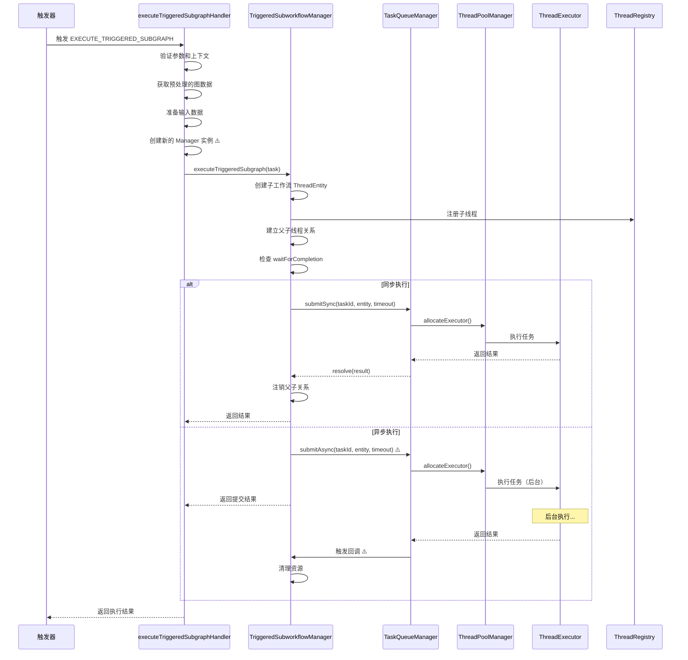

# 触发子工作流执行分析报告

## 执行摘要

本报告对 `execute-triggered-subgraph-handler.ts` 及其相关组件的实现进行了深入分析，发现了多个严重的架构问题，包括资源管理不当、内存泄漏风险、类型安全问题等。这些问题可能导致系统资源耗尽、内存泄漏和运行时错误。本报告提供了详细的问题分析和改进建议。

---

## 1. 执行流程概述

### 1.1 架构层次

当前实现通过以下层次执行触发子工作流：

```
┌─────────────────────────────────────────────────────────────┐
│  Handler 层 (execute-triggered-subgraph-handler.ts)          │
│  - 参数验证                                                   │
│  - 上下文获取                                                 │
│  - 输入数据准备                                               │
│  - 创建 Manager 实例                                          │
└─────────────────────────────────────────────────────────────┘
                              ↓
┌─────────────────────────────────────────────────────────────┐
│  Manager 层 (TriggeredSubworkflowManager)                    │
│  - 创建子工作流 ThreadEntity                                  │
│  - 注册到 ThreadRegistry                                     │
│  - 建立父子线程关系                                           │
│  - 选择同步/异步执行模式                                      │
└─────────────────────────────────────────────────────────────┘
                              ↓
┌─────────────────────────────────────────────────────────────┐
│  队列层 (TaskQueueManager)                                   │
│  - 任务提交到队列                                             │
│  - 分配线程池执行器                                           │
│  - 执行任务并处理结果                                         │
└─────────────────────────────────────────────────────────────┘
```

### 1.2 执行流程图



---

## 2. 发现的问题

### 🔴 严重问题 1：每次调用都创建新的 Manager 实例

**严重程度**: 🔴 严重  
**位置**: `execute-triggered-subgraph-handler.ts:156-168`

**问题描述**:

```typescript
// 创建 TriggeredSubworkflowManager
const executorFactory = () => container.get(Identifiers.ThreadExecutor);
const manager = new TriggeredSubworkflowManager(
  threadRegistry,
  threadBuilder,
  taskQueueManager,
  eventManager,
  executorFactory,
  {
    minExecutors: 1,
    maxExecutors: 10,
    idleTimeout: 30000,
    maxQueueSize: 100,
    taskRetentionTime: 60 * 60 * 1000,
    defaultTimeout: timeout || 30000
  }
);
```

每次触发子工作流时，都会创建一个新的 `TriggeredSubworkflowManager` 实例。每个 Manager 实例又会创建一个新的 `ThreadPoolManager`：

```typescript
// triggered-subworkflow-manager.ts:105
this.threadPoolManager = new ThreadPoolManager(executorFactory, config);
```

**影响分析**:

1. **资源浪费**: 每个 Manager 都维护独立的线程池，无法复用执行器
2. **资源耗尽风险**: 如果一个工作流中有多个触发器，会创建多个独立的线程池
   - 假设有 10 个触发器，每个线程池最多 10 个执行器
   - 总共可能创建 100 个执行器实例
3. **配置混乱**: 每次都重新设置配置，可能导致线程池数量失控
4. **管理困难**: 无法统一管理和监控所有触发子工作流的执行

**示例场景**:

```typescript
// 假设一个工作流定义了 5 个触发器
const workflow = {
  triggers: [
    { action: { type: 'execute_triggered_subgraph', parameters: { triggeredWorkflowId: 'wf1' } } },
    { action: { type: 'execute_triggered_subgraph', parameters: { triggeredWorkflowId: 'wf2' } } },
    { action: { type: 'execute_triggered_subgraph', parameters: { triggeredWorkflowId: 'wf3' } } },
    { action: { type: 'execute_triggered_subgraph', parameters: { triggeredWorkflowId: 'wf4' } } },
    { action: { type: 'execute_triggered_subgraph', parameters: { triggeredWorkflowId: 'wf5' } } }
  ]
};

// 如果这 5 个触发器都被触发，会创建 5 个独立的线程池
// 每个线程池最多 10 个执行器，总共 50 个执行器
// 实际可能只需要 10 个执行器即可
```

**修复建议**:

```typescript
// 方案 A: 通过 DI 容器获取共享实例
export async function executeTriggeredSubgraphHandler(
  action: TriggerAction,
  triggerId: string,
  threadRegistry: ThreadRegistry,
  eventManager: EventManager,
  threadBuilder: ThreadBuilder,
  taskQueueManager: TaskQueueManager,
  currentThreadId?: string
): Promise<TriggerExecutionResult> {
  // ... 参数验证和准备 ...

  const container = getContainer();
  const manager = container.get(Identifiers.TriggeredSubworkflowManager);

  // 执行触发子工作流
  const result = await manager.executeTriggeredSubgraph(task);

  // ...
}

// 方案 B: 使用管理器注册表
class TriggeredSubworkflowManagerRegistry {
  private static instance: TriggeredSubworkflowManagerRegistry;
  private managers: Map<string, TriggeredSubworkflowManager> = new Map();
  
  static getInstance(): TriggeredSubworkflowManagerRegistry {
    if (!this.instance) {
      this.instance = new TriggeredSubworkflowManagerRegistry();
    }
    return this.instance;
  }
  
  getManager(config?: SubworkflowManagerConfig): TriggeredSubworkflowManager {
    const configKey = JSON.stringify(config || defaultConfig);
    
    if (!this.managers.has(configKey)) {
      const manager = new TriggeredSubworkflowManager(
        threadRegistry,
        threadBuilder,
        taskQueueManager,
        eventManager,
        executorFactory,
        config || defaultConfig
      );
      this.managers.set(configKey, manager);
    }
    
    return this.managers.get(configKey)!;
  }
  
  cleanup(): void {
    this.managers.forEach(manager => manager.shutdown());
    this.managers.clear();
  }
}
```

---

### 🟡 中等问题 2：异步执行的 Promise 处理存在内存泄漏风险

**严重程度**: 🟡 中等  
**位置**: `triggered-subworkflow-manager.ts:236-251`

**问题描述**:

```typescript
private executeAsync(
  subgraphEntity: ThreadEntity,
  timeout: number
): TaskSubmissionResult {
  const threadId = subgraphEntity.getThreadId();

  // 先注册任务到全局 TaskRegistry
  const taskId = this.taskRegistry.register(subgraphEntity, this, timeout);

  // 创建 Promise 并注册回调
  const promise = new Promise<ExecutedSubgraphResult>((resolve, reject) => {
    this.callbackManager.registerCallback(threadId, resolve, reject);
  });

  // 提交到任务队列（只提交一次）
  const submissionResult = this.taskQueueManager.submitAsync(taskId, subgraphEntity, timeout);

  // 通过 Promise 处理完成和失败
  promise
    .then((result) => {
      this.handleSubgraphCompleted(threadId, result);
    })
    .catch((error) => {
      this.handleSubgraphFailed(threadId, error);
    });

  return {
    taskId: submissionResult.taskId,
    status: submissionResult.status,
    message: 'Triggered subgraph submitted',
    submitTime: submissionResult.submitTime
  };
}
```

**问题分析**:

1. **未存储 Promise 引用**: 创建的 Promise 没有被存储或引用，无法被取消或清理
2. **未处理 Promise rejection**: 如果 `handleSubgraphCompleted()` 或 `handleSubgraphFailed()` 内部抛出异常，Promise 的错误处理会静默失败
3. **回调重复触发**: 
   - `taskQueueManager.submitAsync()` 内部会调用 `executor.executeThread()`
   - 执行完成后，`TaskQueueManager.handleTaskCompleted()` 会调用 `queueTask.resolve()`
   - 这会触发 `CallbackManager.triggerCallback()`，进而调用 `resolve()`
   - 然后 `promise.then()` 又会调用 `handleSubgraphCompleted()`
   - 导致回调被触发两次

**内存泄漏场景**:

```typescript
// 场景 1: 任务超时但 Promise 没有被清理
const task = { timeout: 30000 };
manager.executeAsync(subgraphEntity, task.timeout);
// 30 秒后任务超时，但 Promise 仍然存在
// 如果没有正确清理，Promise 会一直占用内存

// 场景 2: 任务失败但错误处理抛出异常
promise.catch((error) => {
  this.handleSubgraphFailed(threadId, error);
  // 如果 handleSubgraphFailed() 抛出异常
  // 错误会变成未处理的 Promise rejection
});

// 场景 3: Manager 实例被销毁但 Promise 仍然存在
const manager = new TriggeredSubworkflowManager(...);
manager.executeAsync(subgraphEntity, timeout);
// Manager 实例被销毁
// 但 Promise 仍然引用着 manager 的方法
// 导致 Manager 无法被垃圾回收
```

**修复建议**:

```typescript
private executeAsync(
  subgraphEntity: ThreadEntity,
  timeout: number
): TaskSubmissionResult {
  const threadId = subgraphEntity.getThreadId();

  // 先注册任务到全局 TaskRegistry
  const taskId = this.taskRegistry.register(subgraphEntity, this, timeout);

  // 提交到任务队列
  const submissionResult = this.taskQueueManager.submitAsync(taskId, subgraphEntity, timeout);

  // 直接注册回调，不创建 Promise
  this.callbackManager.registerCallback(
    threadId,
    (result) => this.handleSubgraphCompleted(threadId, result),
    (error) => this.handleSubgraphFailed(threadId, error)
  );

  // 存储任务信息以便后续清理
  this.activeTasks.set(threadId, {
    taskId,
    threadId,
    submitTime: now(),
    timeout
  });

  return {
    taskId: submissionResult.taskId,
    status: submissionResult.status,
    message: 'Triggered subgraph submitted',
    submitTime: submissionResult.submitTime
  };
}

// 在 handleSubgraphCompleted 和 handleSubgraphFailed 中清理任务
private handleSubgraphCompleted(threadId: string, result: ExecutedSubgraphResult): void {
  // ... 现有逻辑 ...

  // 清理任务信息
  this.activeTasks.delete(threadId);
}

private handleSubgraphFailed(threadId: string, error: Error): void {
  // ... 现有逻辑 ...

  // 清理任务信息
  this.activeTasks.delete(threadId);
}

// 添加清理方法
async cleanup(): Promise<void> {
  // 取消所有活跃任务
  for (const [threadId, task] of this.activeTasks.entries()) {
    try {
      await this.cancelTask(task.taskId);
    } catch (error) {
      console.error(`Failed to cancel task ${task.taskId}:`, error);
    }
  }
  
  // 清理任务信息
  this.activeTasks.clear();
  
  // ... 现有清理逻辑 ...
}
```

---

### 🟡 中等问题 3：类型断言不安全

**严重程度**: 🟡 中等  
**位置**: `execute-triggered-subgraph-handler.ts:122-123`

**问题描述**:

```typescript
const parameters = action.parameters as ExecuteTriggeredSubgraphActionConfig;
const { triggeredWorkflowId, waitForCompletion = true } = parameters;
const timeout = (parameters as any).timeout;
const recordHistory = (parameters as any).recordHistory;
```

**问题分析**:

1. **类型定义不完整**: `ExecuteTriggeredSubgraphActionConfig` 类型定义中没有 `timeout` 和 `recordHistory` 字段
2. **绕过类型检查**: 使用 `as any` 绕过了 TypeScript 的类型检查
3. **维护困难**: 类型定义与实际使用不一致，会导致维护困难

**类型定义检查**:

```typescript
// packages/types/src/trigger/config.ts
export interface ExecuteTriggeredSubgraphActionConfig {
  triggeredWorkflowId: ID;
  waitForCompletion?: boolean;
  // 缺少 timeout 和 recordHistory 字段
}
```

**修复建议**:

```typescript
// 更新类型定义
export interface ExecuteTriggeredSubgraphActionConfig {
  /** 触发子工作流ID（包含 START_FROM_TRIGGER 节点的工作流） */
  triggeredWorkflowId: ID;
  /** 是否等待完成（默认true，同步执行） */
  waitForCompletion?: boolean;
  /** 超时时间（毫秒） */
  timeout?: number;
  /** 是否记录历史 */
  recordHistory?: boolean;
}

// 更新 Handler 代码
export async function executeTriggeredSubgraphHandler(
  action: TriggerAction,
  triggerId: string,
  threadRegistry: ThreadRegistry,
  eventManager: EventManager,
  threadBuilder: ThreadBuilder,
  taskQueueManager: TaskQueueManager,
  currentThreadId?: string
): Promise<TriggerExecutionResult> {
  const startTime = now();

  try {
    const parameters = action.parameters as ExecuteTriggeredSubgraphActionConfig;
    const { 
      triggeredWorkflowId, 
      waitForCompletion = true, 
      timeout, 
      recordHistory 
    } = parameters;

    if (!triggeredWorkflowId) {
      throw new RuntimeValidationError(
        'Missing required parameter: triggeredWorkflowId', 
        { operation: 'handle', field: 'triggeredWorkflowId' }
      );
    }

    // ... 其余逻辑 ...
  } catch (error) {
    // ... 错误处理 ...
  }
}
```

---

### 🟡 中等问题 4：回调清理时机不当

**严重程度**: 🟡 中等  
**位置**: `triggered-subworkflow-manager.ts:266-289`

**问题描述**:

```typescript
private handleSubgraphCompleted(threadId: string, result: ExecutedSubgraphResult): void {
  // 触发回调
  this.callbackManager.triggerCallback(threadId, result);

  // 触发完成事件
  this.emitCompletedEvent(threadId, result);

  // 注销父子关系
  const subgraphEntity = this.threadRegistry.get(threadId);
  if (subgraphEntity) {
    this.unregisterParentChildRelationship(subgraphEntity);
  }

  // 清理回调
  this.callbackManager.cleanupCallback(threadId);

  // 清理 TaskRegistry 中的任务记录
  const taskInfo = this.taskRegistry.getAll().find(
    t => t.threadEntity.getThreadId() === threadId
  );
  if (taskInfo) {
    this.taskRegistry.delete(taskInfo.id);
  }
}
```

**问题分析**:

1. **回调重复清理**: 
   - `triggerCallback()` 内部会调用 `resolve()` 并删除回调（`callback-manager.ts:88-108`）
   - 然后又调用 `cleanupCallback()`，会再次调用 `reject()`（`callback-manager.ts:238-253`）
   - 这可能导致已经 resolve 的 Promise 又被 reject

2. **Promise 规范违反**: 
   - 根据 Promise/A+ 规范，Promise 一旦 resolve 或 reject，就不能再改变状态
   - 虽然 JavaScript 的 Promise 实现会忽略第二次调用，但这是不好的实践

3. **错误日志误导**: 
   - `cleanupCallback()` 会调用 `reject(new Error(...))`
   - 这会产生错误日志，但实际上任务已经成功完成

**CallbackManager 的实现**:

```typescript
// callback-manager.ts:88-108
triggerCallback(threadId: string, result: T): boolean {
  const callbackInfo = this.callbacks.get(threadId);
  if (!callbackInfo) {
    return false;
  }

  try {
    // 调用resolve函数
    callbackInfo.resolve(result);

    // ... 通知事件监听器 ...

    // 从回调映射中移除
    this.callbacks.delete(threadId);
    return true;
  } catch (error) {
    console.error(`Error triggering callback for thread ${threadId}:`, error);
    this.callbacks.delete(threadId);
    return false;
  }
}

// callback-manager.ts:238-253
cleanupCallback(threadId: string): boolean {
  const callbackInfo = this.callbacks.get(threadId);
  if (!callbackInfo) {
    return false;
  }

  try {
    const error = new Error(`Callback cleanup for thread ${threadId}`);
    callbackInfo.reject(error); // ⚠️ 会调用 reject
  } catch (error) {
    console.error(`Error cleaning up callback for thread ${threadId}:`, error);
  }

  this.callbacks.delete(threadId);
  return true;
}
```

**修复建议**:

```typescript
private handleSubgraphCompleted(threadId: string, result: ExecutedSubgraphResult): void {
  // 触发完成事件
  this.emitCompletedEvent(threadId, result);

  // 注销父子关系
  const subgraphEntity = this.threadRegistry.get(threadId);
  if (subgraphEntity) {
    this.unregisterParentChildRelationship(subgraphEntity);
  }

  // 清理 TaskRegistry 中的任务记录
  const taskInfo = this.taskRegistry.getAll().find(
    t => t.threadEntity.getThreadId() === threadId
  );
  if (taskInfo) {
    this.taskRegistry.delete(taskInfo.id);
  }

  // 最后触发回调（内部会清理回调）
  // triggerCallback 内部已经会清理回调，不需要再调用 cleanupCallback
  this.callbackManager.triggerCallback(threadId, result);
}

private handleSubgraphFailed(threadId: string, error: Error): void {
  // 触发失败事件
  this.emitFailedEvent(threadId, error);

  // 注销父子关系
  const subgraphEntity = this.threadRegistry.get(threadId);
  if (subgraphEntity) {
    this.unregisterParentChildRelationship(subgraphEntity);
  }

  // 清理 TaskRegistry 中的任务记录
  const taskInfo = this.taskRegistry.getAll().find(
    t => t.threadEntity.getThreadId() === threadId
  );
  if (taskInfo) {
    this.taskRegistry.delete(taskInfo.id);
  }

  // 最后触发错误回调（内部会清理回调）
  this.callbackManager.triggerErrorCallback(threadId, error);
}
```

---

### 🟢 轻微问题 5：硬编码的配置值

**严重程度**: 🟢 轻微  
**位置**: `execute-triggered-subgraph-handler.ts:163-171`

**问题描述**:

```typescript
const manager = new TriggeredSubworkflowManager(
  threadRegistry,
  threadBuilder,
  taskQueueManager,
  eventManager,
  executorFactory,
  {
    minExecutors: 1,
    maxExecutors: 10,
    idleTimeout: 30000,
    maxQueueSize: 100,
    taskRetentionTime: 60 * 60 * 1000,
    defaultTimeout: timeout || 30000
  }
);
```

**问题分析**:

1. **配置硬编码**: 配置值硬编码在代码中，无法根据不同环境调整
2. **无法动态调整**: 无法根据系统负载动态调整配置
3. **灵活性差**: 不同场景可能需要不同的配置

**修复建议**:

```typescript
// 创建配置管理器
class TriggeredSubworkflowConfig {
  static getManagerConfig(): SubworkflowManagerConfig {
    return {
      minExecutors: parseInt(process.env.TRIGGERED_SUBGRAPH_MIN_EXECUTORS || '1'),
      maxExecutors: parseInt(process.env.TRIGGERED_SUBGRAPH_MAX_EXECUTORS || '10'),
      idleTimeout: parseInt(process.env.TRIGGERED_SUBGRAPH_IDLE_TIMEOUT || '30000'),
      maxQueueSize: parseInt(process.env.TRIGGERED_SUBGRAPH_MAX_QUEUE_SIZE || '100'),
      taskRetentionTime: parseInt(process.env.TRIGGERED_SUBGRAPH_TASK_RETENTION || '3600000'),
      defaultTimeout: parseInt(process.env.TRIGGERED_SUBGRAPH_DEFAULT_TIMEOUT || '30000')
    };
  }
}

// 或者使用配置文件
// config/triggered-subworkflow.config.ts
export const triggeredSubworkflowConfig: SubworkflowManagerConfig = {
  minExecutors: 1,
  maxExecutors: 10,
  idleTimeout: 30000,
  maxQueueSize: 100,
  taskRetentionTime: 60 * 60 * 1000,
  defaultTimeout: 30000
};

// 使用
const manager = new TriggeredSubworkflowManager(
  threadRegistry,
  threadBuilder,
  taskQueueManager,
  eventManager,
  executorFactory,
  TriggeredSubworkflowConfig.getManagerConfig()
);
```

---

## 3. 问题优先级和修复计划

### 3.1 问题优先级

| 优先级 | 问题 | 严重程度 | 影响范围 | 修复难度 |
|--------|------|----------|----------|----------|
| P0 | 问题 1: Manager 实例重复创建 | 🔴 严重 | 资源管理、系统稳定性 | 中等 |
| P1 | 问题 2: Promise 内存泄漏 | 🟡 中等 | 内存管理、资源泄漏 | 中等 |
| P1 | 问题 3: 类型不安全 | 🟡 中等 | 类型安全、代码质量 | 低 |
| P2 | 问题 4: 回调清理不当 | 🟡 中等 | Promise 规范、错误日志 | 低 |
| P3 | 问题 5: 配置硬编码 | 🟢 轻微 | 灵活性、可维护性 | 低 |

### 3.2 修复计划

#### 阶段 1: 紧急修复（1-2 天）

1. **修复问题 3: 类型不安全**
   - 更新 `ExecuteTriggeredSubgraphActionConfig` 类型定义
   - 移除所有 `as any` 断言
   - 添加单元测试验证类型安全

2. **修复问题 4: 回调清理不当**
   - 调整回调清理顺序
   - 移除重复的 `cleanupCallback()` 调用
   - 添加单元测试验证回调清理逻辑

#### 阶段 2: 重要修复（3-5 天）

3. **修复问题 1: Manager 实例重复创建**
   - 实现 `TriggeredSubworkflowManager` 单例模式
   - 或实现管理器注册表模式
   - 更新 DI 容器配置
   - 添加集成测试验证资源管理

4. **修复问题 2: Promise 内存泄漏**
   - 重构异步执行逻辑
   - 移除不必要的 Promise 创建
   - 添加任务跟踪和清理机制
   - 添加内存泄漏测试

#### 阶段 3: 优化改进（1-2 天）

5. **修复问题 5: 配置硬编码**
   - 实现配置管理器
   - 支持环境变量配置
   - 添加配置验证
   - 更新文档

---

## 4. 测试建议

### 4.1 单元测试

```typescript
describe('executeTriggeredSubgraphHandler', () => {
  it('应该正确处理类型安全的参数', async () => {
    const action: TriggerAction = {
      type: 'execute_triggered_subgraph',
      parameters: {
        triggeredWorkflowId: 'test-workflow',
        waitForCompletion: true,
        timeout: 30000,
        recordHistory: true
      }
    };

    const result = await executeTriggeredSubgraphHandler(
      action,
      'test-trigger-id',
      mockThreadRegistry,
      mockEventManager,
      mockThreadBuilder,
      mockTaskQueueManager,
      'test-thread-id'
    );

    expect(result.success).toBe(true);
  });

  it('应该在缺少必需参数时抛出错误', async () => {
    const action: TriggerAction = {
      type: 'execute_triggered_subgraph',
      parameters: {} as any
    };

    await expect(
      executeTriggeredSubgraphHandler(
        action,
        'test-trigger-id',
        mockThreadRegistry,
        mockEventManager,
        mockThreadBuilder,
        mockTaskQueueManager,
        'test-thread-id'
      )
    ).rejects.toThrow(RuntimeValidationError);
  });
});

describe('TriggeredSubworkflowManager', () => {
  describe('executeAsync', () => {
    it('应该正确处理异步执行', async () => {
      const manager = new TriggeredSubworkflowManager(...);
      const result = await manager.executeAsync(subgraphEntity, 30000);

      expect(result.status).toBe('QUEUED');
      expect(result.taskId).toBeDefined();
    });

    it('应该在任务完成时正确清理资源', async () => {
      const manager = new TriggeredSubworkflowManager(...);
      await manager.executeAsync(subgraphEntity, 30000);

      // 等待任务完成
      await waitForTaskCompletion(result.taskId);

      // 验证资源已清理
      expect(manager.activeTasks.has(threadId)).toBe(false);
      expect(callbackManager.hasCallback(threadId)).toBe(false);
    });
  });

  describe('内存泄漏测试', () => {
    it('应该不会在多次执行后泄漏内存', async () => {
      const manager = new TriggeredSubworkflowManager(...);
      const initialMemory = process.memoryUsage().heapUsed;

      // 执行 100 次异步任务
      for (let i = 0; i < 100; i++) {
        await manager.executeAsync(subgraphEntity, 1000);
      }

      // 等待所有任务完成
      await waitForAllTasks(manager);

      const finalMemory = process.memoryUsage().heapUsed;
      const memoryIncrease = finalMemory - initialMemory;

      // 内存增长应该在合理范围内 (< 10MB)
      expect(memoryIncrease).toBeLessThan(10 * 1024 * 1024);
    });
  });
});
```

### 4.2 集成测试

```typescript
describe('触发子工作流集成测试', () => {
  it('应该正确处理多个触发器共享同一个 Manager', async () => {
    // 创建一个工作流，包含多个触发器
    const workflow = createWorkflowWithMultipleTriggers(5);

    // 验证所有触发器使用同一个 Manager 实例
    const managerInstances = new Set();
    for (const trigger of workflow.triggers) {
      const manager = getManagerForTrigger(trigger);
      managerInstances.add(manager);
    }

    expect(managerInstances.size).toBe(1);
  });

  it('应该正确处理高并发场景', async () => {
    const concurrentTriggers = 50;
    const promises = [];

    for (let i = 0; i < concurrentTriggers; i++) {
      promises.push(executeTriggeredSubgraphHandler(...));
    }

    const results = await Promise.all(promises);
    const successCount = results.filter(r => r.success).length;

    expect(successCount).toBe(concurrentTriggers);
  });
});
```

---

## 5. 监控和告警建议

### 5.1 监控指标

```typescript
// 添加监控指标
class TriggeredSubworkflowMetrics {
  // Manager 实例数量
  private managerInstanceCount: number = 0;

  // 活跃任务数量
  private activeTaskCount: number = 0;

  // 任务执行时间
  private taskExecutionTimes: number[] = [];

  // 任务成功率
  private taskSuccessCount: number = 0;
  private taskFailureCount: number = 0;

  // 内存使用量
  private memoryUsage: number = 0;

  // 线程池使用率
  private threadPoolUsage: number = 0;

  // 获取指标
  getMetrics() {
    return {
      managerInstanceCount: this.managerInstanceCount,
      activeTaskCount: this.activeTaskCount,
      avgExecutionTime: this.getAverageExecutionTime(),
      successRate: this.getSuccessRate(),
      memoryUsage: this.memoryUsage,
      threadPoolUsage: this.threadPoolUsage
    };
  }

  // 检查是否需要告警
  checkAlerts() {
    const alerts = [];

    // Manager 实例过多
    if (this.managerInstanceCount > 10) {
      alerts.push({
        level: 'warning',
        message: `Too many manager instances: ${this.managerInstanceCount}`
      });
    }

    // 活跃任务过多
    if (this.activeTaskCount > 100) {
      alerts.push({
        level: 'warning',
        message: `Too many active tasks: ${this.activeTaskCount}`
      });
    }

    // 内存使用过高
    if (this.memoryUsage > 500 * 1024 * 1024) { // 500MB
      alerts.push({
        level: 'critical',
        message: `Memory usage too high: ${this.memoryUsage / 1024 / 1024}MB`
      });
    }

    // 成功率过低
    if (this.getSuccessRate() < 0.9) {
      alerts.push({
        level: 'warning',
        message: `Task success rate too low: ${this.getSuccessRate() * 100}%`
      });
    }

    return alerts;
  }
}
```

### 5.2 日志记录

```typescript
// 添加结构化日志
logger.info('Triggered subgraph execution started', {
  triggerId,
  triggeredWorkflowId,
  threadId,
  waitForCompletion,
  timestamp: now()
});

logger.info('Triggered subgraph execution completed', {
  triggerId,
  triggeredWorkflowId,
  threadId,
  executionTime,
  result: result.success ? 'success' : 'failure',
  timestamp: now()
});

logger.error('Triggered subgraph execution failed', {
  triggerId,
  triggeredWorkflowId,
  threadId,
  error: error.message,
  stack: error.stack,
  timestamp: now()
});
```

---

## 6. 结论

当前实现存在多个严重问题，其中最关键的是：

1. **资源管理问题**（P0）：每次调用都创建新的 Manager 实例，导致资源浪费和潜在的资源耗尽
2. **内存泄漏风险**（P1）：异步执行的 Promise 处理不当，可能导致内存泄漏
3. **类型安全问题**（P1）：使用 `as any` 绕过类型检查，降低了代码质量

建议按照修复计划，优先修复 P0 和 P1 级别的问题，然后再进行优化改进。同时，建议添加完善的测试和监控机制，确保系统的稳定性和可维护性。

---

## 7. 附录

### 7.1 相关文件

| 文件路径 | 描述 |
|---------|------|
| `sdk/core/execution/handlers/trigger-handlers/execute-triggered-subgraph-handler.ts` | 触发子工作流处理器 |
| `sdk/core/execution/managers/triggered-subworkflow-manager.ts` | 触发子工作流管理器 |
| `sdk/core/execution/managers/task-queue-manager.ts` | 任务队列管理器 |
| `sdk/core/execution/managers/callback-manager.ts` | 回调管理器 |
| `packages/types/src/trigger/config.ts` | 触发器配置类型定义 |

### 7.2 参考资料

- [Promise/A+ 规范](https://promisesaplus.com/)
- [TypeScript 类型安全最佳实践](https://www.typescriptlang.org/docs/handbook/declaration-files/do-s-and-don-ts.html)
- [Node.js 内存管理](https://nodejs.org/en/docs/guides/simple-profiling/)
- [设计模式：单例模式](https://refactoring.guru/design-patterns/singleton)
