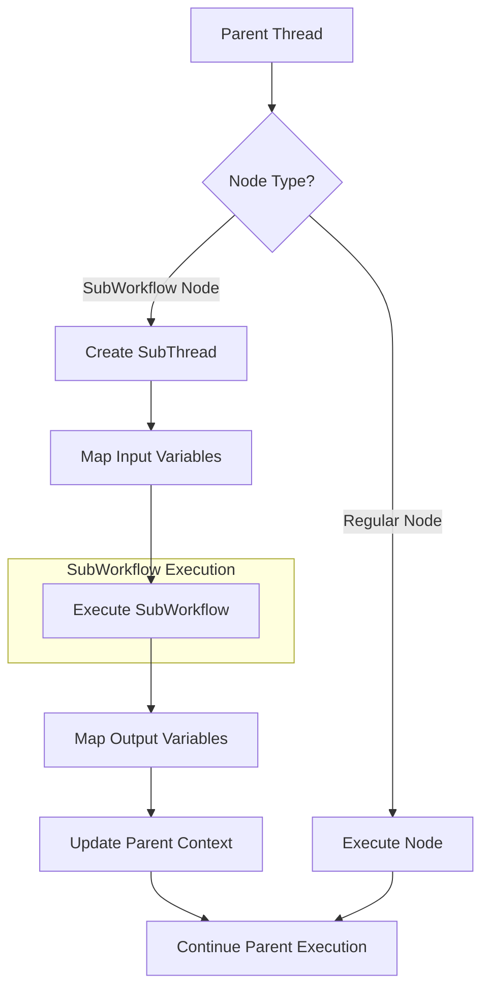

# 子工作流场景下的职责划分调整

## 1. 核心问题分析

### 1.1 子工作流的使用场景

在复杂业务中，为了避免配置过于复杂，需要：
- **工作流复用**：将通用逻辑封装为子工作流
- **模块化设计**：通过组合子工作流构建复杂工作流
- **配置简化**：子工作流作为黑盒节点使用

### 1.2 关键挑战

1. **状态管理复杂度**：子工作流的状态如何与父工作流集成
2. **执行协调**：子工作流的执行如何与主工作流协调
3. **上下文传递**：变量和提示词如何在父子工作流间传递
4. **错误处理**：子工作流失败如何影响父工作流

## 2. Workflow职责调整（静态对象）

### 2.1 核心决策：Workflow作为静态定义

**设计原则**：
- ✅ **Workflow是无状态的静态对象**（immutable definition）
- ✅ **只负责图结构的定义和验证**
- ✅ **不包含任何执行状态**
- ✅ **可以被多个Thread共享**

**理由**：
1. **职责清晰**：定义与执行分离
2. **可复用性**：同一个Workflow可以被多个Thread并发执行
3. **可缓存**：静态对象可以安全缓存
4. **测试友好**：无需清理状态
5. **线程安全**：无状态天然线程安全

### 2.2 Workflow的静态职责

```typescript
export class Workflow extends Entity {
  // 只读属性（创建后不可变）
  private readonly props: WorkflowProps;
  
  // 图结构访问（只读）
  getGraph(): Readonly<WorkflowGraphData>
  getNode(nodeId: NodeId): Readonly<NodeData>
  getEdges(): ReadonlyArray<EdgeData>
  
  // 子工作流引用（只读）
  getSubWorkflows(): ReadonlyArray<WorkflowReference>
  
  // 验证（无副作用）
  validateStructure(): ValidationResult
  validateBusinessRules(): ValidationResult
  
  // 拓扑分析（纯函数）
  getTopologicalOrder(): ReadonlyArray<NodeId>
  hasCycle(): boolean
  
  // 创建（工厂方法）
  static create(definition: WorkflowDefinition): Workflow
  static fromProps(props: WorkflowProps): Workflow
}
```

### 2.3 子工作流引用机制

**设计**：Workflow不直接包含子Workflow，而是通过引用

```typescript
interface WorkflowReference {
  referenceId: string;          // 引用ID
  workflowId: ID;               // 引用的Workflow ID
  version?: string;             // 版本号
  inputMapping: Map<string, string>;  // 输入映射
  outputMapping: Map<string, string>; // 输出映射
}

interface WorkflowProps {
  // ... 其他属性
  subWorkflowReferences: WorkflowReference[];  // 子工作流引用列表
}
```

**配置示例**：
```toml
[workflow]
id = "main_workflow"
name = "主工作流"

[[workflow.sub_workflows]]
reference_id = "data_processing"
workflow_id = "sub_workflow_001"
version = "1.0.0"

[workflow.sub_workflows.input_mapping]
input_data = "{{parent.input}}"
config = "{{parent.processing_config}}"

[workflow.sub_workflows.output_mapping]
processed_data = "{{sub_workflow.result.data}}"
status = "{{sub_workflow.result.status}}"
```

## 3. Thread职责调整（有状态执行器）

### 3.1 Thread作为有状态执行协调器

**设计原则**：
- ✅ **Thread是有状态的执行实例**
- ✅ **负责Workflow的执行和状态管理**
- ✅ **每个Thread对应一个Workflow的执行**
- ✅ **包含完整的执行状态**

### 3.2 Thread的核心职责

```typescript
export class Thread extends Entity {
  // 执行状态（可变）
  private executionState: ExecutionState;
  private contextState: ContextState;
  
  // 工作流引用（只读）
  private readonly workflowId: ID;
  private readonly workflowVersion: string;
  
  // 子工作流执行管理
  private subWorkflowExecutions: Map<string, Thread>;  // referenceId -> Thread
  
  // 执行控制
  async execute(): Promise<ExecutionResult>
  async executeNode(nodeId: NodeId): Promise<NodeExecutionResult>
  async executeSubWorkflow(referenceId: string): Promise<ExecutionResult>
  
  // 状态管理
  getExecutionState(): ExecutionState
  updateNodeState(nodeId: NodeId, state: NodeExecutionState): void
  updateContext(variables: Map<string, any>): void
  
  // 子工作流管理
  createSubWorkflowThread(referenceId: string, workflowId: ID): Thread
  getSubWorkflowExecution(referenceId: string): Thread | undefined
}
```

### 3.3 子工作流执行流程

```typescript
class ThreadExecutionService {
  async executeNode(thread: Thread, node: NodeData): Promise<NodeExecutionResult> {
    // 1. 检查节点类型
    if (node.type === 'sub_workflow') {
      // 2. 获取子工作流引用
      const reference = thread.getWorkflow().getSubWorkflowReference(node.config.referenceId);
      
      // 3. 创建子工作流执行线程
      const subThread = thread.createSubWorkflowThread(
        reference.referenceId,
        reference.workflowId
      );
      
      // 4. 映射输入变量
      const subWorkflowInput = this.mapVariables(
        thread.getContext(),
        reference.inputMapping
      );
      
      // 5. 执行子工作流
      const subResult = await subThread.execute(subWorkflowInput);
      
      // 6. 映射输出变量
      const outputVariables = this.mapVariables(
        subResult,
        reference.outputMapping
      );
      
      // 7. 更新父线程上下文
      thread.updateContext(outputVariables);
      
      return {
        nodeId: node.id,
        status: subResult.status,
        result: subResult.output,
        subWorkflowExecutionId: subThread.id
      };
    }
    
    // 普通节点执行逻辑...
  }
}
```

## 4. 子工作流执行架构

### 4.1 执行流程图



### 4.2 状态管理层次

```
Parent Thread State
├── workflowId: "main_workflow"
├── nodeStates: Map<nodeId, NodeExecutionState>
├── context: ExecutionContext
│   ├── variables: Map<key, value>
│   ├── promptContext: PromptContext
│   └── history: ExecutionStep[]
└── subWorkflowExecutions: Map<referenceId, Child Thread>
    ├── "data_processing" → Thread#2
    └── "validation" → Thread#3
        
Child Thread State (Thread#2)
├── workflowId: "sub_workflow_001"
├── parentThreadId: "thread#1"
├── nodeStates: Map<nodeId, NodeExecutionState>
└── context: ExecutionContext
    └── variables: Map<key, value>  // 独立上下文
```

### 4.3 上下文隔离与传递

**隔离原则**：
- 子工作流有独立的执行上下文
- 子工作流的变量不影响父工作流
- 只有通过显式映射才能传递数据

**传递机制**：
```typescript
interface VariableMapping {
  source: string;      // 源变量路径
  target: string;      // 目标变量路径
  transform?: string;  // 转换函数（可选）
}

class VariableMapper {
  mapVariables(
    sourceContext: ExecutionContext,
    mappings: VariableMapping[]
  ): Map<string, any> {
    const result = new Map<string, any>();
    
    for (const mapping of mappings) {
      const value = sourceContext.getVariable(mapping.source);
      const transformedValue = this.applyTransform(value, mapping.transform);
      result.set(mapping.target, transformedValue);
    }
    
    return result;
  }
}
```

## 5. 错误处理策略

### 5.1 子工作流错误传播

```typescript
interface SubWorkflowErrorHandling {
  strategy: 'propagate' | 'catch' | 'ignore';
  fallbackValue?: any;
  retryConfig?: {
    maxRetries: number;
    delay: number;
  };
}

class SubWorkflowExecutor {
  async executeWithErrorHandling(
    thread: Thread,
    node: NodeData
  ): Promise<NodeExecutionResult> {
    const errorHandling = node.config.errorHandling as SubWorkflowErrorHandling;
    
    try {
      return await this.executeSubWorkflow(thread, node);
    } catch (error) {
      switch (errorHandling.strategy) {
        case 'propagate':
          // 错误传播到父工作流
          throw error;
          
        case 'catch':
          // 捕获错误，返回fallback值
          return {
            nodeId: node.id,
            status: 'failed',
            error: error.message,
            result: errorHandling.fallbackValue
          };
          
        case 'ignore':
          // 忽略错误，继续执行
          return {
            nodeId: node.id,
            status: 'completed',
            result: errorHandling.fallbackValue
          };
      }
    }
  }
}
```

### 5.2 配置示例

```toml
[[workflow.nodes]]
id = "data_processing"
type = "sub_workflow"

[workflow.nodes.config]
reference_id = "processing_sub"

[workflow.nodes.config.error_handling]
strategy = "catch"
fallback_value = { status = "skipped", data = null }

[workflow.nodes.config.retry]
max_retries = 2
delay = 1000
```

## 6. 配置简化策略

### 6.1 子工作流复用配置

**工作流注册表**：
```toml
# configs/workflow/__registry__.toml
[workflows]
data_processing = { id = "wf_001", version = "1.0.0", description = "数据处理子工作流" }
validation = { id = "wf_002", version = "1.0.0", description = "验证子工作流" }
enrichment = { id = "wf_003", version = "1.0.0", description = "数据增强子工作流" }
```

**主工作流配置**：
```toml
[workflow]
id = "main_workflow"
name = "主工作流"

# 引用子工作流
[[workflow.sub_workflow_references]]
reference_id = "process_step"
workflow_id = "wf_001"
version = "1.0.0"

# 节点配置简化
[[workflow.nodes]]
id = "processing"
type = "sub_workflow"
config.reference_id = "process_step"  # 引用预定义子工作流

# 输入输出映射
[workflow.nodes.config.input_mapping]
raw_data = "{{input.data}}"
config = "{{input.processing_config}}"

[workflow.nodes.config.output_mapping]
processed_data = "{{result.data}}"
metadata = "{{result.metadata}}"
```

### 6.2 默认配置继承

```toml
# configs/workflow/defaults.toml
[defaults.sub_workflow]
error_handling.strategy = "propagate"
retry.max_retries = 1
timeout = 300000  # 5分钟

# 主工作流自动继承默认配置
[workflow]
id = "main_workflow"
# 无需重复配置子工作流默认行为
```

## 7. 性能考虑

### 7.1 子工作流执行优化

**线程池复用**：
```typescript
class SubWorkflowThreadPool {
  private pool: Map<string, Thread[]>;  // workflowId -> Thread[]
  
  async acquireThread(workflowId: ID): Promise<Thread> {
    // 从池中获取或创建新线程
  }
  
  releaseThread(thread: Thread): void {
    // 归还线程到池
    // 清理状态但不销毁
  }
}
```

**懒加载**：
```typescript
class LazySubWorkflowLoader {
  private loadedWorkflows: Map<string, Workflow>;
  
  async getWorkflow(workflowId: ID): Promise<Workflow> {
    if (!this.loadedWorkflows.has(workflowId.toString())) {
      const workflow = await this.loadWorkflow(workflowId);
      this.loadedWorkflows.set(workflowId.toString(), workflow);
    }
    return this.loadedWorkflows.get(workflowId.toString())!;
  }
}
```

### 7.2 上下文传递优化

**延迟映射**：
```typescript
class LazyVariableMapping {
  // 只在需要时才映射变量
  async getMappedVariables(): Promise<Map<string, any>> {
    if (!this.cachedMapping) {
      this.cachedMapping = await this.performMapping();
    }
    return this.cachedMapping;
  }
}
```

## 8. 监控和调试

### 8.1 执行链路追踪

```typescript
interface ExecutionTrace {
  traceId: string;
  parentTraceId?: string;
  threadId: string;
  workflowId: string;
  nodeId: string;
  timestamp: Date;
  action: string;
  context: any;
}

class ExecutionTracer {
  private traces: ExecutionTrace[] = [];
  
  startSubWorkflow(
    parentThread: Thread,
    subWorkflowId: ID
  ): string {
    const traceId = this.generateTraceId();
    
    this.traces.push({
      traceId,
      parentTraceId: parentThread.getCurrentTraceId(),
      threadId: subThread.id,
      workflowId: subWorkflowId,
      action: 'sub_workflow_start'
    });
    
    return traceId;
  }
}
```

### 8.2 调试支持

```typescript
class SubWorkflowDebugger {
  // 断点支持
  setBreakpoint(workflowId: ID, nodeId: string): void {
    this.breakpoints.set(`${workflowId}:${nodeId}`, true);
  }
  
  // 单步执行
  async stepInto(thread: Thread, nodeId: string): Promise<void> {
    if (this.isSubWorkflowNode(nodeId)) {
      // 进入子工作流
      await this.debugSubWorkflow(thread, nodeId);
    }
  }
}
```

## 9. 总结

### 9.1 核心设计原则

1. **Workflow静态化**：Workflow作为不可变的定义对象，支持复用和缓存
2. **Thread状态化**：Thread作为有状态的执行实例，管理完整的执行生命周期
3. **子工作流即节点**：子工作流通过SubWorkflowNode实现，保持架构一致性
4. **上下文隔离**：父子工作流上下文隔离，通过显式映射传递数据
5. **错误边界**：子工作流错误可以捕获、传播或忽略，提供灵活性

### 9.2 职责边界

| 职责 | Workflow | Thread | 说明 |
|------|----------|--------|------|
| 图结构定义 | ✅ | ❌ | 静态定义，支持子工作流引用 |
| 子工作流引用 | ✅ | ❌ | 只存储引用信息 |
| 子工作流执行 | ❌ | ✅ | Thread创建子Thread执行 |
| 上下文映射 | ❌ | ✅ | Thread负责变量映射 |
| 错误处理 | ❌ | ✅ | Thread配置错误处理策略 |
| 状态管理 | ❌ | ✅ | Thread管理完整状态树 |

### 9.3 优势

1. **配置简化**：通过子工作流复用，避免重复配置
2. **模块化**：复杂工作流分解为可复用的子工作流
3. **性能优化**：Workflow静态化支持缓存，减少加载开销
4. **调试友好**：清晰的调用链和状态隔离
5. **错误隔离**：子工作流错误不影响父工作流状态（可配置）
6. **资源控制**：Session统一管理所有线程资源

### 9.4 实现建议

1. **第一阶段**：实现静态Workflow和基础Thread
2. **第二阶段**：添加SubWorkflowNode类型
3. **第三阶段**：实现子工作流执行和上下文映射
4. **第四阶段**：添加错误处理和调试支持
5. **第五阶段**：优化性能和资源管理