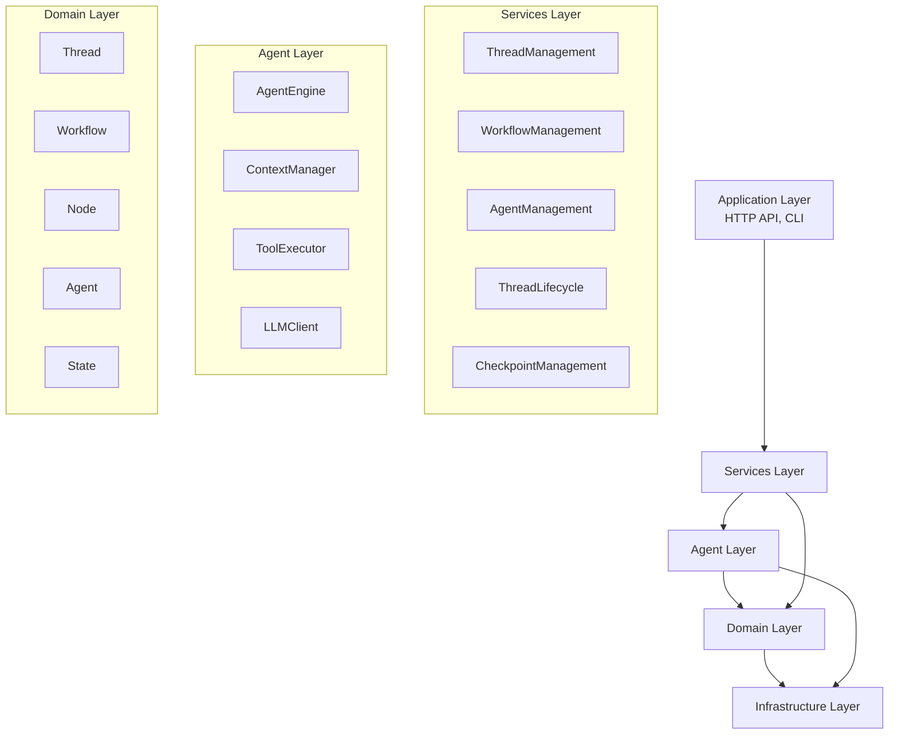
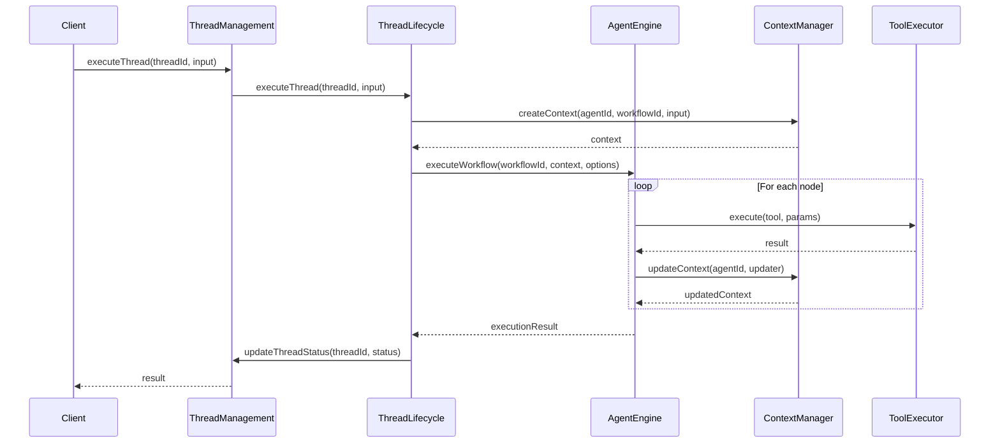

# Agent 执行引擎架构重构设计文档

## 一、当前架构问题分析

### 1.1 Thread 职责过重
- **现状**：`ThreadLifecycle` 同时承担执行引擎和生命周期管理
- **问题**：执行逻辑与线程管理紧密耦合，难以独立测试和扩展
- **影响**：代码复杂度高，维护困难，无法支持多种执行策略

### 1.2 缺乏 Agent 抽象层
- **现状**：没有独立的 Agent 概念，执行逻辑分散在多个服务中
- **问题**：无法支持复杂的智能体行为，如上下文管理、工具调用协调
- **影响**：扩展性差，难以集成新的 LLM 或执行策略

### 1.3 执行逻辑耦合
- **现状**：`WorkflowExecutionEngine` 与 Thread 强耦合
- **问题**：工作流定义与执行引擎无法独立演化
- **影响**：无法灵活替换执行引擎或支持多种执行模式

## 二、新架构设计

### 2.1 核心设计原则

1. **职责分离**：Agent 负责执行，Thread 负责协调
2. **可扩展性**：支持多种 Agent 类型和执行策略
3. **解耦合**：工作流定义与执行引擎解耦
4. **可测试性**：各组件可独立测试

### 2.2 架构分层



### 2.3 关键组件设计

## 三、Agent 层设计

### 3.1 Agent 执行引擎 (AgentEngine)

**职责**：
- 执行工作流节点
- 管理 Agent 执行状态
- 协调工具调用和 LLM 交互

**接口设计**：
```typescript
interface IAgentEngine {
  execute(
    node: Node,
    context: AgentContext,
    options?: ExecutionOptions
  ): Promise<AgentExecutionResult>;
  
  pause(): void;
  resume(): void;
  cancel(): void;
}

interface AgentExecutionResult {
  success: boolean;
  output?: any;
  error?: string;
  executionTime: number;
  toolCalls: ToolCall[];
  llmCalls: LLMCall[];
}
```

**依赖关系**：
- LLMClient：执行 LLM 调用
- ToolExecutor：执行工具调用
- ContextManager：管理执行上下文

### 3.2 上下文管理器 (ContextManager)

**职责**：
- 管理 Agent 执行上下文
- 处理上下文变量和历史记录
- 支持上下文快照和恢复

**接口设计**：
```typescript
interface IContextManager {
  createContext(
    agentId: string,
    workflowId: string,
    initialState?: Record<string, any>
  ): AgentContext;
  
  getContext(agentId: string): AgentContext | null;
  
  updateContext(
    agentId: string,
    updater: (context: AgentContext) => AgentContext
  ): AgentContext;
  
  snapshot(agentId: string): ContextSnapshot;
  restore(snapshot: ContextSnapshot): void;
}
```

**特性**：
- 不可变更新模式
- 版本控制
- 历史追踪
- Token 使用监控

### 3.3 工具执行器 (ToolExecutor)

**职责**：
- 统一执行各种工具调用
- 处理工具参数验证和结果转换
- 支持超时控制和错误处理

**接口设计**：
```typescript
interface IToolExecutor {
  execute(
    tool: Tool,
    params: Record<string, any>,
    options?: ToolExecutionOptions
  ): Promise<ToolExecutionResult>;
  
  validateParams(
    tool: Tool,
    params: Record<string, any>
  ): ValidationResult;
}

interface ToolExecutionResult {
  success: boolean;
  output?: any;
  error?: string;
  executionTime: number;
}
```

**支持的工具类型**：
- LLM 工具（函数调用）
- MCP 工具
- 工作流函数
- 自定义工具

## 四、Thread 服务重构

### 4.1 新职责定义

**ThreadManagement**：
- 线程 CRUD 操作
- 线程查询和列表
- 线程状态管理

**ThreadLifecycle**：
- 线程生命周期管理（创建、启动、暂停、恢复、完成、取消）
- 状态转换验证
- 与 AgentEngine 协调

**移除的职责**：
- 工作流节点执行
- 工具调用执行
- 上下文管理

### 4.2 重构后的 ThreadLifecycle

```typescript
class ThreadLifecycle {
  constructor(
    private threadRepository: IThreadRepository,
    private agentEngine: IAgentEngine,
    private contextManager: IContextManager
  ) {}
  
  async executeThread(
    threadId: string,
    inputData: unknown
  ): Promise<ExecutionResult> {
    // 1. 验证线程状态
    const thread = await this.validateThreadExecution(threadId);
    
    // 2. 创建 Agent 上下文
    const context = this.contextManager.createContext(
      thread.id.toString(),
      thread.workflowId.toString(),
      inputData
    );
    
    // 3. 启动线程
    const startedThread = thread.start();
    await this.threadRepository.save(startedThread);
    
    try {
      // 4. 调用 AgentEngine 执行工作流
      const result = await this.agentEngine.executeWorkflow(
        thread.workflowId.toString(),
        context,
        {
          threadId: thread.id.toString(),
          enableCheckpoints: true
        }
      );
      
      // 5. 更新线程状态
      if (result.success) {
        return await this.completeThread(threadId);
      } else {
        return await this.failThread(threadId, result.error);
      }
    } catch (error) {
      return await this.failThread(threadId, error.message);
    }
  }
}
```

## 五、集成策略

### 5.1 阶段 1：创建 Agent 层

**任务**：
1. 创建 `src/domain/agent/` 目录结构
2. 定义 Agent 领域模型和接口
3. 实现核心 AgentEngine
4. 实现 ContextManager
5. 实现 ToolExecutor

**依赖注入配置**：
```typescript
// di/service-keys.ts
export const TYPES = {
  // ... 现有类型
  AgentEngine: Symbol.for('AgentEngine'),
  ContextManager: Symbol.for('ContextManager'),
  ToolExecutor: Symbol.for('ToolExecutor'),
};

// di/service-bindings.ts
container.bind<IAgentEngine>(TYPES.AgentEngine)
  .to(AgentEngine);
container.bind<IContextManager>(TYPES.ContextManager)
  .to(ContextManager);
container.bind<IToolExecutor>(TYPES.ToolExecutor)
  .to(ToolExecutor);
```

### 5.2 阶段 2：重构 Thread 服务

**任务**：
1. 移除 `ThreadWorkflowExecutor` 中的执行逻辑
2. 更新 `ThreadLifecycle` 使用 AgentEngine
3. 保持 Thread API 兼容性
4. 更新单元测试

**关键改动**：
```typescript
// 移除前
class ThreadLifecycle {
  @inject(TYPES.ThreadWorkflowExecutor) 
  private readonly workflowExecutor: ThreadWorkflowExecutor;
}

// 重构后
class ThreadLifecycle {
  @inject(TYPES.AgentEngine)
  private readonly agentEngine: IAgentEngine;
  
  @inject(TYPES.ContextManager)
  private readonly contextManager: IContextManager;
}
```

### 5.3 阶段 3：集成和测试

**任务**：
1. 更新应用层控制器
2. 编写集成测试
3. 性能测试和优化
4. 更新文档和示例

## 六、数据流设计



## 七、优势分析

### 7.1 解耦优势
- **工作流定义与执行分离**：可以独立演化工作流定义和执行引擎
- **Thread 与 Agent 分离**：Thread 专注于协调，Agent 专注于执行
- **工具与执行分离**：工具可以独立开发和测试

### 7.2 可扩展性
- **支持多种 Agent 类型**：ReAct Agent、Plan-and-Execute Agent 等
- **支持多种执行策略**：顺序执行、并行执行、条件执行
- **易于集成新工具**：统一的 Tool 接口

### 7.3 可维护性
- **职责清晰**：每个组件职责单一，易于理解和维护
- **独立测试**：各组件可独立单元测试
- **代码复用**：Agent 层可在不同场景复用

## 八、风险评估

### 8.1 技术风险
- **风险**：重构过程中可能引入 bug
- **缓解**：保持 API 兼容性，逐步迁移，充分测试

### 8.2 性能风险
- **风险**：新增抽象层可能带来性能开销
- **缓解**：性能测试，必要时进行优化

### 8.3 兼容性风险
- **风险**：现有功能可能受影响
- **缓解**：保持 Thread API 不变，内部实现重构

## 九、实施计划

### 阶段 1：创建 Agent 领域模型（2-3 天）
- [ ] 创建 `src/domain/agent/` 目录结构
- [ ] 定义 Agent 实体和值对象
- [ ] 定义 Agent 仓库接口
- [ ] 定义 Agent 执行结果接口

### 阶段 2：实现 AgentEngine 核心（3-4 天）
- [ ] 实现 AgentEngine 接口
- [ ] 实现工作流执行逻辑
- [ ] 集成 LLMClient
- [ ] 集成 ToolExecutor

### 阶段 3：实现 ContextManager 和 ToolExecutor（2-3 天）
- [ ] 实现 ContextManager
- [ ] 实现上下文快照和恢复
- [ ] 实现 ToolExecutor
- [ ] 集成现有工具系统

### 阶段 4：重构 Thread 服务（3-4 天）
- [ ] 移除 ThreadWorkflowExecutor 执行逻辑
- [ ] 更新 ThreadLifecycle 使用 AgentEngine
- [ ] 更新 Thread API 兼容性
- [ ] 更新单元测试

### 阶段 5：集成测试和优化（2-3 天）
- [ ] 编写集成测试
- [ ] 性能测试
- [ ] 优化和 bug 修复
- [ ] 更新文档和示例

**总计预计：12-17 天**

## 十、关键文件清单

### 新建文件
```
src/domain/agent/
├── entities/
│   └── agent.ts
├── value-objects/
│   ├── agent-context.ts
│   ├── agent-execution-result.ts
│   └── tool-call.ts
├── repositories/
│   └── agent-repository.ts
└── index.ts

src/services/agent/
├── agent-engine.ts
├── context-manager.ts
├── tool-executor.ts
└── index.ts
```

### 修改文件
```
src/services/threads/
├── thread-lifecycle.ts (重构)
├── thread-workflow-executor.ts (移除执行逻辑)
└── workflow-execution-engine.ts (废弃)

src/di/
├── service-keys.ts (添加 Agent 相关类型)
└── service-bindings.ts (添加 Agent 绑定)
```

## 十一、验收标准

### 功能验收
- [ ] Thread API 保持向后兼容
- [ ] 工作流执行功能正常
- [ ] 工具调用功能正常
- [ ] 上下文管理功能正常
- [ ] 检查点功能正常

### 性能验收
- [ ] 执行性能不低于重构前
- [ ] 内存使用合理
- [ ] 响应时间可接受

### 代码质量验收
- [ ] 单元测试覆盖率 > 80%
- [ ] 集成测试通过
- [ ] 代码符合架构规范
- [ ] 文档完整

## 十二、后续扩展方向

### 12.1 Agent 类型扩展
- ReAct Agent
- Plan-and-Execute Agent
- Multi-Agent 协作

### 12.2 执行策略扩展
- 并行执行
- 条件执行
- 循环执行

### 12.3 工具系统扩展
- MCP 工具集成
- 自定义工具开发
- 工具市场

---

**设计完成日期**：2024年
**设计者**：架构团队
**审核状态**：待审核