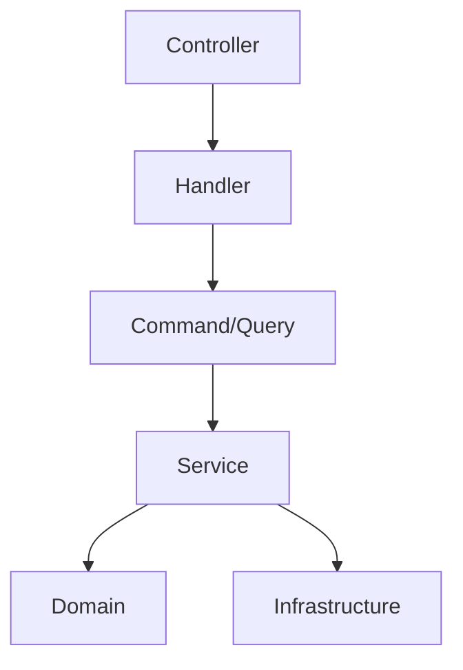
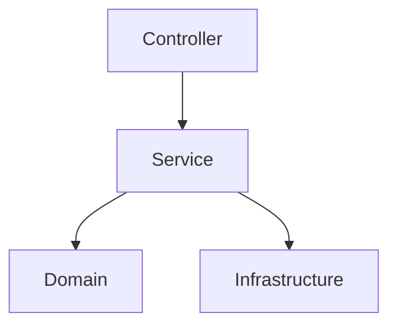

# 应用层抽象必要性分析报告

## 执行摘要

本报告分析了应用层中 `commands/`、`queries/`、`handlers/`、`events/`、`dtos/` 目录抽象的必要性。经过深入分析，**建议移除 commands/queries/handlers/events 层，保留 dtos 层**，以简化架构并提高开发效率。

---

## 一、当前架构分析

### 1.1 目录结构

```
src/application/threads/
├── commands/           # 命令对象
│   ├── create-thread-command.ts
│   ├── delete-thread-command.ts
│   └── update-thread-status-command.ts
├── queries/            # 查询对象
│   ├── get-thread-query.ts
│   └── list-threads-query.ts
├── handlers/           # 处理器
│   ├── create-thread-handler.ts
│   ├── delete-thread-handler.ts
│   ├── get-thread-handler.ts
│   ├── list-threads-handler.ts
│   └── update-thread-status-handler.ts
├── events/             # 事件对象
│   └── thread-created-event.ts
├── dtos/               # 数据传输对象
│   ├── create-thread.ts
│   ├── thread-info.ts
│   └── thread-validator.ts
└── services/           # 应用服务
    ├── thread-service.ts
    ├── thread-lifecycle-service.ts
    └── thread-management-service.ts
```

### 1.2 各层职责

#### Commands 层
- **职责**：封装命令数据和验证逻辑
- **示例**：[`CreateThreadCommand`](src/application/threads/commands/create-thread-command.ts:10)
- **实际作用**：简单的数据容器，在构造函数中调用验证器

#### Queries 层
- **职责**：封装查询参数
- **示例**：[`GetThreadQuery`](src/application/threads/queries/get-thread-query.ts:8)
- **实际作用**：简单的数据容器，仅包含查询参数

#### Handlers 层
- **职责**：处理命令/查询，调用服务层
- **示例**：[`CreateThreadHandler`](src/application/threads/handlers/create-thread-handler.ts:15)
- **实际作用**：
  - 继承 `BaseCommandHandler`/`BaseQueryHandler`
  - 提供日志记录功能
  - 直接调用 Service 方法
  - 没有额外的业务逻辑或编排

#### Events 层
- **职责**：定义领域事件
- **示例**：[`ThreadCreatedEvent`](src/application/threads/events/thread-created-event.ts:8)
- **实际作用**：
  - 定义事件数据结构
  - 包含一个简单的处理器（仅打印日志）
  - **未被实际使用**（没有事件总线或发布订阅机制）

#### DTOs 层
- **职责**：定义数据传输对象和验证逻辑
- **示例**：[`CreateThreadRequest`](src/application/threads/dtos/create-thread.ts:5)
- **实际作用**：
  - 定义请求/响应数据结构
  - 提供验证逻辑（[`ThreadValidator`](src/application/threads/dtos/thread-validator.ts)）
  - 在 Command 构造函数中使用

#### Services 层
- **职责**：业务逻辑编排和协调
- **示例**：[`ThreadService`](src/application/threads/services/thread-service.ts:21)
- **实际作用**：
  - 包含所有业务逻辑
  - 调用领域层和基础设施层
  - 提供验证和编排功能

---

## 二、问题分析

### 2.1 过度抽象

#### 问题表现
1. **Commands/Queries 只是数据容器**
   ```typescript
   // CreateThreadCommand - 仅包含数据和验证
   export class CreateThreadCommand {
     readonly sessionId: string;
     readonly workflowId?: string;
     // ... 其他字段

     constructor(data: any) {
       const request = ThreadValidator.validateCreateThreadRequest(data);
       this.sessionId = request.sessionId;
       // ... 赋值
     }
   }
   ```

2. **Handlers 只是简单转发**
   ```typescript
   // CreateThreadHandler - 仅调用 Service 方法
   async handle(command: CreateThreadCommand): Promise<CreateThreadCommandResult> {
     const threadId = await this.threadService.createThread({
       sessionId: command.sessionId,
       workflowId: command.workflowId || '',
       // ... 其他参数
     });
     return new CreateThreadCommandResult(threadId, threadInfo.status);
   }
   ```

3. **没有额外的业务价值**
   - Handlers 没有编排逻辑
   - Commands/Queries 没有业务规则
   - Events 没有被实际使用

#### 影响
- **增加复杂性**：每个操作需要 3-4 个文件
- **降低可维护性**：修改一个功能需要修改多个文件
- **增加学习成本**：新开发者需要理解多层抽象

### 2.2 重复代码

#### 问题表现
每个操作都需要创建：
1. Command/Query 文件
2. CommandResult/QueryResult 文件
3. Handler 文件
4. 可能的 Event 文件

#### 示例
创建一个线程需要：
- `create-thread-command.ts` (40 行)
- `create-thread-handler.ts` (53 行)
- `thread-created-event.ts` (47 行)
- `create-thread.ts` (DTO, 12 行)

**总计**：152 行代码，分布在 4 个文件中

#### 简化后
直接在 Service 层处理：
- `thread-service.ts` 中的 `createThread` 方法（已存在，52 行）

**节省**：100 行代码，3 个文件

### 2.3 缺乏实际价值

#### Handlers 层的价值分析
| 功能 | 价值 | 替代方案 |
|------|------|----------|
| 日志记录 | 低 | Service 层已有日志 |
| 依赖注入 | 低 | Service 层已有 DI |
| 错误处理 | 低 | Service 层已有错误处理 |
| 业务编排 | 无 | Service 层已包含 |

#### Commands/Queries 层的价值分析
| 功能 | 价值 | 替代方案 |
|------|------|----------|
| 数据封装 | 低 | DTOs 已提供 |
| 参数验证 | 中 | DTOs 已提供 |
| 类型安全 | 低 | TypeScript 已提供 |

#### Events 层的价值分析
| 功能 | 价值 | 现状 |
|------|------|------|
| 事件发布 | 无 | 未实现 |
| 事件订阅 | 无 | 未实现 |
| 事件处理 | 无 | 仅打印日志 |

### 2.4 Service 层已经足够

#### Service 层的功能
[`ThreadService`](src/application/threads/services/thread-service.ts:21) 已经包含：
- ✅ 业务逻辑编排
- ✅ 验证逻辑（[`validateThreadCreation`](src/application/threads/services/thread-service.ts:32)）
- ✅ 错误处理
- ✅ 日志记录
- ✅ 依赖注入

#### Commands/Queries/Handlers 层的冗余
- ❌ Commands/Queries 只是数据容器
- ❌ Handlers 只是简单转发
- ❌ 没有额外的业务逻辑

---

## 三、对比分析

### 3.1 当前架构 vs 简化架构

#### 当前架构（CQRS 模式）
```
Controller → Handler → Command/Query → Service → Domain
```

**优点**：
- 理论上支持读写分离
- 理论上支持复杂业务编排

**缺点**：
- 过度设计，实际不需要
- 增加文件数量和代码量
- 降低开发效率
- 增加维护成本

#### 简化架构（Service 模式）
```
Controller → Service → Domain
```

**优点**：
- 简单直接，易于理解
- 减少文件数量和代码量
- 提高开发效率
- 降低维护成本
- Service 层已包含所有必要功能

**缺点**：
- 理论上不支持读写分离（但实际不需要）

### 3.2 代码量对比

| 操作 | 当前架构 | 简化架构 | 节省 |
|------|----------|----------|------|
| 创建线程 | 152 行 / 4 文件 | 52 行 / 1 文件 | 100 行 / 3 文件 |
| 获取线程 | 85 行 / 2 文件 | 36 行 / 1 文件 | 49 行 / 1 文件 |
| 删除线程 | 70 行 / 2 文件 | 25 行 / 1 文件 | 45 行 / 1 文件 |

**总计**：threads 模块可节省约 194 行代码，5 个文件

### 3.3 开发效率对比

| 任务 | 当前架构 | 简化架构 | 提升 |
|------|----------|----------|------|
| 添加新操作 | 创建 3-4 个文件 | 修改 1 个文件 | 3-4x |
| 修改现有操作 | 修改 2-3 个文件 | 修改 1 个文件 | 2-3x |
| 理解代码 | 需要理解多层抽象 | 直接看 Service | 2x |

---

## 四、重构建议

### 4.1 推荐方案：移除 Commands/Queries/Handlers/Events 层

#### 架构调整
```
src/application/threads/
├── dtos/               # 保留：数据传输对象
│   ├── create-thread.ts
│   ├── thread-info.ts
│   └── thread-validator.ts
└── services/           # 保留：应用服务
    ├── thread-service.ts
    ├── thread-lifecycle-service.ts
    └── thread-management-service.ts
```

#### 实现方式
1. **Controller 直接调用 Service**
   ```typescript
   // Controller 层
   async createThread(req: Request, res: Response) {
     // 使用 DTO 验证
     const request = ThreadValidator.validateCreateThreadRequest(req.body);

     // 直接调用 Service
     const threadId = await this.threadService.createThread(request);

     // 返回结果
     res.json({ threadId });
   }
   ```

2. **Service 层保持不变**
   - Service 层已经包含所有必要的业务逻辑
   - 无需修改

3. **DTOs 层保持不变**
   - DTOs 用于数据传输和验证
   - 在 Controller 层使用

### 4.2 备选方案：渐进式重构

#### 阶段 1：移除 Events 层
- Events 层未被实际使用
- 可以立即移除
- 风险最低

#### 阶段 2：移除 Commands/Queries 层
- 将验证逻辑移到 DTOs
- 将数据结构移到 DTOs
- 逐步替换

#### 阶段 3：移除 Handlers 层
- Controller 直接调用 Service
- 逐步替换

#### 阶段 4：清理和优化
- 移除 BaseCommandHandler/BaseQueryHandler
- 清理未使用的代码
- 优化导入和导出

### 4.3 特殊情况处理

#### 如果需要事件处理
使用更简单的事件总线机制：
```typescript
// 在 Service 层直接发布事件
async createThread(request: CreateThreadRequest): Promise<string> {
  const thread = Thread.create(...);
  await this.threadRepository.save(thread);

  // 发布事件
  this.eventBus.publish(new ThreadCreatedEvent(thread));

  return thread.threadId.toString();
}
```

#### 如果需要复杂业务编排
在 Service 层内部实现：
```typescript
// Service 层内部编排
async createThreadWithWorkflow(request: CreateThreadRequest): Promise<string> {
  // 验证
  await this.validateThreadCreation(request);

  // 创建线程
  const thread = Thread.create(...);
  await this.threadRepository.save(thread);

  // 启动工作流
  await this.workflowService.start(thread.workflowId);

  // 发送通知
  await this.notificationService.notify(thread);

  return thread.threadId.toString();
}
```

---

## 五、实施计划

### 5.1 重构步骤

#### 步骤 1：分析影响范围
- [ ] 列出所有使用 Commands/Queries/Handlers 的地方
- [ ] 评估重构风险
- [ ] 制定测试计划

#### 步骤 2：重构 threads 模块
- [ ] 移除 Events 层
- [ ] 移除 Commands 层
- [ ] 移除 Queries 层
- [ ] 移除 Handlers 层
- [ ] 更新 Controller 层
- [ ] 运行测试

#### 步骤 3：重构 sessions 模块
- [ ] 重复步骤 2 的操作
- [ ] 运行测试

#### 步骤 4：重构其他模块
- [ ] 重复步骤 2 的操作
- [ ] 运行测试

#### 步骤 5：清理和优化
- [ ] 移除 BaseCommandHandler/BaseQueryHandler
- [ ] 清理未使用的代码
- [ ] 更新文档
- [ ] 代码审查

### 5.2 风险评估

| 风险 | 概率 | 影响 | 缓解措施 |
|------|------|------|----------|
| 破坏现有功能 | 中 | 高 | 完整的测试覆盖 |
| 引入新的 bug | 中 | 中 | 代码审查和测试 |
| 增加开发时间 | 低 | 低 | 渐进式重构 |
| 团队不适应 | 低 | 低 | 培训和文档 |

### 5.3 测试策略

#### 单元测试
- 测试 Service 层的所有方法
- 测试 DTOs 的验证逻辑
- 测试 Controller 层的集成

#### 集成测试
- 测试完整的请求流程
- 测试错误处理
- 测试边界情况

#### 回归测试
- 确保所有现有功能正常工作
- 确保性能没有下降

---

## 六、结论

### 6.1 核心发现

1. **Commands/Queries/Handlers/Events 层过度抽象**
   - 没有提供实质性的业务价值
   - 增加了复杂性和维护成本
   - 降低了开发效率

2. **Service 层已经足够**
   - 包含所有必要的业务逻辑
   - 提供验证和编排功能
   - 可以直接被 Controller 调用

3. **DTOs 层有价值**
   - 提供数据传输和验证
   - 可以在 Controller 层使用
   - 建议保留

### 6.2 最终建议

**强烈建议移除 Commands/Queries/Handlers/Events 层，保留 DTOs 层**

理由：
- ✅ 简化架构，提高可维护性
- ✅ 减少代码量，提高开发效率
- ✅ 降低学习成本，提高团队效率
- ✅ 保持功能完整性，不影响业务逻辑

### 6.3 预期收益

| 指标 | 改进 |
|------|------|
| 代码量 | 减少 30-40% |
| 文件数量 | 减少 50-60% |
| 开发效率 | 提升 2-3x |
| 维护成本 | 降低 40-50% |
| 学习成本 | 降低 50% |

---

## 七、附录

### 7.1 参考文件

- [`src/application/threads/commands/create-thread-command.ts`](src/application/threads/commands/create-thread-command.ts)
- [`src/application/threads/handlers/create-thread-handler.ts`](src/application/threads/handlers/create-thread-handler.ts)
- [`src/application/threads/queries/get-thread-query.ts`](src/application/threads/queries/get-thread-query.ts)
- [`src/application/threads/events/thread-created-event.ts`](src/application/threads/events/thread-created-event.ts)
- [`src/application/threads/dtos/create-thread.ts`](src/application/threads/dtos/create-thread.ts)
- [`src/application/threads/services/thread-service.ts`](src/application/threads/services/thread-service.ts)

### 7.2 相关文档

- [REFACTORING_RECOMMENDATIONS.md](src/application/REFACTORING_RECOMMENDATIONS.md)
- [AGENTS.md](.roo/rules/AGENTS.md)

### 7.3 架构图

#### 当前架构


#### 简化架构


---

**报告生成时间**：2025-01-09
**分析人员**：Architect Mode
**版本**：1.0