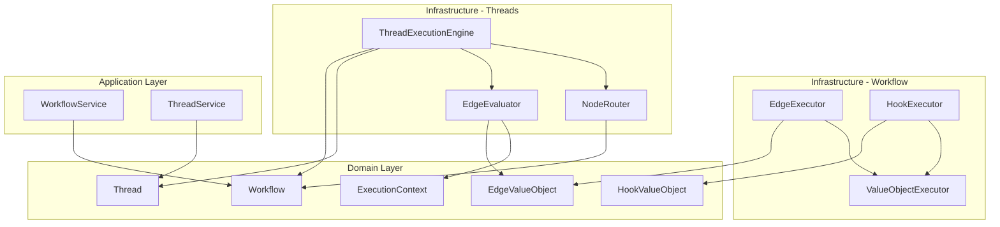

# Workflow执行器与Thread模块集成分析

## 当前架构概述

基于代码分析，当前系统采用三层架构：
- **Domain层**: 包含纯业务逻辑和领域实体
- **Application层**: 提供应用服务和业务流程编排
- **Infrastructure层**: 提供具体技术实现

## 组件定位分析

### 1. Workflow层执行器
- **EdgeExecutor** (`src/infrastructure/workflow/edges/edge-executor.ts`)
  - 职责：执行边值对象的逻辑
  - 依赖：`EdgeValueObject` (domain), `ValueObjectExecutor` (infrastructure)
  - 使用场景：通过 `ValueObjectExecutor` 执行边映射

- **HookExecutor** (`src/infrastructure/workflow/hooks/hook-executor.ts`)
  - 职责：在指定 hookPoint 执行钩子
  - 依赖：`HookValueObject` (domain), `ValueObjectExecutor` (infrastructure)
  - 使用场景：批量执行钩子，按优先级排序

### 2. Thread层执行器
- **EdgeEvaluator** (`src/infrastructure/threads/execution/edge-evaluator.ts`)
  - 职责：评估边的条件表达式，决定是否可以沿着边执行
  - 依赖：`EdgeValueObject` (domain), `ExecutionContext` (domain)
  - 使用场景：在 `ThreadExecutionEngine.determineNextNode()` 中评估边条件

- **NodeRouter** (`src/infrastructure/threads/execution/node-router.ts`)
  - 职责：工作流图中的节点路由逻辑
  - 依赖：`Workflow` (domain), `NodeId` (domain)
  - 使用场景：在 `ThreadExecutionEngine` 中获取起始节点、结束节点等

- **ThreadExecutionEngine** (`src/infrastructure/threads/execution/thread-execution-engine.ts`)
  - 职责：协调Thread的执行流程
  - 依赖：`Workflow` (domain), `Thread` (domain), `EdgeEvaluator`, `NodeRouter`
  - 使用场景：执行节点、确定下一个节点、管理执行状态

## 依赖关系图

## 集成问题分析

### 1. 功能重叠与分离
- **EdgeEvaluator** 和 **EdgeExecutor** 功能分离：
  - `EdgeEvaluator`: 仅评估条件（返回布尔值）
  - `EdgeExecutor`: 执行边逻辑（返回执行结果）
  - 当前 `ThreadExecutionEngine` 只使用 `EdgeEvaluator` 评估条件，没有使用 `EdgeExecutor` 执行边逻辑

### 2. 钩子执行集成缺失
- `HookExecutor` 在 workflow 层，但 thread 执行流程中没有集成钩子执行机制
- 钩子应该在节点执行前后、边评估前后等关键点触发

### 3. 架构约束符合性
- 所有基础设施组件都只依赖 domain 层，符合三层架构约束
- 但组件间的协作关系需要进一步明确

### 4. 执行流程完整性
- 当前 `ThreadExecutionEngine.executeNode()` 使用模拟实现，没有调用实际的节点执行器
- 需要集成 `NodeExecutor` (`src/infrastructure/workflow/nodes/node-executor.ts`)

## 建议的集成方案

1. **增强 ThreadExecutionEngine**：
   - 注入 `NodeExecutor` 来执行节点逻辑
   - 注入 `EdgeExecutor` 来执行边逻辑（如果需要）
   - 注入 `HookExecutor` 来执行相关钩子

2. **明确职责边界**：
   - `EdgeEvaluator`: 条件评估（是否可通行）
   - `EdgeExecutor`: 边逻辑执行（数据转换、副作用等）
   - `NodeRouter`: 图结构导航
   - `ThreadExecutionEngine`: 协调上述组件完成执行流程

3. **钩子集成点**：
   - 节点执行前/后
   - 边评估前/后
   - 线程开始/结束
   - 错误处理

4. **依赖注入配置**：
   - 通过依赖注入容器配置组件关系
   - 确保基础设施组件可替换

## 结论

当前架构基本符合三层架构约束，但组件间的集成不够完整。`EdgeEvaluator` 和 `NodeRouter` 放在 thread 层是合理的，因为它们专注于 thread 执行过程中的路由决策。需要增强 `ThreadExecutionEngine` 来集成 workflow 层的执行器，形成完整的执行流水线。