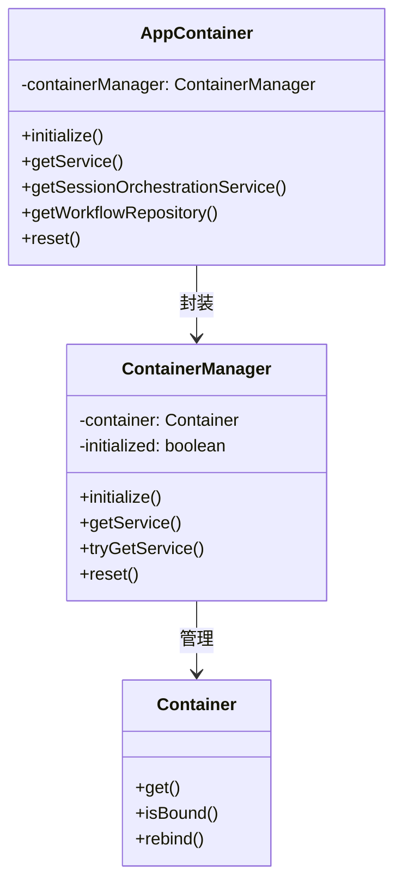

# DI（依赖注入）使用情况分析报告

## 一、概述

本项目使用 InversifyJS 作为依赖注入框架，采用分层架构（Domain + Services + Infrastructure + Application）。本报告分析了当前 DI 的使用情况，并识别了设计中存在的问题。

## 二、DI 架构概览

### 2.1 核心组件

```
src/di/
├── container.ts              # 容器管理器和应用容器
├── service-keys.ts           # 服务标识符定义
└── bindings/
    ├── index.ts              # 绑定模块导出
    ├── infrastructure-bindings.ts  # Infrastructure 层绑定
    └── services-bindings.ts  # Services 层绑定
```

### 2.2 容器层次结构



## 三、各层 DI 使用模式分析

### 3.1 Infrastructure 层

**使用方式**：装饰器模式（`@injectable()` + `@inject()`）

**示例**：
```typescript
@injectable()
export class SessionRepository extends BaseRepository<Session, SessionModel, ID>
  implements ISessionRepository {
  constructor(@inject('ConnectionManager') connectionManager: ConnectionManager) {
    super(connectionManager);
  }
}
```

**特点**：
- ✅ 使用装饰器声明依赖
- ✅ 通过构造函数注入
- ⚠️ 使用字符串字面量作为标识符（`'ConnectionManager'`）
- ⚠️ 缺少类型安全保证

**绑定配置**：
```typescript
bind(TYPES.SessionRepository).to(SessionInfrastructureRepository).inSingletonScope();
```

### 3.2 Services 层

**使用方式**：装饰器模式（`@injectable()` + `@inject()`）

**示例 1 - 使用字符串标识符**：
```typescript
@injectable()
export class WorkflowValidator {
  constructor(
    @inject('WorkflowRepository') private readonly workflowRepository: IWorkflowRepository,
    @inject('Logger') private readonly logger: ILogger
  ) { }
}
```

**示例 2 - 使用 TYPES 常量**：
```typescript
@injectable()
export class ThreadWorkflowExecutor {
  constructor(
    @inject(TYPES.ThreadStateManager) stateManager: ThreadStateManager,
    @inject(TYPES.ThreadHistoryManager) historyManager: ThreadHistoryManager,
    @inject(TYPES.CheckpointManagement) checkpointManagement: CheckpointManagement,
    @inject(TYPES.ThreadConditionalRouter) router: ThreadConditionalRouter,
    @inject(TYPES.NodeExecutor) nodeExecutor: INodeExecutor,
    @inject(TYPES.FunctionRegistry) functionRegistry: FunctionRegistry,
    @inject(TYPES.ThreadRepository) threadRepository: IThreadRepository
  ) { }
}
```

**特点**：
- ✅ 使用装饰器声明依赖
- ✅ 通过构造函数注入
- ❌ **标识符使用不一致**：混用字符串字面量和 TYPES 常量
- ❌ 部分服务使用字符串标识符，部分使用 TYPES 常量

**绑定配置**：
```typescript
bind(TYPES.ThreadWorkflowExecutor).to(ThreadWorkflowExecutor).inSingletonScope();
```

### 3.3 Application 层

**使用方式**：服务定位器模式（`AppContainer.getService()`）

**示例**：
```typescript
export class Application {
  async initialize(): Promise<void> {
    try {
      const logger = AppContainer.getService<ILogger>(TYPES.Logger);
      logger.info('正在初始化应用程序...');
      // ...
    } catch (error) {
      const logger = AppContainer.getService<ILogger>(TYPES.Logger);
      logger.error('应用程序初始化失败', error as Error);
    }
  }
}
```

**特点**：
- ✅ 使用 TYPES 常量作为标识符
- ✅ 提供类型安全的服务获取
- ❌ **使用服务定位器模式**，违反了依赖注入原则
- ❌ 与其他层的 DI 使用方式不一致
- ❌ 隐式依赖，难以测试

### 3.4 Domain 层

**使用方式**：不使用 DI

**特点**：
- ✅ Domain 层不依赖 DI 容器，符合架构原则
- ✅ 只定义接口和实体
- ✅ 通过依赖倒置原则，由其他层注入实现

## 四、识别的设计问题

### 4.1 严重问题

#### 问题 1：混合使用两种 DI 方式

**描述**：
- Services 层和 Infrastructure 层使用装饰器模式（构造函数注入）
- Application 层使用服务定位器模式（`AppContainer.getService()`）

**影响**：
- 代码风格不一致，增加维护成本
- Application 层的隐式依赖难以测试
- 违反了依赖注入的核心原则

**示例对比**：
```typescript
// Services 层 - 装饰器模式（推荐）
@injectable()
export class WorkflowValidator {
  constructor(
    @inject('WorkflowRepository') private readonly workflowRepository: IWorkflowRepository,
    @inject('Logger') private readonly logger: ILogger
  ) { }
}

// Application 层 - 服务定位器模式（不推荐）
export class Application {
  async initialize(): Promise<void> {
    const logger = AppContainer.getService<ILogger>(TYPES.Logger);
    logger.info('正在初始化应用程序...');
  }
}
```

#### 问题 2：服务标识符使用不一致

**描述**：
- 有些地方使用字符串字面量（如 `@inject('WorkflowRepository')`）
- 有些地方使用 TYPES 常量（如 `@inject(TYPES.ThreadStateManager)`）

**影响**：
- 降低类型安全性
- 容易出现拼写错误
- 重构时难以全局修改
- 运行时才能发现错误

**示例**：
```typescript
// 不一致的使用方式
@inject('WorkflowRepository')  // 字符串字面量
@inject(TYPES.ThreadStateManager)  // TYPES 常量
@inject('Logger')  // 字符串字面量
```

### 4.2 中等问题

#### 问题 3：AppContainer 便捷方法不完整

**描述**：
- 只定义了少数几个服务的便捷方法
- 大部分服务仍需通过 `AppContainer.getService(TYPES.Xxx)` 获取
- 便捷方法的意义不大

**示例**：
```typescript
// 便捷方法（只有这几个）
static getSessionOrchestrationService() {
  return this.getService(TYPES.SessionOrchestration);
}

static getWorkflowRepository() {
  return this.getService(TYPES.WorkflowRepository);
}

// 但大部分服务仍需这样获取
const stateManager = AppContainer.getService(TYPES.ThreadStateManager);
```

**影响**：
- 便捷方法没有提供真正的便利
- 增加了维护成本
- 容易遗漏新服务的便捷方法

#### 问题 4：缺少循环依赖检测和处理

**描述**：
- 当前实现没有循环依赖检测机制
- 如果出现循环依赖，会导致运行时错误

**影响**：
- 难以发现和调试循环依赖问题
- 可能导致应用启动失败

### 4.3 轻微问题

#### 问题 5：测试支持不足

**描述**：
- 虽然有 `reset()` 方法用于测试，但缺少更灵活的测试支持
- 难以为不同测试场景创建独立的容器实例

**影响**：
- 测试隔离性差
- 测试之间可能相互影响

#### 问题 6：缺少生命周期管理

**描述**：
- 所有服务都使用单例模式（`inSingletonScope()`）
- 没有考虑需要瞬态或请求作用域的服务

**影响**：
- 可能导致内存泄漏
- 无法支持需要独立实例的服务

## 五、改进建议

### 5.1 统一 DI 使用方式（高优先级）

**建议**：
1. 在 Application 层也使用装饰器模式
2. 通过构造函数注入依赖
3. 移除 `AppContainer.getService()` 的使用

**改进后的 Application 层**：
```typescript
@injectable()
export class Application {
  constructor(
    @inject(TYPES.Logger) private readonly logger: ILogger,
    @inject(TYPES.SessionOrchestration) private readonly sessionOrchestration: SessionOrchestration
  ) {}

  async initialize(): Promise<void> {
    try {
      this.logger.info('正在初始化应用程序...');
      // 使用注入的服务
    } catch (error) {
      this.logger.error('应用程序初始化失败', error as Error);
    }
  }
}
```

### 5.2 统一使用 TYPES 常量（高优先级）

**建议**：
1. 所有 `@inject()` 装饰器都使用 TYPES 常量
2. 禁止使用字符串字面量作为标识符
3. 添加 ESLint 规则强制使用 TYPES 常量

**改进示例**：
```typescript
// 改进前
@inject('WorkflowRepository')
@inject('Logger')

// 改进后
@inject(TYPES.WorkflowRepository)
@inject(TYPES.Logger)
```

### 5.3 完善 AppContainer（中优先级）

**建议**：
1. 移除不完整的便捷方法
2. 或者完善所有服务的便捷方法
3. 提供更好的类型推断

**选项 A - 移除便捷方法**：
```typescript
export class AppContainer {
  static getService<T>(serviceIdentifier: symbol): T {
    return this.getContainerManager().getService<T>(serviceIdentifier);
  }
  // 移除所有便捷方法
}
```

**选项 B - 完善便捷方法**：
```typescript
export class AppContainer {
  // 为所有服务提供便捷方法
  static getThreadStateManager(): ThreadStateManager {
    return this.getService(TYPES.ThreadStateManager);
  }
  static getThreadHistoryManager(): ThreadHistoryManager {
    return this.getService(TYPES.ThreadHistoryManager);
  }
  // ... 其他所有服务
}
```

### 5.4 添加循环依赖检测（中优先级）

**建议**：
1. 在容器初始化时检测循环依赖
2. 提供清晰的错误信息
3. 使用工具如 `inversify-express-utils` 的循环依赖检测功能

### 5.5 改进测试支持（中优先级）

**建议**：
1. 提供创建独立容器实例的方法
2. 支持测试专用的绑定覆盖
3. 提供测试工具函数

**示例**：
```typescript
export class TestContainerHelper {
  static createTestContainer(overrides?: ContainerModule[]): Container {
    const container = new Container({ defaultScope: 'Transient' });
    container.load(infrastructureBindings);
    container.load(servicesBindings);
    if (overrides) {
      container.load(...overrides);
    }
    return container;
  }
}
```

### 5.6 支持多种生命周期（低优先级）

**建议**：
1. 根据服务特性选择合适的作用域
2. 对于有状态的服务使用 Transient 作用域
3. 对于请求级别的服务使用 Request 作用域

**示例**：
```typescript
// 单例（无状态服务）
bind(TYPES.Logger).to(Logger).inSingletonScope();

// 瞬态（有状态服务）
bind(TYPES.NodeExecutor).to(NodeExecutor).inTransientScope();

// 请求作用域（如果使用 Web 框架）
bind(TYPES.RequestContext).to(RequestContext).inRequestScope();
```

## 六、实施计划

### 阶段 1：统一标识符（1-2 天）
1. 将所有字符串字面量标识符替换为 TYPES 常量
2. 添加 ESLint 规则强制使用 TYPES 常量
3. 运行测试确保没有破坏性变更

### 阶段 2：统一 DI 方式（2-3 天）
1. 重构 Application 层使用装饰器模式
2. 移除 `AppContainer.getService()` 的使用
3. 更新应用启动逻辑

### 阶段 3：完善基础设施（1-2 天）
1. 添加循环依赖检测
2. 改进测试支持
3. 完善文档

### 阶段 4：优化和清理（1 天）
1. 移除不必要的便捷方法
2. 优化服务生命周期
3. 代码审查和重构

## 七、总结

当前项目的 DI 使用存在以下主要问题：

1. **混合使用两种 DI 方式**：装饰器模式和服务定位器模式混用
2. **标识符使用不一致**：字符串字面量和 TYPES 常量混用
3. **AppContainer 设计不完善**：便捷方法不完整
4. **缺少循环依赖检测**：可能导致运行时错误
5. **测试支持不足**：难以创建独立的测试容器

建议按照优先级逐步改进，首先解决标识符不一致和 DI 方式不统一的问题，然后完善基础设施和测试支持。

## 八、附录

### 8.1 当前 DI 使用统计

| 层级 | 文件数 | 使用装饰器 | 使用服务定位器 | 标识符类型 |
|------|--------|-----------|---------------|-----------|
| Domain | 0 | 0 | 0 | N/A |
| Services | 73 | 73 | 0 | 混合 |
| Infrastructure | 47 | 47 | 0 | 混合 |
| Application | 10 | 0 | 10 | TYPES 常量 |

### 8.2 依赖关系图

```mermaid
graph TB
    A[Application 层] -->|AppContainer.getService| B[DI 容器]
    C[Services 层] -->|@inject 装饰器| B
    D[Infrastructure 层] -->|@inject 装饰器| B
    E[Domain 层] -.->|不依赖 DI| B
    
    style A fill:#ff9999
    style C fill:#99ff99
    style D fill:#99ff99
    style E fill:#9999ff
```

### 8.3 推荐的 DI 使用模式

```typescript
// ✅ 推荐模式
@injectable()
export class MyService {
  constructor(
    @inject(TYPES.Logger) private readonly logger: ILogger,
    @inject(TYPES.WorkflowRepository) private readonly workflowRepository: IWorkflowRepository
  ) {}
}

// ❌ 不推荐模式
export class MyService {
  private logger: ILogger;
  
  constructor() {
    this.logger = AppContainer.getService<ILogger>(TYPES.Logger);
  }
}

// ❌ 不推荐模式
@injectable()
export class MyService {
  constructor(
    @inject('Logger') private readonly logger: ILogger  // 使用字符串字面量
  ) {}
}