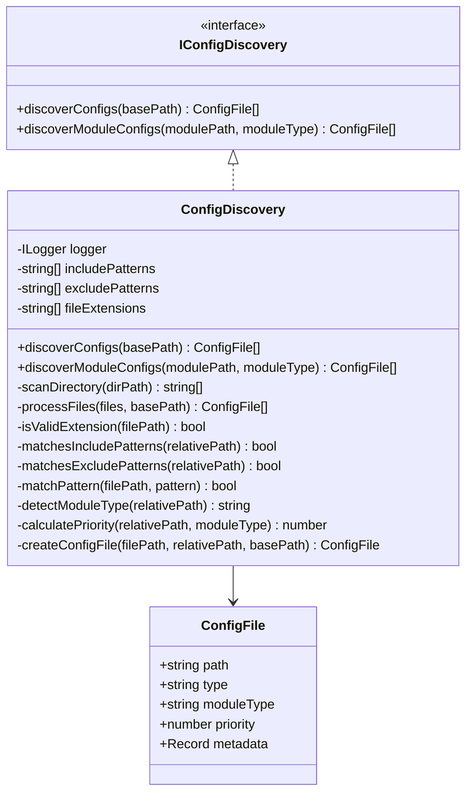
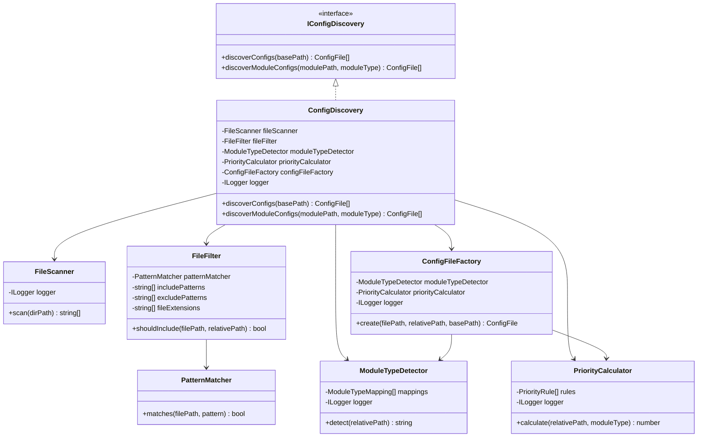

# ConfigDiscovery 职责分析报告

## 执行摘要

[`ConfigDiscovery`](src/infrastructure/config/loading/discovery.ts:22) 类存在严重的职责过载问题，违反了单一职责原则（SRP）。该类承担了文件发现、过滤、模式匹配、模块类型检测、优先级计算等多个职责，导致代码复杂度高、可维护性差、可测试性低。

**建议**：进行职责分离重构，将不同职责拆分到独立的类中，提高代码的可维护性和可测试性。

---

## 一、当前职责分析

### 1.1 主要职责清单

[`ConfigDiscovery`](src/infrastructure/config/loading/discovery.ts:22) 类目前承担以下职责：

| 职责 | 方法 | 代码行数 |
|------|------|----------|
| 文件系统扫描 | [`scanDirectory()`](src/infrastructure/config/loading/discovery.ts:89) | 24 行 |
| 文件扩展名验证 | [`isValidExtension()`](src/infrastructure/config/loading/discovery.ts:148) | 4 行 |
| 包含模式匹配 | [`matchesIncludePatterns()`](src/infrastructure/config/loading/discovery.ts:156) | 3 行 |
| 排除模式匹配 | [`matchesExcludePatterns()`](src/infrastructure/config/loading/discovery.ts:163) | 3 行 |
| Glob 模式匹配 | [`matchPattern()`](src/infrastructure/config/loading/discovery.ts:171) | 29 行 |
| 模块类型检测 | [`detectModuleType()`](src/infrastructure/config/loading/discovery.ts:229) | 52 行 |
| 优先级计算 | [`calculatePriority()`](src/infrastructure/config/loading/discovery.ts:285) | 57 行 |
| ConfigFile 对象创建 | [`createConfigFile()`](src/infrastructure/config/loading/discovery.ts:204) | 21 行 |
| 文件处理协调 | [`processFiles()`](src/infrastructure/config/loading/discovery.ts:117) | 27 行 |

**总计**：342 行代码，9 个主要职责

### 1.2 职责分类

#### 基础设施职责（应该保留）
- 文件系统扫描
- 文件扩展名验证
- ConfigFile 对象创建

#### 业务逻辑职责（应该分离）
- 模块类型检测（包含硬编码的映射规则）
- 优先级计算（包含复杂的业务规则）

#### 工具职责（应该使用成熟库）
- Glob 模式匹配（当前实现过于简单）

---

## 二、识别的问题

### 2.1 违反单一职责原则（SRP）

**问题描述**：[`ConfigDiscovery`](src/infrastructure/config/loading/discovery.ts:22) 类承担了太多不相关的职责。

**影响**：
- 修改一个职责可能影响其他职责
- 难以理解和维护
- 测试复杂度高

**具体表现**：
```typescript
// 问题1：模块类型检测包含硬编码的业务规则
private detectModuleType(relativePath: string): string {
  const MODULE_MAPPING: Record<string, string> = {
    global: 'global',
    environments: 'global',
    llms: 'llms',
    tools: 'tools',
    // ... 更多硬编码映射
  };
  // 52 行复杂的检测逻辑
}

// 问题2：优先级计算包含复杂的业务规则
private calculatePriority(relativePath: string, moduleType: string): number {
  let priority = 100;
  // 57 行复杂的优先级计算逻辑
  // 包含多个 if-else 分支和硬编码的优先级值
}
```

### 2.2 业务逻辑混入基础设施层

**问题描述**：[`detectModuleType()`](src/infrastructure/config/loading/discovery.ts:229) 和 [`calculatePriority()`](src/infrastructure/config/loading/discovery.ts:285) 包含了大量业务规则，这些规则应该由配置驱动，而不是硬编码在代码中。

**影响**：
- 业务规则变更需要修改代码
- 不同环境难以使用不同的规则
- 违反了开闭原则（OCP）

**具体表现**：
```typescript
// 硬编码的模块映射
const MODULE_MAPPING: Record<string, string> = {
  global: 'global',
  environments: 'global',
  llms: 'llms',
  tools: 'tools',
  workflows: 'workflows',
  // ... 更多映射
};

// 硬编码的优先级规则
if (firstDir === 'global') {
  priority += 1000;
}
if (firstDir === 'environments') {
  priority += 800;
}
```

### 2.3 模式匹配实现过于简单

**问题描述**：[`matchPattern()`](src/infrastructure/config/loading/discovery.ts:171) 方法只支持有限的 glob 模式，实现不够健壮。

**影响**：
- 无法支持复杂的 glob 模式
- 可能存在边界情况未处理
- 重复造轮子

**具体表现**：
```typescript
private matchPattern(filePath: string, pattern: string): boolean {
  // 只支持简单的 **/*.ext 模式
  // 不支持通配符、字符类等高级特性
  // 29 行自定义实现，容易出错
}
```

### 2.4 硬编码的配置

**问题描述**：多个配置项都是硬编码的默认值，缺乏灵活性。

**影响**：
- 难以适应不同的项目结构
- 无法通过配置文件调整行为
- 扩展性差

**具体表现**：
```typescript
constructor(options: ConfigDiscoveryOptions = {}, logger: ILogger) {
  this.includePatterns = options.includePatterns || ['**/*.toml'];
  this.excludePatterns = options.excludePatterns || [
    '**/_*',
    '**/__*',
    '**/test_*',
    '**/*.test.*',
  ];
  this.fileExtensions = options.fileExtensions || ['.toml'];
}
```

### 2.5 缺乏可测试性

**问题描述**：大量私有方法，难以单独测试。

**影响**：
- 只能通过公共方法间接测试
- 测试覆盖率难以提高
- 问题定位困难

**具体表现**：
- 9 个私有方法
- 业务逻辑与文件系统操作耦合
- 无法 mock 文件系统操作

---

## 三、重构建议

### 3.1 职责分离方案

#### 方案 A：渐进式重构（推荐）

将 [`ConfigDiscovery`](src/infrastructure/config/loading/discovery.ts:22) 的职责拆分为以下类：

```
ConfigDiscovery (协调者)
├── FileScanner (文件扫描)
├── FileFilter (文件过滤)
├── PatternMatcher (模式匹配)
├── ModuleTypeDetector (模块类型检测)
├── PriorityCalculator (优先级计算)
└── ConfigFileFactory (ConfigFile 创建)
```

**优点**：
- 可以逐步重构，降低风险
- 每个类职责清晰
- 易于测试和维护

**缺点**：
- 类的数量增加
- 需要协调多个类

#### 方案 B：配置驱动重构

将业务规则提取到配置文件中，[`ConfigDiscovery`](src/infrastructure/config/loading/discovery.ts:22) 只负责执行规则。

**优点**：
- 业务规则可配置
- 无需修改代码即可调整行为
- 符合开闭原则

**缺点**：
- 需要设计配置格式
- 配置文件管理复杂度增加

### 3.2 具体重构步骤

#### 步骤 1：提取模式匹配器

创建 [`PatternMatcher`](src/infrastructure/config/loading/pattern-matcher.ts) 类，使用成熟的 glob 库。

```typescript
// src/infrastructure/config/loading/pattern-matcher.ts
import { minimatch } from 'minimatch';

export class PatternMatcher {
  matches(filePath: string, pattern: string): boolean {
    return minimatch(filePath, pattern);
  }
}
```

#### 步骤 2：提取模块类型检测器

创建 [`ModuleTypeDetector`](src/infrastructure/config/loading/module-type-detector.ts) 类，支持配置驱动。

```typescript
// src/infrastructure/config/loading/module-type-detector.ts
export interface ModuleTypeMapping {
  directory: string;
  moduleType: string;
}

export class ModuleTypeDetector {
  constructor(
    private readonly mappings: ModuleTypeMapping[],
    private readonly logger: ILogger
  ) {}

  detect(relativePath: string): string {
    // 基于配置的检测逻辑
  }
}
```

#### 步骤 3：提取优先级计算器

创建 [`PriorityCalculator`](src/infrastructure/config/loading/priority-calculator.ts) 类，支持配置驱动。

```typescript
// src/infrastructure/config/loading/priority-calculator.ts
export interface PriorityRule {
  condition: (path: string, moduleType: string) => boolean;
  priority: number;
}

export class PriorityCalculator {
  constructor(
    private readonly rules: PriorityRule[],
    private readonly logger: ILogger
  ) {}

  calculate(relativePath: string, moduleType: string): number {
    // 基于规则的优先级计算
  }
}
```

#### 步骤 4：提取文件过滤器

创建 [`FileFilter`](src/infrastructure/config/loading/file-filter.ts) 类。

```typescript
// src/infrastructure/config/loading/file-filter.ts
export class FileFilter {
  constructor(
    private readonly patternMatcher: PatternMatcher,
    private readonly includePatterns: string[],
    private readonly excludePatterns: string[],
    private readonly fileExtensions: string[]
  ) {}

  shouldInclude(filePath: string, relativePath: string): boolean {
    // 过滤逻辑
  }
}
```

#### 步骤 5：重构 ConfigDiscovery

简化 [`ConfigDiscovery`](src/infrastructure/config/loading/discovery.ts:22) 类，使其只负责协调。

```typescript
// src/infrastructure/config/loading/discovery.ts (重构后)
export class ConfigDiscovery implements IConfigDiscovery {
  private readonly fileScanner: FileScanner;
  private readonly fileFilter: FileFilter;
  private readonly moduleTypeDetector: ModuleTypeDetector;
  private readonly priorityCalculator: PriorityCalculator;
  private readonly configFileFactory: ConfigFileFactory;
  private readonly logger: ILogger;

  constructor(
    options: ConfigDiscoveryOptions,
    logger: ILogger
  ) {
    this.logger = logger.child({ module: 'ConfigDiscovery' });

    // 初始化各个组件
    this.patternMatcher = new PatternMatcher();
    this.moduleTypeDetector = new ModuleTypeDetector(options.moduleMappings, logger);
    this.priorityCalculator = new PriorityCalculator(options.priorityRules, logger);
    this.fileFilter = new FileFilter(
      this.patternMatcher,
      options.includePatterns,
      options.excludePatterns,
      options.fileExtensions
    );
    this.fileScanner = new FileScanner(logger);
    this.configFileFactory = new ConfigFileFactory(
      this.moduleTypeDetector,
      this.priorityCalculator,
      logger
    );
  }

  async discoverConfigs(basePath: string): Promise<ConfigFile[]> {
    const files = await this.fileScanner.scan(basePath);
    const filteredFiles = files.filter(file => 
      this.fileFilter.shouldInclude(file, path.relative(basePath, file))
    );
    
    return Promise.all(
      filteredFiles.map(file => 
        this.configFileFactory.create(file, path.relative(basePath, file), basePath)
      )
    );
  }
}
```

### 3.3 配置驱动方案

创建配置文件来定义业务规则：

```toml
# configs/discovery-config.toml
[module_mappings]
global = "global"
environments = "global"
llms = "llms"
tools = "tools"
workflows = "workflows"

[[priority_rules]]
condition = "path.includes('__registry__')"
priority = 600

[[priority_rules]]
condition = "path.includes('common')"
priority = 500

[[priority_rules]]
condition = "firstDir === 'global'"
priority = 1000
```

---

## 四、架构图

### 4.1 当前架构



### 4.2 重构后架构



---

## 五、实施建议

### 5.1 优先级

| 优先级 | 任务 | 理由 |
|--------|------|------|
| 高 | 提取模式匹配器，使用成熟库 | 提高可靠性，减少维护成本 |
| 高 | 提取模块类型检测器 | 分离业务逻辑，提高可配置性 |
| 中 | 提取优先级计算器 | 分离业务逻辑，提高可配置性 |
| 中 | 提取文件过滤器 | 提高代码可读性 |
| 低 | 配置驱动重构 | 需要更多设计工作 |

### 5.2 风险评估

| 风险 | 影响 | 缓解措施 |
|------|------|----------|
| 破坏现有功能 | 高 | 完善单元测试，逐步重构 |
| 增加复杂度 | 中 | 保持接口稳定，内部重构 |
| 性能下降 | 低 | 使用成熟的 glob 库，性能更好 |

### 5.3 测试策略

1. **单元测试**：为每个新类编写独立的单元测试
2. **集成测试**：确保 [`ConfigDiscovery`](src/infrastructure/config/loading/discovery.ts:22) 与其他组件的集成正常
3. **回归测试**：确保现有功能不受影响

---

## 六、总结

### 6.1 主要问题

1. **职责过载**：[`ConfigDiscovery`](src/infrastructure/config/loading/discovery.ts:22) 承担了 9 个不同的职责
2. **业务逻辑混入**：模块类型检测和优先级计算包含硬编码的业务规则
3. **模式匹配简陋**：自定义的 glob 匹配实现不够健壮
4. **配置硬编码**：多个配置项缺乏灵活性
5. **可测试性差**：大量私有方法，难以单独测试

### 6.2 重构收益

1. **提高可维护性**：每个类职责单一，易于理解和修改
2. **提高可测试性**：每个组件可以独立测试
3. **提高可配置性**：业务规则可以通过配置调整
4. **提高可靠性**：使用成熟的 glob 库，减少 bug
5. **符合 SOLID 原则**：特别是单一职责原则和开闭原则

### 6.3 下一步行动

1. 与团队讨论重构方案
2. 确定优先级和实施计划
3. 编写测试用例
4. 逐步实施重构
5. 持续监控和优化

---

## 附录

### A. 相关文件

- [`src/infrastructure/config/loading/discovery.ts`](src/infrastructure/config/loading/discovery.ts:1) - 当前实现
- [`src/infrastructure/config/loading/types.ts`](src/infrastructure/config/loading/types.ts:1) - 类型定义
- [`src/infrastructure/config/loading/config-loading-module.ts`](src/infrastructure/config/loading/config-loading-module.ts:1) - 配置加载模块

### B. 参考资料

- SOLID 原则
- 单一职责原则（SRP）
- 开闭原则（OCP）
- Glob 模式规范
- TypeScript 最佳实践