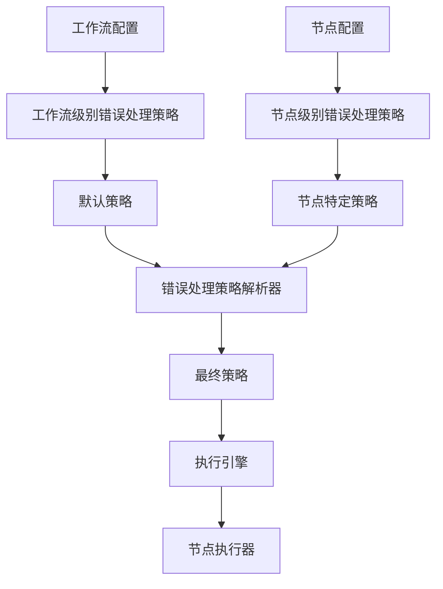

# 错误处理策略重构方案

## 一、当前设计问题分析

### 1.1 工作流级别的错误处理策略过于粗粒度

**问题描述：**
- `ErrorHandlingStrategy` 被定义在 `WorkflowDefinition` 中（第18行）
- 整个工作流使用统一的错误处理策略
- 无法满足不同节点类型的不同错误处理需求

**代码位置：**
- [`src/domain/workflow/value-objects/workflow-definition.ts:18`](src/domain/workflow/value-objects/workflow-definition.ts:18)
- [`src/domain/workflow/entities/workflow.ts:107`](src/domain/workflow/entities/workflow.ts:107)

### 1.2 节点类型差异未被考虑

**问题描述：**
项目中有18种不同的节点类型，每种类型对错误的容忍度和处理方式应该不同：

| 节点类型 | 推荐错误处理策略 | 原因 |
|---------|----------------|------|
| LLM | RETRY | 网络问题、限流等临时性错误 |
| TOOL | RETRY/SKIP | 外部服务调用可能失败 |
| DATA_TRANSFORM | SKIP/CONTINUE | 数据处理失败不应阻塞整个流程 |
| FORK/JOIN | STOP_ON_ERROR | 控制流节点错误通常表示严重问题 |
| CONDITION | STOP_ON_ERROR | 条件判断错误无法继续 |
| USER_INTERACTION | SKIP/CONTINUE | 用户交互失败可以跳过 |
| WAIT | SKIP | 等待超时可以跳过 |
| CONTEXT_PROCESSOR | SKIP | 上下文处理失败可以使用默认值 |
| START/END | STOP_ON_ERROR | 起止节点错误必须停止 |
| LOOP_START/LOOP_END | STOP_ON_ERROR | 循环控制错误必须停止 |

### 1.3 执行引擎中的错误处理逻辑分散

**问题描述：**
- [`WorkflowExecutionEngine.handleNodeExecutionError`](src/services/threads/workflow-execution-engine.ts:669-704) 只检查错误边，没有考虑节点类型
- 重试逻辑在 [`executeNodeWithRetry`](src/services/threads/workflow-execution-engine.ts:476-496) 中，但重试配置来自执行选项，不是节点配置
- 错误处理逻辑与节点类型解耦

### 1.4 配置渠道不清晰

**问题描述：**
- 当前错误处理策略配置在工作流级别
- 节点级别的错误处理配置缺失
- 执行选项中虽然有重试配置（`maxNodeRetries`, `nodeRetryDelay`），但这是全局的，不是针对特定节点的

## 二、重构方案设计

### 2.1 设计原则

1. **分层配置**：工作流级别提供默认策略，节点级别可以覆盖
2. **类型感知**：根据节点类型提供合理的默认策略
3. **灵活配置**：支持通过配置文件和代码两种方式配置
4. **向后兼容**：保留工作流级别的错误处理策略作为默认值

### 2.2 架构设计



### 2.3 核心组件设计

#### 2.3.1 节点错误处理配置（新增）

**文件位置：** `src/domain/workflow/value-objects/node-error-handling-config.ts`

```typescript
export interface NodeErrorHandlingConfigProps {
  strategy: ErrorHandlingStrategy;
  retryCount?: number;
  retryDelay?: number;
  fallbackNodeId?: string;  // 错误时跳转到的节点
  continueOnWarning?: boolean;  // 警告时是否继续
}

export class NodeErrorHandlingConfig extends ValueObject<NodeErrorHandlingConfigProps> {
  // 静态工厂方法
  public static default(): NodeErrorHandlingConfig;
  public static fromNodeType(nodeType: NodeType): NodeErrorHandlingConfig;
  public static fromConfig(config: any): NodeErrorHandlingConfig;
}
```

#### 2.3.2 节点类型默认策略映射（新增）

**文件位置：** `src/domain/workflow/value-objects/node-error-handling-defaults.ts`

```typescript
export const NODE_TYPE_ERROR_HANDLING_DEFAULTS: Record<NodeTypeValue, NodeErrorHandlingConfig> = {
  [NodeTypeValue.LLM]: NodeErrorHandlingConfig.retry(3, 1000),
  [NodeTypeValue.TOOL]: NodeErrorHandlingConfig.retry(2, 500),
  [NodeTypeValue.DATA_TRANSFORM]: NodeErrorHandlingConfig.skip(),
  [NodeTypeValue.FORK]: NodeErrorHandlingConfig.stopOnError(),
  [NodeTypeValue.JOIN]: NodeErrorHandlingConfig.stopOnError(),
  [NodeTypeValue.CONDITION]: NodeErrorHandlingConfig.stopOnError(),
  [NodeTypeValue.USER_INTERACTION]: NodeErrorHandlingConfig.continueOnError(),
  [NodeTypeValue.WAIT]: NodeErrorHandlingConfig.skip(),
  [NodeTypeValue.CONTEXT_PROCESSOR]: NodeErrorHandlingConfig.skip(),
  [NodeTypeValue.START]: NodeErrorHandlingConfig.stopOnError(),
  [NodeTypeValue.END]: NodeErrorHandlingConfig.stopOnError(),
  [NodeTypeValue.LOOP_START]: NodeErrorHandlingConfig.stopOnError(),
  [NodeTypeValue.LOOP_END]: NodeErrorHandlingConfig.stopOnError(),
  [NodeTypeValue.MERGE]: NodeErrorHandlingConfig.continueOnError(),
  [NodeTypeValue.SUBGRAPH]: NodeErrorHandlingConfig.continueOnError(),
  [NodeTypeValue.CUSTOM]: NodeErrorHandlingConfig.continueOnError(),
};
```

#### 2.3.3 错误处理策略解析器（新增）

**文件位置：** `src/services/workflow/error-handling-strategy-resolver.ts`

```typescript
export class ErrorHandlingStrategyResolver {
  constructor(
    private readonly workflow: Workflow
  ) {}

  /**
   * 解析节点的错误处理策略
   * 优先级：节点配置 > 节点类型默认 > 工作流默认
   */
  public resolveForNode(node: Node): NodeErrorHandlingConfig {
    // 1. 检查节点是否有自定义配置
    const nodeConfig = this.getNodeErrorHandlingConfig(node);
    if (nodeConfig) {
      return nodeConfig;
    }

    // 2. 使用节点类型默认策略
    const typeDefault = NODE_TYPE_ERROR_HANDLING_DEFAULTS[node.type.getValue()];
    if (typeDefault) {
      return typeDefault;
    }

    // 3. 使用工作流默认策略
    return this.getWorkflowDefaultConfig();
  }

  private getNodeErrorHandlingConfig(node: Node): NodeErrorHandlingConfig | null;
  private getWorkflowDefaultConfig(): NodeErrorHandlingConfig;
}
```

#### 2.3.4 修改 Node 实体

**文件位置：** `src/domain/workflow/entities/node.ts`

```typescript
export interface NodeProps {
  readonly id: NodeId;
  readonly type: NodeType;
  readonly name?: string;
  readonly description?: string;
  readonly position?: { x: number; y: number };
  readonly properties: Record<string, any>;
  readonly status: NodeStatus;
  readonly errorHandlingConfig?: NodeErrorHandlingConfig;  // 新增
  readonly createdAt: Timestamp;
  readonly updatedAt: Timestamp;
  readonly version: Version;
}

export abstract class Node extends Entity {
  // 新增方法
  public getErrorHandlingConfig(): NodeErrorHandlingConfig | undefined;
  public updateErrorHandlingConfig(config: NodeErrorHandlingConfig): Node;
}
```

#### 2.3.5 修改 WorkflowExecutionEngine

**文件位置：** `src/services/threads/workflow-execution-engine.ts`

```typescript
export class WorkflowExecutionEngine {
  private readonly errorHandlingResolver: ErrorHandlingStrategyResolver;

  constructor(
    // ... 其他依赖
    @inject(TYPES.ErrorHandlingStrategyResolver) 
    errorHandlingResolver: ErrorHandlingStrategyResolver
  ) {
    // ... 其他初始化
    this.errorHandlingResolver = errorHandlingResolver;
  }

  private async executeNodeWithRetry(
    node: any,
    state: ThreadWorkflowState,
    threadId: string,
    options: { timeout: number; maxRetries: number; retryDelay: number }
  ): Promise<any> {
    // 解析节点的错误处理配置
    const errorHandlingConfig = this.errorHandlingResolver.resolveForNode(node);

    // 使用节点特定的重试配置
    const nodeRetryConfig = {
      maxRetries: errorHandlingConfig.retryCount ?? options.maxRetries,
      retryDelay: errorHandlingConfig.retryDelay ?? options.retryDelay,
    };

    // 根据策略执行
    if (errorHandlingConfig.strategy.isRetry()) {
      return await this.executeWithRetry(node, state, threadId, nodeRetryConfig);
    } else if (errorHandlingConfig.strategy.isSkip()) {
      return await this.executeWithSkip(node, state, threadId);
    } else if (errorHandlingConfig.strategy.isContinueOnError()) {
      return await this.executeWithContinue(node, state, threadId);
    } else {
      return await this.executeWithStop(node, state, threadId);
    }
  }

  private async handleNodeExecutionError(
    error: any,
    node: any,
    threadId: string,
    workflow: Workflow,
    enableErrorRecovery: boolean
  ): Promise<boolean> {
    const errorHandlingConfig = this.errorHandlingResolver.resolveForNode(node);

    // 根据策略处理错误
    if (errorHandlingConfig.strategy.isSkip()) {
      return await this.handleSkipStrategy(error, node, threadId, errorHandlingConfig);
    } else if (errorHandlingConfig.strategy.isContinueOnError()) {
      return await this.handleContinueStrategy(error, node, threadId, errorHandlingConfig);
    } else if (errorHandlingConfig.strategy.isRetry()) {
      return await this.handleRetryStrategy(error, node, threadId, errorHandlingConfig);
    } else {
      return await this.handleStopStrategy(error, node, threadId, errorHandlingConfig);
    }
  }
}
```

### 2.4 配置文件格式

#### 2.4.1 工作流配置文件（TOML）

```toml
[workflow]
name = "示例工作流"
error_handling_strategy = "stop_on_error"  # 工作流默认策略

[[workflow.nodes]]
id = "node_1"
type = "llm"
name = "LLM节点"

# 节点级别的错误处理配置
[workflow.nodes.error_handling]
strategy = "retry"
retry_count = 3
retry_delay = 1000

[[workflow.nodes]]
id = "node_2"
type = "tool"
name = "工具节点"

[workflow.nodes.error_handling]
strategy = "skip"
fallback_node_id = "node_3"  # 错误时跳转到此节点
```

#### 2.4.2 环境变量配置

```bash
# 工作流级别默认策略
WORKFLOW_ERROR_HANDLING_STRATEGY=stop_on_error

# 节点类型默认策略（可选覆盖）
NODE_TYPE_LLM_ERROR_HANDLING_STRATEGY=retry
NODE_TYPE_LLM_RETRY_COUNT=3
NODE_TYPE_LLM_RETRY_DELAY=1000

NODE_TYPE_TOOL_ERROR_HANDLING_STRATEGY=skip
```

## 三、实施步骤

### 3.1 第一阶段：创建核心组件

1. 创建 `NodeErrorHandlingConfig` 值对象
2. 创建节点类型默认策略映射
3. 创建 `ErrorHandlingStrategyResolver` 服务
4. 添加单元测试

### 3.2 第二阶段：修改现有组件

1. 修改 `Node` 实体，添加 `errorHandlingConfig` 属性
2. 修改 `WorkflowExecutionEngine`，集成错误处理策略解析器
3. 修改配置解析器，支持节点级别的错误处理配置
4. 更新集成测试

### 3.3 第三阶段：配置支持

1. 更新 TOML 配置解析器
2. 添加环境变量支持
3. 创建配置迁移脚本（向后兼容）
4. 更新文档

### 3.4 第四阶段：优化和测试

1. 性能优化（缓存解析结果）
2. 添加端到端测试
3. 更新用户文档
4. 代码审查和重构

## 四、向后兼容性

### 4.1 兼容策略

1. **保留工作流级别的错误处理策略**：作为默认值
2. **渐进式迁移**：新工作流可以使用节点级别配置，旧工作流继续使用工作流级别配置
3. **配置迁移工具**：提供工具将工作流级别配置转换为节点级别配置

### 4.2 迁移路径


## 五、优势总结

### 5.1 灵活性提升

- ✅ 每个节点可以有自己的错误处理策略
- ✅ 支持基于节点类型的智能默认策略
- ✅ 支持工作流级别的默认策略作为兜底

### 5.2 可维护性提升

- ✅ 错误处理逻辑集中管理
- ✅ 配置清晰，易于理解和修改
- ✅ 类型安全，编译时检查

### 5.3 可扩展性提升

- ✅ 易于添加新的错误处理策略
- ✅ 易于添加新的节点类型
- ✅ 支持自定义错误处理逻辑

### 5.4 用户体验提升

- ✅ 更精细的错误控制
- ✅ 更好的错误恢复能力
- ✅ 更清晰的错误信息

## 六、风险评估

### 6.1 技术风险

| 风险 | 影响 | 缓解措施 |
|------|------|----------|
| 配置复杂度增加 | 中 | 提供合理的默认值和配置验证 |
| 性能影响 | 低 | 使用缓存优化策略解析 |
| 向后兼容性 | 中 | 提供迁移工具和兼容模式 |

### 6.2 业务风险

| 风险 | 影响 | 缓解措施 |
|------|------|----------|
| 用户学习成本 | 中 | 提供详细文档和示例 |
| 配置错误 | 中 | 提供配置验证和错误提示 |
| 迁移成本 | 低 | 提供自动化迁移工具 |

## 七、总结

本重构方案通过引入基于节点类型的错误处理策略，解决了当前设计中工作流级别策略过于粗粒度的问题。方案具有以下特点：

1. **分层配置**：工作流级别提供默认策略，节点级别可以覆盖
2. **类型感知**：根据节点类型提供合理的默认策略
3. **灵活配置**：支持通过配置文件和代码两种方式配置
4. **向后兼容**：保留工作流级别的错误处理策略作为默认值

该方案在提升灵活性和可维护性的同时，保持了向后兼容性，降低了迁移成本。