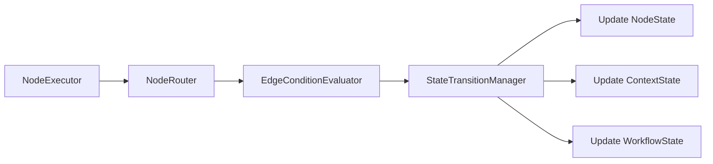

# 图工作流实现详细计划

## 1. 状态管理架构设计

### 1.1 状态分层设计

```mermaid
graph TB
    A[ExecutionState] --> B[WorkflowState]
    A --> C[NodeExecutionState]
    A --> D[ContextState]
    
    B --> B1[status: pending/running/completed/failed]
    B --> B2[progress: 0-100]
    B --> B3[startTime/endTime]
    B --> B4[currentNodeId]
    
    C --> C1[nodeId]
    C --> C2[status: pending/running/completed/failed/skipped]
    C --> C3[retryCount]
    C --> C4[result]
    C --> C5[error]
    
    D --> D1[variables: Map<string, any>]
    D --> D2[promptContext: PromptContext]
    D --> D3[executionHistory: ExecutionStep[]]
```

### 1.2 状态管理职责分配

**Domain层** (`src/domain/workflow/entities/`)
- `ExecutionState`: 执行状态实体，包含工作流、节点、上下文状态
- `WorkflowState`: 工作流整体状态
- `NodeExecutionState`: 单个节点执行状态
- `PromptContext`: 提示词上下文值对象

**Application层** (`src/application/workflow/services/`)
- `StateManagementService`: 状态管理服务，协调状态变更
- `ContextManagementService`: 上下文管理服务，处理变量和提示词传递

**Infrastructure层** (`src/infrastructure/workflow/state/`)
- `StatePersistenceService`: 状态持久化服务
- `StateQueryService`: 状态查询服务

## 2. 节点路由机制设计

### 2.1 路由架构



### 2.2 路由流程

1. **节点执行完成后**，调用`NodeRouter.determineNextNodes()`
2. **NodeRouter**获取节点的出边列表
3. **EdgeConditionEvaluator**评估每条边的条件
4. **StateTransitionManager**根据评估结果更新状态：
   - 更新当前节点状态为completed
   - 将节点结果添加到上下文
   - 更新提示词上下文
   - 设置下一个执行节点

### 2.3 关键组件

**NodeRouter** (`src/infrastructure/workflow/routing/`)
```typescript
interface NodeRouter {
  determineNextNodes(currentNodeId: string, context: ExecutionContext): Promise<string[]>;
}
```

**StateTransitionManager** (`src/infrastructure/workflow/state/`)
```typescript
interface StateTransitionManager {
  transition(nodeId: string, result: NodeExecutionResult, context: ExecutionContext): Promise<void>;
}
```

## 3. 功能模块实现位置

### 3.1 Domain层

```
src/domain/workflow/
├── entities/
│   ├── execution-state.ts          # 执行状态实体
│   ├── workflow-state.ts           # 工作流状态
│   ├── node-execution-state.ts     # 节点执行状态
│   └── prompt-context.ts           # 提示词上下文
├── value-objects/
│   ├── execution-status.ts         # 执行状态值对象
│   ├── node-status.ts              # 节点状态值对象
│   └── variable-path.ts            # 变量路径
└── events/
    ├── state-changed-event.ts      # 状态变更事件
    └── context-updated-event.ts    # 上下文更新事件
```

### 3.2 Application层

```
src/application/workflow/
├── services/
│   ├── state-management-service.ts     # 状态管理服务
│   ├── context-management-service.ts   # 上下文管理服务
│   └── execution-coordinator-service.ts # 执行协调服务
└── dtos/
    ├── state-dto.ts                    # 状态DTO
    └── context-dto.ts                  # 上下文DTO
```

### 3.3 Infrastructure层

```
src/infrastructure/workflow/
├── execution/
│   ├── execution-engine.ts             # 执行引擎
│   └── execution-context-manager.ts    # 执行上下文管理
├── state/
│   ├── state-persistence-service.ts    # 状态持久化
│   ├── state-query-service.ts          # 状态查询
│   └── state-transition-manager.ts     # 状态转换管理
├── routing/
│   ├── node-router.ts                  # 节点路由
│   └── edge-condition-evaluator.ts     # 边条件评估
└── nodes/
    ├── executors/                      # 节点执行器
    └── factories/
        └── node-executor-factory.ts    # 执行器工厂
```

## 4. 核心组件实现顺序

### 第一阶段：基础状态管理
1. **Domain层状态实体** (2天)
   - 创建ExecutionState、WorkflowState、NodeExecutionState
   - 创建PromptContext值对象
   - 定义状态变更事件

2. **Application层状态服务** (2天)
   - 实现StateManagementService
   - 实现ContextManagementService
   - 定义状态管理接口

3. **Infrastructure层状态持久化** (2天)
   - 实现StatePersistenceService
   - 实现StateQueryService
   - 添加数据库模型和转换器

### 第二阶段：路由和边评估
4. **边条件评估系统** (2天)
   - 完善EdgeConditionEvaluator
   - 集成ExpressionEvaluator
   - 支持预定义路由函数

5. **节点路由机制** (2天)
   - 实现NodeRouter
   - 实现StateTransitionManager
   - 集成状态管理服务

### 第三阶段：执行引擎
6. **执行引擎实现** (3天)
   - 创建ExecutionEngine
   - 集成GraphAlgorithmService
   - 实现拓扑排序执行
   - 支持并行和串行模式

7. **节点执行器完善** (3天)
   - 完善LLMNodeExecutor（集成提示词模块）
   - 完善ToolNodeExecutor（集成MCP工具）
   - 实现DataTransformNodeExecutor
   - 实现NodeExecutorFactory

### 第四阶段：编排和集成
8. **工作流编排服务** (2天)
   - 完善WorkflowOrchestrationService
   - 集成Thread和Session服务
   - 实现并行工作流执行

9. **扩展系统集成** (2天)
   - 集成Hooks系统
   - 集成Plugins系统
   - 集成Triggers系统

### 第五阶段：配置和测试
10. **配置驱动实现** (2天)
    - 创建WorkflowConfigLoader
    - 定义节点、边、hooks配置结构
    - 支持环境变量注入

11. **测试和优化** (3天)
    - 单元测试
    - 集成测试
    - 性能优化

**总计：23个工作日**

## 5. 配置驱动方案

### 5.1 配置结构

```toml
# configs/workflow/workflows/example.toml
[workflow]
name = "示例工作流"
type = "graph"
description = "图工作流示例"

[workflow.state_management]
persist_enabled = true
context_sharing = true
prompt_propagation = true

[[workflow.nodes]]
id = "llm_node"
type = "llm"
name = "LLM处理"

[workflow.nodes.config]
model = "${LLM_MODEL:-gpt-4}"
prompt_template = "请分析: {{input}}"

[workflow.nodes.routing]
evaluate_edges = true
continue_on_failure = false

[[workflow.nodes.hooks]]
point = "pre_execution"
name = "validate_input"

[[workflow.edges]]
from = "llm_node"
to = "tool_node"
type = "conditional"

[workflow.edges.condition]
expression = "{{llm_node.result.success}} == true"

[workflow.edges.state_transition]
update_context = true
propagate_prompt = true
```

### 5.2 配置加载器

**位置**: `src/infrastructure/config/loading/loaders/workflow-loader.ts`

```typescript
export class WorkflowConfigLoader extends BaseModuleLoader {
  loadWorkflowConfig(workflowId: string): Promise<WorkflowConfig> {
    // 加载工作流配置
    // 支持继承和环境变量注入
    // 验证配置结构
  }
  
  loadNodeConfig(nodeType: string): Promise<NodeConfig> {
    // 加载节点配置
  }
  
  loadEdgeConfig(edgeType: string): Promise<EdgeConfig> {
    // 加载边配置
  }
}
```

## 6. 扩展系统集成

### 6.1 Hooks集成

**执行点**：
- `pre_node_execution`: 节点执行前
- `post_node_execution`: 节点执行后
- `pre_state_transition`: 状态转换前
- `post_state_transition`: 状态转换后
- `pre_context_update`: 上下文更新前
- `post_context_update`: 上下文更新后

**配置示例**：
```toml
[[workflow.hooks]]
name = "log_execution"
hook_point = "post_node_execution"
priority = 100
enabled = true

[workflow.hooks.config]
level = "info"
include_context = true
```

### 6.2 Plugins集成

**插件类型**：
- `node_executor`: 自定义节点执行器
- `edge_evaluator`: 自定义边条件评估器
- `state_persister`: 自定义状态持久化器

**配置示例**：
```toml
[[workflow.plugins]]
type = "node_executor"
name = "custom_llm_executor"
enabled = true

[workflow.plugins.config]
executor_class = "CustomLlmNodeExecutor"
dependencies = ["llm_client"]
```

### 6.3 Triggers集成

**触发类型**：
- `timeout`: 超时触发
- `state_change`: 状态变更触发
- `error`: 错误触发
- `condition_met`: 条件满足触发

**配置示例**：
```toml
[[workflow.triggers]]
type = "timeout"
name = "node_timeout"
enabled = true

[workflow.triggers.config]
duration = 30000
action = "skip_node"
target_nodes = ["llm_node"]
```

## 7. 测试策略

### 7.1 单元测试

**测试目录**: `src/**/__tests__/`

**测试覆盖**：
- 状态实体和值对象
- 状态管理服务
- 节点路由逻辑
- 边条件评估
- 状态转换管理

**示例**：
```typescript
describe('StateManagementService', () => {
  it('should update node state correctly', async () => {
    const service = new StateManagementService();
    await service.updateNodeState('node1', 'completed', { result: 'success' });
    
    const state = await service.getNodeState('node1');
    expect(state.status).toBe('completed');
    expect(state.result).toBe('success');
  });
});
```

### 7.2 集成测试

**测试目录**: `tests/integration/`

**测试场景**：
- 完整工作流执行流程
- 状态持久化和恢复
- 上下文传递和提示词传播
- 并行节点执行
- 错误处理和重试

**示例**：
```typescript
describe('Graph Workflow Integration', () => {
  it('should execute graph workflow with state management', async () => {
    const workflow = createTestWorkflow();
    const result = await executionEngine.execute(workflow, context);
    
    expect(result.status).toBe('completed');
    expect(result.state.nodeStates.size).toBe(3);
    expect(result.context.getVariable('prompt_context')).toBeDefined();
  });
});
```

### 7.3 端到端测试

**测试目录**: `tests/e2e/`

**测试场景**：
- 复杂业务工作流
- 多工作流并行执行
- 故障恢复场景
- 性能基准测试

## 8. 关键设计决策

### 8.1 状态管理集中化

**决策**：在Domain层定义状态实体，Application层提供状态管理服务，Infrastructure层负责持久化。

**理由**：
- 符合分层架构原则
- 业务规则集中在Domain层
- 便于测试和维护
- 支持多种持久化方式

### 8.2 节点负责路由

**决策**：节点执行完成后，由节点路由机制决定下一个节点，边主要负责条件评估和状态变化控制。

**理由**：
- 符合图执行逻辑
- 边可以专注于条件评估
- 状态变化更加清晰
- 便于调试和监控

### 8.3 提示词上下文传递

**决策**：将提示词上下文作为状态管理的核心部分，通过ContextState进行传递。

**理由**：
- 提示词传递是业务核心需求
- 统一管理便于追踪
- 支持复杂的工作流场景
- 便于集成LLM节点

### 8.4 配置驱动优先

**决策**：所有组件都支持配置驱动，通过TOML文件进行配置。

**理由**：
- 提高灵活性
- 便于环境管理
- 支持热更新
- 符合框架设计原则

## 9. 风险和对策

### 9.1 性能风险

**风险**：状态频繁更新导致性能下降。

**对策**：
- 使用批量更新机制
- 实现状态缓存
- 异步持久化
- 性能监控和优化

### 9.2 复杂度风险

**风险**：状态管理和路由逻辑过于复杂。

**对策**：
- 保持设计简单清晰
- 充分测试覆盖
- 文档和示例完善
- 代码审查机制

### 9.3 集成风险

**风险**：与现有系统（Thread、Session）集成困难。

**对策**：
- 定义清晰的接口
- 逐步集成和测试
- 保持向后兼容
- 充分的集成测试

## 10. 后续优化方向

1. **状态快照**：支持执行状态快照，便于调试和恢复
2. **可视化监控**：提供工作流执行状态的可视化界面
3. **性能优化**：并行状态更新、缓存优化
4. **高级路由**：支持更复杂的路由策略
5. **分布式支持**：支持分布式工作流执行