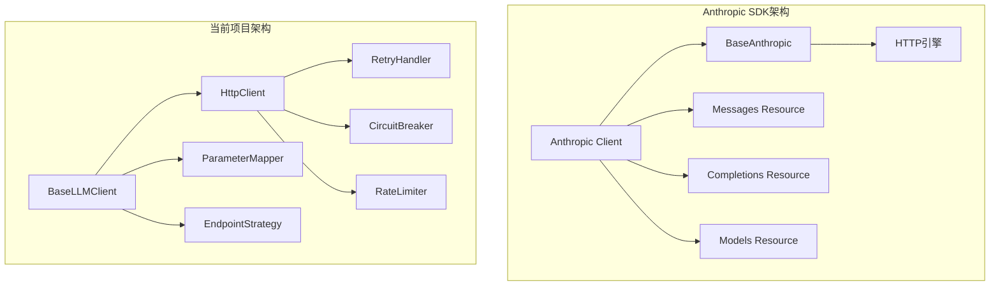

# HTTP Client和LLM Client改造分析报告

## 执行摘要

基于对Anthropic SDK v0.71.2设计模式和当前项目架构的深入分析，本报告评估了将当前项目的HTTP client和LLM client改造为类似Anthropic SDK设计模式的必要性和可行性。

## 1. Anthropic SDK设计模式分析

### 1.1 核心架构特点

**分层架构**：
```
┌─────────────────────────────────────┐
│          Anthropic Client           │
│  - BaseAnthropic (基础客户端)        │
│  - 资源类 (Messages, Completions等) │
└──────────────┬──────────────────────┘
               │
               │ 继承
               │
┌──────────────▼──────────────────────┐
│          BaseAnthropic              │
│  - HTTP请求处理                     │
│  - 认证管理                         │
│  - 重试逻辑                         │
│  - 超时控制                         │
└─────────────────────────────────────┘
```

### 1.2 关键设计模式

1. **资源模式 (Resource Pattern)**：
   - `APIResource` 基类，所有API资源继承此类
   - 资源类持有客户端实例，通过客户端发起请求
   - 示例：`Messages`、`Completions`、`Models`等

2. **客户端聚合模式**：
   ```typescript
   export class Anthropic extends BaseAnthropic {
     completions: API.Completions = new API.Completions(this);
     messages: API.Messages = new API.Messages(this);
     models: API.Models = new API.Models(this);
   }
   ```

3. **配置驱动设计**：
   - `ClientOptions` 提供灵活的配置选项
   - 支持环境变量、运行时配置等多种配置方式

4. **统一的错误处理**：
   - 分层错误类型体系
   - 统一的错误生成和传播机制

### 1.3 优点
- **职责分离清晰**：客户端处理HTTP细节，资源类处理业务逻辑
- **类型安全**：完整的TypeScript类型定义
- **可扩展性**：易于添加新的API资源
- **平台适配**：支持多平台（Bedrock、Vertex等）

## 2. 当前项目架构分析

### 2.1 HTTP Client实现 (`src/infrastructure/common/http/http-client.ts`)

**特点**：
- 基于原生fetch API实现
- 集成三个中间件：RetryHandler、CircuitBreaker、RateLimiter
- 返回`APIPromise<T>`类型
- 支持请求级别的配置覆盖

**核心方法**：
- `get/post/put/patch/delete`：标准HTTP方法
- `request`：通用请求方法
- `setDefaultHeader`/`setBaseURL`：配置方法

### 2.2 LLM Client实现 (`src/infrastructure/llm/clients/base-llm-client.ts`)

**特点**：
- 抽象基类`BaseLLMClient`
- 使用组合关系依赖`HttpClient`
- 集成参数映射器 (`parameterMapper`)
- 集成端点策略 (`endpointStrategy`)
- 支持流式和非流式响应

**架构关系**：
```
┌─────────────────────────────────────┐
│      BaseLLMClient                  │
│  - httpClient: HttpClient           │
│  - rateLimiter: TokenBucketLimiter │
│  - tokenCalculator: TokenCalculator│
│  - providerConfig: ProviderConfig   │
│                                     │
│  generateResponse() {              │
│    httpClient.post(...)             │
│  }                                   │
└──────────────┬──────────────────────┘
               │
               │ 依赖注入
               │
┌──────────────▼──────────────────────┐
│      HttpClient                      │
│  - retryHandler: RetryHandler       │
│  - circuitBreaker: CircuitBreaker   │
│  - rateLimiter: RateLimiter         │
│                                     │
│  post(url, data, config)            │
└─────────────────────────────────────┘
```

## 3. 设计模式对比分析

### 3.1 架构对比



### 3.2 关键差异对比表

| 维度 | Anthropic SDK | 当前项目 | 差异分析 |
|------|---------------|----------|----------|
| **架构模式** | 资源模式 + 继承 | 组合模式 + 依赖注入 | Anthropic使用继承，当前项目使用组合 |
| **HTTP处理** | 集成在BaseAnthropic中 | 独立的HttpClient组件 | Anthropic更紧密耦合，当前项目更模块化 |
| **错误处理** | 统一的错误类型体系 | 分散的错误处理 | Anthropic更系统化 |
| **配置管理** | ClientOptions集中配置 | 分散的配置管理 | Anthropic更统一 |
| **类型安全** | 完整的TypeScript类型 | 部分类型安全 | Anthropic更完善 |
| **扩展性** | 易于添加新资源 | 需要修改多个组件 | Anthropic更易扩展 |
| **中间件** | 内置重试逻辑 | 三个独立中间件 | 当前项目更灵活但更复杂 |

### 3.3 优势对比

**Anthropic SDK优势**：
1. **架构更简洁**：资源模式减少了代码重复
2. **类型更安全**：完整的TypeScript支持
3. **更易维护**：统一的错误处理和配置管理
4. **社区标准**：符合行业最佳实践

**当前项目优势**：
1. **更灵活**：组合模式支持运行时更换组件
2. **更模块化**：各组件独立，易于测试
3. **功能更丰富**：集成了CircuitBreaker、RateLimiter等高级功能
4. **符合项目架构**：遵循项目的分层架构原则

## 4. 改造必要性和可行性评估

### 4.1 改造必要性分析

**需要改造的方面**：

1. **类型安全性提升** ✅
   - Anthropic SDK提供了更完善的类型定义
   - 当前项目的类型定义可以进一步完善

2. **错误处理统一** ✅
   - Anthropic的错误处理体系更系统化
   - 当前项目可以借鉴其错误类型设计

3. **配置管理优化** ✅
   - ClientOptions模式提供了更统一的配置管理
   - 当前项目的配置管理可以进一步优化

4. **资源模式引入** ⚠️
   - 资源模式可以减少代码重复
   - 但需要评估是否适合当前项目的使用场景

**不需要改造的方面**：

1. **架构模式变更** ❌
   - 当前项目的组合模式更符合SOLID原则
   - 继承模式可能导致过度耦合

2. **中间件移除** ❌
   - CircuitBreaker和RateLimiter是重要功能
   - Anthropic SDK没有这些功能

3. **依赖注入移除** ❌
   - 依赖注入提高了可测试性
   - 符合项目的架构原则

### 4.2 可行性分析

**技术可行性**：高
- Anthropic SDK是开源项目，设计模式清晰
- 当前项目已有良好基础，改造风险可控

**业务可行性**：中等
- 需要评估改造对现有功能的影响
- 需要考虑开发资源和时间成本

**风险分析**：
1. **兼容性风险**：改造可能影响现有API
2. **学习曲线**：团队需要适应新的设计模式
3. **迁移成本**：需要逐步迁移，不能一次性完成

## 5. 改造建议和计划

### 5.1 推荐方案：渐进式优化，不进行大规模重构

**核心原则**：
- 保持当前组合架构的优势
- 借鉴Anthropic SDK的优秀设计
- 逐步优化，降低风险

### 5.2 具体改造建议（精简版）

#### 核心改进点（真正有价值的）：

1. **类型安全增强**
   - 借鉴Anthropic SDK的完整TypeScript类型体系
   - 为HttpClient和LLMClient提供更严格的类型定义
   - 减少any类型的使用，提高代码安全性

2. **错误处理统一**
   - 创建分层的错误类型体系（类似Anthropic的APIError、AuthenticationError等）
   - 统一错误生成和传播机制
   - 提供更好的错误信息和调试支持

3. **配置管理优化**
   - 引入类似ClientOptions的配置对象
   - 支持环境变量、配置文件、运行时配置的多层级覆盖
   - 简化配置管理，提高可维护性

#### 可选的改进点：

4. **请求构建优化**
   - 参考Anthropic的请求构建方式（buildRequest方法）
   - 保持现有中间件功能不变
   - 优化请求日志和监控

5. **流式处理增强**
   - 借鉴Anthropic的流式响应处理
   - 优化当前项目的流式API接口

#### 不建议的改进：

6. **资源模式引入** ❌
   - 对现有架构无实际价值
   - 会增加不必要的复杂性
   - 保持当前组合架构的优势

7. **架构模式变更** ❌
   - 当前组合模式更符合SOLID原则
   - 继承模式可能导致过度耦合

### 5.3 具体实施计划

#### 短期计划（1-2周）
1. **分析现有代码**：完成详细的影响分析
2. **设计类型体系**：创建完善的TypeScript类型定义
3. **实现错误处理优化**：统一错误类型和传播机制

#### 中期计划（2-4周）
1. **优化配置管理**：引入ClientOptions-like配置
2. **增强HttpClient**：优化接口设计，保持向后兼容
3. **创建概念验证**：实现一个资源类的示例

#### 长期计划（1-2月）
1. **逐步迁移**：按模块逐步应用新设计
2. **测试验证**：确保功能完整性和性能
3. **文档更新**：更新相关文档和示例

### 5.4 风险缓解措施

1. **保持向后兼容**：所有改造必须保持API兼容性
2. **分阶段实施**：小步快跑，降低风险
3. **充分测试**：每个阶段都要有完整的测试覆盖
4. **团队培训**：确保团队理解新设计模式

## 6. 结论和建议

### 6.1 核心结论

1. **不推荐完全照搬Anthropic SDK架构**
   - 当前项目的组合架构更灵活、更符合SOLID原则
   - Anthropic的继承模式可能导致过度耦合

2. **推荐渐进式优化**
   - 借鉴Anthropic SDK的优秀设计元素
   - 保持当前架构的核心优势

3. **重点关注类型安全和错误处理**
   - 这是Anthropic SDK最值得借鉴的部分
   - 对提升代码质量有显著帮助

### 6.2 最终建议（基于用户反馈调整）

**经过重新评估，建议聚焦于真正有价值的改进**：

✅ **强烈推荐采纳**：
1. **类型安全增强** - Anthropic SDK最值得借鉴的部分
2. **错误处理统一** - 提升代码质量和可维护性
3. **配置管理优化** - 简化配置，提高灵活性

⚠️ **可考虑采纳**：
4. **请求构建优化** - 参考Anthropic的buildRequest方式
5. **流式处理增强** - 改善流式API体验

❌ **明确不建议采纳**：
6. **资源模式引入** - 对现有架构无实际价值，会增加复杂性
7. **架构模式变更** - 当前组合模式更优，不应改为继承模式

**实施优先级调整**：
1. **最高优先级**：类型安全和错误处理优化
2. **高优先级**：配置管理优化
3. **中优先级**：请求构建和流式处理优化
4. **不实施**：资源模式和架构模式变更

**核心原则**：
- 保持当前组合架构的所有优势
- 仅借鉴Anthropic SDK中真正有价值的设计元素
- 避免为改造而改造，专注于解决实际问题

通过这种聚焦式的改进策略，可以在最小化改动的情况下，最大程度地提升代码质量和开发体验。