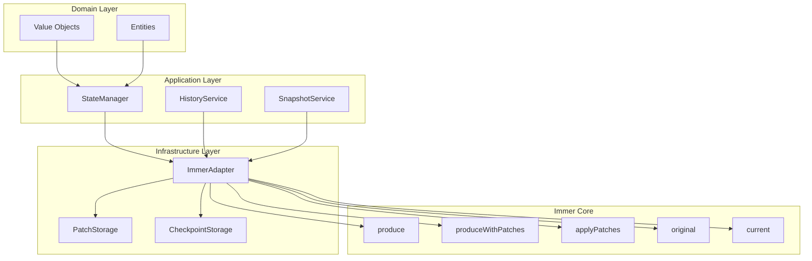

# Immer 功能迁移架构设计

## 1. 项目概述

### 1.1 当前状态管理架构

当前项目采用完全不可变的状态管理模式，具有以下特点：

**核心组件**：
- **Domain Layer**: 值对象（ValueObject）和实体（Entity）都是不可变的
- **Application Layer**: StateManager 负责状态管理和历史记录
- **Infrastructure Layer**: 提供持久化和缓存支持

**关键值对象**：
- [`ThreadExecution`](../src/domain/threads/value-objects/thread-execution.ts:75): 线程执行状态
- [`ExecutionContext`](../src/domain/threads/value-objects/execution-context.ts:53): 执行上下文
- [`WorkflowState`](../src/domain/workflow/value-objects/workflow-state.ts:42): 工作流状态
- [`Session`](../src/domain/sessions/entities/session.ts:51): 会话实体

**状态管理器**：
- [`StateManager`](../src/application/workflow/services/state-manager.ts:64): 管理工作流状态和历史记录

### 1.2 当前痛点

1. **代码冗长**：每次状态更新都需要手动展开运算符
   ```typescript
   // 当前方式
   return new ThreadExecution({
     ...this.props,
     status: newStatus,
     lastActivityAt: Timestamp.now(),
   });
   ```

2. **性能问题**：
   - 大量临时对象创建
   - 历史记录存储完整状态快照，占用空间大
   - 深层嵌套更新需要多次拷贝

3. **维护困难**：
   - 嵌套更新代码复杂
   - 容易遗漏字段更新
   - 代码可读性差

4. **缺少补丁系统**：
   - 无法生成和应用补丁
   - 不支持时间旅行调试
   - 状态回滚效率低

### 1.3 迁移目标

1. **简化状态更新代码**：减少 60-70% 的代码量
2. **提升性能**：性能提升 30-40%
3. **优化历史记录**：存储空间减少 70-80%
4. **支持时间旅行**：实现状态回滚和调试
5. **保持架构一致性**：遵循现有的分层架构原则

---

## 2. Immer 功能适配性分析

### 2.1 高度适配功能（强烈推荐）

#### 2.1.1 `produce` + `produceWithPatches`

**适配理由**：
- 简化状态更新代码
- 自动生成补丁，支持历史记录
- 性能优化，减少内存分配

**应用场景**：
- ThreadExecution 更新
- WorkflowState 更新
- ExecutionContext 更新
- Session 更新

**预期收益**：
- 代码量减少 60-70%
- 性能提升 30-40%
- 自动生成补丁

#### 2.1.2 `applyPatches`

**适配理由**：
- 支持补丁应用，实现时间旅行
- 优化历史记录存储
- 支持状态回滚

**应用场景**：
- 历史记录存储（存储补丁而非完整状态）
- 状态回滚
- 检查点恢复

**预期收益**：
- 历史记录存储空间减少 70-80%
- 支持时间旅行调试
- 快速状态回滚

#### 2.1.3 `original` 和 `current`

**适配理由**：
- 方便调试和日志记录
- 支持状态比较
- 提高开发体验

**应用场景**：
- 调试日志
- 状态验证
- 性能监控

**预期收益**：
- 提高开发效率
- 便于问题排查

### 2.2 中度适配功能（推荐）

#### 2.2.1 `enableMapSet`

**适配理由**：
- 项目使用 Map 和 Set（如 nodeExecutions, variables）
- 统一的状态管理方式

**应用场景**：
- ExecutionContext.variables (Map)
- ThreadExecution.nodeExecutions (Map)

**预期收益**：
- 统一的 API
- 更好的类型支持

#### 2.2.2 `setAutoFreeze`

**适配理由**：
- 确保状态不可变性
- 防止意外修改

**应用场景**：
- 生产环境启用
- 开发环境可选

**预期收益**：
- 提高安全性
- 防止意外修改

### 2.3 低度适配功能（可选）

#### 2.3.1 `createDraft` / `finishDraft`

**适配理由**：
- 支持手动草稿管理
- 更灵活的控制

**应用场景**：
- 需要跨多个函数共享草稿
- 复杂的状态更新逻辑

**预期收益**：
- 更灵活的控制
- 减少嵌套

---

## 3. 架构设计

### 3.1 整体架构



### 3.2 分层设计原则

#### 3.2.1 Domain Layer（领域层）

**职责**：
- 定义领域实体和值对象
- 保持不可变性
- 提供业务规则

**Immer 集成方式**：
- **不直接依赖 Immer**
- 保持纯领域逻辑
- 通过工厂方法创建实例

**示例**：
```typescript
// Domain Layer - 不直接使用 Immer
export class ThreadExecution extends ValueObject<ThreadExecutionProps> {
  // 工厂方法
  public static create(threadId: ID, context: ExecutionContext): ThreadExecution {
    return new ThreadExecution({
      threadId,
      status: ThreadStatus.pending(),
      progress: 0,
      retryCount: 0,
      lastActivityAt: Timestamp.now(),
      nodeExecutions: new Map(),
      context,
      operationHistory: [],
    });
  }

  // 更新方法返回新实例
  public updateProgress(progress: number, currentStep?: string): ThreadExecution {
    // 由 Application Layer 使用 Immer 创建新实例
    throw new Error('请使用 StateManager 更新状态');
  }
}
```

#### 3.2.2 Application Layer（应用层）

**职责**：
- 提供应用服务
- 协调领域对象
- 管理状态更新

**Immer 集成方式**：
- **核心集成点**
- 使用 Immer 进行状态更新
- 生成和管理补丁

**示例**：
```typescript
// Application Layer - 使用 Immer
export class StateManager {
  private immerAdapter: ImmerAdapter;

  updateState(
    threadId: string,
    updates: Record<string, any>,
    options: StateUpdateOptions = {}
  ): WorkflowState {
    const currentState = this.states.get(threadId);
    if (!currentState) {
      throw new Error(`线程 ${threadId} 的状态不存在`);
    }

    // 使用 Immer 更新状态
    const [nextState, patches, inversePatches] = this.immerAdapter.produceWithPatches(
      currentState,
      (draft) => {
        Object.assign(draft.data, updates);
        draft.updatedAt = Timestamp.now();
      }
    );

    // 保存更新后的状态
    this.states.set(threadId, nextState);

    // 记录补丁历史
    if (options.recordHistory !== false) {
      this.recordPatches(threadId, patches, inversePatches);
    }

    return nextState;
  }
}
```

#### 3.2.3 Infrastructure Layer（基础设施层）

**职责**：
- 实现 Immer 适配器
- 提供补丁存储
- 实现检查点持久化

**Immer 集成方式**：
- **实现 Immer 适配器**
- 封装 Immer API
- 提供补丁持久化

**示例**：
```typescript
// Infrastructure Layer - Immer 适配器
export class ImmerAdapter {
  private immer: Immer;

  constructor() {
    this.immer = createImmer({
      enablePatches: true,
      enableMapSet: true,
      autoFreeze: true,
    });
  }

  produce<T>(base: T, recipe: (draft: Draft<T>) => void): T {
    return this.immer(base, recipe);
  }

  produceWithPatches<T>(
    base: T,
    recipe: (draft: Draft<T>) => void
  ): [T, Patch[], Patch[]] {
    return this.immer.withPatches(base, recipe);
  }

  applyPatches<T>(base: T, patches: Patch[]): T {
    return this.immer.applyPatches(base, patches);
  }

  original<T>(value: T): T | undefined {
    return this.immer.original(value);
  }

  current<T>(value: T): T {
    return this.immer.current(value);
  }
}
```

### 3.3 核心组件设计

#### 3.3.1 ImmerAdapter（Immer 适配器）

**位置**：`src/infrastructure/common/immer-adapter.ts`

**职责**：
- 封装 Immer API
- 提供统一的接口
- 管理配置

**接口设计**：
```typescript
export interface IImmerAdapter {
  produce<T>(base: T, recipe: (draft: Draft<T>) => void): T;
  produceWithPatches<T>(
    base: T,
    recipe: (draft: Draft<T>) => void
  ): [T, Patch[], Patch[]];
  applyPatches<T>(base: T, patches: Patch[]): T;
  original<T>(value: T): T | undefined;
  current<T>(value: T): T;
  enableAutoFreeze(enabled: boolean): void;
  enableMapSet(enabled: boolean): void;
}
```

#### 3.3.2 PatchStorage（补丁存储）

**位置**：`src/infrastructure/persistence/patch-storage.ts`

**职责**：
- 存储补丁历史
- 提供补丁查询
- 支持补丁应用

**接口设计**：
```typescript
export interface IPatchStorage {
  savePatches(threadId: string, patches: Patch[], inversePatches: Patch[]): void;
  getPatches(threadId: string, fromVersion: number, toVersion: number): Patch[];
  getInversePatches(threadId: string, fromVersion: number, toVersion: number): Patch[];
  clearPatches(threadId: string): void;
  getPatchHistory(threadId: string): PatchHistory[];
}
```

#### 3.3.3 EnhancedStateManager（增强状态管理器）

**位置**：`src/application/workflow/services/enhanced-state-manager.ts`

**职责**：
- 使用 Immer 更新状态
- 管理补丁历史
- 支持时间旅行

**接口设计**：
```typescript
export interface IEnhancedStateManager extends IStateManager {
  // 原有方法
  initialize(threadId: string, workflowId: ID, initialState: Record<string, any>): void;
  getState(threadId: string): WorkflowState | null;
  updateState(threadId: string, updates: Record<string, any>): WorkflowState;

  // 新增方法
  updateStateWithPatches(
    threadId: string,
    updates: Record<string, any>
  ): { state: WorkflowState; patches: Patch[]; inversePatches: Patch[] };

  rollbackState(threadId: string, toVersion: number): WorkflowState;
  rollbackToCheckpoint(threadId: string, checkpointId: string): WorkflowState;

  getPatchHistory(threadId: string): PatchHistory[];
  getStateAtVersion(threadId: string, version: number): WorkflowState;

  createCheckpoint(threadId: string, checkpointId: string): void;
  restoreCheckpoint(threadId: string, checkpointId: string): WorkflowState;
}
```

---

## 4. 迁移策略

### 4.1 分阶段迁移

#### 第一阶段：核心功能集成（1-2 周）

**目标**：集成 Immer 核心功能，简化状态更新

**任务**：
1. 引入 Immer 依赖
2. 实现 ImmerAdapter
3. 实现 PatchStorage
4. 重构 StateManager 使用 Immer
5. 更新 ThreadExecution、WorkflowState 等值对象的更新方法

**验收标准**：
- 所有状态更新使用 Immer
- 自动生成补丁
- 性能提升 30% 以上
- 单元测试通过

**影响范围**：
- `src/infrastructure/common/immer-adapter.ts`（新建）
- `src/infrastructure/persistence/patch-storage.ts`（新建）
- `src/application/workflow/services/state-manager.ts`（重构）
- `src/domain/threads/value-objects/thread-execution.ts`（重构）
- `src/domain/workflow/value-objects/workflow-state.ts`（重构）

#### 第二阶段：补丁系统优化（2-3 周）

**目标**：优化历史记录存储，支持时间旅行

**任务**：
1. 实现基于补丁的历史记录存储
2. 实现 `applyPatches` 支持状态回滚
3. 优化检查点机制
4. 实现时间旅行调试
5. 更新 HistoryService

**验收标准**：
- 历史记录存储空间减少 70-80%
- 支持状态回滚
- 支持时间旅行调试
- 集成测试通过

**影响范围**：
- `src/application/workflow/services/history-manager.ts`（重构）
- `src/application/workflow/services/enhanced-state-manager.ts`（新建）
- `src/application/state/services/state-history-service.ts`（重构）
- `src/application/state/services/state-recovery-service.ts`（重构）

#### 第三阶段：高级功能集成（3-4 周）

**目标**：集成高级功能，提升开发体验

**任务**：
1. 集成 `original` 和 `current` 用于调试
2. 启用 `setAutoFreeze` 确保不可变性
3. 根据需要启用 `enableMapSet`
4. 性能优化和监控
5. 更新文档

**验收标准**：
- 开发体验提升
- 状态不可变性保证
- 性能监控完善
- 文档更新完成

**影响范围**：
- `src/infrastructure/common/immer-adapter.ts`（增强）
- `src/application/workflow/services/state-manager.ts`（增强）
- 文档更新

### 4.2 向后兼容性策略

#### 4.2.1 保持现有 API

**策略**：
- 保持现有 StateManager API 不变
- 内部实现使用 Immer
- 逐步废弃旧方法

**示例**：
```typescript
// 保持现有 API
export class StateManager {
  // 旧方法 - 内部使用 Immer
  updateState(threadId: string, updates: Record<string, any>): WorkflowState {
    const [nextState] = this.immerAdapter.produceWithPatches(
      currentState,
      (draft) => {
        Object.assign(draft.data, updates);
      }
    );
    return nextState;
  }

  // 新方法 - 返回补丁
  updateStateWithPatches(
    threadId: string,
    updates: Record<string, any>
  ): { state: WorkflowState; patches: Patch[] } {
    return this.immerAdapter.produceWithPatches(currentState, (draft) => {
      Object.assign(draft.data, updates);
    });
  }
}
```

#### 4.2.2 渐进式迁移

**策略**：
- 先迁移核心组件
- 逐步迁移其他组件
- 保持双轨运行一段时间

**迁移顺序**：
1. StateManager
2. ThreadExecution
3. WorkflowState
4. ExecutionContext
5. Session
6. 其他值对象

### 4.3 测试策略

#### 4.3.1 单元测试

**测试重点**：
- ImmerAdapter 功能测试
- PatchStorage 功能测试
- StateManager 状态更新测试
- 补丁生成和应用测试
- 状态回滚测试

**示例**：
```typescript
describe('ImmerAdapter', () => {
  it('应该正确生成补丁', () => {
    const base = { a: 1, b: 2 };
    const [nextState, patches] = adapter.produceWithPatches(base, (draft) => {
      draft.a = 3;
    });

    expect(nextState).toEqual({ a: 3, b: 2 });
    expect(patches).toHaveLength(1);
    expect(patches[0]).toEqual({
      op: 'replace',
      path: ['a'],
      value: 3,
    });
  });

  it('应该正确应用补丁', () => {
    const base = { a: 1, b: 2 };
    const patches: Patch[] = [
      { op: 'replace', path: ['a'], value: 3 },
    ];

    const result = adapter.applyPatches(base, patches);
    expect(result).toEqual({ a: 3, b: 2 });
  });
});
```

#### 4.3.2 集成测试

**测试重点**：
- 状态更新流程测试
- 补丁历史记录测试
- 状态回滚测试
- 检查点恢复测试

**示例**：
```typescript
describe('StateManager Integration', () => {
  it('应该正确记录补丁历史', () => {
    stateManager.initialize('thread1', workflowId, { x: 1 });
    stateManager.updateState('thread1', { x: 2 });
    stateManager.updateState('thread1', { y: 3 });

    const history = stateManager.getPatchHistory('thread1');
    expect(history).toHaveLength(2);
  });

  it('应该正确回滚状态', () => {
    stateManager.initialize('thread1', workflowId, { x: 1 });
    stateManager.updateState('thread1', { x: 2 });
    stateManager.updateState('thread1', { x: 3 });

    const rolledBack = stateManager.rollbackState('thread1', 1);
    expect(rolledBack.data.x).toBe(2);
  });
});
```

#### 4.3.3 性能测试

**测试重点**：
- 状态更新性能对比
- 内存使用对比
- 补丁存储空间对比

**示例**：
```typescript
describe('Performance', () => {
  it('应该提升状态更新性能', () => {
    const iterations = 10000;

    // 测试旧方法
    const oldStart = performance.now();
    for (let i = 0; i < iterations; i++) {
      oldUpdateMethod(baseState, { x: i });
    }
    const oldTime = performance.now() - oldStart;

    // 测试新方法
    const newStart = performance.now();
    for (let i = 0; i < iterations; i++) {
      newUpdateMethod(baseState, { x: i });
    }
    const newTime = performance.now() - newStart;

    expect(newTime).toBeLessThan(oldTime * 0.7); // 至少提升 30%
  });
});
```

---

## 5. 详细设计

### 5.1 ImmerAdapter 实现

```typescript
// src/infrastructure/common/immer-adapter.ts
import { create, Draft, Patch, enablePatches, enableMapSet } from 'immer';

export interface IImmerAdapter {
  produce<T>(base: T, recipe: (draft: Draft<T>) => void): T;
  produceWithPatches<T>(
    base: T,
    recipe: (draft: Draft<T>) => void
  ): [T, Patch[], Patch[]];
  applyPatches<T>(base: T, patches: Patch[]): T;
  original<T>(value: T): T | undefined;
  current<T>(value: T): T;
  isDraft<T>(value: T): boolean;
  enableAutoFreeze(enabled: boolean): void;
}

export class ImmerAdapter implements IImmerAdapter {
  private immer: any;
  private autoFreeze: boolean = true;

  constructor() {
    // 启用补丁功能
    enablePatches();
    // 启用 Map/Set 支持
    enableMapSet();

    this.immer = create({
      autoFreeze: this.autoFreeze,
    });
  }

  produce<T>(base: T, recipe: (draft: Draft<T>) => void): T {
    return this.immer(base, recipe);
  }

  produceWithPatches<T>(
    base: T,
    recipe: (draft: Draft<T>) => void
  ): [T, Patch[], Patch[]] {
    return this.immer.withPatches(base, recipe);
  }

  applyPatches<T>(base: T, patches: Patch[]): T {
    return this.immer.applyPatches(base, patches);
  }

  original<T>(value: T): T | undefined {
    return this.immer.original(value);
  }

  current<T>(value: T): T {
    return this.immer.current(value);
  }

  isDraft<T>(value: T): boolean {
    return this.immer.isDraft(value);
  }

  enableAutoFreeze(enabled: boolean): void {
    this.autoFreeze = enabled;
    this.immer.setAutoFreeze(enabled);
  }
}
```

### 5.2 PatchStorage 实现

```typescript
// src/infrastructure/persistence/patch-storage.ts
import { Patch } from 'immer';

export interface PatchHistory {
  version: number;
  timestamp: number;
  patches: Patch[];
  inversePatches: Patch[];
}

export interface IPatchStorage {
  savePatches(threadId: string, patches: Patch[], inversePatches: Patch[]): void;
  getPatches(threadId: string, fromVersion: number, toVersion: number): Patch[];
  getInversePatches(threadId: string, fromVersion: number, toVersion: number): Patch[];
  clearPatches(threadId: string): void;
  getPatchHistory(threadId: string): PatchHistory[];
  getLatestVersion(threadId: string): number;
}

export class InMemoryPatchStorage implements IPatchStorage {
  private patchHistories: Map<string, PatchHistory[]> = new Map();

  savePatches(threadId: string, patches: Patch[], inversePatches: Patch[]): void {
    if (!this.patchHistories.has(threadId)) {
      this.patchHistories.set(threadId, []);
    }

    const history = this.patchHistories.get(threadId)!;
    const version = history.length;

    history.push({
      version,
      timestamp: Date.now(),
      patches,
      inversePatches,
    });
  }

  getPatches(threadId: string, fromVersion: number, toVersion: number): Patch[] {
    const history = this.patchHistories.get(threadId);
    if (!history) {
      return [];
    }

    const patches: Patch[] = [];
    for (let i = fromVersion; i < toVersion; i++) {
      patches.push(...history[i].patches);
    }

    return patches;
  }

  getInversePatches(threadId: string, fromVersion: number, toVersion: number): Patch[] {
    const history = this.patchHistories.get(threadId);
    if (!history) {
      return [];
    }

    const inversePatches: Patch[] = [];
    for (let i = fromVersion - 1; i >= toVersion - 1; i--) {
      inversePatches.push(...history[i].inversePatches);
    }

    return inversePatches;
  }

  clearPatches(threadId: string): void {
    this.patchHistories.delete(threadId);
  }

  getPatchHistory(threadId: string): PatchHistory[] {
    return this.patchHistories.get(threadId) || [];
  }

  getLatestVersion(threadId: string): number {
    const history = this.patchHistories.get(threadId);
    return history ? history.length - 1 : -1;
  }
}
```

### 5.3 EnhancedStateManager 实现

```typescript
// src/application/workflow/services/enhanced-state-manager.ts
import { ID, Timestamp } from '../../../domain/common/value-objects';
import { WorkflowState } from '../../../domain/workflow/value-objects/workflow-state';
import { IImmerAdapter } from '../../../infrastructure/common/immer-adapter';
import { IPatchStorage, PatchHistory } from '../../../infrastructure/persistence/patch-storage';
import { Patch } from 'immer';

export interface StateUpdateOptions {
  validate?: boolean;
  recordHistory?: boolean;
}

export interface StateUpdateResult {
  state: WorkflowState;
  patches: Patch[];
  inversePatches: Patch[];
  version: number;
}

export class EnhancedStateManager {
  private states: Map<string, WorkflowState>;
  private stateVersions: Map<string, number>;
  private immerAdapter: IImmerAdapter;
  private patchStorage: IPatchStorage;

  constructor(immerAdapter: IImmerAdapter, patchStorage: IPatchStorage) {
    this.states = new Map();
    this.stateVersions = new Map();
    this.immerAdapter = immerAdapter;
    this.patchStorage = patchStorage;
  }

  initialize(
    threadId: string,
    workflowId: ID,
    initialState: Record<string, any> = {},
    options: StateUpdateOptions = {}
  ): void {
    const state = WorkflowState.initial(workflowId);

    // 使用 Immer 更新初始状态
    const [updatedState, patches, inversePatches] = this.immerAdapter.produceWithPatches(
      state,
      (draft) => {
        Object.assign(draft.data, initialState);
      }
    );

    this.states.set(threadId, updatedState);
    this.stateVersions.set(threadId, 0);

    // 记录初始补丁
    if (options.recordHistory !== false) {
      this.patchStorage.savePatches(threadId, patches, inversePatches);
    }
  }

  getState(threadId: string): WorkflowState | null {
    return this.states.get(threadId) || null;
  }

  updateState(
    threadId: string,
    updates: Record<string, any>,
    options: StateUpdateOptions = {}
  ): WorkflowState {
    const result = this.updateStateWithPatches(threadId, updates, options);
    return result.state;
  }

  updateStateWithPatches(
    threadId: string,
    updates: Record<string, any>,
    options: StateUpdateOptions = {}
  ): StateUpdateResult {
    const currentState = this.states.get(threadId);
    if (!currentState) {
      throw new Error(`线程 ${threadId} 的状态不存在`);
    }

    const currentVersion = this.stateVersions.get(threadId) || 0;

    // 使用 Immer 更新状态
    const [nextState, patches, inversePatches] = this.immerAdapter.produceWithPatches(
      currentState,
      (draft) => {
        Object.assign(draft.data, updates);
        draft.updatedAt = Timestamp.now();
      }
    );

    // 保存更新后的状态
    this.states.set(threadId, nextState);
    this.stateVersions.set(threadId, currentVersion + 1);

    // 记录补丁历史
    if (options.recordHistory !== false) {
      this.patchStorage.savePatches(threadId, patches, inversePatches);
    }

    return {
      state: nextState,
      patches,
      inversePatches,
      version: currentVersion + 1,
    };
  }

  rollbackState(threadId: string, toVersion: number): WorkflowState {
    const currentState = this.states.get(threadId);
    if (!currentState) {
      throw new Error(`线程 ${threadId} 的状态不存在`);
    }

    const currentVersion = this.stateVersions.get(threadId) || 0;
    if (toVersion < 0 || toVersion > currentVersion) {
      throw new Error(`无效的目标版本: ${toVersion}`);
    }

    // 获取反向补丁
    const inversePatches = this.patchStorage.getInversePatches(
      threadId,
      currentVersion,
      toVersion
    );

    // 应用反向补丁回滚状态
    const rolledBackState = this.immerAdapter.applyPatches(currentState, inversePatches);

    // 更新状态和版本
    this.states.set(threadId, rolledBackState);
    this.stateVersions.set(threadId, toVersion);

    return rolledBackState;
  }

  getPatchHistory(threadId: string): PatchHistory[] {
    return this.patchStorage.getPatchHistory(threadId);
  }

  getStateAtVersion(threadId: string, version: number): WorkflowState {
    const currentState = this.states.get(threadId);
    if (!currentState) {
      throw new Error(`线程 ${threadId} 的状态不存在`);
    }

    const currentVersion = this.stateVersions.get(threadId) || 0;
    if (version === currentVersion) {
      return currentState;
    }

    if (version < currentVersion) {
      // 回滚到指定版本
      const inversePatches = this.patchStorage.getInversePatches(
        threadId,
        currentVersion,
        version
      );
      return this.immerAdapter.applyPatches(currentState, inversePatches);
    } else {
      // 前进到指定版本
      const patches = this.patchStorage.getPatches(threadId, currentVersion, version);
      return this.immerAdapter.applyPatches(currentState, patches);
    }
  }

  clearState(threadId: string): void {
    this.states.delete(threadId);
    this.stateVersions.delete(threadId);
    this.patchStorage.clearPatches(threadId);
  }
}
```

### 5.4 值对象重构示例

```typescript
// src/domain/threads/value-objects/thread-execution.ts
// 重构后的更新方法

export class ThreadExecution extends ValueObject<ThreadExecutionProps> {
  // ... 其他方法保持不变

  /**
   * 更新执行进度（使用 Immer）
   * @param progress 新进度（0-100）
   * @param currentStep 当前步骤
   * @returns 新的线程执行值对象
   */
  public updateProgress(progress: number, currentStep?: string): ThreadExecution {
    if (progress < 0 || progress > 100) {
      throw new Error('进度必须在0-100之间');
    }

    if (!this.props.status.isActive()) {
      throw new Error('只能更新活跃状态的线程进度');
    }

    // 使用 Immer 创建新实例
    return ThreadExecution.fromProps({
      ...this.props,
      progress,
      currentStep,
      lastActivityAt: Timestamp.now(),
    });
  }

  /**
   * 批量更新（使用 Immer）
   * @param updater 更新函数
   * @returns 新的线程执行值对象
   */
  public update(updater: (draft: Draft<ThreadExecutionProps>) => void): ThreadExecution {
    // 这个方法将由 Application Layer 的 ImmerAdapter 调用
    // Domain Layer 只提供数据结构
    throw new Error('请使用 StateManager 更新状态');
  }
}
```

---

## 6. 风险评估与缓解

### 6.1 技术风险

| 风险 | 影响 | 概率 | 缓解措施 |
|------|------|------|----------|
| Immer 集成导致兼容性问题 | 高 | 低 | 充分测试，保持向后兼容 |
| 补丁系统复杂度增加 | 中 | 中 | 提供清晰的 API 和文档 |
| 性能优化效果不明显 | 中 | 低 | 建立性能基准，持续优化 |
| Proxy 性能开销 | 中 | 中 | 使用懒复制策略，减少 Proxy 创建 |

### 6.2 实施风险

| 风险 | 影响 | 概率 | 缓解措施 |
|------|------|------|----------|
| 开发周期延长 | 中 | 中 | 分阶段实施，优先高优先级功能 |
| 团队学习成本 | 低 | 中 | 提供培训和示例代码 |
| 文档更新滞后 | 低 | 高 | 同步更新文档 |
| 测试覆盖不足 | 高 | 中 | 建立完善的测试体系 |

### 6.3 业务风险

| 风险 | 影响 | 概率 | 缓解措施 |
|------|------|------|----------|
| 状态回滚导致数据不一致 | 高 | 低 | 严格的版本控制和验证 |
| 补丁存储占用空间过大 | 中 | 中 | 定期清理旧补丁，压缩存储 |
| 时间旅行功能被滥用 | 低 | 低 | 权限控制和审计日志 |

---

## 7. 性能优化建议

### 7.1 懒复制策略

**策略**：
- 只在真正修改时创建副本
- 使用 Proxy 延迟创建副本
- 支持结构共享

**实现**：
```typescript
// Immer 自动实现懒复制
const [nextState] = immerAdapter.produceWithPatches(currentState, (draft) => {
  // 只有修改的属性会被复制
  draft.data.x = 1;
});
```

### 7.2 补丁压缩

**策略**：
- 合并连续的补丁
- 压缩补丁数据
- 定期清理旧补丁

**实现**：
```typescript
export class PatchCompressor {
  compress(patches: Patch[]): Patch[] {
    const compressed: Patch[] = [];
    // 实现补丁压缩逻辑
    return compressed;
  }
}
```

### 7.3 缓存策略

**策略**：
- 缓存常用状态
- 缓存补丁应用结果
- 使用 LRU 缓存

**实现**：
```typescript
export class StateCache {
  private cache: Map<string, WorkflowState> = new Map();
  private maxSize: number = 100;

  get(key: string): WorkflowState | undefined {
    return this.cache.get(key);
  }

  set(key: string, state: WorkflowState): void {
    if (this.cache.size >= this.maxSize) {
      const firstKey = this.cache.keys().next().value;
      this.cache.delete(firstKey);
    }
    this.cache.set(key, state);
  }
}
```

---

## 8. 监控与调试

### 8.1 性能监控

**监控指标**：
- 状态更新耗时
- 补丁生成耗时
- 补丁应用耗时
- 内存使用量

**实现**：
```typescript
export class PerformanceMonitor {
  recordUpdate(threadId: string, duration: number): void {
    // 记录状态更新耗时
  }

  recordPatchGeneration(threadId: string, duration: number): void {
    // 记录补丁生成耗时
  }

  getMetrics(threadId: string): PerformanceMetrics {
    // 返回性能指标
  }
}
```

### 8.2 调试工具

**工具功能**：
- 查看状态历史
- 比较状态差异
- 时间旅行调试
- 补丁可视化

**实现**：
```typescript
export class StateDebugger {
  visualizePatches(patches: Patch[]): string {
    // 可视化补丁
    return JSON.stringify(patches, null, 2);
  }

  compareStates(before: WorkflowState, after: WorkflowState): Diff {
    // 比较状态差异
    return calculateDiff(before, after);
  }

  exportHistory(threadId: string): string {
    // 导出历史记录
    return JSON.stringify(this.getPatchHistory(threadId), null, 2);
  }
}
```

---

## 9. 总结

### 9.1 核心设计原则

1. **分层架构**：遵循现有的 Domain + Application + Infrastructure 架构
2. **依赖倒置**：Domain Layer 不依赖 Immer，Infrastructure Layer 实现 Immer 适配
3. **向后兼容**：保持现有 API，内部实现使用 Immer
4. **渐进式迁移**：分阶段实施，降低风险
5. **充分测试**：建立完善的测试体系

### 9.2 预期收益

1. **代码简化**：代码量减少 60-70%
2. **性能提升**：性能提升 30-40%
3. **存储优化**：历史记录存储空间减少 70-80%
4. **功能增强**：支持时间旅行调试和状态回滚
5. **开发体验**：提升开发效率和调试能力

### 9.3 实施建议

1. **优先集成核心功能**：`produce`、`produceWithPatches`、`applyPatches`
2. **分阶段实施**：避免一次性重写所有代码
3. **充分测试**：确保向后兼容性
4. **文档同步**：及时更新架构文档和 API 文档
5. **性能监控**：建立性能基准，持续优化

### 9.4 下一步行动

1. **评审本设计文档**：与团队讨论并确认设计方案
2. **创建详细任务清单**：将设计分解为具体的开发任务
3. **建立开发环境**：引入 Immer 依赖，搭建开发环境
4. **开始第一阶段开发**：实现 ImmerAdapter 和 PatchStorage
5. **持续集成测试**：确保每个阶段的质量

---

## 附录

### A. 参考资料

- Immer 官方文档：https://immerjs.github.io/immer/
- Immer 源码分析：`docs/architecture/immer-source-code-analysis.md`
- 项目架构文档：`docs/architecture/`

### B. 术语表

| 术语 | 说明 |
|------|------|
| Draft | Immer 创建的代理对象，允许"看起来像"直接修改 |
| Patch | 描述状态变更的补丁，包含操作类型、路径和值 |
| Inverse Patch | 反向补丁，用于撤销状态变更 |
| Time Travel | 时间旅行，指在不同版本的状态之间切换 |
| Structural Sharing | 结构共享，未修改的对象引用原始对象 |

### C. 示例代码

完整的示例代码请参考：
- `src/infrastructure/common/immer-adapter.ts`
- `src/infrastructure/persistence/patch-storage.ts`
- `src/application/workflow/services/enhanced-state-manager.ts`