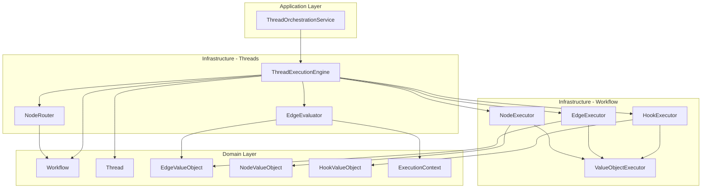

# Workflow执行器与Thread模块集成改进方案

## 问题总结

基于对代码的分析，发现以下集成问题：

1. **执行器分离**：`EdgeEvaluator` (thread层) 和 `EdgeExecutor` (workflow层) 功能分离但缺乏协调
2. **钩子集成缺失**：`HookExecutor` 没有集成到 thread 执行流程中
3. **节点执行模拟**：`ThreadExecutionEngine.executeNode()` 使用模拟实现，没有调用实际的 `NodeExecutor`
4. **执行流程不完整**：缺少边逻辑执行和钩子触发点

## 改进目标

1. 建立完整的执行流水线：节点执行 → 边评估 → 边执行 → 路由决策
2. 集成钩子执行机制到关键执行点
3. 保持三层架构约束，明确组件职责边界
4. 通过依赖注入实现组件解耦

## 详细改进方案

### 1. 增强 ThreadExecutionEngine 依赖注入

**当前问题**：`ThreadExecutionEngine` 只依赖 `EdgeEvaluator` 和 `NodeRouter`，缺少其他执行器。

**改进方案**：扩展构造函数，注入必要的执行器：

```typescript
export class ThreadExecutionEngine {
  constructor(
    workflow: Workflow,
    thread: Thread,
    nodeExecutor: NodeExecutor,
    edgeExecutor: EdgeExecutor,
    edgeEvaluator: EdgeEvaluator,
    nodeRouter: NodeRouter,
    hookExecutor?: HookExecutor, // 可选，根据配置决定
    config?: ExecutionEngineConfig
  ) {
    // ... 初始化
  }
}
```

### 2. 完善执行流程

**当前流程**：
1. 评估边条件 (`EdgeEvaluator`)
2. 选择下一个节点 (`NodeRouter`)
3. 模拟执行节点

**改进后流程**：
1. **节点执行前钩子**：调用 `hookExecutor.executeBatch()` (hookPoint: `BEFORE_NODE_EXECUTION`)
2. **执行节点**：调用 `nodeExecutor.execute()`
3. **节点执行后钩子**：调用 `hookExecutor.executeBatch()` (hookPoint: `AFTER_NODE_EXECUTION`)
4. **获取出边**：使用 `workflow.getOutgoingEdges()`
5. **边评估前钩子**：调用 `hookExecutor.executeBatch()` (hookPoint: `BEFORE_EDGE_EVALUATION`)
6. **评估边条件**：调用 `edgeEvaluator.getSatisfiedEdges()`
7. **边执行**：对满足条件的边调用 `edgeExecutor.execute()` (如果需要执行边逻辑)
8. **边执行后钩子**：调用 `hookExecutor.executeBatch()` (hookPoint: `AFTER_EDGE_EXECUTION`)
9. **路由决策**：使用 `nodeRouter` 确定下一个节点
10. **线程状态更新**：更新 thread 执行状态

### 3. 明确组件职责边界

| 组件 | 职责 | 所在层 | 依赖 |
|------|------|--------|------|
| **NodeExecutor** | 执行节点逻辑 | infrastructure/workflow | NodeValueObject (domain) |
| **EdgeExecutor** | 执行边逻辑（数据转换、副作用） | infrastructure/workflow | EdgeValueObject (domain) |
| **EdgeEvaluator** | 评估边条件（是否可通行） | infrastructure/threads | EdgeValueObject, ExecutionContext (domain) |
| **NodeRouter** | 图结构导航和路由决策 | infrastructure/threads | Workflow, NodeId (domain) |
| **HookExecutor** | 执行钩子逻辑 | infrastructure/workflow | HookValueObject (domain) |
| **ThreadExecutionEngine** | 协调上述组件，管理执行流程 | infrastructure/threads | 所有上述组件 + Workflow, Thread (domain) |

### 4. 钩子集成点设计

定义以下钩子执行点：

```typescript
enum ThreadHookPoint {
  BEFORE_THREAD_START = 'before_thread_start',
  AFTER_THREAD_START = 'after_thread_start',
  BEFORE_NODE_EXECUTION = 'before_node_execution',
  AFTER_NODE_EXECUTION = 'after_node_execution',
  BEFORE_EDGE_EVALUATION = 'before_edge_evaluation',
  AFTER_EDGE_EVALUATION = 'after_edge_evaluation',
  BEFORE_EDGE_EXECUTION = 'before_edge_execution',
  AFTER_EDGE_EXECUTION = 'after_edge_execution',
  ON_THREAD_COMPLETE = 'on_thread_complete',
  ON_THREAD_ERROR = 'on_thread_error'
}
```

### 5. 依赖注入配置

在基础设施模块中配置依赖关系：

```typescript
// src/infrastructure/threads/execution/index.ts
export function configureThreadExecutionDependencies(container: Container) {
  container.bind<NodeExecutor>('NodeExecutor').to(NodeExecutor);
  container.bind<EdgeExecutor>('EdgeExecutor').to(EdgeExecutor);
  container.bind<EdgeEvaluator>('EdgeEvaluator').to(EdgeEvaluator);
  container.bind<NodeRouter>('NodeRouter').to(NodeRouter);
  container.bind<HookExecutor>('HookExecutor').to(HookExecutor);
  container.bind<ThreadExecutionEngine>('ThreadExecutionEngine').toDynamicValue((context) => {
    return new ThreadExecutionEngine(
      context.container.get<Workflow>('Workflow'),
      context.container.get<Thread>('Thread'),
      context.container.get<NodeExecutor>('NodeExecutor'),
      context.container.get<EdgeExecutor>('EdgeExecutor'),
      context.container.get<EdgeEvaluator>('EdgeEvaluator'),
      context.container.get<NodeRouter>('NodeRouter'),
      context.container.get<HookExecutor>('HookExecutor'),
      context.container.get<ExecutionEngineConfig>('ExecutionEngineConfig')
    );
  });
}
```

### 6. 执行器协调接口

定义统一的执行器协调接口，便于测试和替换：

```typescript
interface ExecutionOrchestrator {
  executeNode(nodeId: NodeId, context: ExecutionContext): Promise<unknown>;
  evaluateEdges(edges: EdgeValueObject[], context: ExecutionContext): Promise<EdgeValueObject[]>;
  executeEdge(edge: EdgeValueObject, context: ExecutionContext): Promise<unknown>;
  determineNextNode(currentNodeId: NodeId, nodeResult: unknown): Promise<RoutingDecision>;
}
```

### 7. 迁移路径

**阶段1：最小改动**
- 修改 `ThreadExecutionEngine` 构造函数，添加可选参数
- 保持向后兼容性，现有代码继续工作
- 在 `executeNode()` 中集成 `NodeExecutor`

**阶段2：完整集成**
- 实现钩子执行机制
- 集成 `EdgeExecutor` 执行边逻辑
- 添加完整的执行流程钩子点

**阶段3：优化和测试**
- 添加单元测试和集成测试
- 性能优化（批量执行、缓存等）
- 错误处理和重试机制

## 架构验证

### 三层架构符合性

改进方案仍然符合三层架构约束：

1. **Domain层**：`Workflow`, `Thread`, `EdgeValueObject`, `NodeValueObject`, `HookValueObject`, `ExecutionContext`
2. **Infrastructure层**：所有执行器只依赖 domain 层
3. **Application层**：通过服务调用基础设施组件
4. **Interface层**：通过 API/CLI 调用应用服务

### 依赖关系图（改进后）



## 预期收益

1. **功能完整性**：完整的执行流水线，支持节点执行、边评估、边执行、钩子触发
2. **可扩展性**：通过钩子机制支持自定义扩展
3. **可测试性**：组件职责清晰，便于单元测试和集成测试
4. **维护性**：遵循三层架构，依赖关系明确
5. **灵活性**：通过依赖注入支持组件替换和配置

## 风险评估

1. **性能影响**：钩子执行可能增加执行时间
   - 缓解：异步执行、批量处理、优先级控制
2. **复杂性增加**：执行流程变得更复杂
   - 缓解：清晰的文档、示例代码、逐步迁移
3. **向后兼容性**：现有代码可能受影响
   - 缓解：保持API兼容，提供迁移指南

## 下一步行动

1. 与团队评审此方案
2. 创建详细的技术设计文档
3. 实现阶段1的最小改动
4. 添加测试用例
5. 逐步实现完整集成