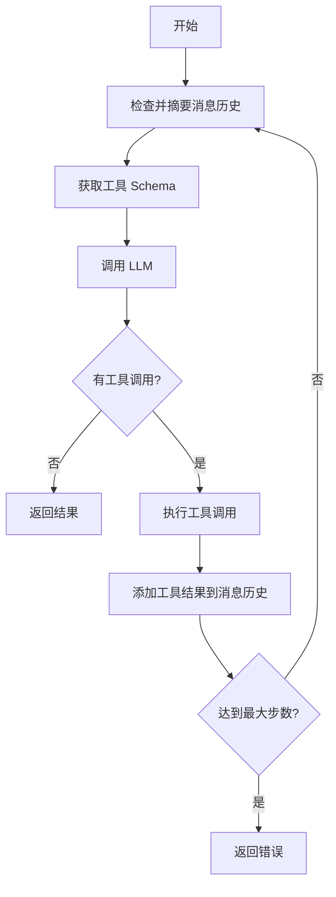

# Interaction 模块优化分析报告

## 一、参考项目（Mini-Agent）核心机制分析

### 1.1 提示词上下文管理机制

#### 核心特性
- **消息历史管理**：使用 `Message` 类存储所有对话历史，支持 system、user、assistant、tool 四种角色
- **精确 Token 估算**：使用 tiktoken 库（cl100k_base 编码器）精确计算 token 数量
- **智能摘要机制**：当 token 超过限制（默认 80000）时，自动触发摘要
  - 保留所有用户消息（用户意图）
  - 对每轮对话的执行过程进行摘要
  - 使用 LLM 生成简洁的执行摘要（1000 字以内）
  - 结构：system → user1 → summary1 → user2 → summary2 → ...
- **工作空间注入**：自动将工作目录信息注入到系统提示词中
- **Token 估算方法**：
  ```python
  def _estimate_tokens(self) -> int:
      # 使用 tiktoken 精确计算
      encoding = tiktoken.get_encoding("cl100k_base")
      total_tokens = 0
      for msg in self.messages:
          # 计算文本内容
          total_tokens += len(encoding.encode(msg.content))
          # 计算 thinking
          if msg.thinking:
              total_tokens += len(encoding.encode(msg.thinking))
          # 计算 tool_calls
          if msg.tool_calls:
              total_tokens += len(encoding.encode(str(msg.tool_calls)))
          # 每条消息的元数据开销（约 4 tokens）
          total_tokens += 4
      return total_tokens
  ```

#### 关键代码位置
- [`agent.py:79-114`](ref/Mini-Agent/mini_agent/agent.py:79) - Token 估算
- [`agent.py:136-197`](ref/Mini-Agent/mini_agent/agent.py:136) - 消息摘要
- [`agent.py:199-256`](ref/Mini-Agent/mini_agent/agent.py:199) - 摘要生成

### 1.2 工具执行机制

#### 核心特性
- **统一接口**：所有工具继承 `Tool` 基类，实现标准接口
  ```python
  class Tool:
      @property
      def name(self) -> str: ...
      @property
      def description(self) -> str: ...
      @property
      def parameters(self) -> dict[str, Any]: ...
      async def execute(self, *args, **kwargs) -> ToolResult: ...
  ```
- **标准化结果**：使用 `ToolResult` 统一返回格式
  ```python
  class ToolResult(BaseModel):
      success: bool
      content: str = ""
      error: str | None = None
  ```
- **增强结果类型**：如 `BashOutputResult` 扩展了 stdout、stderr、exit_code、bash_id 等字段
- **后台进程管理**：`BackgroundShellManager` 管理长时间运行的后台进程
  - 支持启动、监控、获取输出、终止后台进程
  - 自动清理资源
- **Token 截断**：文件读取时自动截断超长内容（保留头部和尾部）
- **错误处理**：捕获所有异常并转换为标准化的失败结果

#### 关键代码位置
- [`tools/base.py:16-44`](ref/Mini-Agent/mini_agent/tools/base.py:16) - Tool 基类
- [`tools/bash_tool.py:48-211`](ref/Mini-Agent/mini_agent/tools/bash_tool.py:48) - 后台进程管理
- [`tools/file_tools.py:11-61`](ref/Mini-Agent/mini_agent/tools/file_tools.py:11) - Token 截断

### 1.3 LLM 交互机制

#### 核心特性
- **重试机制**：使用装饰器实现指数退避重试策略
  ```python
  @async_retry(RetryConfig(max_retries=3, initial_delay=1.0))
  async def _make_api_request(self, payload: dict[str, Any]) -> dict[str, Any]:
      ...
  ```
- **消息转换**：将内部 `Message` 格式转换为 API 兼容格式
  - 处理 system 消息（单独提取）
  - 处理 assistant 消息（支持 thinking 和 tool_calls）
  - 处理 tool 结果消息（转换为 tool_result content block）
- **多内容块支持**：支持 text、thinking、tool_use 三种内容块
- **响应解析**：从 API 响应中提取文本、thinking、tool_calls
- **错误处理**：统一处理 API 错误和 MiniMax base_resp 错误

#### 关键代码位置
- [`llm.py:37-82`](ref/Mini-Agent/mini_agent/llm.py:37) - API 请求
- [`llm.py:84-203`](ref/Mini-Agent/mini_agent/llm.py:84) - 消息生成和解析
- [`retry.py:73-138`](ref/Mini-Agent/mini_agent/retry.py:73) - 重试装饰器

### 1.4 Agent 执行循环

#### 核心流程


#### 关键特性
- **每步检查**：在每次 LLM 调用前检查 token 使用情况
- **工具执行**：顺序执行所有工具调用
- **错误处理**：捕获工具执行异常并转换为失败结果
- **日志记录**：详细记录所有 LLM 请求、响应、工具调用

#### 关键代码位置
- [`agent.py:258-407`](ref/Mini-Agent/mini_agent/agent.py:258) - Agent 执行循环

---

## 二、当前项目 Interaction 模块分析

### 2.1 架构设计

#### 模块结构
```
src/services/interaction/
├── index.ts                          # 模块导出
├── interaction-engine.ts             # 交互引擎（协调器）
├── interaction-context.ts            # 上下文管理
└── executors/
    ├── index.ts                      # 执行器导出
    ├── llm-executor.ts               # LLM 执行器
    ├── tool-executor.ts              # 工具执行器
    └── user-interaction-handler.ts   # 用户交互处理器
```

#### 设计模式
- **依赖注入**：使用 inversify 进行依赖注入
- **接口隔离**：定义清晰的接口（ILLMExecutor、IToolExecutor、IUserInteractionHandler）
- **职责分离**：Engine 负责协调，Executor 负责执行

### 2.2 提示词上下文管理

#### 当前实现
- **接口定义**：`IInteractionContext` 定义了上下文管理接口
- **消息管理**：支持添加、获取、清空消息历史
- **变量管理**：支持键值对变量存储
- **工具调用记录**：记录所有工具调用
- **LLM 调用记录**：记录所有 LLM 调用
- **Token 使用统计**：累计 token 使用情况
- **元数据支持**：支持自定义元数据
- **上下文克隆**：支持上下文克隆

#### 关键代码位置
- [`interaction-context.ts:15-90`](src/services/interaction/interaction-context.ts:15) - 接口定义
- [`interaction-context.ts:95-199`](src/services/interaction/interaction-context.ts:95) - 实现类

#### 缺失功能
- ❌ Token 估算机制
- ❌ 消息摘要机制
- ❌ 工作空间信息注入
- ❌ 消息压缩策略

### 2.3 工具执行机制

#### 当前实现
- **接口定义**：`IToolExecutor` 定义了工具执行接口
- **框架实现**：`ToolExecutor` 提供了框架结构
- **状态**：具体实现尚未完成（TODO 标记）

#### 关键代码位置
- [`executors/tool-executor.ts:17-35`](src/services/interaction/executors/tool-executor.ts:17) - 接口定义
- [`executors/tool-executor.ts:43-133`](src/services/interaction/executors/tool-executor.ts:43) - 实现类

#### 缺失功能
- ❌ 工具注册表
- ❌ 参数验证
- ❌ 工具执行逻辑
- ❌ 错误处理
- ❌ 后台进程管理
- ❌ Token 截断

### 2.4 LLM 交互机制

#### 当前实现
- **接口定义**：`ILLMExecutor` 定义了 LLM 执行接口
- **框架实现**：`LLMExecutor` 提供了框架结构
- **消息构建**：提供了 `buildMessages` 方法
- **LLM 调用记录**：提供了 `createLLMCall` 方法
- **状态**：具体实现尚未完成（TODO 标记）

#### 关键代码位置
- [`executors/llm-executor.ts:21-32`](src/services/interaction/executors/llm-executor.ts:21) - 接口定义
- [`executors/llm-executor.ts:40-161`](src/services/interaction/executors/llm-executor.ts:40) - 实现类

#### 缺失功能
- ❌ LLM Client 集成
- ❌ 重试机制
- ❌ 消息格式转换
- ❌ 响应解析
- ❌ 错误处理

### 2.5 交互引擎

#### 当前实现
- **协调器**：`InteractionEngine` 协调 LLM、Tool、UserInteraction 的执行
- **上下文管理**：维护当前上下文
- **执行方法**：
  - `executeLLM` - 执行 LLM 调用
  - `executeTool` - 执行工具调用
  - `handleUserInteraction` - 处理用户交互
- **上下文更新**：执行后自动更新上下文

#### 关键代码位置
- [`interaction-engine.ts:64-180`](src/services/interaction/interaction-engine.ts:64) - 引擎实现

#### 缺失功能
- ❌ 执行循环
- ❌ 工具调用链处理
- ❌ 错误恢复策略

---

## 三、对比分析

### 3.1 架构对比

| 维度 | Mini-Agent | 当前项目 |
|------|-----------|---------|
| **架构风格** | 单体 Agent 类 | 分层架构（Engine + Executors） |
| **依赖管理** | 直接依赖 | 依赖注入 |
| **接口设计** | 基类继承 | 接口隔离 |
| **扩展性** | 中等 | 高 |
| **复杂度** | 低 | 中等 |

### 3.2 功能对比

| 功能 | Mini-Agent | 当前项目 | 差距 |
|------|-----------|---------|------|
| **消息历史管理** | ✅ 完整 | ✅ 完整 | - |
| **Token 估算** | ✅ 精确（tiktoken） | ❌ 无 | ⚠️ |
| **消息摘要** | ✅ 智能摘要 | ❌ 无 | ⚠️ |
| **工作空间注入** | ✅ 自动注入 | ❌ 无 | ⚠️ |
| **工具执行** | ✅ 完整 | ⚠️ 框架 | ⚠️ |
| **工具注册表** | ✅ 字典管理 | ❌ 无 | ⚠️ |
| **后台进程管理** | ✅ 完整 | ❌ 无 | ⚠️ |
| **Token 截断** | ✅ 智能截断 | ❌ 无 | ⚠️ |
| **LLM 调用** | ✅ 完整 | ⚠️ 框架 | ⚠️ |
| **重试机制** | ✅ 指数退避 | ❌ 无 | ⚠️ |
| **消息转换** | ✅ 完整 | ⚠️ 部分 | ⚠️ |
| **错误处理** | ✅ 统一 | ⚠️ 部分 | ⚠️ |
| **日志记录** | ✅ 详细 | ✅ 基础 | - |
| **执行循环** | ✅ 完整 | ❌ 无 | ⚠️ |

### 3.3 代码质量对比

| 维度 | Mini-Agent | 当前项目 |
|------|-----------|---------|
| **代码行数** | ~600 行（核心） | ~500 行（框架） |
| **注释覆盖率** | 高 | 中等 |
| **类型安全** | Pydantic | TypeScript |
| **错误处理** | 完善 | 部分 |
| **测试覆盖** | 未知 | 框架测试 |

---

## 四、优化建议

### 4.1 提示词上下文管理优化

#### 优先级：🔴 高

#### 建议 1：实现 Token 估算机制
**目标**：精确计算消息历史的 token 数量，防止上下文溢出

**实现方案**：
```typescript
// src/services/interaction/token-estimator.ts
export class TokenEstimator {
  private encoding: any;

  constructor() {
    // 使用 tiktoken-js 或类似库
    this.encoding = new Tiktoken('cl100k_base');
  }

  estimateMessage(message: Message): number {
    let tokens = 0;
    
    // 计算内容
    if (typeof message.content === 'string') {
      tokens += this.encoding.encode(message.content).length;
    } else if (Array.isArray(message.content)) {
      for (const block of message.content) {
        tokens += this.encoding.encode(JSON.stringify(block)).length;
      }
    }
    
    // 计算 thinking
    if (message.thinking) {
      tokens += this.encoding.encode(message.thinking).length;
    }
    
    // 计算 tool_calls
    if (message.toolCalls) {
      tokens += this.encoding.encode(JSON.stringify(message.toolCalls)).length;
    }
    
    // 消息元数据开销（约 4 tokens）
    tokens += 4;
    
    return tokens;
  }

  estimateMessages(messages: Message[]): number {
    return messages.reduce((total, msg) => total + this.estimateMessage(msg), 0);
  }
}
```

**集成点**：
- 在 `InteractionContext` 中添加 `estimateTokens()` 方法
- 在 `InteractionEngine.executeLLM` 前检查 token 使用情况

#### 建议 2：实现智能摘要机制
**目标**：当 token 超过限制时，自动摘要对话历史

**实现方案**：
```typescript
// src/services/interaction/message-summarizer.ts
export class MessageSummarizer {
  constructor(
    private llmExecutor: ILLMExecutor,
    private logger: ILogger
  ) {}

  async summarizeMessages(
    messages: Message[],
    tokenLimit: number
  ): Promise<Message[]> {
    const estimatedTokens = this.estimateTokens(messages);
    
    if (estimatedTokens <= tokenLimit) {
      return messages;
    }

    // 找到所有用户消息索引（跳过系统提示）
    const userIndices = messages
      .map((msg, idx) => msg.role === MessageRole.USER ? idx : -1)
      .filter(idx => idx > 0);

    if (userIndices.length < 1) {
      return messages;
    }

    // 构建新的消息列表
    const newMessages: Message[] = [messages[0]]; // 保留系统提示

    // 对每轮对话进行摘要
    for (let i = 0; i < userIndices.length; i++) {
      const userIdx = userIndices[i];
      newMessages.push(messages[userIdx]);

      // 确定要摘要的消息范围
      const nextUserIdx = i < userIndices.length - 1 
        ? userIndices[i + 1] 
        : messages.length;

      const executionMessages = messages.slice(userIdx + 1, nextUserIdx);

      if (executionMessages.length > 0) {
        const summary = await this.createSummary(executionMessages, i + 1);
        newMessages.push(new Message({
          role: MessageRole.USER,
          content: `[Assistant Execution Summary]\n\n${summary}`,
        }));
      }
    }

    return newMessages;
  }

  private async createSummary(
    messages: Message[],
    roundNum: number
  ): Promise<string> {
    // 构建摘要内容
    let summaryContent = `Round ${roundNum} execution process:\n\n`;
    for (const msg of messages) {
      if (msg.role === MessageRole.ASSISTANT) {
        summaryContent += `Assistant: ${msg.content}\n`;
        if (msg.toolCalls) {
          const toolNames = msg.toolCalls.map(tc => tc.function.name);
          summaryContent += `  → Called tools: ${toolNames.join(', ')}\n`;
        }
      } else if (msg.role === MessageRole.TOOL) {
        const preview = msg.content.substring(0, 100);
        summaryContent += `  ← Tool returned: ${preview}...\n`;
      }
    }

    // 调用 LLM 生成简洁摘要
    const summaryPrompt = `Please provide a concise summary of the following Agent execution process:

${summaryContent}

Requirements:
1. Focus on what tasks were completed and which tools were called
2. Keep key execution results and important findings
3. Be concise and clear, within 1000 words
4. Use English
5. Do not include "user" related content, only summarize the Agent's execution process`;

    const result = await this.llmExecutor.execute({
      provider: 'openai',
      model: 'gpt-4',
      systemPrompt: 'You are an assistant skilled at summarizing Agent execution processes.',
      prompt: summaryPrompt,
    }, new InteractionContext());

    return result.output || summaryContent;
  }

  private estimateTokens(messages: Message[]): number {
    // 使用 TokenEstimator
    return 0;
  }
}
```

**集成点**：
- 在 `InteractionEngine` 中添加 `MessageSummarizer` 依赖
- 在 `executeLLM` 前调用 `summarizeMessages`

#### 建议 3：实现工作空间信息注入
**目标**：自动将工作目录信息注入到系统提示词中

**实现方案**：
```typescript
// src/services/interaction/workspace-injector.ts
export class WorkspaceInjector {
  injectWorkspaceInfo(systemPrompt: string, workspaceDir: string): string {
    if (systemPrompt.includes('Current Workspace')) {
      return systemPrompt;
    }

    const workspaceInfo = `\n\n## Current Workspace\nYou are currently working in: \`${workspaceDir}\`\nAll relative paths will be resolved relative to this directory.`;
    return systemPrompt + workspaceInfo;
  }
}
```

**集成点**：
- 在 `LLMExecutor.buildMessages` 中调用

### 4.2 工具执行机制优化

#### 优先级：🔴 高

#### 建议 4：实现工具注册表
**目标**：统一管理所有可用工具

**实现方案**：
```typescript
// src/services/interaction/tool-registry.ts
export interface ITool {
  name: string;
  description: string;
  parameters: Record<string, any>;
  execute(args: any): Promise<ToolResult>;
}

export class ToolRegistry {
  private tools: Map<string, ITool> = new Map();

  register(tool: ITool): void {
    this.tools.set(tool.name, tool);
  }

  unregister(name: string): void {
    this.tools.delete(name);
  }

  get(name: string): ITool | undefined {
    return this.tools.get(name);
  }

  getAll(): ITool[] {
    return Array.from(this.tools.values());
  }

  getSchema(name: string): Record<string, any> | undefined {
    const tool = this.tools.get(name);
    if (!tool) return undefined;

    return {
      name: tool.name,
      description: tool.description,
      input_schema: tool.parameters,
    };
  }

  getSchemas(names: string[]): Record<string, any>[] {
    return names
      .map(name => this.getSchema(name))
      .filter((schema): schema is Record<string, any> => schema !== undefined);
  }
}
```

**集成点**：
- 在 `ToolExecutor` 中注入 `ToolRegistry`
- 在应用启动时注册所有工具

#### 建议 5：完善工具执行逻辑
**目标**：实现完整的工具执行流程

**实现方案**：
```typescript
// src/services/interaction/executors/tool-executor.ts
export class ToolExecutor implements IToolExecutor {
  constructor(
    @inject('Logger') private readonly logger: ILogger,
    @inject('ToolRegistry') private readonly toolRegistry: ToolRegistry
  ) {}

  async execute(
    config: ToolConfig,
    context: IInteractionContext
  ): Promise<ToolExecutionResult> {
    const startTime = Date.now();

    this.logger.debug('开始执行工具调用', {
      toolId: config.toolId,
    });

    try {
      // 1. 从工具注册表获取工具
      const tool = this.toolRegistry.get(config.toolId);
      if (!tool) {
        return {
          success: false,
          error: `Unknown tool: ${config.toolId}`,
          executionTime: Date.now() - startTime,
          metadata: { toolId: config.toolId },
        };
      }

      // 2. 验证参数
      const validationResult = this.validateParameters(tool, config.parameters);
      if (!validationResult.valid) {
        return {
          success: false,
          error: `Parameter validation failed: ${validationResult.error}`,
          executionTime: Date.now() - startTime,
          metadata: { toolId: config.toolId },
        };
      }

      // 3. 执行工具
      const result = await tool.execute(config.parameters);

      // 4. 处理结果
      const executionTime = Date.now() - startTime;

      // 5. 更新上下文
      const toolCall = this.createToolCall(config, result, executionTime);
      context.addToolCall(toolCall);

      return {
        success: result.success,
        output: result.content,
        error: result.error,
        executionTime,
        metadata: { toolId: config.toolId },
      };
    } catch (error) {
      const executionTime = Date.now() - startTime;

      this.logger.error('工具调用失败', error instanceof Error ? error : new Error(String(error)), {
        toolId: config.toolId,
      });

      return {
        success: false,
        error: error instanceof Error ? error.message : String(error),
        executionTime,
        metadata: { toolId: config.toolId },
      };
    }
  }

  private validateParameters(
    tool: ITool,
    parameters: Record<string, any>
  ): { valid: boolean; error?: string } {
    // 使用 JSON Schema 验证
    // 可以使用 ajv 或类似库
    return { valid: true };
  }

  getToolSchemas(toolIds: string[]): any[] {
    return this.toolRegistry.getSchemas(toolIds);
  }
}
```

#### 建议 6：实现后台进程管理
**目标**：支持长时间运行的后台进程

**实现方案**：
```typescript
// src/services/interaction/background-process-manager.ts
export class BackgroundProcess {
  constructor(
    public readonly id: string,
    public readonly command: string,
    public readonly process: any,
    public readonly startTime: number
  ) {
    this.outputLines: string[] = [];
    this.lastReadIndex = 0;
    this.status = 'running';
    this.exitCode: number | null = null;
  }

  outputLines: string[];
  lastReadIndex: number;
  status: 'running' | 'completed' | 'failed' | 'terminated' | 'error';
  exitCode: number | null;

  addOutput(line: string): void {
    this.outputLines.push(line);
  }

  getNewOutput(filterPattern?: string): string[] {
    const newLines = this.outputLines.slice(this.lastReadIndex);
    this.lastReadIndex = this.outputLines.length;

    if (filterPattern) {
      const pattern = new RegExp(filterPattern);
      return newLines.filter(line => pattern.test(line));
    }

    return newLines;
  }

  updateStatus(isAlive: boolean, exitCode?: number): void {
    if (!isAlive) {
      this.status = exitCode === 0 ? 'completed' : 'failed';
      this.exitCode = exitCode ?? null;
    } else {
      this.status = 'running';
    }
  }
}

export class BackgroundProcessManager {
  private static processes: Map<string, BackgroundProcess> = new Map();
  private static monitorTasks: Map<string, any> = new Map();

  static add(process: BackgroundProcess): void {
    this.processes.set(process.id, process);
  }

  static get(id: string): BackgroundProcess | undefined {
    return this.processes.get(id);
  }

  static getAvailableIds(): string[] {
    return Array.from(this.processes.keys());
  }

  static async startMonitor(id: string): Promise<void> {
    const process = this.get(id);
    if (!process) return;

    const monitor = async () => {
      try {
        while (process.process.returncode === null) {
          const line = await process.process.stdout.readline();
          if (line) {
            process.addOutput(line.toString().trim());
          } else {
            break;
          }
        }

        const returncode = await process.process.wait();
        process.updateStatus(false, returncode);
      } catch (error) {
        if (this.processes.has(id)) {
          this.processes.get(id)!.status = 'error';
          this.processes.get(id)!.addOutput(`Monitor error: ${error}`);
        }
      } finally {
        this.monitorTasks.delete(id);
      }
    };

    const task = monitor();
    this.monitorTasks.set(id, task);
  }

  static async terminate(id: string): Promise<BackgroundProcess> {
    const process = this.get(id);
    if (!process) {
      throw new Error(`Process not found: ${id}`);
    }

    await process.process.terminate();
    this.monitorTasks.delete(id);
    this.processes.delete(id);

    return process;
  }
}
```

#### 建议 7：实现 Token 截断
**目标**：自动截断超长的工具输出

**实现方案**：
```typescript
// src/services/interaction/token-truncator.ts
export class TokenTruncator {
  private estimator: TokenEstimator;

  constructor() {
    this.estimator = new TokenEstimator();
  }

  truncateByTokens(text: string, maxTokens: number): string {
    const tokenCount = this.estimator.estimateText(text);

    if (tokenCount <= maxTokens) {
      return text;
    }

    // 计算字符/token 比率
    const charCount = text.length;
    const ratio = tokenCount / charCount;

    // 保留头部和尾部
    const charsPerHalf = Math.floor((maxTokens / 2) / ratio * 0.95);

    // 找到最近的换行符
    const headPart = text.substring(0, charsPerHalf);
    const lastNewlineHead = headPart.lastIndexOf('\n');
    const truncatedHead = lastNewlineHead > 0 
      ? headPart.substring(0, lastNewlineHead) 
      : headPart;

    const tailPart = text.substring(text.length - charsPerHalf);
    const firstNewlineTail = tailPart.indexOf('\n');
    const truncatedTail = firstNewlineTail > 0 
      ? tailPart.substring(firstNewlineTail + 1) 
      : tailPart;

    const truncationNote = `\n\n... [Content truncated: ${tokenCount} tokens -> ~${maxTokens} tokens limit] ...\n\n`;

    return truncatedHead + truncationNote + truncatedTail;
  }
}
```

### 4.3 LLM 交互机制优化

#### 优先级：🔴 高

#### 建议 8：实现重试机制
**目标**：使用指数退避策略重试失败的 LLM 调用

**实现方案**：
```typescript
// src/services/interaction/retry-manager.ts
export interface RetryConfig {
  enabled: boolean;
  maxRetries: number;
  initialDelay: number;
  maxDelay: number;
  exponentialBase: number;
}

export class RetryExhaustedError extends Error {
  constructor(
    public readonly lastError: Error,
    public readonly attempts: number
  ) {
    super(`Retry failed after ${attempts} attempts. Last error: ${lastError.message}`);
  }
}

export class RetryManager {
  static calculateDelay(attempt: number, config: RetryConfig): number {
    const delay = config.initialDelay * Math.pow(config.exponentialBase, attempt);
    return Math.min(delay, config.maxDelay);
  }

  static async retry<T>(
    fn: () => Promise<T>,
    config: RetryConfig,
    onRetry?: (error: Error, attempt: number) => void
  ): Promise<T> {
    if (!config.enabled) {
      return fn();
    }

    let lastError: Error | null = null;

    for (let attempt = 0; attempt <= config.maxRetries; attempt++) {
      try {
        return await fn();
      } catch (error) {
        lastError = error instanceof Error ? error : new Error(String(error));

        if (attempt >= config.maxRetries) {
          throw new RetryExhaustedError(lastError, attempt + 1);
        }

        const delay = this.calculateDelay(attempt, config);

        if (onRetry) {
          onRetry(lastError, attempt + 1);
        }

        await this.sleep(delay);
      }
    }

    throw lastError || new Error('Unknown error');
  }

  private static sleep(ms: number): Promise<void> {
    return new Promise(resolve => setTimeout(resolve, ms));
  }
}
```

**集成点**：
- 在 `LLMExecutor.execute` 中使用 `RetryManager.retry`

#### 建议 9：完善消息格式转换
**目标**：将内部消息格式转换为 API 兼容格式

**实现方案**：
```typescript
// src/services/interaction/message-converter.ts
export class MessageConverter {
  static toAPIFormat(messages: Message[]): {
    system?: string;
    messages: any[];
  } {
    let systemMessage: string | undefined;
    const apiMessages: any[] = [];

    for (const msg of messages) {
      if (msg.role === MessageRole.SYSTEM) {
        systemMessage = msg.content;
        continue;
      }

      if (msg.role === MessageRole.USER || msg.role === MessageRole.ASSISTANT) {
        if (msg.role === MessageRole.ASSISTANT && (msg.thinking || msg.toolCalls)) {
          // 构建内容块
          const contentBlocks: any[] = [];

          if (msg.thinking) {
            contentBlocks.push({
              type: 'thinking',
              thinking: msg.thinking,
            });
          }

          if (msg.content) {
            contentBlocks.push({
              type: 'text',
              text: msg.content,
            });
          }

          if (msg.toolCalls) {
            for (const toolCall of msg.toolCalls) {
              contentBlocks.push({
                type: 'tool_use',
                id: toolCall.id,
                name: toolCall.function.name,
                input: toolCall.function.arguments,
              });
            }
          }

          apiMessages.push({
            role: 'assistant',
            content: contentBlocks,
          });
        } else {
          apiMessages.push({
            role: msg.role,
            content: msg.content,
          });
        }
      } else if (msg.role === MessageRole.TOOL) {
        // 转换为 tool_result content block
        apiMessages.push({
          role: 'user',
          content: [
            {
              type: 'tool_result',
              tool_use_id: msg.toolCallId,
              content: msg.content,
            },
          ],
        });
      }
    }

    return {
      system: systemMessage,
      messages: apiMessages,
    };
  }
}
```

#### 建议 10：完善响应解析
**目标**：从 API 响应中提取文本、thinking、tool_calls

**实现方案**：
```typescript
// src/services/interaction/response-parser.ts
export class ResponseParser {
  static parse(contentBlocks: any[]): {
    text: string;
    thinking: string | null;
    toolCalls: ToolCall[];
  } {
    let text = '';
    let thinking: string | null = null;
    const toolCalls: ToolCall[] = [];

    for (const block of contentBlocks) {
      if (block.type === 'text') {
        text += block.text || '';
      } else if (block.type === 'thinking') {
        thinking = block.thinking || null;
      } else if (block.type === 'tool_use') {
        toolCalls.push(new ToolCall({
          id: block.id,
          type: 'function',
          function: {
            name: block.name,
            arguments: block.input || {},
          },
        }));
      }
    }

    return { text, thinking, toolCalls };
  }
}
```

### 4.4 执行循环优化

#### 优先级：🟡 中

#### 建议 11：实现 Agent 执行循环
**目标**：实现完整的 Agent 执行循环

**实现方案**：
```typescript
// src/services/interaction/agent-loop.ts
export class AgentLoop {
  constructor(
    private engine: InteractionEngine,
    private summarizer: MessageSummarizer,
    private logger: ILogger
  ) {}

  async run(
    initialMessage: string,
    maxSteps: number = 50,
    tokenLimit: number = 80000
  ): Promise<string> {
    const context = this.engine.createContext();

    // 添加初始用户消息
    context.addMessage(new Message({
      role: MessageRole.USER,
      content: initialMessage,
    }));

    for (let step = 0; step < maxSteps; step++) {
      this.logger.debug(`Step ${step + 1}/${maxSteps}`);

      // 1. 检查并摘要消息历史
      await this.summarizer.summarizeMessages(
        context.getMessages(),
        tokenLimit
      );

      // 2. 获取工具 Schema
      const toolSchemas = this.getToolSchemas();

      // 3. 调用 LLM
      const llmResult = await this.engine.executeLLM({
        provider: 'openai',
        model: 'gpt-4',
        systemPrompt: this.getSystemPrompt(),
        prompt: '',
        tools: toolSchemas,
      }, context);

      if (!llmResult.success) {
        return llmResult.error || 'LLM call failed';
      }

      // 4. 检查是否有工具调用
      if (!llmResult.toolCalls || llmResult.toolCalls.length === 0) {
        return llmResult.output || 'No output';
      }

      // 5. 执行工具调用
      for (const toolCall of llmResult.toolCalls) {
        const toolResult = await this.engine.executeTool({
          toolId: toolCall.function.name,
          parameters: toolCall.function.arguments,
        }, context);

        // 添加工具结果到上下文
        context.addMessage(new Message({
          role: MessageRole.TOOL,
          content: toolResult.success ? toolResult.output : toolResult.error,
          toolCallId: toolCall.id,
        }));
      }
    }

    return `Task couldn't be completed after ${maxSteps} steps.`;
  }

  private getToolSchemas(): any[] {
    // 从工具注册表获取
    return [];
  }

  private getSystemPrompt(): string {
    // 获取系统提示词
    return '';
  }
}
```

### 4.5 错误处理优化

#### 优先级：🟡 中

#### 建议 12：统一错误处理
**目标**：提供统一的错误处理机制

**实现方案**：
```typescript
// src/services/interaction/error-handler.ts
export class InteractionError extends Error {
  constructor(
    message: string,
    public readonly code: string,
    public readonly details?: any
  ) {
    super(message);
    this.name = 'InteractionError';
  }
}

export class ErrorHandler {
  static handle(error: unknown): InteractionError {
    if (error instanceof InteractionError) {
      return error;
    }

    if (error instanceof RetryExhaustedError) {
      return new InteractionError(
        error.message,
        'RETRY_EXHAUSTED',
        { lastError: error.lastError, attempts: error.attempts }
      );
    }

    if (error instanceof Error) {
      return new InteractionError(
        error.message,
        'UNKNOWN_ERROR',
        { originalError: error.name }
      );
    }

    return new InteractionError(
      String(error),
      'UNKNOWN_ERROR'
    );
  }
}
```

### 4.6 日志记录优化

#### 优先级：🟢 低

#### 建议 13：增强日志记录
**目标**：提供详细的执行日志

**实现方案**：
```typescript
// src/services/interaction/interaction-logger.ts
export class InteractionLogger {
  constructor(private logger: ILogger) {}

  logLLMRequest(messages: Message[], tools: any[]): void {
    this.logger.debug('LLM Request', {
      messageCount: messages.length,
      toolCount: tools.length,
      messages: messages.map(m => ({
        role: m.role,
        contentLength: m.content?.length || 0,
      })),
    });
  }

  logLLMResponse(response: LLMExecutionResult): void {
    this.logger.debug('LLM Response', {
      success: response.success,
      outputLength: response.output?.length || 0,
      toolCallCount: response.toolCalls?.length || 0,
      tokenUsage: response.tokenUsage,
      executionTime: response.executionTime,
    });
  }

  logToolCall(toolCall: ToolCall, result: ToolExecutionResult): void {
    this.logger.debug('Tool Call', {
      toolName: toolCall.function.name,
      success: result.success,
      outputLength: result.output?.length || 0,
      executionTime: result.executionTime,
    });
  }
}
```

---

## 五、实施路线图

### 阶段 1：核心功能实现（优先级：🔴 高）

**目标**：实现基本的 LLM 和工具执行能力

**任务**：
1. ✅ 实现 Token 估算机制
2. ✅ 实现工具注册表
3. ✅ 完善 LLM 执行器
4. ✅ 完善工具执行器
5. ✅ 实现重试机制
6. ✅ 实现消息格式转换
7. ✅ 实现响应解析

**预计工作量**：5-7 天

### 阶段 2：上下文管理优化（优先级：🔴 高）

**目标**：实现智能的上下文管理

**任务**：
1. ✅ 实现消息摘要机制
2. ✅ 实现工作空间信息注入
3. ✅ 实现 Token 截断
4. ✅ 优化上下文更新逻辑

**预计工作量**：3-4 天

### 阶段 3：高级功能实现（优先级：🟡 中）

**目标**：实现高级功能

**任务**：
1. ✅ 实现后台进程管理
2. ✅ 实现 Agent 执行循环
3. ✅ 统一错误处理
4. ✅ 增强日志记录

**预计工作量**：4-5 天

### 阶段 4：测试和优化（优先级：🟢 低）

**目标**：完善测试和性能优化

**任务**：
1. ✅ 编写单元测试
2. ✅ 编写集成测试
3. ✅ 性能优化
4. ✅ 文档完善

**预计工作量**：3-4 天

---

## 六、总结

### 6.1 关键发现

1. **架构优势**：当前项目的分层架构设计良好，扩展性强
2. **功能差距**：核心功能（Token 管理、工具执行、LLM 交互）尚未实现
3. **参考价值**：Mini-Agent 提供了成熟的实现方案，值得借鉴

### 6.2 优化重点

1. **Token 管理**：实现精确的 Token 估算和智能摘要
2. **工具执行**：完善工具注册表和执行逻辑
3. **LLM 交互**：实现重试机制和消息转换
4. **执行循环**：实现完整的 Agent 执行循环

### 6.3 预期收益

1. **功能完整性**：实现完整的 Agent 执行能力
2. **性能优化**：通过智能摘要和 Token 管理优化性能
3. **可维护性**：清晰的架构和完善的错误处理
4. **可扩展性**：支持自定义工具和 LLM 提供商

---

## 七、附录

### 7.1 参考项目文件清单

- [`agent.py`](ref/Mini-Agent/mini_agent/agent.py) - Agent 核心实现
- [`llm.py`](ref/Mini-Agent/mini_agent/llm.py) - LLM 客户端
- [`tools/base.py`](ref/Mini-Agent/mini_agent/tools/base.py) - 工具基类
- [`tools/bash_tool.py`](ref/Mini-Agent/mini_agent/tools/bash_tool.py) - Bash 工具
- [`tools/file_tools.py`](ref/Mini-Agent/mini_agent/tools/file_tools.py) - 文件工具
- [`retry.py`](ref/Mini-Agent/mini_agent/retry.py) - 重试机制
- [`schema/schema.py`](ref/Mini-Agent/mini_agent/schema/schema.py) - 数据模型

### 7.2 当前项目文件清单

- [`interaction-engine.ts`](src/services/interaction/interaction-engine.ts) - 交互引擎
- [`interaction-context.ts`](src/services/interaction/interaction-context.ts) - 上下文管理
- [`executors/llm-executor.ts`](src/services/interaction/executors/llm-executor.ts) - LLM 执行器
- [`executors/tool-executor.ts`](src/services/interaction/executors/tool-executor.ts) - 工具执行器
- [`executors/user-interaction-handler.ts`](src/services/interaction/executors/user-interaction-handler.ts) - 用户交互处理器

### 7.3 技术栈对比

| 技术 | Mini-Agent | 当前项目 |
|------|-----------|---------|
| **语言** | Python | TypeScript |
| **类型系统** | Pydantic | TypeScript |
| **异步** | asyncio | Promise |
| **依赖注入** | 手动 | inversify |
| **Token 计算** | tiktoken | 待实现 |
| **重试机制** | 自定义装饰器 | 待实现 |
| **日志** | logging | ILogger |

---

**报告生成时间**：2025-01-15
**分析人员**：Architect Mode
**版本**：1.0