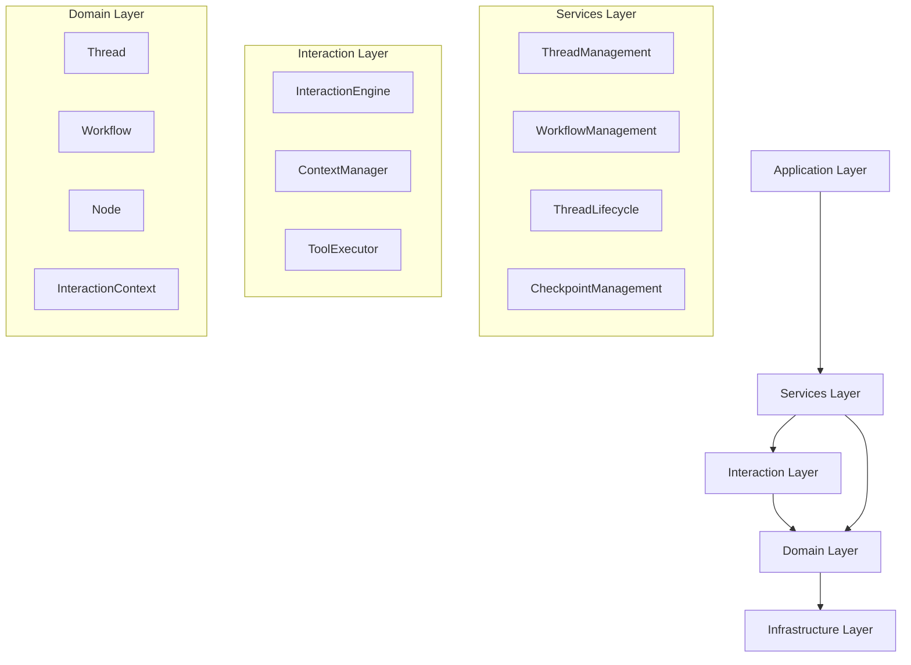
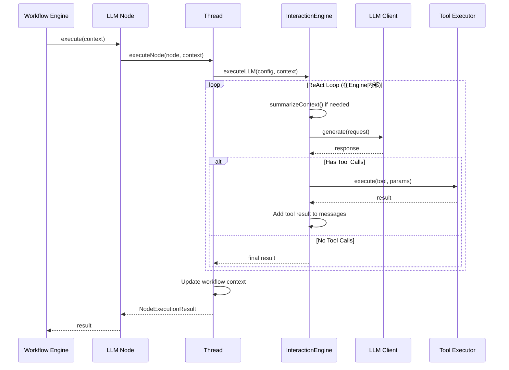
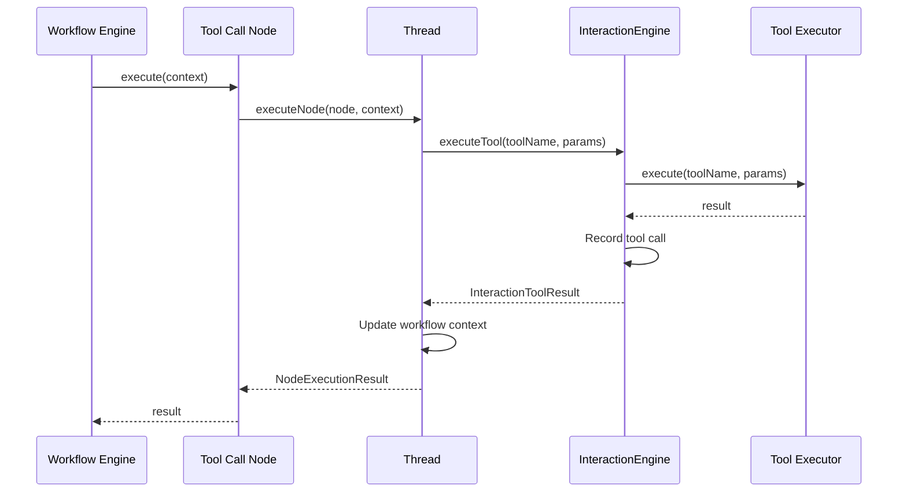

# LLM Interaction 架构设计文档

## 一、核心设计目标

### 1.1 解耦目标
- **Workflow 静态定义** 与 **执行引擎** 完全解耦
- **Thread 执行协调** 与 **LLM 交互逻辑** 分离
- **节点配置** 与 **节点执行** 分离

### 1.2 命名规范
为避免混淆，采用以下命名：
- **Interaction Layer**：LLM 交互层（原 Agent Layer）
- **InteractionEngine**：LLM 交互引擎（原 AgentEngine）
- **InteractionContext**：LLM 交互上下文（原 AgentContext）

## 二、架构分层



## 三、各层职责定义

### 3.1 Workflow 层（纯配置）

**核心原则**：只包含配置信息，不包含任何执行逻辑

#### LLM Node（配置）
```typescript
export interface LLMNodeConfig {
  provider: string;           // LLM提供商
  model: string;              // 模型名称
  temperature?: number;       // 温度参数
  maxTokens?: number;         // 最大token数
  systemPrompt?: string;      // 系统提示词
  userPrompt: string;         // 用户提示词（支持模板）
  stream?: boolean;           // 是否流式输出
  toolMode?: 'none' | 'auto' | 'required';  // 工具调用模式
  availableTools?: string[];  // 可用工具列表
  maxIterations?: number;     // 最大迭代次数（用于ReAct模式）
}

export class LLMNode extends Node {
  constructor(
    id: NodeId,
    public readonly config: LLMNodeConfig,
    name?: string,
    description?: string,
    position?: { x: number; y: number }
  ) {
    super(id, NodeType.llm(), name, description, position);
  }

  // 执行逻辑完全委托给Thread
  async execute(context: WorkflowExecutionContext): Promise<NodeExecutionResult> {
    const thread = context.getService<Thread>('Thread');
    return thread.executeNode(this, context);
  }

  validate(): ValidationResult {
    // 仅验证配置完整性
    const errors: string[] = [];
    if (!this.config.provider) errors.push('provider is required');
    if (!this.config.model) errors.push('model is required');
    if (!this.config.userPrompt) errors.push('userPrompt is required');
    return { valid: errors.length === 0, errors };
  }
}
```

#### Tool Call Node（配置）
```typescript
export interface ToolCallNodeConfig {
  toolName: string;                    // 工具名称
  parameters: Record<string, any>;     // 工具参数（支持表达式）
  timeout?: number;                    // 超时时间
}

export class ToolCallNode extends Node {
  constructor(
    id: NodeId,
    public readonly config: ToolCallNodeConfig,
    name?: string,
    description?: string,
    position?: { x: number; y: number }
  ) {
    super(id, NodeType.tool(), name, description, position);
  }

  // 执行逻辑完全委托给Thread
  async execute(context: WorkflowExecutionContext): Promise<NodeExecutionResult> {
    const thread = context.getService<Thread>('Thread');
    return thread.executeNode(this, context);
  }

  validate(): ValidationResult {
    const errors: string[] = [];
    if (!this.config.toolName) errors.push('toolName is required');
    return { valid: errors.length === 0, errors };
  }
}
```

#### Context Processor Node（配置）
```typescript
export interface ContextProcessorNodeConfig {
  processorName: string;               // 处理器名称
  processorConfig?: Record<string, unknown>;  // 处理器配置
}

export class ContextProcessorNode extends Node {
  constructor(
    id: NodeId,
    public readonly config: ContextProcessorNodeConfig,
    name?: string,
    description?: string,
    position?: { x: number; y: number }
  ) {
    super(id, NodeType.contextProcessor(), name, description, position);
  }

  // 执行逻辑完全委托给Thread
  async execute(context: WorkflowExecutionContext): Promise<NodeExecutionResult> {
    const thread = context.getService<Thread>('Thread');
    return thread.executeNode(this, context);
  }

  validate(): ValidationResult {
    const errors: string[] = [];
    if (!this.config.processorName) errors.push('processorName is required');
    return { valid: errors.length === 0, errors };
  }
}
```

### 3.2 Thread 层（执行协调）

**核心职责**：
- 管理 Workflow 执行生命周期
- 协调节点执行顺序
- 管理 InteractionEngine 生命周期
- 维护跨节点的执行状态
- 调用 InteractionEngine 执行 LLM 相关操作

```typescript
export interface IThread {
  // 执行节点（统一入口）
  executeNode(
    node: Node,
    context: WorkflowExecutionContext
  ): Promise<NodeExecutionResult>;

  // 执行LLM节点
  executeLLMNode(
    node: LLMNode,
    context: WorkflowExecutionContext
  ): Promise<NodeExecutionResult>;

  // 执行工具节点
  executeToolNode(
    node: ToolCallNode,
    context: WorkflowExecutionContext
  ): Promise<NodeExecutionResult>;

  // 执行上下文处理器节点
  executeContextProcessorNode(
    node: ContextProcessorNode,
    context: WorkflowExecutionContext
  ): Promise<NodeExecutionResult>;

  // 获取 InteractionEngine
  getInteractionEngine(): InteractionEngine;
}

export class Thread implements IThread {
  private interactionEngine: InteractionEngine;
  private executionState: ExecutionState;

  constructor(
    private threadId: string,
    private workflowId: string,
    private sessionId: string
  ) {
    this.interactionEngine = new InteractionEngine();
    this.executionState = new ExecutionState();
  }

  // 统一节点执行入口
  async executeNode(
    node: Node,
    context: WorkflowExecutionContext
  ): Promise<NodeExecutionResult> {
    // 验证节点
    const validation = node.validate();
    if (!validation.valid) {
      return {
        success: false,
        error: `Validation failed: ${validation.errors.join(', ')}`,
        executionTime: 0
      };
    }

    // 根据节点类型分发
    if (node instanceof LLMNode) {
      return this.executeLLMNode(node, context);
    } else if (node instanceof ToolCallNode) {
      return this.executeToolNode(node, context);
    } else if (node instanceof ContextProcessorNode) {
      return this.executeContextProcessorNode(node, context);
    } else {
      return {
        success: false,
        error: `Unknown node type: ${node.type}`,
        executionTime: 0
      };
    }
  }

  // 执行LLM节点
  async executeLLMNode(
    node: LLMNode,
    context: WorkflowExecutionContext
  ): Promise<NodeExecutionResult> {
    const startTime = Date.now();

    try {
      // 1. 准备 InteractionContext
      const interactionContext = this.prepareInteractionContext(context);

      // 2. 调用 InteractionEngine 执行LLM
      const result = await this.interactionEngine.executeLLM(
        node.config,
        interactionContext
      );

      // 3. 更新Workflow上下文
      context.setVariable('output', result.output);
      context.setVariable('messages', result.context.messages);
      context.setVariable('llmCalls', result.context.llmCalls);
      context.setVariable('toolCalls', result.context.toolCalls);

      const executionTime = Date.now() - startTime;

      return {
        success: result.success,
        output: result.output,
        executionTime,
        metadata: {
          llmCalls: result.context.llmCalls.length,
          toolCalls: result.context.toolCalls.length,
          tokenUsage: result.context.tokenUsage
        }
      };
    } catch (error) {
      const executionTime = Date.now() - startTime;

      return {
        success: false,
        error: error.message,
        executionTime
      };
    }
  }

  // 执行工具节点
  async executeToolNode(
    node: ToolCallNode,
    context: WorkflowExecutionContext
  ): Promise<NodeExecutionResult> {
    const startTime = Date.now();

    try {
      // 1. 准备参数（支持表达式求值）
      const parameters = this.evaluateParameters(node.config.parameters, context);

      // 2. 调用 InteractionEngine 执行工具
      const result = await this.interactionEngine.executeTool(
        node.config.toolName,
        parameters
      );

      // 3. 更新Workflow上下文
      context.setVariable('output', result.output);

      const executionTime = Date.now() - startTime;

      return {
        success: result.success,
        output: result.output,
        executionTime,
        metadata: {
          toolName: node.config.toolName,
          executionTime
        }
      };
    } catch (error) {
      const executionTime = Date.now() - startTime;

      return {
        success: false,
        error: error.message,
        executionTime
      };
    }
  }

  // 执行上下文处理器节点
  async executeContextProcessorNode(
    node: ContextProcessorNode,
    context: WorkflowExecutionContext
  ): Promise<NodeExecutionResult> {
    const startTime = Date.now();

    try {
      // 1. 调用 InteractionEngine 处理上下文
      const result = await this.interactionEngine.processContext(
        node.config.processorName,
        node.config.processorConfig || {},
        this.interactionEngine.getContext()
      );

      // 2. 更新Workflow上下文
      if (result.processedContext) {
        context.setVariable('context', result.processedContext);
      }

      const executionTime = Date.now() - startTime;

      return {
        success: result.success,
        output: result.output,
        executionTime,
        metadata: {
          processorName: node.config.processorName
        }
      };
    } catch (error) {
      const executionTime = Date.now() - startTime;

      return {
        success: false,
        error: error.message,
        executionTime
      };
    }
  }

  // 准备InteractionContext
  private prepareInteractionContext(
    context: WorkflowExecutionContext
  ): InteractionContext {
    return {
      messages: context.getVariable('messages') || [],
      variables: context.getVariables(),
      toolCalls: [],
      llmCalls: [],
      tokenUsage: {
        promptTokens: 0,
        completionTokens: 0,
        totalTokens: 0
      }
    };
  }

  // 参数求值（支持表达式）
  private evaluateParameters(
    parameters: Record<string, any>,
    context: WorkflowExecutionContext
  ): Record<string, any> {
    const evaluated: Record<string, any> = {};

    for (const [key, value] of Object.entries(parameters)) {
      if (typeof value === 'string' && value.startsWith('{{')) {
        // 表达式求值
        evaluated[key] = this.evaluateExpression(value, context);
      } else {
        evaluated[key] = value;
      }
    }

    return evaluated;
  }

  private evaluateExpression(
    expression: string,
    context: WorkflowExecutionContext
  ): any {
    // 简单的表达式求值实现
    const expr = expression.slice(2, -2).trim(); // 移除{{}}
    return context.getVariable(expr);
  }

  getInteractionEngine(): InteractionEngine {
    return this.interactionEngine;
  }
}
```

### 3.3 Interaction 层（LLM 交互引擎）

**核心职责**：
- 维护提示词上下文（messages 列表）
- 执行 LLM API 调用
- 协调工具调用（工具调用由 InteractionEngine 统一管理）
- 管理上下文摘要（防止 token 溢出，参考 Mini-Agent）
- 处理 LLM 响应和工具结果

```typescript
export interface IInteractionEngine {
  // 执行LLM调用
  executeLLM(
    config: LLMNodeConfig,
    context: InteractionContext
  ): Promise<InteractionLLMResult>;

  // 执行工具调用
  executeTool(
    toolName: string,
    parameters: Record<string, any>
  ): Promise<InteractionToolResult>;

  // 处理上下文
  processContext(
    processorName: string,
    config: Record<string, unknown>,
    context: InteractionContext
  ): Promise<InteractionContextResult>;

  // 获取当前上下文
  getContext(): InteractionContext;

  // 更新上下文
  updateContext(
    updater: (context: InteractionContext) => InteractionContext
  ): void;

  // 摘要上下文（防止token溢出）
  summarizeContext(): Promise<void>;
}

export interface InteractionContext {
  messages: Message[];           // 消息历史
  variables: Map<string, any>;   // 上下文变量
  toolCalls: ToolCall[];         // 工具调用历史
  llmCalls: LLMCall[];           // LLM调用历史
  tokenUsage: {                  // Token使用量
    promptTokens: number;
    completionTokens: number;
    totalTokens: number;
  };
}

export class InteractionEngine implements IInteractionEngine {
  private context: InteractionContext;
  private llmClient: LLMClient;
  private toolExecutor: ToolExecutor;
  private tokenLimit: number;

  constructor(
    llmClient: LLMClient,
    toolExecutor: ToolExecutor,
    tokenLimit: number = 80000
  ) {
    this.llmClient = llmClient;
    this.toolExecutor = toolExecutor;
    this.tokenLimit = tokenLimit;

    this.context = {
      messages: [],
      variables: new Map(),
      toolCalls: [],
      llmCalls: [],
      tokenUsage: {
        promptTokens: 0,
        completionTokens: 0,
        totalTokens: 0
      }
    };
  }

  // 执行LLM调用（核心方法）
  async executeLLM(
    config: LLMNodeConfig,
    context: InteractionContext
  ): Promise<InteractionLLMResult> {
    const startTime = Date.now();

    // 1. 检查token使用量，必要时进行摘要
    await this.summarizeContext();

    // 2. 构建LLM请求
    const llmRequest = this.buildLLMRequest(config, context);

    // 3. 调用LLM
    const llmResponse = await this.llmClient.generate(llmRequest);

    // 4. 记录LLM调用
    const llmCall = this.createLLMCall(llmRequest, llmResponse);
    context.llmCalls.push(llmCall);

    // 5. 添加助手消息到上下文
    const assistantMessage: Message = {
      role: 'assistant',
      content: llmResponse.content,
      toolCalls: llmResponse.toolCalls
    };
    context.messages.push(assistantMessage);

    // 6. 处理工具调用（如果有）
    if (llmResponse.toolCalls && llmResponse.toolCalls.length > 0) {
      for (const toolCall of llmResponse.toolCalls) {
        // 执行工具调用
        const toolResult = await this.executeTool(
          toolCall.function.name,
          toolCall.function.arguments
        );

        // 添加工具结果到上下文
        const toolMessage: Message = {
          role: 'tool',
          toolCallId: toolCall.id,
          content: toolResult.output
        };
        context.messages.push(toolMessage);
      }

      // 如果有工具调用，继续下一轮LLM调用（ReAct模式）
      if (config.toolMode === 'auto') {
        return this.executeLLM(config, context);
      }
    }

    const executionTime = Date.now() - startTime;

    return {
      success: true,
      output: llmResponse.content,
      executionTime,
      context
    };
  }

  // 执行工具调用
  async executeTool(
    toolName: string,
    parameters: Record<string, any>
  ): Promise<InteractionToolResult> {
    const startTime = Date.now();

    try {
      // 调用ToolExecutor执行工具
      const result = await this.toolExecutor.execute(toolName, parameters);

      // 记录工具调用
      const toolCall: ToolCall = {
        id: `tool_${Date.now()}`,
        name: toolName,
        parameters,
        result: result.output,
        executionTime: Date.now() - startTime
      };
      this.context.toolCalls.push(toolCall);

      return {
        success: result.success,
        output: result.output,
        executionTime: Date.now() - startTime
      };
    } catch (error) {
      return {
        success: false,
        error: error.message,
        executionTime: Date.now() - startTime
      };
    }
  }

  // 处理上下文
  async processContext(
    processorName: string,
    config: Record<string, unknown>,
    context: InteractionContext
  ): Promise<InteractionContextResult> {
    const startTime = Date.now();

    try {
      // 获取上下文处理器
      const processor = this.getContextProcessor(processorName);

      // 执行处理器
      const processedContext = await processor.execute(context, config);

      return {
        success: true,
        output: processedContext,
        processedContext,
        executionTime: Date.now() - startTime
      };
    } catch (error) {
      return {
        success: false,
        error: error.message,
        executionTime: Date.now() - startTime
      };
    }
  }

  // 摘要上下文（防止token溢出，参考Mini-Agent）
  async summarizeContext(): Promise<void> {
    // 估算token使用量
    const estimatedTokens = this.estimateTokens(this.context.messages);

    if (estimatedTokens <= this.tokenLimit) {
      return; // 不需要摘要
    }

    console.log(`Token usage ${estimatedTokens}/${this.tokenLimit}, triggering summarization...`);

    // 找到所有用户消息的位置（跳过系统消息）
    const userIndices = this.context.messages
      .map((msg, idx) => ({ msg, idx }))
      .filter(({ msg, idx }) => msg.role === 'user' && idx > 0)
      .map(({ idx }) => idx);

    if (userIndices.length < 1) {
      console.log('Insufficient messages for summarization');
      return;
    }

    // 构建新的消息列表
    const newMessages: Message[] = [this.context.messages[0]]; // 保留系统消息
    let summaryCount = 0;

    // 为每个用户消息区间创建摘要
    for (let i = 0; i < userIndices.length; i++) {
      const userIdx = userIndices[i];

      // 添加用户消息
      newMessages.push(this.context.messages[userIdx]);

      // 确定要摘要的消息范围
      const nextUserIdx = i < userIndices.length - 1
        ? userIndices[i + 1]
        : this.context.messages.length;

      // 提取执行消息
      const executionMessages = this.context.messages.slice(userIdx + 1, nextUserIdx);

      // 如果有执行消息，创建摘要
      if (executionMessages.length > 0) {
        const summary = await this.createSummary(executionMessages, i + 1);
        if (summary) {
          newMessages.push({
            role: 'user',
            content: `[Assistant Execution Summary]\n\n${summary}`
          });
          summaryCount++;
        }
      }
    }

    // 替换消息列表
    this.context.messages = newMessages;

    // 重新估算token使用量
    const newTokens = this.estimateTokens(this.context.messages);
    console.log(`Summarization completed: ${estimatedTokens} -> ${newTokens} tokens`);
    console.log(`Structure: system + ${userIndices.length} user messages + ${summaryCount} summaries`);
  }

  // 创建摘要（参考Mini-Agent）
  private async createSummary(
    messages: Message[],
    roundNum: number
  ): Promise<string> {
    if (!messages || messages.length === 0) {
      return '';
    }

    // 构建摘要内容
    let summaryContent = `Round ${roundNum} execution process:\n\n`;
    for (const msg of messages) {
      if (msg.role === 'assistant') {
        summaryContent += `Assistant: ${msg.content}\n`;
        if (msg.toolCalls) {
          const toolNames = msg.toolCalls.map(tc => tc.function.name);
          summaryContent += `  → Called tools: ${toolNames.join(', ')}\n`;
        }
      } else if (msg.role === 'tool') {
        const resultPreview = typeof msg.content === 'string'
          ? msg.content.substring(0, 100)
          : JSON.stringify(msg.content).substring(0, 100);
        summaryContent += `  ← Tool returned: ${resultPreview}...\n`;
      }
    }

    // 调用LLM生成简洁摘要
    try {
      const summaryPrompt = `Please provide a concise summary of the following execution process:\n\n${summaryContent}\n\nRequirements:\n1. Focus on completed tasks and tool calls\n2. Keep key results and findings\n3. Be concise and clear, within 1000 words\n4. Do not include user content, only summarize the execution process`;

      const summaryRequest: LLMRequest = {
        messages: [
          {
            role: 'system',
            content: 'You are skilled at summarizing execution processes.'
          },
          {
            role: 'user',
            content: summaryPrompt
          }
        ]
      };

      const summaryResponse = await this.llmClient.generate(summaryRequest);
      console.log(`Summary for round ${roundNum} generated successfully`);

      return summaryResponse.content;
    } catch (error) {
      console.log(`Summary generation failed for round ${roundNum}: ${error.message}`);
      // 失败时返回简单文本摘要
      return summaryContent;
    }
  }

  // 估算token使用量
  private estimateTokens(messages: Message[]): number {
    // 简化的token估算
    let totalChars = 0;
    for (const msg of messages) {
      const content = typeof msg.content === 'string' ? msg.content : JSON.stringify(msg.content);
      totalChars += content.length;
    }
    // 假设：平均2.5字符 = 1 token
    return Math.floor(totalChars / 2.5);
  }

  // 构建LLM请求
  private buildLLMRequest(
    config: LLMNodeConfig,
    context: InteractionContext
  ): LLMRequest {
    // 构建消息列表
    const messages: Message[] = [];

    // 添加系统消息
    if (config.systemPrompt) {
      messages.push({
        role: 'system',
        content: config.systemPrompt
      });
    }

    // 添加上下文中的消息
    messages.push(...context.messages);

    // 添加当前用户消息（处理模板变量）
    const userPrompt = this.processTemplate(config.userPrompt, context.variables);
    messages.push({
      role: 'user',
      content: userPrompt
    });

    // 构建LLM请求
    return {
      messages,
      provider: config.provider,
      model: config.model,
      temperature: config.temperature,
      maxTokens: config.maxTokens,
      stream: config.stream,
      tools: this.getAvailableTools(config.availableTools)
    };
  }

  // 处理模板变量
  private processTemplate(
    template: string,
    variables: Map<string, any>
  ): string {
    // 简单的模板替换
    let result = template;
    for (const [key, value] of variables) {
      const placeholder = `{{${key}}}`;
      result = result.replace(new RegExp(placeholder, 'g'), String(value));
    }
    return result;
  }

  // 获取可用工具
  private getAvailableTools(availableTools?: string[]): any[] {
    if (!availableTools || availableTools.length === 0) {
      return [];
    }

    // 从ToolExecutor获取工具schema
    return this.toolExecutor.getToolSchemas(availableTools);
  }

  // 创建LLM调用记录
  private createLLMCall(
    request: LLMRequest,
    response: LLMResponse
  ): LLMCall {
    return {
      id: `llm_${Date.now()}`,
      provider: request.provider,
      model: request.model,
      messages: request.messages,
      response: response.content,
      toolCalls: response.toolCalls,
      usage: response.usage,
      timestamp: new Date().toISOString()
    };
  }

  // 获取上下文处理器
  private getContextProcessor(processorName: string): ContextProcessor {
    // 从注册表中获取处理器
    const processors = new Map<string, ContextProcessor>();
    return processors.get(processorName);
  }

  getContext(): InteractionContext {
    return this.context;
  }

  updateContext(
    updater: (context: InteractionContext) => InteractionContext
  ): void {
    this.context = updater(this.context);
  }
}
```

## 四、执行流程

### 4.1 LLM 节点执行流程



### 4.2 工具调用节点执行流程



## 五、与 Mini-Agent 的对比

### 5.1 Mini-Agent 核心逻辑

```python
class Agent:
    def __init__(self, llm_client, system_prompt, tools):
        self.llm = llm_client
        self.tools = {tool.name: tool for tool in tools}
        self.messages = [Message(role="system", content=system_prompt)]
        self.logger = AgentLogger()

    async def run(self):
        # 1. 摘要消息历史
        await self._summarize_messages()

        # 2. 获取工具schema
        tool_schemas = [tool.to_schema() for tool in self.tools.values()]

        # 3. 调用LLM
        response = await self.llm.generate(messages=self.messages, tools=tool_schemas)

        # 4. 处理工具调用
        if response.tool_calls:
            for tool_call in response.tool_calls:
                tool = self.tools[tool_call.function.name]
                result = await tool.execute(**tool_call.function.arguments)

                # 添加工具结果到messages
                self.messages.append(Message(
                    role="tool",
                    tool_call_id=tool_call.id,
                    content=result
                ))

            # 继续下一轮
            return await self.run()

        # 5. 返回最终结果
        return response.content
```

### 5.2 我们的设计优势

| 特性 | Mini-Agent | 我们的设计 |
|------|-----------|-----------|
| **职责分离** | Agent 包含所有逻辑 | Workflow/Thread/Interaction 三层分离 |
| **流程控制** | 简单循环 | Thread 协调复杂流程（并行、分支等） |
| **上下文管理** | 简单 messages 列表 | 完整的 InteractionContext，支持摘要 |
| **工具集成** | 直接调用 | 统一的 ToolExecutor，支持多种工具类型 |
| **可扩展性** | 有限 | 支持多种 InteractionEngine 策略 |
| **监控调试** | 日志文件 | 完整的执行历史和监控 |

## 六、命名调整说明

### 6.1 命名变更

| 旧命名 | 新命名 | 理由 |
|--------|--------|------|
| Agent Layer | Interaction Layer | 避免与现有 Agent 概念混淆，更准确地描述 LLM 交互职责 |
| AgentEngine | InteractionEngine | 同上 |
| AgentContext | InteractionContext | 同上 |
| AgentExecutionResult | InteractionLLMResult | 更具体的命名 |

### 6.2 命名空间

```
src/domain/interaction/     # Interaction 领域模型
src/services/interaction/   # Interaction 服务实现
src/domain/thread/          # Thread 领域模型（保持不变）
src/services/thread/        # Thread 服务实现（保持不变）
src/domain/workflow/        # Workflow 领域模型（保持不变）
src/services/workflow/      # Workflow 服务实现（保持不变）
```

## 七、实施计划

### 阶段 1：创建 Interaction 层基础（2 天）

- [ ] 创建 `src/domain/interaction/` 目录结构
- [ ] 定义 InteractionContext 接口
- [ ] 定义 Message、ToolCall、LLMCall 等值对象
- [ ] 定义 IInteractionEngine 接口

### 阶段 2：实现 InteractionEngine 核心（3 天）

- [ ] 实现 InteractionEngine 类
- [ ] 实现 LLM 调用逻辑
- [ ] 实现工具调用协调
- [ ] 实现上下文摘要逻辑（参考 Mini-Agent）
- [ ] 实现 Token 使用监控
- [ ] 编写单元测试

### 阶段 3：重构 Thread 层（2 天）

- [ ] 在 Thread 中集成 InteractionEngine
- [ ] 实现 Thread.executeNode() 统一入口
- [ ] 实现 Thread.executeLLMNode()
- [ ] 实现 Thread.executeToolNode()
- [ ] 实现 Thread.executeContextProcessorNode()
- [ ] 更新 ThreadLifecycle

### 阶段 4：重构 Workflow 节点（2 天）

- [ ] 重构 LLMNode（移除执行逻辑，改为委托）
- [ ] 重构 ToolCallNode（移除执行逻辑，改为委托）
- [ ] 重构 ContextProcessorNode（移除执行逻辑，改为委托）
- [ ] 更新节点验证逻辑
- [ ] 更新节点类型定义

### 阶段 5：集成测试（2 天）

- [ ] 编写集成测试
- [ ] 测试 LLM 节点执行
- [ ] 测试工具调用
- [ ] 测试上下文处理
- [ ] 测试上下文摘要功能
- [ ] 性能测试

**总计：11 天**

## 八、关键决策

### 8.1 为什么 Workflow 节点不包含执行逻辑？

**理由**：
1. 符合单一职责原则
2. 执行逻辑集中在 InteractionEngine，便于维护和测试
3. 支持多种执行策略（由 InteractionEngine 决定）
4. 与 Mini-Agent 设计一致
5. 节点只关心配置，不关心执行

### 8.2 为什么需要 Thread 层？

**理由**：
1. Thread 管理 workflow 执行生命周期
2. Thread 协调多个 InteractionEngine 调用
3. Thread 维护跨节点的执行状态
4. Thread 处理并行、分支等复杂流程
5. Thread 集成检查点和恢复功能
6. Thread 负责节点分发和结果聚合

### 8.3 InteractionEngine 是否只处理 LLM 交互？

**是的**，InteractionEngine 的职责：
- ✅ 维护提示词上下文
- ✅ 执行 LLM API 调用
- ✅ 协调工具调用
- ✅ 管理上下文摘要
- ❌ 不包含流程控制
- ❌ 不包含节点路由
- ❌ 不包含并行协调

## 九、后续扩展

### 9.1 支持多种 InteractionEngine 策略

```typescript
// ReAct InteractionEngine
class ReActInteractionEngine implements IInteractionEngine {
  // 实现ReAct逻辑
}

// Plan-and-Execute InteractionEngine
class PlanAndExecuteInteractionEngine implements IInteractionEngine {
  // 先规划，后执行
}

// Multi-LLM InteractionEngine
class MultiLLMInteractionEngine implements IInteractionEngine {
  // 多个LLM协作
}
```

### 9.2 支持更多节点类型

```typescript
// 循环节点
class LoopNode extends Node {
  // 配置循环条件和最大次数
}

// 并行节点
class ParallelNode extends Node {
  // 配置并行执行的分支
}

// 条件节点
class ConditionNode extends Node {
  // 配置条件表达式
}
```

### 9.3 增强监控和调试

```typescript
interface ExecutionMonitor {
  // 监控LLM调用
  onLLMCall(call: LLMCall): void;

  // 监控工具调用
  onToolCall(call: ToolCall): void;

  // 监控Token使用
  onTokenUsage(usage: TokenUsage): void;

  // 监控上下文摘要
  onContextSummarized(originalTokens: number, newTokens: number): void;
}
```

---

**设计完成日期**：2024年
**审核状态**：待审核
**关键改进**：
1. Workflow 节点仅包含配置，无执行逻辑
2. Thread 负责执行协调和节点分发
3. InteractionEngine 专注于 LLM 交互，参考 Mini-Agent 设计
4. 命名调整避免混淆