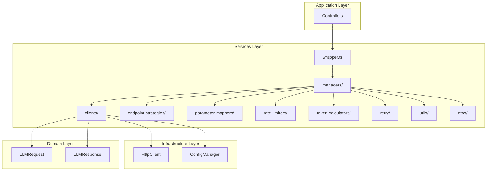
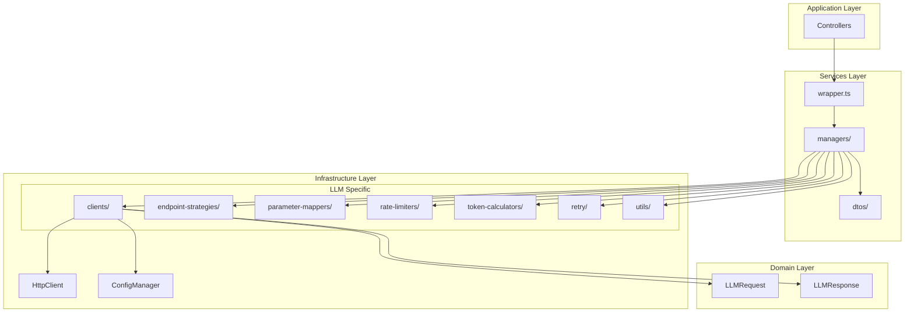

# LLM 模块层级迁移分析报告

## 一、执行摘要

本报告分析了 `src/services/llm` 目录中的各个模块，根据项目的分层架构规则（Domain + Services + Infrastructure + Application），识别出应该迁移到基础设施层的模块。

**核心发现**：
- **应迁移到 Infrastructure 层**：7个子模块（clients, endpoint-strategies, parameter-mappers, rate-limiters, token-calculators, retry, utils）
- **保留在 Services 层**：4个核心模块（managers, wrapper.ts, human-relay.ts, dtos）

**重要说明**：
- 在基础设施层创建专门的 `src/infrastructure/llm/` 目录，因为这些模块都是LLM特定的，不是通用基础设施
- DTOs保留在Services层，因为它们定义了服务接口的契约，与业务逻辑密切相关

---

## 二、架构规则回顾

### 2.1 分层架构约束

| 层级 | 依赖规则 | 职责 |
|------|---------|------|
| **Domain** | 不依赖任何其他层 | 纯业务逻辑、领域实体、契约定义 |
| **Infrastructure** | 只能依赖 Domain 层 | 技术基础设施：持久化、日志、配置、外部API集成 |
| **Services** | 可依赖 Domain 和 Infrastructure 层 | 业务逻辑、技术实现、协调管理、DTO定义 |
| **Application** | 只能依赖 Services 层 | 外部接口适配（HTTP/gRPC） |

### 2.2 依赖流向

```
Infrastructure → Domain
Services → Domain + Infrastructure
Application → Services
```

### 2.3 LLM特定基础设施

由于LLM相关的模块都是针对LLM服务的特定实现，不是通用基础设施，因此在 `src/infrastructure/` 下创建专门的 `llm/` 子目录。

---

## 三、模块详细分析

### 3.1 应迁移到 Infrastructure 层的模块

#### 3.1.1 `clients/` - LLM客户端实现

**当前位置**: `src/services/llm/clients/`

**包含文件**:
- `base-llm-client.ts` - 抽象基类
- `openai-chat-client.ts` - OpenAI聊天客户端
- `openai-response-client.ts` - OpenAI响应客户端
- `anthropic-client.ts` - Anthropic客户端
- `gemini-client.ts` - Gemini原生客户端
- `gemini-openai-client.ts` - Gemini OpenAI兼容客户端
- `mock-client.ts` - Mock客户端
- `human-relay-client.ts` - 人工中继客户端
- `llm-client-factory.ts` - 客户端工厂

**功能分析**:
- 负责与外部LLM API进行HTTP通信
- 处理请求/响应的序列化和反序列化
- 实现不同提供商的API适配
- 管理API密钥和认证

**迁移理由**:
1. ✅ **技术实现细节**：这些是纯粹的技术实现，负责与外部服务通信
2. ✅ **无业务逻辑**：不包含业务规则，只是API调用的技术封装
3. ✅ **基础设施性质**：属于外部API集成的基础设施
4. ✅ **可替换性**：可以轻松替换为其他实现而不影响业务逻辑
5. ✅ **LLM特定**：这些模块都是针对LLM服务的特定实现

**目标位置**: `src/infrastructure/llm/clients/`

---

#### 3.1.2 `endpoint-strategies/` - 端点策略

**当前位置**: `src/services/llm/endpoint-strategies/`

**包含文件**:
- `base-endpoint-strategy.ts` - 基础端点策略
- `anthropic-endpoint-strategy.ts` - Anthropic端点策略
- `gemini-native-endpoint-strategy.ts` - Gemini原生端点策略
- `mock-endpoint-strategy.ts` - Mock端点策略
- `openai-compatible-endpoint-strategy.ts` - OpenAI兼容端点策略
- `openai-responses-endpoint-strategy.ts` - OpenAI响应端点策略

**功能分析**:
- 构建API端点URL
- 生成请求头（认证、内容类型等）
- 处理认证逻辑
- 验证配置

**迁移理由**:
1. ✅ **技术实现**：URL构建和头部生成是纯技术实现
2. ✅ **基础设施性质**：属于HTTP通信的基础设施
3. ✅ **无业务逻辑**：不包含业务规则
4. ✅ **LLM特定**：这些策略都是针对LLM API的特定实现

**目标位置**: `src/infrastructure/llm/endpoint-strategies/`

---

#### 3.1.3 `parameter-mappers/` - 参数映射器

**当前位置**: `src/services/llm/parameter-mappers/`

**包含文件**:
- `base-parameter-mapper.ts` - 基础参数映射器
- `anthropic-parameter-mapper.ts` - Anthropic参数映射器
- `gemini-parameter-mapper.ts` - Gemini参数映射器
- `mock-parameter-mapper.ts` - Mock参数映射器
- `openai-parameter-mapper.ts` - OpenAI参数映射器
- `interfaces/` - 接口定义

**功能分析**:
- 将标准LLM请求格式转换为提供商特定格式
- 将提供商响应格式转换为标准LLM响应格式
- 参数验证
- 特性支持检测

**迁移理由**:
1. ✅ **数据转换**：纯数据格式转换，无业务逻辑
2. ✅ **技术实现**：属于API集成的技术细节
3. ✅ **基础设施性质**：是外部API适配的基础设施
4. ✅ **LLM特定**：这些映射器都是针对LLM API的特定实现

**目标位置**: `src/infrastructure/llm/parameter-mappers/`

---

#### 3.1.4 `rate-limiters/` - 速率限制器

**当前位置**: `src/services/llm/rate-limiters/`

**包含文件**:
- `sliding-window-limiter.ts` - 滑动窗口限流器
- `token-bucket-limiter.ts` - 令牌桶限流器

**功能分析**:
- 实现API调用速率限制
- 防止超过API提供商的速率限制
- 提供等待和重试机制

**迁移理由**:
1. ✅ **技术实现**：纯算法实现（滑动窗口、令牌桶）
2. ✅ **基础设施性质**：属于API调用的基础设施保护机制
3. ✅ **无业务逻辑**：不包含业务规则
4. ✅ **LLM特定**：这些限流器是为LLM API调用设计的

**目标位置**: `src/infrastructure/llm/rate-limiters/`

---

#### 3.1.5 `token-calculators/` - Token计算器

**当前位置**: `src/services/llm/token-calculators/`

**包含文件**:
- `base-token-calculator.ts` - 基础Token计算器
- `api-response-token-calculator.ts` - API响应Token计算器
- `local-token-calculator.ts` - 本地Token计算器
- `token-calculator.ts` - Token计算器

**功能分析**:
- 计算文本的token数量
- 计算消息列表的token数量
- 解析API响应中的token使用信息
- 计算成本
- 文本截断

**迁移理由**:
1. ✅ **技术实现**：纯计算逻辑，无业务规则
2. ✅ **基础设施性质**：属于API调用的辅助基础设施
3. ✅ **可替换性**：可以轻松替换为其他计算方法
4. ✅ **LLM特定**：这些计算器是为LLM token计算设计的

**目标位置**: `src/infrastructure/llm/token-calculators/`

---

#### 3.1.6 `retry/` - 重试机制

**当前位置**: `src/services/llm/retry/`

**包含文件**:
- `retry-config.ts` - 重试配置

**功能分析**:
- 定义重试策略（指数退避、线性退避、固定延迟、自适应）
- 计算重试延迟
- 判断是否应该重试
- 记录重试统计信息

**迁移理由**:
1. ✅ **技术实现**：纯算法实现，无业务逻辑
2. ✅ **基础设施性质**：属于API调用的基础设施保护机制
3. ✅ **通用性**：可以用于任何需要重试的场景
4. ✅ **LLM特定**：当前是为LLM API调用设计的

**目标位置**: `src/infrastructure/llm/retry/`

---

#### 3.1.7 `utils/` - 工具类

**当前位置**: `src/services/llm/utils/`

**包含文件**:
- `content-extractor.ts` - 内容提取器
- `header-validator.ts` - 头部验证器

**功能分析**:
- 从响应中提取内容
- 验证请求头

**迁移理由**:
1. ✅ **工具函数**：纯工具函数，无业务逻辑
2. ✅ **基础设施性质**：属于技术辅助工具
3. ✅ **LLM特定**：这些工具是为LLM API响应处理设计的

**目标位置**: `src/infrastructure/llm/utils/`

---

### 3.2 保留在 Services 层的模块

#### 3.2.1 `managers/` - 管理器

**当前位置**: `src/services/llm/managers/`

**包含文件**:
- `llm-wrapper-manager.ts` - LLM包装器管理器
- `pool-manager.ts` - 轮询池管理器
- `task-group-manager.ts` - 任务组管理器

**功能分析**:
- 管理LLM包装器的生命周期
- 实现轮询池策略（负载均衡、故障转移）
- 实现任务组管理
- 协调多个LLM实例
- 提供业务级别的统计和报告

**保留理由**:
1. ✅ **业务逻辑**：包含负载均衡、故障转移等业务策略
2. ✅ **协调管理**：协调多个LLM实例，属于业务编排
3. ✅ **依赖Infrastructure**：依赖Infrastructure层的clients和其他组件
4. ✅ **符合Services层职责**：提供业务逻辑和技术实现

---

#### 3.2.2 `wrapper.ts` - 包装器服务

**当前位置**: `src/services/llm/wrapper.ts`

**功能分析**:
- 提供LLM调用的业务接口
- 实现请求路由逻辑
- 实现最优包装器选择策略
- 提供系统级报告聚合

**保留理由**:
1. ✅ **业务逻辑**：包含请求路由、包装器选择等业务规则
2. ✅ **业务接口**：为Application层提供业务接口
3. ✅ **依赖Infrastructure**：依赖Infrastructure层的managers
4. ✅ **符合Services层职责**：提供业务逻辑和编排

---

#### 3.2.3 `human-relay.ts` - 人工中继

**当前位置**: `src/services/llm/human-relay.ts`

**功能分析**:
- 实现人工介入机制
- 管理人工交互流程

**保留理由**:
1. ✅ **业务逻辑**：人工介入是业务需求，不是技术实现
2. ✅ **符合Services层职责**：提供业务逻辑

---

#### 3.2.4 `dtos/` - 数据传输对象

**当前位置**: `src/services/llm/dtos/`

**包含文件**:
- `llm-dto.ts` - LLM数据传输对象

**功能分析**:
- 定义数据传输对象
- 数据格式转换

**保留理由**:
1. ✅ **服务接口契约**：DTOs定义了服务接口的契约，与业务逻辑密切相关
2. ✅ **Services层职责**：DTOs属于Services层的职责范围
3. ✅ **业务相关性**：DTOs反映了业务数据结构，不是纯粹的技术实现
4. ✅ **依赖方向**：DTOs应该被Services层使用，而不是Infrastructure层

---

## 四、迁移影响分析

### 4.1 依赖关系变化

#### 迁移前
```
Services Layer (services/llm/)
├── clients/ (依赖 Infrastructure.HttpClient)
├── endpoint-strategies/
├── parameter-mappers/
├── rate-limiters/
├── token-calculators/
├── retry/
├── utils/
├── dtos/
├── managers/ (依赖上述所有模块)
└── wrapper.ts (依赖 managers/)
```

#### 迁移后
```
Infrastructure Layer (infrastructure/llm/)
├── clients/ (依赖 Infrastructure.HttpClient)
├── endpoint-strategies/
├── parameter-mappers/
├── rate-limiters/
├── token-calculators/
├── retry/
└── utils/

Services Layer (services/llm/)
├── dtos/
├── managers/ (依赖 Infrastructure.llm.*)
└── wrapper.ts (依赖 managers/)
```

### 4.2 依赖注入变化

需要更新依赖注入配置，将Infrastructure层的组件注入到Services层。

### 4.3 导入路径变化

所有从Infrastructure层迁移的模块，其导入路径需要更新。

---

## 五、迁移计划

### 5.1 迁移步骤

#### 阶段1：准备工作
1. 创建 `src/infrastructure/llm/` 目录结构
2. 备份现有代码
3. 更新依赖注入配置

#### 阶段2：迁移基础设施模块
1. 迁移 `clients/` 模块
2. 迁移 `endpoint-strategies/` 模块
3. 迁移 `parameter-mappers/` 模块
4. 迁移 `rate-limiters/` 模块
5. 迁移 `token-calculators/` 模块
6. 迁移 `retry/` 模块
7. 迁移 `utils/` 模块

#### 阶段3：更新Services层
1. 更新 `managers/` 模块的导入路径
2. 更新 `wrapper.ts` 的导入路径
3. 更新 `human-relay.ts` 的导入路径

#### 阶段4：测试验证
1. 运行单元测试
2. 运行集成测试
3. 验证功能完整性

#### 阶段5：清理
1. 删除 `src/services/llm/` 中的已迁移模块
2. 更新文档
3. 更新依赖注入配置

### 5.2 风险评估

| 风险 | 影响 | 缓解措施 |
|------|------|---------|
| 导入路径错误 | 高 | 使用IDE的重构功能，全面测试 |
| 依赖注入配置错误 | 高 | 逐步更新，每步验证 |
| 循环依赖 | 中 | 仔细检查依赖关系，使用接口解耦 |
| 测试失败 | 中 | 更新测试的导入路径，确保测试覆盖 |

---

## 六、架构图

### 6.1 迁移前架构



### 6.2 迁移后架构



---

## 七、建议

### 7.1 迁移优先级

**高优先级**（核心基础设施）:
1. `clients/` - 核心API集成
2. `endpoint-strategies/` - 端点管理
3. `parameter-mappers/` - 参数转换

**中优先级**（辅助基础设施）:
4. `rate-limiters/` - 速率限制
5. `token-calculators/` - Token计算
6. `retry/` - 重试机制

**低优先级**（工具类）:
7. `utils/` - 工具函数

### 7.2 注意事项

1. **保持向后兼容**：在迁移过程中，确保现有功能不受影响
2. **逐步迁移**：不要一次性迁移所有模块，逐步进行
3. **充分测试**：每迁移一个模块，都要进行充分测试
4. **更新文档**：及时更新相关文档
5. **代码审查**：迁移完成后，进行代码审查

### 7.3 长期收益

1. **更清晰的架构**：符合分层架构原则，职责更清晰
2. **更好的可维护性**：基础设施和业务逻辑分离，更容易维护
3. **更好的可测试性**：可以独立测试基础设施和业务逻辑
4. **更好的可扩展性**：可以轻松替换基础设施实现
5. **更好的复用性**：基础设施组件可以在其他服务中复用

---

## 八、总结

本次分析识别出 `src/services/llm` 目录中的7个子模块应该迁移到基础设施层：

1. ✅ `clients/` - LLM客户端实现
2. ✅ `endpoint-strategies/` - 端点策略
3. ✅ `parameter-mappers/` - 参数映射器
4. ✅ `rate-limiters/` - 速率限制器
5. ✅ `token-calculators/` - Token计算器
6. ✅ `retry/` - 重试机制
7. ✅ `utils/` - 工具类

保留在Services层的4个核心模块：

1. ✅ `managers/` - 管理器（包含业务逻辑）
2. ✅ `wrapper.ts` - 包装器服务（业务接口）
3. ✅ `human-relay.ts` - 人工中继（业务逻辑）
4. ✅ `dtos/` - 数据传输对象（服务接口契约）

**重要说明**：
- 在 `src/infrastructure/` 下创建专门的 `llm/` 目录，因为这些模块都是LLM特定的
- DTOs保留在Services层，因为它们定义了服务接口的契约，与业务逻辑密切相关

这次迁移将使架构更加清晰，符合分层架构原则，提高代码的可维护性和可扩展性。