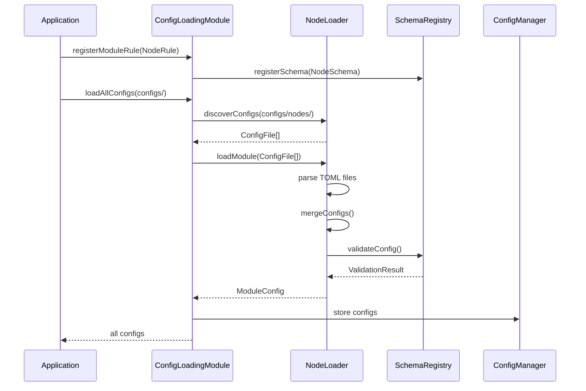
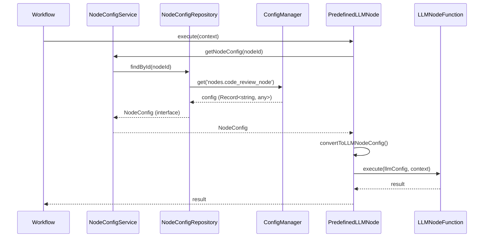

# LLM节点配置系统架构设计（简化版）

## 1. 设计原则

### 1.1 遵循现有模式

基于对现有配置模块（LLM、Prompt、Tool）的分析，采用**轻量级配置设计**：

- ✅ **不在Domain层创建配置值对象**
- ✅ **在Infrastructure层定义JSON Schema进行验证**
- ✅ **配置数据以`Record<string, any>`形式处理**
- ✅ **只在Application层提供配置服务接口**

### 1.2 与现有模块保持一致

**现有模块模式：**
```
LLM模块: LLMSchema (Infrastructure) + LLMLoader (Infrastructure)
Prompt模块: PromptSchema (Infrastructure) + PromptLoader (Infrastructure)
Tool模块: ToolSchema (Infrastructure) + ToolLoader (Infrastructure)
```

**节点模块模式：**
```
Node模块: NodeSchema (Infrastructure) + NodeLoader (Infrastructure) + NodeConfigService (Application)
```

## 2. 架构设计

### 2.1 分层架构

```
┌─────────────────────────────────────────┐
│         Interface Layer                 │
│  (HTTP API, gRPC, CLI)                  │
└─────────────────────────────────────────┘
                    ↓
┌─────────────────────────────────────────┐
│       Application Layer                 │
│  NodeConfigService                      │
│  - getNodeConfig(id)                    │
│  - getAllNodeConfigs()                  │
│  - validateConfig(config)               │
└─────────────────────────────────────────┘
                    ↓
┌─────────────────────────────────────────┐
│      Infrastructure Layer               │
│  ┌──────────────────────────────────┐   │
│  │  Config Loading Module          │   │
│  │  - NodeLoader                   │   │
│  │  - NodeRule (Schema)            │   │
│  │  - NodeConfigRepository         │   │
│  └──────────────────────────────────┘   │
│  ┌──────────────────────────────────┐   │
│  │  Predefined Nodes               │   │
│  │  - PredefinedLLMNode            │   │
│  │  - NodeFactory                  │   │
│  └──────────────────────────────────┘   │
└─────────────────────────────────────────┘
                    ↓
┌─────────────────────────────────────────┐
│          Domain Layer                   │
│  - IConfigSource (已有)                 │
│  - IConfigProcessor (已有)              │
│  - IConfigValidator (已有)              │
│  - IConfigManager (已有)                │
│  - 不创建节点配置值对象                  │
└─────────────────────────────────────────┘
```

### 2.2 核心组件

#### 2.2.1 Infrastructure层

**1. NodeSchema（JSON Schema）**
- 文件：`src/infrastructure/config/loading/rules/node-rule.ts`
- 职责：定义节点配置的验证规则
- 格式：JSON Schema（与LLMSchema、PromptSchema一致）

**2. NodeLoader**
- 文件：`src/infrastructure/config/loading/loaders/node-loader.ts`
- 职责：加载节点配置文件
- 继承：`BaseModuleLoader`
- 输出：`Record<string, any>`（按节点ID组织的配置）

**3. NodeConfigRepository**
- 文件：`src/infrastructure/workflow/repositories/node-config-repository.ts`
- 职责：从ConfigManager获取节点配置
- 接口：在Domain层定义（如果需要）
- 实现：在Infrastructure层实现

**4. PredefinedLLMNode**
- 文件：`src/infrastructure/workflow/nodes/predefined-llm-node.ts`
- 职责：执行预定义的LLM节点
- 依赖：NodeConfigService

**5. NodeFactory**
- 文件：`src/infrastructure/workflow/nodes/node-factory.ts`
- 职责：根据配置创建节点实例

#### 2.2.2 Application层

**NodeConfigService**
- 文件：`src/application/workflow/services/node-config-service.ts`
- 职责：提供节点配置的查询和管理功能
- 依赖：NodeConfigRepository（Infrastructure）

## 3. 类型定义

### 3.1 TypeScript接口（Infrastructure层）

**文件：** `src/infrastructure/config/loading/types/node-config-types.ts`

```typescript
/**
 * 节点配置接口
 */
export interface NodeConfig {
  id: string;
  name: string;
  description?: string;
  type: 'llm' | 'tool' | 'routing';
  version: string;
  tags?: string[];
  llm?: LLMConfig;
  prompt?: PromptConfig;
  input_schema?: JSONSchema;
  output_schema?: JSONSchema;
  error_handling?: ErrorHandlingConfig;
  metadata?: NodeConfigMetadata;
  _filepath?: string;
}

/**
 * LLM配置
 */
export interface LLMConfig {
  wrapper_name: string;
  temperature?: number;
  max_tokens?: number;
  stream?: boolean;
}

/**
 * 提示词配置
 */
export interface PromptConfig {
  system?: PromptSource;
  user?: PromptSource;
  variables?: Record<string, string>;
}

/**
 * 提示词来源
 */
export interface PromptSource {
  type: 'direct' | 'template';
  content?: string;
  category?: string;
  name?: string;
  options?: Record<string, any>;
}

/**
 * 错误处理配置
 */
export interface ErrorHandlingConfig {
  max_retries?: number;
  retry_delay?: number;
  fallback_node?: string;
}

/**
 * 节点配置元数据
 */
export interface NodeConfigMetadata {
  author?: string;
  created_at?: string;
  updated_at?: string;
  deprecated?: boolean;
}

/**
 * JSON Schema
 */
export interface JSONSchema {
  type: string;
  properties?: Record<string, JSONSchema>;
  required?: string[];
  items?: JSONSchema;
  description?: string;
  default?: any;
}
```

### 3.2 为什么不在Domain层创建值对象？

**原因分析：**

1. **现有模式一致性**：LLM、Prompt、Tool模块都没有在Domain层创建配置值对象
2. **配置是技术细节**：配置加载、解析、验证是Infrastructure层的职责
3. **业务逻辑分离**：节点配置主要用于驱动节点执行，不包含复杂业务逻辑
4. **简化架构**：避免过度设计，减少不必要的抽象层

**何时需要Domain层值对象？**

- ✅ 当配置有复杂的业务规则和不变性要求时
- ✅ 当配置需要在多个层之间传递并需要类型安全时
- ✅ 当配置有领域特定的行为和验证逻辑时

**节点配置的情况：**

- ❌ 配置主要用于Infrastructure层的加载和执行
- ❌ 没有复杂的业务规则
- ❌ 主要在Infrastructure层使用
- ❌ 可以通过TypeScript接口提供类型安全

**结论：** 不在Domain层创建节点配置值对象，采用轻量级设计。

## 4. 实施方案

### 4.1 Phase 1: Infrastructure层 - 配置加载

**任务清单：**
1. 创建NodeSchema（JSON Schema）
2. 创建NodeLoader（继承BaseModuleLoader）
3. 创建NodeRule（注册规则）
4. 集成到ConfigLoadingModule

**文件清单：**
```
src/infrastructure/config/loading/
├── types/
│   └── node-config-types.ts          # TypeScript接口定义
├── loaders/
│   └── node-loader.ts                # 节点配置加载器
└── rules/
    └── node-rule.ts                  # 节点配置验证规则
```

### 4.2 Phase 2: Infrastructure层 - 配置存储

**任务清单：**
1. 创建NodeConfigRepository接口（Domain层，可选）
2. 实现NodeConfigRepository（Infrastructure层）
3. 从ConfigManager获取节点配置

**文件清单：**
```
src/infrastructure/workflow/repositories/
└── node-config-repository.ts         # 节点配置仓储实现
```

### 4.3 Phase 3: Application层 - 配置服务

**任务清单：**
1. 创建NodeConfigService
2. 提供配置查询和管理功能
3. 集成到依赖注入容器

**文件清单：**
```
src/application/workflow/services/
└── node-config-service.ts            # 节点配置服务
```

### 4.4 Phase 4: Infrastructure层 - 预定义节点

**任务清单：**
1. 创建PredefinedLLMNode
2. 创建NodeFactory
3. 实现节点注册机制

**文件清单：**
```
src/infrastructure/workflow/nodes/
├── predefined-llm-node.ts            # 预定义LLM节点
└── node-factory.ts                   # 节点工厂
```

### 4.5 Phase 5: 配置文件和测试

**任务清单：**
1. 创建示例配置文件
2. 编写单元测试
3. 编写集成测试

**文件清单：**
```
configs/nodes/
└── builtin/
    └── llm/
        ├── code-review-node.toml
        ├── data-analysis-node.toml
        └── text-generation-node.toml

tests/
├── infrastructure/config/loading/
│   └── node-loader.test.ts
├── application/workflow/services/
│   └── node-config-service.test.ts
└── infrastructure/workflow/nodes/
    └── predefined-llm-node.test.ts
```

## 5. 配置文件示例

### 5.1 代码审查节点

**文件：** `configs/nodes/builtin/llm/code-review-node.toml`

```toml
[node]
id = "code_review_node"
name = "代码审查节点"
description = "用于审查代码质量的LLM节点"
type = "llm"
version = "1.0.0"
tags = ["code", "review", "llm"]

[node.llm]
wrapper_name = "openai:gpt-4"
temperature = 0.3
max_tokens = 2000
stream = false

[node.prompt.system]
type = "template"
category = "system"
name = "coder"

[node.prompt.user]
type = "template"
category = "templates"
name = "code_review"
options = { include_rules = true }

[node.prompt.variables]
code = "{{input.code}}"
language = "{{input.language}}"

[node.input_schema]
type = "object"
required = ["code"]

[node.input_schema.properties]
code = { type = "string", description = "要审查的代码" }
language = { type = "string", description = "编程语言", default = "typescript" }

[node.output_schema]
type = "object"
required = ["review_result", "suggestions"]

[node.output_schema.properties]
review_result = { type = "string", description = "审查结果" }
suggestions = { type = "array", items = { type = "string" } }
score = { type = "number", description = "代码质量评分" }

[node.error_handling]
max_retries = 3
retry_delay = 1000
```

## 6. 集成流程

### 6.1 配置加载流程



### 6.2 节点执行流程



## 7. 关键代码示例

### 7.1 NodeSchema

```typescript
// src/infrastructure/config/loading/rules/node-rule.ts

export const NodeSchema = {
  type: 'object',
  properties: {
    node: {
      type: 'object',
      properties: {
        id: { type: 'string', pattern: '^[a-zA-Z0-9_-]+$' },
        name: { type: 'string', minLength: 1, maxLength: 100 },
        description: { type: 'string', maxLength: 500 },
        type: { type: 'string', enum: ['llm', 'tool', 'routing'] },
        version: { type: 'string', pattern: '^\\d+\\.\\d+\\.\\d+$' },
        tags: { type: 'array', items: { type: 'string' }, maxItems: 10 },
        llm: {
          type: 'object',
          properties: {
            wrapper_name: { type: 'string' },
            temperature: { type: 'number', minimum: 0, maximum: 2 },
            max_tokens: { type: 'number', minimum: 1, maximum: 128000 },
            stream: { type: 'boolean' }
          },
          required: ['wrapper_name']
        },
        prompt: {
          type: 'object',
          properties: {
            system: { $ref: '#/definitions/promptSource' },
            user: { $ref: '#/definitions/promptSource' },
            variables: { type: 'object' }
          }
        },
        input_schema: { type: 'object' },
        output_schema: { type: 'object' },
        error_handling: {
          type: 'object',
          properties: {
            max_retries: { type: 'number', minimum: 0, maximum: 10 },
            retry_delay: { type: 'number', minimum: 0 },
            fallback_node: { type: 'string' }
          }
        },
        metadata: {
          type: 'object',
          properties: {
            author: { type: 'string' },
            created_at: { type: 'string' },
            updated_at: { type: 'string' },
            deprecated: { type: 'boolean' }
          }
        }
      },
      required: ['id', 'name', 'type', 'version']
    }
  },
  definitions: {
    promptSource: {
      type: 'object',
      properties: {
        type: { type: 'string', enum: ['direct', 'template'] },
        content: { type: 'string' },
        category: { type: 'string' },
        name: { type: 'string' },
        options: { type: 'object' }
      },
      required: ['type']
    }
  }
};
```

### 7.2 NodeLoader

```typescript
// src/infrastructure/config/loading/loaders/node-loader.ts

export class NodeLoader extends BaseModuleLoader {
  readonly moduleType = 'nodes';

  protected override async preprocessFiles(files: ConfigFile[]): Promise<ConfigFile[]> {
    return files.map(file => {
      const filePath = file.path.toLowerCase();
      if (filePath.includes('builtin/')) {
        file.priority += 1000; // 内置节点优先级最高
      } else if (filePath.includes('custom/')) {
        file.priority += 500; // 自定义节点次之
      }
      return file;
    });
  }

  protected override async mergeConfigs(configs: Record<string, any>[]): Promise<Record<string, any>> {
    const result: Record<string, any> = { nodes: {} };

    for (const config of configs) {
      const nodeId = config['node']?.id;
      if (nodeId) {
        result.nodes[nodeId] = config;
      }
    }

    return result;
  }
}
```

### 7.3 NodeConfigService

```typescript
// src/application/workflow/services/node-config-service.ts

export class NodeConfigService {
  constructor(
    private readonly nodeConfigRepository: NodeConfigRepository,
    private readonly logger: ILogger
  ) {}

  async getNodeConfig(id: string): Promise<NodeConfig | null> {
    return this.nodeConfigRepository.findById(id);
  }

  async getAllNodeConfigs(): Promise<NodeConfig[]> {
    return this.nodeConfigRepository.findAll();
  }

  async getNodeConfigsByType(type: 'llm' | 'tool' | 'routing'): Promise<NodeConfig[]> {
    return this.nodeConfigRepository.findByType(type);
  }

  validateConfig(config: NodeConfig): ValidationResult {
    // 使用SchemaRegistry验证
    // ...
  }
}
```

## 8. 优势总结

### 8.1 简化架构

- ✅ 减少不必要的抽象层
- ✅ 与现有配置模块保持一致
- ✅ 降低维护成本

### 8.2 提高效率

- ✅ 减少代码量
- ✅ 简化测试
- ✅ 加快开发速度

### 8.3 保持灵活性

- ✅ TypeScript接口提供类型安全
- ✅ JSON Schema提供运行时验证
- ✅ 易于扩展和维护

## 9. 与原方案的对比

| 方面 | 原方案（Domain层值对象） | 简化方案（轻量级设计） |
|------|------------------------|----------------------|
| Domain层 | 6个值对象 | 0个值对象 |
| Infrastructure层 | NodeLoader + Repository | NodeLoader + Repository + Schema |
| Application层 | NodeConfigService | NodeConfigService |
| 代码量 | ~1500行 | ~800行 |
| 复杂度 | 高 | 低 |
| 与现有模块一致性 | 不一致 | 一致 |
| 维护成本 | 高 | 低 |

## 10. 结论

采用**轻量级配置设计**，不在Domain层创建节点配置值对象，而是：

1. 在Infrastructure层定义JSON Schema进行验证
2. 使用TypeScript接口提供类型安全
3. 配置数据以`Record<string, any>`形式处理
4. 在Application层提供配置服务

这种设计：
- ✅ 与现有配置模块（LLM、Prompt、Tool）保持一致
- ✅ 简化架构，减少不必要的抽象
- ✅ 提高开发效率和维护性
- ✅ 保持足够的类型安全和验证能力