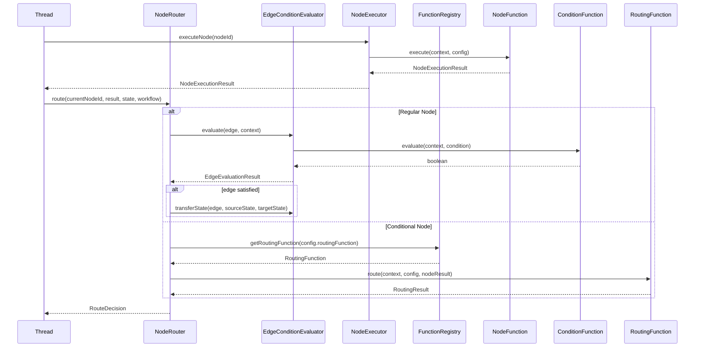

# 新的NodeRouter接口设计

## 1. 核心接口定义

### NodeRouter接口
```typescript
interface NodeRouter {
  // 节点执行后调用，决定下一个节点
  route(
    currentNodeId: NodeId,
    nodeResult: NodeExecutionResult,
    executionState: ExecutionState,
    workflow: Workflow
  ): Promise<RouteDecision>;
}

// 路由决策结果
interface RouteDecision {
  nextNodeIds: NodeId[];
  satisfiedEdges: EdgeData[];
  unsatisfiedEdges: EdgeData[];
  stateUpdates: Record<string, any>;
}

// 节点执行结果
interface NodeExecutionResult {
  status: NodeStatus;
  result?: any;
  error?: Error;
  executionTime: number;
  metadata?: Record<string, any>;
}
```

## 2. NodeRouter实现策略

### 节点类型路由策略
```typescript
export class NodeRouterImpl implements NodeRouter {
  private edgeConditionEvaluator: EdgeConditionEvaluator;
  private functionRegistry: FunctionRegistry;

  async route(
    currentNodeId: NodeId,
    nodeResult: NodeExecutionResult,
    executionState: ExecutionState,
    workflow: Workflow
  ): Promise<RouteDecision> {
    const currentNode = workflow.getNode(currentNodeId);
    
    switch (currentNode.type) {
      case 'sub_workflow':
        return await this.routeSubWorkflowNode(currentNode, nodeResult, executionState);
      
      case 'conditional':
        return await this.routeConditionalNode(currentNode, nodeResult, executionState);
      
      default:
        return await this.routeRegularNode(currentNode, nodeResult, executionState, workflow);
    }
  }
}
```

## 3. EdgeConditionEvaluator重构

### 新的职责定位
```typescript
interface EdgeConditionEvaluator {
  // 评估边是否允许状态通过
  evaluate(
    edge: EdgeData,
    context: StateTransferContext
  ): Promise<EdgeEvaluationResult>;
  
  // 执行状态传递（过滤和转换）
  transferState(
    edge: EdgeData,
    sourceState: ExecutionState,
    targetState: ExecutionState
  ): Promise<void>;
}

// 状态转换上下文
interface StateTransferContext {
  sourceNodeId: NodeId;
  targetNodeId: NodeId;
  sourceState: NodeExecutionState;
  variables: Map<string, any>;
  promptContext: PromptContext;
}
```

## 4. FunctionRegistry分层设计

### 分层函数接口
```typescript
interface FunctionRegistry {
  // 条件函数（服务于边条件评估）
  registerConditionFunction(name: string, func: ConditionFunction): void;
  getConditionFunction(name: string): ConditionFunction | undefined;
  
  // 路由函数（服务于节点路由决策）
  registerRoutingFunction(name: string, func: RoutingFunction): void;
  getRoutingFunction(name: string): RoutingFunction | undefined;
  
  // 节点函数（服务于节点执行）
  registerNodeFunction(name: string, func: NodeFunction): void;
  getNodeFunction(name: string): NodeFunction | undefined;
  
  // 触发器函数（服务于触发器）
  registerTriggerFunction(name: string, func: TriggerFunction): void;
  getTriggerFunction(name: string): TriggerFunction | undefined;
}
```

## 5. 各模块详细接口

### ConditionFunction接口
```typescript
interface ConditionFunction {
  evaluate(context: ExecutionContext, config: ConditionConfig): Promise<boolean>;
  getRequiredVariables(): string[];
  validateConfig(config: ConditionConfig): ValidationResult;
}
```

### RoutingFunction接口
```typescript
interface RoutingFunction {
  route(
    context: ExecutionContext,
    config: RoutingConfig,
    nodeResult: NodeExecutionResult
  ): Promise<RoutingResult>;
  validateConfig(config: RoutingConfig): ValidationResult;
}
```

### NodeFunction接口
```typescript
interface NodeFunction {
  execute(
    context: ExecutionContext,
    config: NodeConfig
  ): Promise<NodeExecutionResult>;
  canExecute(context: ExecutionContext, config: NodeConfig): Promise<boolean>;
  validateConfig(config: NodeConfig): ValidationResult;
}
```

### TriggerFunction接口
```typescript
interface TriggerFunction {
  check(
    context: ExecutionContext,
    config: TriggerConfig
  ): Promise<TriggerCheckResult>;
  execute(
    context: ExecutionContext,
    config: TriggerConfig
  ): Promise<TriggerExecutionResult>;
  validateConfig(config: TriggerConfig): ValidationResult;
}
```

## 6. 模块协作流程

### 新的执行流程


## 7. 配置系统更新

### 分层函数配置模式
```toml
# 条件函数配置
[condition]
type = "variable_match"
negate = false

[condition.params]
variablePath = "node1.result.success"
operator = "equals"
value = true

# 路由函数配置
[routing]
type = "conditional"
match_mode = "first"
default_target = "error_node"

[[routing.conditions]]
name = "success_case"
target_node_id = "success_node"

[routing.conditions.condition]
type = "node_status"
params.nodeId = "node1"
params.expectedStatus = "completed"

# 节点函数配置
[node]
type = "llm"

[node.params]
prompt = "请分析: {{input}}"
model = "gpt-4"
temperature = 0.7

[node.input_mapping]
input = "{{parent.input}}"

[node.output_mapping]
analysis = "{{result.content}}"
```

## 8. 实施优先级

### 高优先级（第一阶段）
- 设计新的NodeRouter接口
- 重构EdgeConditionEvaluator职责分离
- 重新设计FunctionRegistry

### 中优先级（第二阶段）
- 实现Conditions模块
- 实现Routing模块
- 更新domain层定义

### 低优先级（第三阶段）
- 实现Nodes模块
- 实现Triggers模块
- 集成测试

## 9. 预期收益

1. **架构清晰**：职责明确，降低耦合
2. **可扩展**：易于添加新的函数类型
3. **可测试**：每个函数可独立测试
4. **灵活配置**：支持复杂的业务逻辑
5. **性能优化**：函数可缓存和复用