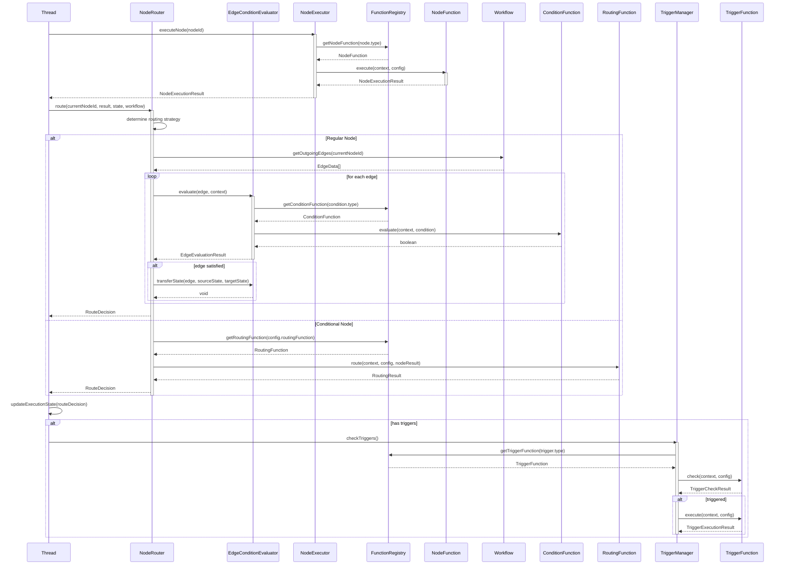

# Routing模块和Functions模块重新设计

## 1. 当前设计问题分析

### 1.1 职责混淆

**当前实现**：
- `NodeRouter`依赖`EdgeConditionEvaluator`决定下一个节点
- 边的条件评估包含了路由逻辑
- 状态传递和路由决策耦合在一起

**问题**：
- 边承担了过多的职责（条件评估 + 路由暗示）
- 节点没有主动的路由决策权
- 状态传递逻辑不清晰

### 1.2 正确职责划分

```
节点（Node）职责：
├─ 执行业务逻辑
├─ 产生执行结果
├─ 决定下一步方向（路由决策）
└─ 更新执行状态

边（Edge）职责：
├─ 定义状态传递规则
├─ 过滤和转换状态数据
├─ 条件评估（是否允许通过）
└─ 不决定路由，只控制数据流

路由（Routing）职责：
├─ 节点执行后的决策逻辑
├─ 基于结果选择下一个节点
└─ 调用边条件评估进行状态过滤
```

## 2. 重新设计的Routing架构

### 2.1 核心组件重构

```typescript
// 节点路由器（负责路由决策）
interface NodeRouter {
  // 节点执行后调用，决定下一个节点
  route(
    currentNodeId: NodeId,
    nodeResult: NodeExecutionResult,
    executionState: ExecutionState,
    workflow: Workflow
  ): Promise<RouteDecision>;
}

// 边条件评估器（负责状态过滤）
interface EdgeConditionEvaluator {
  // 评估边是否允许状态通过
  evaluate(
    edge: EdgeData,
    context: StateTransferContext
  ): Promise<EdgeEvaluationResult>;
  
  // 执行状态传递（过滤和转换）
  transferState(
    edge: EdgeData,
    sourceState: ExecutionState,
    targetState: ExecutionState
  ): Promise<void>;
}

// 状态转换上下文
interface StateTransferContext {
  sourceNodeId: NodeId;
  targetNodeId: NodeId;
  sourceState: NodeExecutionState;
  variables: Map<string, any>;
  promptContext: PromptContext;
}
```

### 2.2 路由决策流程

```mermaid
graph TB
    A[Node Execution Complete] --> B[NodeRouter.route()]
    B --> C{Node Type?}
    C -->|Regular Node| D[Evaluate Outgoing Edges]
    C -->|SubWorkflow Node| E[Execute SubWorkflow]
    C -->|Conditional Node| F[Evaluate Conditions]
    
    D --> G[EdgeConditionEvaluator.evaluate()]
    G --> H{Edge Satisfied?}
    H -->|Yes| I[Add to Next Nodes]
    H -->|No| J[Skip Edge]
    
    I --> K[EdgeConditionEvaluator.transferState()]
    K --> L[Update Target Context]
    
    E --> M[Create SubThread]
    M --> N[Map Input Variables]
    N --> O[Execute SubWorkflow]
    O --> P[Map Output Variables]
    
    F --> Q[Select Target Node]
    
    L --> R[Return RouteDecision]
    P --> R
    Q --> R
```

### 2.3 NodeRouter实现

```typescript
export class NodeRouterImpl implements NodeRouter {
  private edgeConditionEvaluator: EdgeConditionEvaluator;
  private functionRegistry: FunctionRegistry;

  constructor(
    edgeConditionEvaluator: EdgeConditionEvaluator,
    functionRegistry: FunctionRegistry
  ) {
    this.edgeConditionEvaluator = edgeConditionEvaluator;
    this.functionRegistry = functionRegistry;
  }

  async route(
    currentNodeId: NodeId,
    nodeResult: NodeExecutionResult,
    executionState: ExecutionState,
    workflow: Workflow
  ): Promise<RouteDecision> {
    // 1. 获取当前节点
    const currentNode = workflow.getNode(currentNodeId);
    
    // 2. 根据节点类型选择路由策略
    switch (currentNode.type) {
      case 'sub_workflow':
        return await this.routeSubWorkflowNode(currentNode, nodeResult, executionState);
      
      case 'conditional':
        return await this.routeConditionalNode(currentNode, nodeResult, executionState);
      
      default:
        return await this.routeRegularNode(currentNode, nodeResult, executionState, workflow);
    }
  }

  private async routeRegularNode(
    currentNode: NodeData,
    nodeResult: NodeExecutionResult,
    executionState: ExecutionState,
    workflow: Workflow
  ): Promise<RouteDecision> {
    // 1. 获取出边
    const outgoingEdges = workflow.getOutgoingEdges(currentNode.id);
    
    // 2. 评估每条边的条件
    const satisfiedEdges: EdgeData[] = [];
    
    for (const edge of outgoingEdges) {
      const context: StateTransferContext = {
        sourceNodeId: currentNode.id,
        targetNodeId: edge.toNodeId,
        sourceState: executionState.getNodeState(currentNode.id),
        variables: executionState.getVariables(),
        promptContext: executionState.getPromptContext()
      };
      
      const evaluation = await this.edgeConditionEvaluator.evaluate(edge, context);
      
      if (evaluation.satisfied) {
        satisfiedEdges.push(edge);
        
        // 3. 执行状态传递
        await this.edgeConditionEvaluator.transferState(
          edge,
          executionState,
          executionState
        );
      }
    }
    
    // 4. 确定下一个节点
    const nextNodeIds = satisfiedEdges.map(edge => edge.toNodeId);
    
    return {
      nextNodeIds,
      satisfiedEdges,
      unsatisfiedEdges: outgoingEdges.filter(edge => !satisfiedEdges.includes(edge)),
      stateUpdates: this.extractStateUpdates(executionState)
    };
  }

  private async routeSubWorkflowNode(
    currentNode: NodeData,
    nodeResult: NodeExecutionResult,
    executionState: ExecutionState
  ): Promise<RouteDecision> {
    // 子工作流节点路由逻辑
    // 通常只有一个默认出边
    const defaultEdge = currentNode.outgoingEdges[0];
    
    return {
      nextNodeIds: [defaultEdge.toNodeId],
      satisfiedEdges: [defaultEdge],
      unsatisfiedEdges: [],
      stateUpdates: {
        subWorkflowResult: nodeResult.result
      }
    };
  }

  private async routeConditionalNode(
    currentNode: NodeData,
    nodeResult: NodeExecutionResult,
    executionState: ExecutionState
  ): Promise<RouteDecision> {
    // 使用routing函数进行条件路由
    const routingFunction = this.functionRegistry.getRoutingFunction(
      currentNode.config.routingFunction
    );
    
    if (!routingFunction) {
      throw new Error(`Routing function not found: ${currentNode.config.routingFunction}`);
    }
    
    const targetNodeId = await routingFunction.execute({
      context: executionState,
      conditions: currentNode.config.conditions,
      nodeResult
    });
    
    return {
      nextNodeIds: Array.isArray(targetNodeId) ? targetNodeId : [targetNodeId],
      satisfiedEdges: [], // 条件节点通常没有显式边
      unsatisfiedEdges: [],
      stateUpdates: {}
    };
  }
}
```

## 3. Functions模块职责设计

### 3.1 分层职责模型

```
functions/builtin/conditions/   → 服务于边条件评估
├─ 职责：评估是否满足某个条件
├─ 输入：执行上下文、配置参数
├─ 输出：boolean（是否满足）
└─ 示例：has-errors, has-tool-calls, variable-exists

functions/builtin/routing/      → 服务于节点路由决策
├─ 职责：基于条件选择目标节点
├─ 输入：执行上下文、条件数组、节点结果
├─ 输出：NodeId或NodeId[]（目标节点）
└─ 示例：conditional-routing, switch-routing, pattern-routing

functions/builtin/nodes/        → 服务于节点执行
├─ 职责：执行具体的节点逻辑
├─ 输入：执行上下文、节点配置
├─ 输出：节点执行结果
└─ 示例：llm-node, tool-call-node, sub-workflow-node

functions/builtin/triggers/     → 服务于触发器
├─ 职责：监控状态并触发动作
├─ 输入：执行上下文、触发配置
├─ 输出：是否触发 + 触发动作
└─ 示例：state-trigger, time-trigger, event-trigger
```

### 3.2 Conditions模块详细设计

**职责定位**：
- 纯粹的条件评估，不涉及路由决策
- 服务于`EdgeConditionEvaluator`
- 可组合使用（与、或、非）

**接口设计**：
```typescript
interface ConditionFunction {
  // 评估条件是否满足
  evaluate(context: ExecutionContext, config: ConditionConfig): Promise<boolean>;
  
  // 获取需要的变量列表
  getRequiredVariables(): string[];
  
  // 验证配置
  validateConfig(config: ConditionConfig): ValidationResult;
}

interface ConditionConfig {
  type: string;           // 条件类型
  params: Record<string, any>;  // 参数
  negate?: boolean;       // 是否取反
}
```

**内置条件函数**：
```typescript
// conditions/has-errors.function.ts
export class HasErrorsConditionFunction implements ConditionFunction {
  async evaluate(context: ExecutionContext, config: ConditionConfig): Promise<boolean> {
    const nodeResults = context.getNodeResults();
    return nodeResults.some(result => result.status === 'failed');
  }
}

// conditions/variable-match.function.ts
export class VariableMatchConditionFunction implements ConditionFunction {
  async evaluate(context: ExecutionContext, config: ConditionConfig): Promise<boolean> {
    const { variablePath, operator, value } = config.params;
    const actualValue = context.getVariable(variablePath);
    
    return this.compareValues(actualValue, operator, value);
  }
}

// conditions/node-status.function.ts
export class NodeStatusConditionFunction implements ConditionFunction {
  async evaluate(context: ExecutionContext, config: ConditionConfig): Promise<boolean> {
    const { nodeId, expectedStatus } = config.params;
    const nodeState = context.getNodeState(nodeId);
    
    return nodeState?.status === expectedStatus;
  }
}
```

**使用示例**：
```toml
# 边配置
[[workflow.edges]]
from = "node1"
to = "node2"

[workflow.edges.condition]
type = "composite"  # 复合条件
operator = "and"    # 与操作

[[workflow.edges.condition.conditions]]
type = "node_status"
params.nodeId = "node1"
params.expectedStatus = "completed"

[[workflow.edges.condition.conditions]]
type = "variable_match"
params.variablePath = "node1.result.success"
params.operator = "equals"
params.value = true
```

### 3.3 Routing模块详细设计

**职责定位**：
- 节点执行后的路由决策
- 服务于`NodeRouter`
- 基于条件选择目标节点

**接口设计**：
```typescript
interface RoutingFunction {
  // 执行路由决策
  route(
    context: ExecutionContext,
    config: RoutingConfig,
    nodeResult: NodeExecutionResult
  ): Promise<RoutingResult>;
  
  // 验证配置
  validateConfig(config: RoutingConfig): ValidationResult;
}

interface RoutingConfig {
  type: string;           // 路由类型
  conditions: RoutingCondition[];  // 路由条件
  defaultTarget?: NodeId; // 默认目标
  matchMode: 'first' | 'all' | 'any';  // 匹配模式
}

interface RoutingCondition {
  name: string;
  condition: ConditionConfig;  // 复用条件函数
  targetNodeId: NodeId;
  priority?: number;
}

interface RoutingResult {
  targetNodeIds: NodeId[];      // 目标节点列表
  matchedConditions: string[];  // 匹配的条件名称
  routingMetadata: Record<string, any>;
}
```

**内置路由函数**：
```typescript
// routing/conditional-routing.function.ts
export class ConditionalRoutingFunction implements RoutingFunction {
  async route(
    context: ExecutionContext,
    config: RoutingConfig,
    nodeResult: NodeExecutionResult
  ): Promise<RoutingResult> {
    const matchedTargets: NodeId[] = [];
    const matchedConditions: string[] = [];
    
    for (const condition of config.conditions) {
      // 复用条件函数进行评估
      const conditionFunc = this.functionRegistry.getConditionFunction(condition.condition.type);
      if (!conditionFunc) {
        throw new Error(`Condition function not found: ${condition.condition.type}`);
      }
      
      const isMatch = await conditionFunc.evaluate(context, condition.condition);
      
      if (isMatch) {
        matchedTargets.push(condition.targetNodeId);
        matchedConditions.push(condition.name);
        
        // first模式：找到第一个匹配就返回
        if (config.matchMode === 'first') {
          break;
        }
      }
    }
    
    // 根据匹配模式处理结果
    switch (config.matchMode) {
      case 'first':
        return {
          targetNodeIds: matchedTargets.length > 0 ? [matchedTargets[0]] : [config.defaultTarget],
          matchedConditions,
          routingMetadata: { mode: 'first' }
        };
      
      case 'all':
        const allMatched = matchedTargets.length === config.conditions.length;
        return {
          targetNodeIds: allMatched ? matchedTargets : [config.defaultTarget],
          matchedConditions,
          routingMetadata: { mode: 'all', allMatched }
        };
      
      case 'any':
        return {
          targetNodeIds: matchedTargets.length > 0 ? matchedTargets : [config.defaultTarget],
          matchedConditions,
          routingMetadata: { mode: 'any' }
        };
    }
  }
}

// routing/switch-routing.function.ts
export class SwitchRoutingFunction implements RoutingFunction {
  async route(
    context: ExecutionContext,
    config: RoutingConfig,
    nodeResult: NodeExecutionResult
  ): Promise<RoutingResult> {
    const switchValue = context.getVariable(config.switchVariable);
    
    // 查找匹配的case
    const caseConfig = config.cases.find(case => case.value === switchValue);
    
    if (caseConfig) {
      return {
        targetNodeIds: [caseConfig.targetNodeId],
        matchedConditions: [caseConfig.value],
        routingMetadata: { type: 'switch', value: switchValue }
      };
    }
    
    // 使用默认目标
    return {
      targetNodeIds: [config.defaultTarget],
      matchedConditions: [],
      routingMetadata: { type: 'switch', value: switchValue, usedDefault: true }
    };
  }
}
```

**使用示例**：
```toml
# 节点配置
[[workflow.nodes]]
id = "decision_node"
type = "conditional"

[workflow.nodes.config.routing]
type = "conditional"
match_mode = "first"
default_target = "error_node"

[[workflow.nodes.config.routing.conditions]]
name = "success_case"
target_node_id = "success_node"

[workflow.nodes.config.routing.conditions.condition]
type = "node_status"
params.nodeId = "previous_node"
params.expectedStatus = "completed"

[[workflow.nodes.config.routing.conditions]]
name = "retry_case"
target_node_id = "retry_node"

[workflow.nodes.config.routing.conditions.condition]
type = "variable_match"
params.variablePath = "previous_node.retryCount"
params.operator = "less_than"
params.value = 3
```

### 3.4 Nodes模块详细设计

**职责定位**：
- 执行具体的节点业务逻辑
- 服务于`NodeExecutor`
- 产生节点执行结果

**接口设计**：
```typescript
interface NodeFunction {
  // 执行节点逻辑
  execute(
    context: ExecutionContext,
    config: NodeConfig
  ): Promise<NodeExecutionResult>;
  
  // 检查是否可以执行
  canExecute(context: ExecutionContext, config: NodeConfig): Promise<boolean>;
  
  // 验证配置
  validateConfig(config: NodeConfig): ValidationResult;
  
  // 获取输入模式（用于验证）
  getInputSchema(): InputSchema;
  
  // 获取输出模式（用于验证）
  getOutputSchema(): OutputSchema;
}

interface NodeConfig {
  type: string;           // 节点类型
  params: Record<string, any>;  // 参数
  inputMapping?: VariableMapping[];   // 输入映射
  outputMapping?: VariableMapping[];  // 输出映射
}

interface NodeExecutionResult {
  status: NodeStatus;     // 执行状态
  result?: any;           // 执行结果
  error?: Error;          // 错误信息
  executionTime: number;  // 执行时间
  metadata?: Record<string, any>;
}
```

**内置节点函数**：
```typescript
// nodes/llm-node.function.ts
export class LLMNodeFunction implements NodeFunction {
  async execute(
    context: ExecutionContext,
    config: NodeConfig
  ): Promise<NodeExecutionResult> {
    const startTime = Date.now();
    
    try {
      // 1. 准备输入
      const prompt = this.interpolateTemplate(config.params.prompt, context);
      const model = config.params.model || 'gpt-4';
      
      // 2. 调用LLM服务
      const llmResult = await this.llmService.generate(prompt, {
        model,
        temperature: config.params.temperature,
        maxTokens: config.params.maxTokens
      });
      
      // 3. 映射输出到上下文
      const outputVariables = this.mapOutput(llmResult, config.outputMapping);
      for (const [key, value] of Object.entries(outputVariables)) {
        context.setVariable(key, value);
      }
      
      return {
        status: NodeStatus.completed(),
        result: llmResult,
        executionTime: Date.now() - startTime,
        metadata: { model, tokensUsed: llmResult.tokens }
      };
    } catch (error) {
      return {
        status: NodeStatus.failed(),
        error,
        executionTime: Date.now() - startTime
      };
    }
  }
}

// nodes/sub-workflow-node.function.ts
export class SubWorkflowNodeFunction implements NodeFunction {
  async execute(
    context: ExecutionContext,
    config: NodeConfig
  ): Promise<NodeExecutionResult> {
    const startTime = Date.now();
    
    // 1. 获取子工作流引用
    const subWorkflowRef = config.params.subWorkflowRef;
    const subWorkflow = await this.workflowRepository.getById(subWorkflowRef.workflowId);
    
    // 2. 创建子线程
    const subThread = this.threadFactory.createSubThread(
      context.getThreadId(),
      subWorkflow.id
    );
    
    // 3. 映射输入变量
    const inputVariables = this.mapInput(context, subWorkflowRef.inputMapping);
    subThread.setVariables(inputVariables);
    
    // 4. 执行子工作流
    const subResult = await subThread.execute();
    
    // 5. 映射输出变量
    const outputVariables = this.mapOutput(subResult, subWorkflowRef.outputMapping);
    for (const [key, value] of Object.entries(outputVariables)) {
      context.setVariable(key, value);
    }
    
    return {
      status: subResult.status,
      result: subResult.output,
      executionTime: Date.now() - startTime,
      metadata: { subWorkflowId: subWorkflow.id, subThreadId: subThread.id }
    };
  }
}
```

### 3.5 Triggers模块详细设计

**职责定位**：
- 监控执行状态并触发动作
- 服务于`TriggerManager`
- 支持事件驱动的工作流

**接口设计**：
```typescript
interface TriggerFunction {
  // 检查是否触发
  check(
    context: ExecutionContext,
    config: TriggerConfig
  ): Promise<TriggerCheckResult>;
  
  // 执行触发动作
  execute(
    context: ExecutionContext,
    config: TriggerConfig
  ): Promise<TriggerExecutionResult>;
  
  // 验证配置
  validateConfig(config: TriggerConfig): ValidationResult;
}

interface TriggerConfig {
  type: string;           // 触发器类型
  params: Record<string, any>;  // 参数
  action: TriggerAction;  // 触发动作
  conditions?: ConditionConfig[];  // 触发条件
}

interface TriggerAction {
  type: string;           // 动作类型
  target?: NodeId;        // 目标节点
  params: Record<string, any>;  // 动作参数
}

interface TriggerCheckResult {
  triggered: boolean;     // 是否触发
  triggerData?: any;      // 触发数据
  reason?: string;        // 触发原因
}

interface TriggerExecutionResult {
  success: boolean;       // 是否成功
  result?: any;           // 执行结果
  error?: Error;          // 错误信息
}
```

**内置触发器函数**：
```typescript
// triggers/state-trigger.function.ts
export class StateTriggerFunction implements TriggerFunction {
  async check(
    context: ExecutionContext,
    config: TriggerConfig
  ): Promise<TriggerCheckResult> {
    const { stateVariable, operator, expectedValue } = config.params;
    const actualValue = context.getVariable(stateVariable);
    
    const triggered = this.evaluateCondition(actualValue, operator, expectedValue);
    
    return {
      triggered,
      triggerData: { variable: stateVariable, value: actualValue },
      reason: triggered ? `State condition met: ${stateVariable}` : undefined
    };
  }
  
  async execute(
    context: ExecutionContext,
    config: TriggerConfig
  ): Promise<TriggerExecutionResult> {
    const action = config.action;
    
    switch (action.type) {
      case 'skip_node':
        // 跳过目标节点
        context.skipNode(action.target);
        return { success: true, result: { action: 'skip', nodeId: action.target } };
      
      case 'pause_execution':
        // 暂停执行
        context.pauseExecution();
        return { success: true, result: { action: 'pause' } };
      
      case 'trigger_node':
        // 触发节点执行
        await context.triggerNode(action.target, action.params);
        return { success: true, result: { action: 'trigger', nodeId: action.target } };
      
      default:
        throw new Error(`Unknown trigger action: ${action.type}`);
    }
  }
}

// triggers/time-trigger.function.ts
export class TimeTriggerFunction implements TriggerFunction {
  private timers: Map<string, NodeJS.Timeout> = new Map();
  
  async check(
    context: ExecutionContext,
    config: TriggerConfig
  ): Promise<TriggerCheckResult> {
    // 时间触发器通常由外部调度器调用
    // 这里返回false，实际触发由定时器完成
    return { triggered: false };
  }
  
  // 设置定时器
  scheduleTrigger(
    context: ExecutionContext,
    config: TriggerConfig,
    callback: () => Promise<void>
  ): void {
    const { delay, interval } = config.params;
    
    if (interval) {
      // 周期性触发
      const timer = setInterval(callback, interval);
      this.timers.set(context.getExecutionId(), timer);
    } else if (delay) {
      // 一次性触发
      const timer = setTimeout(callback, delay);
      this.timers.set(context.getExecutionId(), timer);
    }
  }
  
  // 清理定时器
  clearTrigger(executionId: string): void {
    const timer = this.timers.get(executionId);
    if (timer) {
      clearTimeout(timer);
      this.timers.delete(executionId);
    }
  }
}
```

**使用示例**：
```toml
# 工作流触发器配置
[[workflow.triggers]]
type = "state"
name = "timeout_check"

[workflow.triggers.params]
stateVariable = "execution_time"
operator = "greater_than"
expectedValue = 300000  # 5分钟

[workflow.triggers.action]
type = "pause_execution"
params.reason = "Execution timeout"

# 节点触发器配置
[[workflow.nodes.triggers]]
type = "time"
name = "retry_timer"

[workflow.nodes.triggers.params]
delay = 5000  # 5秒后触发

[workflow.nodes.triggers.action]
type = "trigger_node"
target = "retry_handler"
params.retryCount = "{{node.retryCount}}"
```

## 4. 模块协作流程

### 4.1 完整执行流程



### 4.2 函数注册和发现

```typescript
export class FunctionRegistry {
  private conditionFunctions: Map<string, ConditionFunction> = new Map();
  private routingFunctions: Map<string, RoutingFunction> = new Map();
  private nodeFunctions: Map<string, NodeFunction> = new Map();
  private triggerFunctions: Map<string, TriggerFunction> = new Map();
  
  // 注册函数
  registerConditionFunction(name: string, func: ConditionFunction): void {
    this.conditionFunctions.set(name, func);
  }
  
  registerRoutingFunction(name: string, func: RoutingFunction): void {
    this.routingFunctions.set(name, func);
  }
  
  registerNodeFunction(name: string, func: NodeFunction): void {
    this.nodeFunctions.set(name, func);
  }
  
  registerTriggerFunction(name: string, func: TriggerFunction): void {
    this.triggerFunctions.set(name, func);
  }
  
  // 获取函数
  getConditionFunction(name: string): ConditionFunction | undefined {
    return this.conditionFunctions.get(name);
  }
  
  getRoutingFunction(name: string): RoutingFunction | undefined {
    return this.routingFunctions.get(name);
  }
  
  getNodeFunction(name: string): NodeFunction | undefined {
    return this.nodeFunctions.get(name);
  }
  
  getTriggerFunction(name: string): TriggerFunction | undefined {
    return this.triggerFunctions.get(name);
  }
  
  // 批量注册内置函数
  registerBuiltinFunctions(): void {
    // 注册条件函数
    this.registerConditionFunction('has_errors', new HasErrorsConditionFunction());
    this.registerConditionFunction('has_tool_calls', new HasToolCallsConditionFunction());
    this.registerConditionFunction('variable_match', new VariableMatchConditionFunction());
    
    // 注册路由函数
    this.registerRoutingFunction('conditional', new ConditionalRoutingFunction());
    this.registerRoutingFunction('switch', new SwitchRoutingFunction());
    
    // 注册节点函数
    this.registerNodeFunction('llm', new LLMNodeFunction());
    this.registerNodeFunction('tool_call', new ToolCallNodeFunction());
    this.registerNodeFunction('sub_workflow', new SubWorkflowNodeFunction());
    
    // 注册触发器函数
    this.registerTriggerFunction('state', new StateTriggerFunction());
    this.registerTriggerFunction('time', new TimeTriggerFunction());
    this.registerTriggerFunction('event', new EventTriggerFunction());
  }
}
```

## 5. 配置设计

### 5.1 统一函数配置模式

```toml
# 条件函数配置
[condition]
type = "variable_match"  # 函数名称
negate = false           # 是否取反

[condition.params]
variablePath = "node1.result.success"
operator = "equals"
value = true

# 路由函数配置
[routing]
type = "conditional"     # 函数名称
match_mode = "first"
default_target = "error_node"

[[routing.conditions]]
name = "success_case"
target_node_id = "success_node"

[routing.conditions.condition]
type = "node_status"
params.nodeId = "node1"
params.expectedStatus = "completed"

# 节点函数配置
[node]
type = "llm"             # 函数名称

[node.params]
prompt = "请分析: {{input}}"
model = "gpt-4"
temperature = 0.7

[node.input_mapping]
input = "{{parent.input}}"

[node.output_mapping]
analysis = "{{result.content}}"

# 触发器函数配置
[trigger]
type = "state"           # 函数名称

[trigger.params]
stateVariable = "retry_count"
operator = "greater_than"
expectedValue = 3

[trigger.action]
type = "skip_node"
target = "retry_node"
```

### 5.2 函数组合使用示例

```toml
# 复杂条件组合
[edge.condition]
type = "composite"
operator = "and"

[[edge.condition.conditions]]
type = "node_status"
params.nodeId = "node1"
params.expectedStatus = "completed"

[[edge.condition.conditions]]
type = "variable_match"
params.variablePath = "node1.result.success"
params.operator = "equals"
params.value = true

[[edge.condition.conditions]]
type = "has_errors"
negate = true  # 取反：没有错误

# 复杂路由决策
[node.config.routing]
type = "conditional"
match_mode = "first"

[[node.config.routing.conditions]]
name = "high_confidence"
target_node_id = "auto_process"

[node.config.routing.conditions.condition]
type = "variable_match"
params.variablePath = "node1.result.confidence"
params.operator = "greater_than"
params.value = 0.9

[[node.config.routing.conditions]]
name = "medium_confidence"
target_node_id = "human_review"

[node.config.routing.conditions.condition]
type = "variable_match"
params.variablePath = "node1.result.confidence"
params.operator = "greater_than"
params.value = 0.7

# 默认情况
[node.config.routing.default]
target_node_id = "reject_process"
```

## 6. 总结

### 6.1 核心设计原则

1. **职责分离**：
   - 节点负责路由决策
   - 边负责状态传递和过滤
   - 函数模块服务于具体职责

2. **函数模块化**：
   - conditions：纯粹的条件评估
   - routing：基于条件的路由决策
   - nodes：具体的业务逻辑执行
   - triggers：状态监控和动作触发

3. **可组合性**：
   - 条件函数可组合使用（与、或、非）
   - 路由函数可复用条件函数
   - 触发器可组合多个条件

4. **配置驱动**：
   - 统一的函数配置模式
   - 支持复杂的条件组合
   - 灵活的参数映射

### 6.2 模块协作关系

```
NodeRouter (节点路由决策)
    ↓ (调用)
EdgeConditionEvaluator (边条件评估)
    ↓ (调用)
ConditionFunction (条件函数)
    ↑ (注册)
FunctionRegistry (函数注册表)
    ↑ (注册)
[RoutingFunction, NodeFunction, TriggerFunction]
```

### 6.3 实施建议

**第一阶段（已完成）**：
- ✅ NodeRouter基础实现
- ✅ EdgeConditionEvaluator基础实现

**第二阶段（当前）**：
- 重构NodeRouter，明确路由决策逻辑
- 强化EdgeConditionEvaluator的状态传递职责
- 完善FunctionRegistry的函数分类管理

**第三阶段**：
- 实现所有内置条件函数
- 实现所有内置路由函数
- 实现完整的节点函数
- 实现触发器函数

**第四阶段**：
- 集成测试所有函数类型
- 性能优化和缓存机制
- 文档和示例完善

### 6.4 优势

1. **架构清晰**：职责明确，降低耦合
2. **可扩展**：易于添加新的函数类型
3. **可测试**：每个函数可独立测试
4. **灵活配置**：支持复杂的业务逻辑
5. **性能优化**：函数可缓存和复用