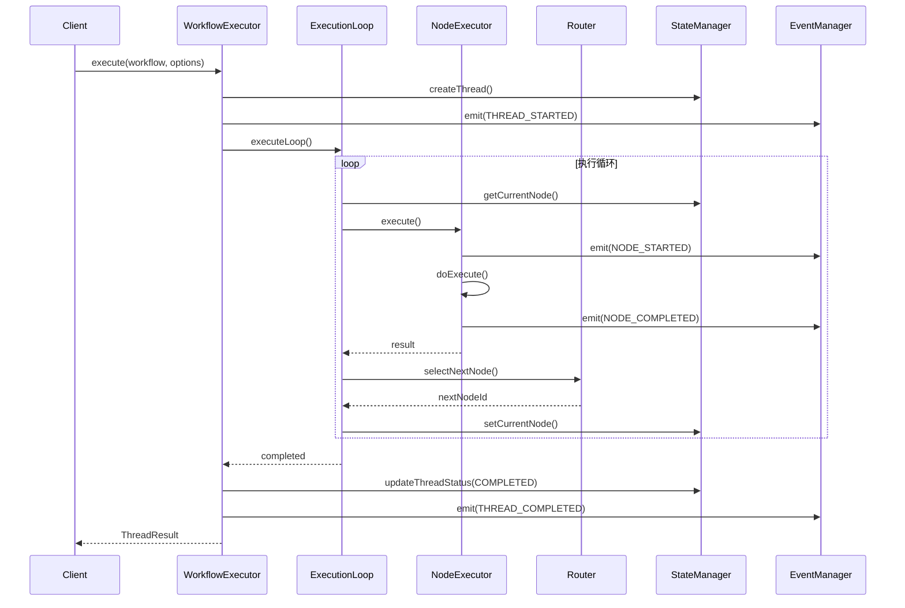
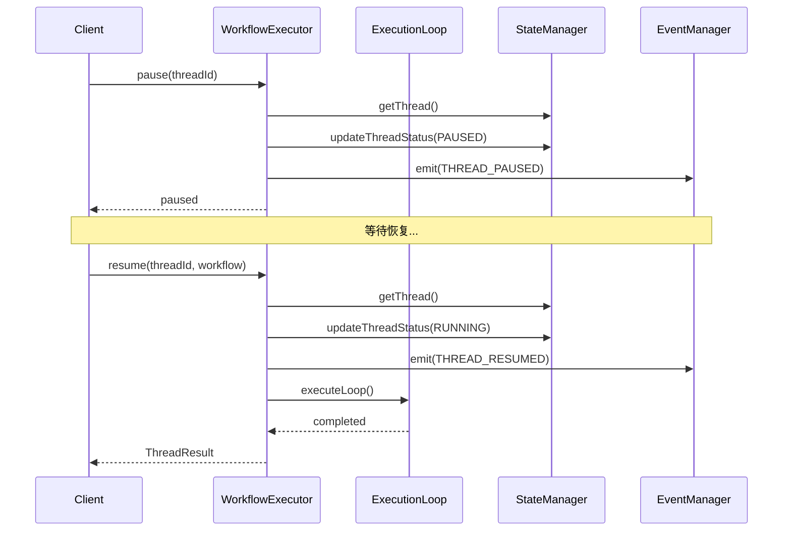
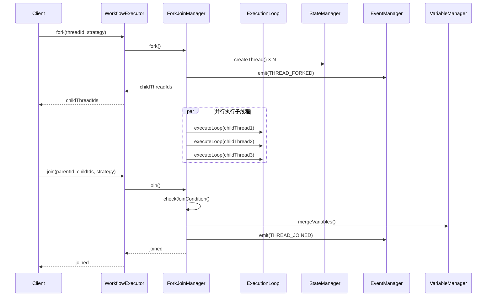
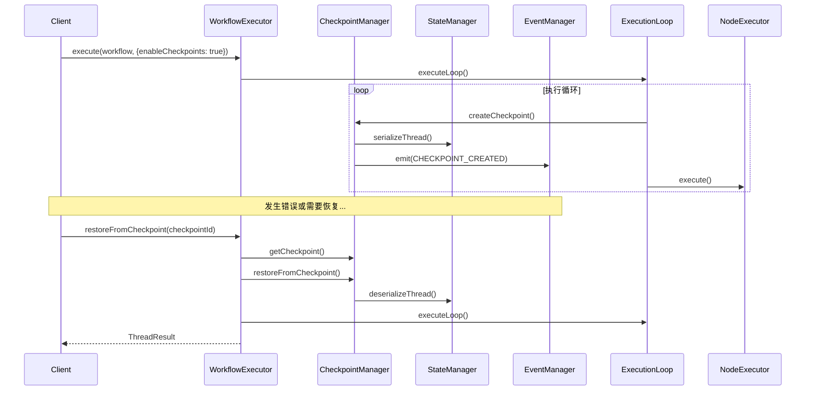

# 主执行引擎设计文档

## 1. 概述

主执行引擎是SDK的核心组件，负责工作流的执行、状态管理、事件分发和协调控制。本文档详细描述执行引擎的架构设计、模块划分和实现方案。

## 2. 设计目标

### 2.1 核心目标
- **职责清晰**：每个模块职责单一，边界明确
- **可扩展性**：支持新节点类型、新执行策略的扩展
- **可观测性**：完整的事件系统和日志记录
- **可靠性**：支持检查点、暂停/恢复、错误处理
- **高性能**：支持并行执行、资源优化

### 2.2 非功能目标
- **类型安全**：充分利用TypeScript类型系统
- **可测试性**：模块独立，易于单元测试
- **可维护性**：代码结构清晰，文档完善

## 3. 架构设计

### 3.1 整体架构

```
┌─────────────────────────────────────────────────────────────┐
│                     WorkflowExecutor                         │
│                   (主执行引擎 - 协调层)                        │
└─────────────────────────────────────────────────────────────┘
                              │
        ┌─────────────────────┼─────────────────────┐
        │                     │                     │
        ▼                     ▼                     ▼
┌───────────────┐    ┌───────────────┐    ┌───────────────┐
│ ExecutionLoop │    │ EventManager  │    │ CheckpointMgr │
│   (执行循环)   │    │  (事件管理)    │    │  (检查点)     │
└───────────────┘    └───────────────┘    └───────────────┘
        │                     │                     │
        └─────────────────────┼─────────────────────┘
                              │
        ┌─────────────────────┼─────────────────────┐
        │                     │                     │
        ▼                     ▼                     ▼
┌───────────────┐    ┌───────────────┐    ┌───────────────┐
│ NodeExecutor  │    │ Router        │    │ ForkJoinMgr   │
│  (节点执行)    │    │  (路由控制)    │    │ (并行控制)    │
└───────────────┘    └───────────────┘    └───────────────┘
        │
        ▼
┌───────────────┐
│ StateManager  │
│  (状态管理)    │
└───────────────┘
```

### 3.2 模块划分

#### 3.2.1 WorkflowExecutor（主执行引擎）
**职责**：
- 工作流执行的生命周期管理
- 执行协调和调度
- 错误处理和恢复
- 暂停/恢复/取消控制

**核心方法**：
```typescript
class WorkflowExecutor {
  // 执行工作流
  execute(workflow: WorkflowDefinition, options: ThreadOptions): Promise<ThreadResult>
  
  // 暂停执行
  pause(threadId: string): Promise<void>
  
  // 恢复执行
  resume(threadId: string, workflow: WorkflowDefinition): Promise<ThreadResult>
  
  // 取消执行
  cancel(threadId: string): Promise<void>
  
  // Fork操作
  fork(threadId: string, forkStrategy: 'serial' | 'parallel'): Promise<ID[]>
  
  // Join操作
  join(parentThreadId: string, childThreadIds: ID[], strategy: JoinStrategy): Promise<void>
}
```

#### 3.2.2 ExecutionLoop（执行循环）
**职责**：
- 执行循环控制
- 步数限制和超时控制
- 节点执行调度
- 路由决策

**核心方法**：
```typescript
class ExecutionLoop {
  // 执行循环
  async executeLoop(context: ExecutionContext, workflowContext: WorkflowContext): Promise<void>
  
  // 执行单个节点
  async executeNode(context: ExecutionContext): Promise<NodeExecutionResult>
  
  // 路由到下一个节点
  routeToNextNode(context: ExecutionContext): string | null
  
  // 检查执行条件
  checkExecutionConditions(context: ExecutionContext): boolean
}
```

#### 3.2.3 NodeExecutor（节点执行器）
**职责**：
- 节点执行的标准接口
- 节点验证和前置检查
- 执行结果封装

**核心方法**：
```typescript
abstract class NodeExecutor {
  // 执行节点
  async execute(context: ExecutionContext): Promise<NodeExecutionResult>
  
  // 验证节点配置
  protected validate(node: Node): boolean
  
  // 检查是否可以执行
  protected canExecute(node: Node, context: ExecutionContext): boolean
  
  // 具体执行逻辑（抽象方法）
  protected abstract doExecute(context: ExecutionContext): Promise<any>
}
```

#### 3.2.4 Router（路由器）
**职责**：
- 边条件评估
- 下一个节点选择
- 路由策略实现

**核心方法**：
```typescript
class Router {
  // 选择下一个节点
  selectNextNode(currentNode: Node, edges: Edge[], context: ExecutionContext): string | null
  
  // 评估边的条件
  evaluateEdgeCondition(edge: Edge, context: ExecutionContext): boolean
  
  // 评估条件表达式
  private evaluateCondition(condition: EdgeCondition, context: ExecutionContext): boolean
}
```

#### 3.2.5 StateManager（状态管理器）
**职责**：
- Thread状态管理
- 当前节点跟踪
- 状态持久化

**核心方法**：
```typescript
class ThreadStateManager {
  // 创建Thread
  createThread(workflowId: string, workflowVersion: string, options: ThreadOptions): Thread
  
  // 更新Thread状态
  updateThreadStatus(threadId: string, status: ThreadStatus): void
  
  // 获取/设置当前节点
  getCurrentNode(threadId: string): string | null
  setCurrentNode(threadId: string, nodeId: string): void
  
  // 序列化/反序列化
  serializeThread(threadId: string): string
  deserializeThread(data: string): Thread
}
```

#### 3.2.6 WorkflowContext（工作流上下文）
**职责**：
- 工作流定义缓存
- 节点和边的快速查找
- 工作流配置访问

**核心方法**：
```typescript
class WorkflowContext {
  // 获取节点/边
  getNode(nodeId: string): Node | undefined
  getEdge(edgeId: string): Edge | undefined
  
  // 获取节点的出边/入边
  getOutgoingEdges(nodeId: string): Edge[]
  getIncomingEdges(nodeId: string): Edge[]
  
  // 获取START/END节点
  getStartNode(): Node | undefined
  getEndNode(): Node | undefined
}
```

#### 3.2.7 VariableManager（变量管理器）
**职责**：
- Thread变量管理
- 变量作用域控制
- 表达式评估

**核心方法**：
```typescript
class VariableManager {
  // 设置/获取变量
  setVariable(threadId: string, name: string, value: any, ...): void
  getVariable(threadId: string, name: string): any
  
  // 表达式评估
  evaluateExpression(threadId: string, expression: string): any
  
  // Fork/Join操作
  copyVariables(sourceThreadId: string, targetThreadId: string): void
  mergeVariables(sourceThreadIds: string[], targetThreadId: string): void
}
```

#### 3.2.8 HistoryManager（历史记录管理器）
**职责**：
- 执行历史记录
- 节点执行历史
- 工具调用历史
- 错误历史

**核心方法**：
```typescript
class HistoryManager {
  // 记录节点执行
  recordNodeExecution(threadId: string, nodeId: string, nodeType: string, result: NodeExecutionResult): void
  
  // 记录工具调用
  recordToolCall(threadId: string, toolName: string, parameters: any, result?: any): void
  
  // 记录错误
  recordError(threadId: string, error: any): void
  
  // 获取历史
  getExecutionHistory(threadId: string): ExecutionHistoryEntry[]
  getNodeHistory(threadId: string, nodeId: string): NodeExecutionResult[]
  getToolHistory(threadId: string): ToolCall[]
  getErrorHistory(threadId: string): any[]
}
```

#### 3.2.9 EventManager（事件管理器）
**职责**：
- 事件监听器管理
- 事件分发
- 事件过滤和路由

**核心方法**：
```typescript
class EventManager {
  // 注册监听器
  on<T extends BaseEvent>(eventType: EventType, listener: EventListener<T>): void
  
  // 注销监听器
  off<T extends BaseEvent>(eventType: EventType, listener: EventListener<T>): void
  
  // 触发事件
  emit<T extends BaseEvent>(event: T): Promise<void>
  
  // 一次性监听
  once<T extends BaseEvent>(eventType: EventType, listener: EventListener<T>): void
  
  // 清空监听器
  clear(eventType?: EventType): void
}
```

#### 3.2.10 CheckpointManager（检查点管理器）
**职责**：
- 检查点创建和管理
- 状态快照
- 从检查点恢复

**核心方法**：
```typescript
class CheckpointManager {
  // 创建检查点
  createCheckpoint(threadId: string, description?: string): Promise<Checkpoint>
  
  // 获取检查点
  getCheckpoint(checkpointId: string): Checkpoint | null
  
  // 从检查点恢复
  restoreFromCheckpoint(checkpointId: string): Promise<Thread>
  
  // 删除检查点
  deleteCheckpoint(checkpointId: string): void
  
  // 获取线程的所有检查点
  getThreadCheckpoints(threadId: string): Checkpoint[]
}
```

#### 3.2.11 ForkJoinManager（Fork/Join管理器）
**职责**：
- Fork操作管理
- Join操作管理
- 并行执行协调
- 子线程状态跟踪

**核心方法**：
```typescript
class ForkJoinManager {
  // Fork操作
  fork(threadId: string, forkStrategy: 'serial' | 'parallel', forkId: string): Promise<ID[]>
  
  // Join操作
  join(parentThreadId: string, childThreadIds: ID[], strategy: JoinStrategy): Promise<void>
  
  // 跟踪子线程状态
  trackChildThreads(parentThreadId: string, childThreadIds: ID[]): void
  
  // 检查Join条件
  checkJoinCondition(childThreadIds: ID[], strategy: JoinStrategy): boolean
}
```

## 4. 执行流程

### 4.1 正常执行流程



### 4.2 暂停/恢复流程



### 4.3 Fork/Join流程



### 4.4 检查点流程



## 5. 关键设计决策

### 5.1 职责分离
- **WorkflowExecutor**：只负责协调和调度，不处理具体执行逻辑
- **ExecutionLoop**：封装执行循环逻辑，可独立测试
- **NodeExecutor**：节点执行的标准接口，支持多种节点类型
- **Router**：路由逻辑独立，支持多种路由策略

### 5.2 事件驱动
- 所有关键操作都触发事件
- 支持同步和异步事件监听
- 事件与业务逻辑解耦

### 5.3 状态管理
- Thread状态集中管理
- 支持序列化和反序列化
- 为检查点和恢复提供基础

### 5.4 可扩展性
- 节点执行器通过注册机制扩展
- 路由策略可配置
- 事件监听器动态注册

### 5.5 错误处理
- 统一的错误类型
- 错误事件触发
- 支持错误恢复

## 6. 数据流

### 6.1 输入数据流
```
Client Input → Thread.input → NodeExecutor → NodeExecutionResult.output → Thread.output
```

### 6.2 变量数据流
```
NodeExecutor → VariableManager.setVariable() → Thread.variables → VariableManager.getVariable() → NodeExecutor
```

### 6.3 事件数据流
```
WorkflowExecutor → EventManager.emit() → EventListener → Client Handler
```

### 6.4 状态数据流
```
WorkflowExecutor → StateManager.updateThreadStatus() → Thread.status → StateManager.getThread() → WorkflowExecutor
```

## 7. 性能优化

### 7.1 并行执行
- Fork节点支持并行执行子线程
- 使用Promise.all()并行等待
- 资源池限制并发数

### 7.2 缓存优化
- WorkflowContext缓存节点和边映射
- 节点执行结果缓存
- 变量值缓存

### 7.3 资源管理
- 限制最大执行步数
- 超时控制
- 内存使用监控

## 8. 安全性

### 8.1 输入验证
- 工作流定义验证
- 节点配置验证
- 边条件验证

### 8.2 权限控制
- 工具调用权限检查
- 变量访问权限
- 节点执行权限

### 8.3 沙箱执行
- 表达式评估沙箱
- 工具执行隔离
- 资源限制

## 9. 测试策略

### 9.1 单元测试
- 每个模块独立测试
- Mock依赖模块
- 覆盖率要求 > 80%

### 9.2 集成测试
- 模块间协作测试
- 端到端流程测试
- 错误场景测试

### 9.3 性能测试
- 执行时间测试
- 内存使用测试
- 并发性能测试

## 10. 未来扩展

### 10.1 分布式执行
- 支持跨机器执行
- 分布式状态管理
- 分布式事件系统

### 10.2 实时监控
- 执行指标收集
- 性能监控
- 告警机制

### 10.3 可视化
- 执行流程可视化
- 状态可视化
- 性能可视化

## 11. 总结

主执行引擎采用分层架构设计，职责清晰，模块独立。通过事件驱动、状态管理、检查点机制等设计，实现了高可靠性、可扩展性和可观测性。未来可进一步扩展分布式执行和实时监控能力。