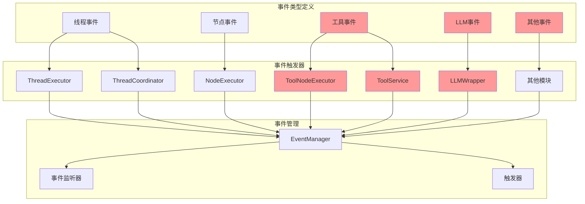

# SDK事件实现分析与补充计划

## 一、事件类型定义概览

SDK模块在 [`sdk/types/events.ts`](sdk/types/events.ts) 中定义了17种事件类型：

### 1. 线程相关事件（8种）
- `THREAD_STARTED` - 线程开始
- `THREAD_COMPLETED` - 线程完成
- `THREAD_FAILED` - 线程失败
- `THREAD_PAUSED` - 线程暂停
- `THREAD_RESUMED` - 线程恢复
- `THREAD_FORKED` - 线程分叉
- `THREAD_JOINED` - 线程合并
- `THREAD_COPIED` - 线程复制

### 2. 节点相关事件（3种）
- `NODE_STARTED` - 节点开始
- `NODE_COMPLETED` - 节点完成
- `NODE_FAILED` - 节点失败

### 3. 工具相关事件（3种）
- `TOOL_CALLED` - 工具调用
- `TOOL_COMPLETED` - 工具完成
- `TOOL_FAILED` - 工具失败

### 4. 其他事件（3种）
- `TOKEN_LIMIT_EXCEEDED` - Token超过限制
- `ERROR` - 错误事件
- `CHECKPOINT_CREATED` - 检查点创建

## 二、事件实际使用情况分析

### 2.1 已实现的事件（11种）

#### 线程事件（8种）✓ 全部实现
- **实现位置**: [`sdk/core/execution/thread-executor.ts`](sdk/core/execution/thread-executor.ts)
- **实现位置**: [`sdk/core/execution/thread-coordinator.ts`](sdk/core/execution/thread-coordinator.ts)
- **状态**: 所有线程相关事件均已正确触发

#### 节点事件（3种）✓ 全部实现
- **实现位置**: [`sdk/core/execution/thread-executor.ts`](sdk/core/execution/thread-executor.ts:365-418)
- **触发时机**:
  - `NODE_STARTED`: 在 [`executeNode()`](sdk/core/execution/thread-executor.ts:365) 方法开始时触发
  - `NODE_COMPLETED`: 在节点执行成功后触发
  - `NODE_FAILED`: 在节点执行失败时触发
- **状态**: 所有节点相关事件均已正确触发

### 2.2 未实现的事件（6种）

#### 工具事件（3种）✗ 未实现
- **定义位置**: [`sdk/types/events.ts`](sdk/types/events.ts:182-218)
- **应该触发位置**: [`sdk/core/execution/executors/node/tool-node-executor.ts`](sdk/core/execution/executors/node/tool-node-executor.ts)
- **当前状态**: 
  - [`ToolNodeExecutor.doExecute()`](sdk/core/execution/executors/node/tool-node-executor.ts:84) 方法中执行工具调用
  - 第99行调用 `executeTool()` 方法
  - **未触发任何工具相关事件**
- **影响**: 无法追踪工具调用的生命周期

#### Token限制事件（1种）✗ 未实现
- **定义位置**: [`sdk/types/events.ts`](sdk/types/events.ts:223-229)
- **应该触发位置**: LLM调用相关代码
- **当前状态**: 未找到任何触发此事件的代码
- **影响**: 无法监控Token使用情况

#### 错误事件（1种）✗ 未实现
- **定义位置**: [`sdk/types/events.ts`](sdk/types/events.ts:234-242)
- **应该触发位置**: 全局错误处理
- **当前状态**: 未找到触发此事件的代码
- **影响**: 无法统一捕获和处理错误

#### 检查点事件（1种）✗ 未实现
- **定义位置**: [`sdk/types/events.ts`](sdk/types/events.ts:247-253)
- **应该触发位置**: 检查点管理模块
- **当前状态**: 
  - SDK中没有找到检查点管理模块的实现
  - 事件类型已定义但无处触发
- **影响**: 无法追踪检查点创建

## 三、事件使用差距分析

### 3.1 工具事件缺失

**问题描述**:
- 工具是SDK的核心功能之一，但工具调用过程完全没有事件追踪
- [`ToolNodeExecutor`](sdk/core/execution/executors/node/tool-node-executor.ts:31) 在执行工具时没有触发任何事件
- [`ToolService`](sdk/core/tools/tool-service.ts:20) 在执行工具时也没有触发事件

**影响**:
- 无法监控工具调用的开始、完成和失败
- 无法追踪工具执行时间
- 无法实现工具调用的审计日志
- 无法基于工具事件实现触发器功能

**需要补充的位置**:
1. [`ToolNodeExecutor.executeTool()`](sdk/core/execution/executors/node/tool-node-executor.ts:201) - 工具调用前触发 `TOOL_CALLED`
2. [`ToolNodeExecutor.executeTool()`](sdk/core/execution/executors/node/tool-node-executor.ts:201) - 工具成功后触发 `TOOL_COMPLETED`
3. [`ToolNodeExecutor.executeTool()`](sdk/core/execution/executors/node/tool-node-executor.ts:201) - 工具失败时触发 `TOOL_FAILED`
4. [`ToolService.execute()`](sdk/core/tools/tool-service.ts:134) - 工具服务层也应该触发事件

### 3.2 LLM事件缺失

**问题描述**:
- LLM调用是SDK的核心功能，但没有专门的事件类型
- 只有 `MessageStream` 有自己的事件系统（[`sdk/core/llm/message-stream-events.ts`](sdk/core/llm/message-stream-events.ts)）
- LLM调用过程无法通过主事件系统追踪

**影响**:
- 无法监控LLM调用的生命周期
- 无法追踪LLM Token使用情况
- 无法实现LLM调用的审计日志
- 无法基于LLM事件实现触发器功能

**建议补充的事件类型**:
1. `LLM_CALL_STARTED` - LLM调用开始
2. `LLM_CALL_COMPLETED` - LLM调用完成
3. `LLM_CALL_FAILED` - LLM调用失败
4. `LLM_STREAM_STARTED` - LLM流式调用开始
5. `LLM_STREAM_CHUNK` - LLM流式数据块
6. `LLM_STREAM_COMPLETED` - LLM流式调用完成

### 3.3 Token限制事件未使用

**问题描述**:
- `TOKEN_LIMIT_EXCEEDED` 事件已定义但从未触发
- LLM调用时没有检查Token限制

**影响**:
- 无法监控Token使用情况
- 无法在Token超限时采取行动（如切换模型、截断输入等）

**需要补充的位置**:
1. [`LLMWrapper.generate()`](sdk/core/llm/wrapper.ts:38) - 检查Token使用
2. [`LLMWrapper.generateStream()`](sdk/core/llm/wrapper.ts:55) - 检查Token使用
3. [`BaseClient`](sdk/core/llm/base-client.ts) - 在解析响应时检查Token

### 3.4 错误事件未使用

**问题描述**:
- `ERROR` 事件已定义但从未触发
- 错误处理分散在各个模块中

**影响**:
- 无法统一捕获和处理错误
- 无法实现全局错误监控
- 无法基于错误事件实现触发器功能

**需要补充的位置**:
1. [`ThreadExecutor`](sdk/core/execution/thread-executor.ts) - 全局错误处理
2. [`NodeExecutor`](sdk/core/execution/executors/node/base-node-executor.ts) - 节点执行错误
3. [`ToolService`](sdk/core/tools/tool-service.ts) - 工具执行错误
4. [`LLMWrapper`](sdk/core/llm/wrapper.ts) - LLM调用错误

### 3.5 检查点事件未使用

**问题描述**:
- `CHECKPOINT_CREATED` 事件已定义但无处触发
- SDK中没有检查点管理模块的实现

**影响**:
- 无法追踪检查点创建
- 无法实现基于检查点的恢复功能

**需要补充的内容**:
1. 实现检查点管理模块
2. 在创建检查点时触发事件

### 3.6 其他可能需要补充的事件

#### 变量操作事件
- **建议**: 添加变量读取、写入、删除事件
- **用途**: 追踪变量变化，实现变量审计

#### 边条件评估事件
- **建议**: 添加边条件评估事件
- **用途**: 追踪工作流执行路径

#### 工作流事件
- **建议**: 添加工作流开始、完成、失败事件
- **用途**: 追踪工作流级别的执行状态

#### 子图事件
- **建议**: 添加子图调用事件
- **用途**: 追踪子图执行

## 四、补充实施计划

### 4.1 优先级分类

#### 高优先级（P0）
1. **工具事件实现** - 工具是核心功能，必须支持事件追踪
2. **LLM事件实现** - LLM是核心功能，必须支持事件追踪
3. **错误事件实现** - 统一错误处理，提高系统可靠性

#### 中优先级（P1）
4. **Token限制事件实现** - 监控Token使用，控制成本
5. **检查点模块实现** - 支持状态恢复

#### 低优先级（P2）
6. **变量操作事件** - 增强可观测性
7. **边条件评估事件** - 增强可观测性
8. **工作流事件** - 增强可观测性
9. **子图事件** - 增强可观测性

### 4.2 实施步骤

#### 阶段1：补充核心事件（P0）
1. 在 [`ToolNodeExecutor`](sdk/core/execution/executors/node/tool-node-executor.ts) 中添加工具事件触发
2. 在 [`ToolService`](sdk/core/tools/tool-service.ts) 中添加工具事件触发
3. 在 [`sdk/types/events.ts`](sdk/types/events.ts) 中添加LLM事件类型定义
4. 在 [`LLMWrapper`](sdk/core/llm/wrapper.ts) 中添加LLM事件触发
5. 在 [`ThreadExecutor`](sdk/core/execution/thread-executor.ts) 中添加全局错误处理
6. 编写单元测试验证事件触发

#### 阶段2：补充监控事件（P1）
7. 在LLM调用中添加Token限制检查和事件触发
8. 实现检查点管理模块
9. 在检查点创建时触发事件
10. 编写单元测试验证事件触发

#### 阶段3：补充可观测性事件（P2）
11. 在 [`VariableNodeExecutor`](sdk/core/execution/executors/node/variable-node-executor.ts) 中添加变量事件
12. 在边条件评估时添加事件
13. 在工作流级别添加事件
14. 在子图调用时添加事件
15. 编写单元测试验证事件触发

### 4.3 技术考虑

#### 事件管理器访问
- 需要在各个执行器中注入 `EventManager` 实例
- 考虑使用依赖注入模式

#### 事件数据完整性
- 确保事件包含足够的上下文信息
- 包括：workflowId、threadId、nodeId、timestamp等

#### 事件性能影响
- 事件触发应该是异步的，不影响主流程性能
- 考虑事件批处理

#### 事件错误处理
- 事件监听器中的错误不应影响主流程
- 已在 [`EventManager.emit()`](sdk/core/execution/event-manager.ts:98) 中实现

## 五、事件架构图

## 六、总结

### 当前状态
- **已定义事件**: 17种
- **已实现事件**: 11种（64.7%）
- **未实现事件**: 6种（35.3%）

### 主要问题
1. 工具事件完全缺失（3种）
2. LLM事件完全缺失（需要新增）
3. Token限制事件未使用
4. 错误事件未使用
5. 检查点事件未使用（模块未实现）

### 建议
1. 优先实现工具事件和LLM事件（P0）
2. 统一错误处理机制（P0）
3. 实现Token监控（P1）
4. 实现检查点模块（P1）
5. 增强可观测性（P2）

### 预期收益
- 完整的事件追踪能力
- 更好的可观测性
- 支持触发器功能
- 支持审计日志
- 支持监控和告警