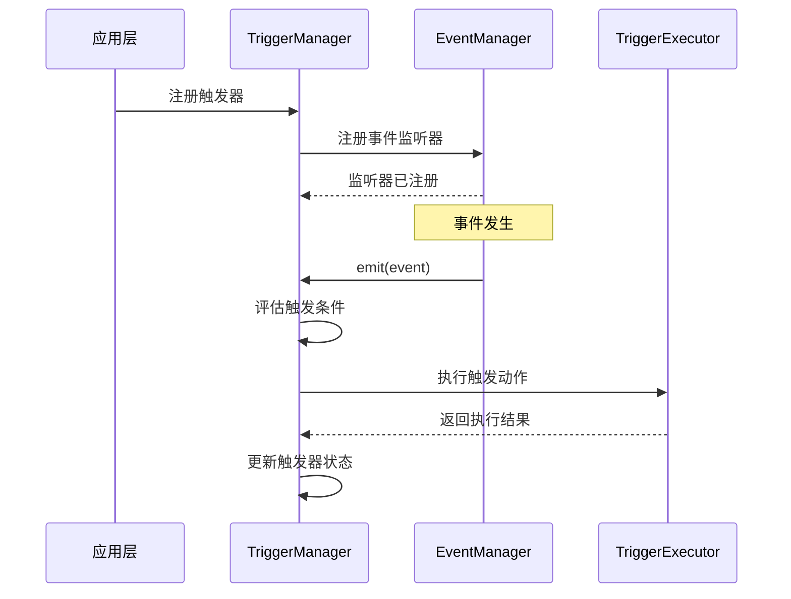

# Trigger Core 模块设计

## 概述

定义 SDK Core 层的触发器（Trigger）实现模块，负责触发器的注册、条件评估、动作执行和生命周期管理。当前版本仅支持事件触发器。

## 设计原则

1. **依赖规则**：Core 层只依赖 Types 和 Utils 层
2. **事件驱动**：触发器通过监听 SDK 事件实现
3. **职责分离**：每个模块负责单一职责
4. **可扩展性**：支持自定义触发动作

## 模块结构

```
sdk/core/trigger/
├── index.ts                      # 导出所有模块
├── trigger-manager.ts            # 触发器管理器
├── trigger-executor.ts           # 触发器执行器
└── __tests__/                    # 测试文件
    ├── trigger-manager.test.ts
    └── trigger-executor.test.ts
```

## 核心模块设计

### 1. TriggerManager（触发器管理器）

**职责**：
- 管理触发器的注册和注销
- 监听 SDK 事件，评估触发条件
- 协调触发器的执行
- 维护触发器状态

**核心逻辑**：
1. 注册触发器时，向 EventManager 注册事件监听器
2. 当事件触发时，评估所有相关触发器的条件
3. 条件满足时，调用 TriggerExecutor 执行动作
4. 更新触发器状态和触发次数

**依赖关系**：
- 依赖 Types 层：`Trigger`、`TriggerCondition`、`TriggerAction`、`TriggerStatus`
- 依赖 Core 层：`EventManager`（来自 `core/execution/event-manager.ts`）
- 依赖 Core 层：`TriggerExecutor`

**关键方法**：
```typescript
class TriggerManager {
  // 注册触发器
  register(trigger: Trigger): void

  // 注销触发器
  unregister(triggerId: ID): void

  // 启用触发器
  enable(triggerId: ID): void

  // 禁用触发器
  disable(triggerId: ID): void

  // 获取触发器
  get(triggerId: ID): Trigger | undefined

  // 获取所有触发器
  getAll(): Trigger[]

  // 处理事件（内部方法）
  private handleEvent(event: BaseEvent): Promise<void>

  // 评估触发器（内部方法）
  private evaluateTrigger(trigger: Trigger, event: BaseEvent): boolean

  // 执行触发器（内部方法）
  private executeTrigger(trigger: Trigger, event: BaseEvent): Promise<TriggerExecutionResult>
}
```

### 2. TriggerExecutor（触发器执行器）

**职责**：
- 执行触发器的动作
- 处理不同类型的动作
- 返回执行结果

**核心逻辑**：
1. 根据动作类型分发到不同的执行逻辑
2. 当前版本所有动作类型均为空实现
3. 记录触发信息，返回执行结果

**依赖关系**：
- 依赖 Types 层：`TriggerAction`、`TriggerActionType`、`TriggerExecutionResult`

**关键方法**：
```typescript
class TriggerExecutor {
  // 执行动作
  execute(action: TriggerAction, context: ExecutionContext): Promise<TriggerExecutionResult>

  // 启动工作流（空实现）
  private executeStartWorkflow(parameters: Record<string, any>): Promise<any>

  // 停止工作流（空实现）
  private executeStopWorkflow(parameters: Record<string, any>): Promise<any>

  // 暂停线程（空实现）
  private executePauseThread(parameters: Record<string, any>): Promise<any>

  // 恢复线程（空实现）
  private executeResumeThread(parameters: Record<string, any>): Promise<any>

  // 跳过节点（空实现）
  private executeSkipNode(parameters: Record<string, any>): Promise<any>

  // 设置变量（空实现）
  private executeSetVariable(parameters: Record<string, any>): Promise<any>

  // 发送通知（空实现）
  private executeSendNotification(parameters: Record<string, any>): Promise<any>

  // 自定义动作（空实现）
  private executeCustom(parameters: Record<string, any>): Promise<any>
}
```

## 依赖关系图

```
┌─────────────────────────────────────────────────────────────┐
│                        Types Layer                           │
│  Trigger, TriggerCondition, TriggerAction, TriggerStatus   │
│  EventType, BaseEvent, TriggerExecutionResult              │
└─────────────────────────────────────────────────────────────┘
                              ↓
┌─────────────────────────────────────────────────────────────┐
│                        Core Layer                           │
│                                                              │
│  ┌──────────────────┐         ┌──────────────────────────┐ │
│  │ TriggerManager   │────────▶│ TriggerExecutor          │ │
│  └──────────────────┘         └──────────────────────────┘ │
│           ↓                                                      │
│  ┌──────────────────┐                                        │
│  │ EventManager     │                                        │
│  │ (existing)       │                                        │
│  └──────────────────┘                                        │
└─────────────────────────────────────────────────────────────┘
```

## 执行流程

### 事件触发器执行流程



## 与现有模块的集成

### 1. 与 EventManager 集成

**集成方式**：
- TriggerManager 在注册 EVENT/STATE 触发器时，向 EventManager 注册监听器
- EventManager 触发事件时，调用 TriggerManager 的 handleEvent 方法
- TriggerManager 评估触发条件，执行触发动作

**依赖关系**：
- TriggerManager 依赖 EventManager
- EventManager 不依赖 TriggerManager（保持单向依赖）

## 设计要点

1. **单向依赖**：Trigger 模块依赖现有模块，现有模块不依赖 Trigger 模块
2. **事件驱动**：触发器通过监听 SDK 事件实现，保持架构一致性
3. **职责分离**：每个模块负责单一职责，便于测试和维护
4. **可扩展性**：支持自定义触发动作
5. **错误处理**：所有异步操作都有错误处理，不影响其他触发器
6. **状态管理**：TriggerManager 维护触发器状态，确保状态一致性
7. **性能考虑**：条件评估和动作执行都是异步的，不阻塞主流程
8. **空实现**：当前版本所有动作类型均为空实现，仅记录触发信息

## 使用示例

### 注册事件触发器

```typescript
const triggerManager = new TriggerManager(eventManager, triggerExecutor);

const trigger: Trigger = {
  id: 'trigger-1',
  name: '节点失败通知',
  type: TriggerType.EVENT,
  condition: {
    eventType: EventType.NODE_FAILED
  },
  action: {
    type: TriggerActionType.SEND_NOTIFICATION,
    parameters: {
      message: '节点执行失败',
      recipients: ['admin@example.com']
    }
  },
  status: TriggerStatus.ENABLED,
  triggerCount: 0,
  createdAt: Date.now(),
  updatedAt: Date.now()
};

triggerManager.register(trigger);
```

### 注销触发器

```typescript
triggerManager.unregister('trigger-1');
```

### 禁用触发器

```typescript
triggerManager.disable('trigger-1');
```

### 启用触发器

```typescript
triggerManager.enable('trigger-1');