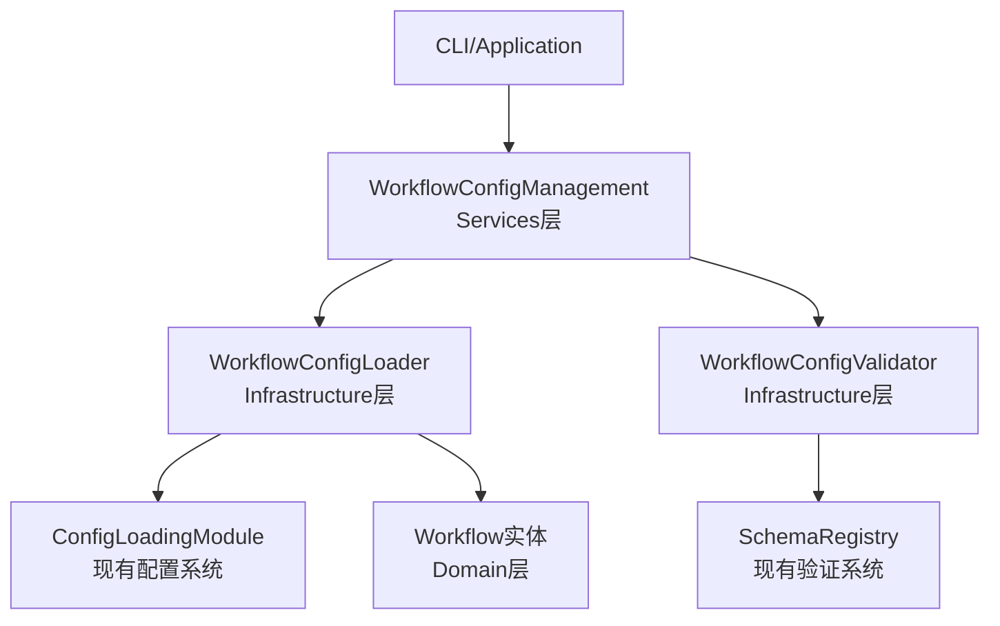
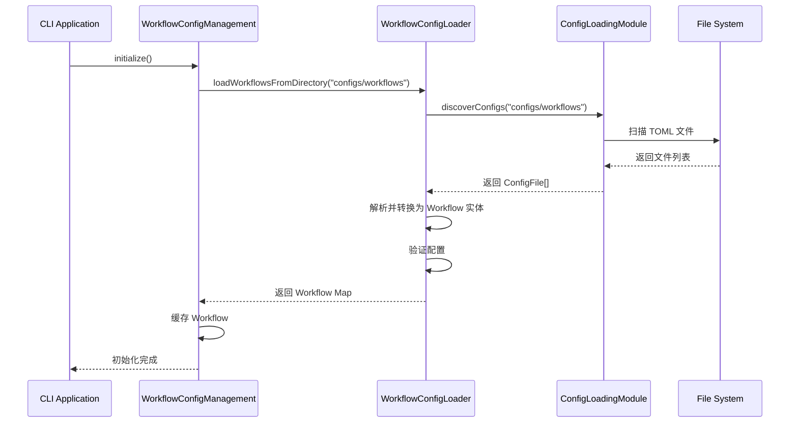
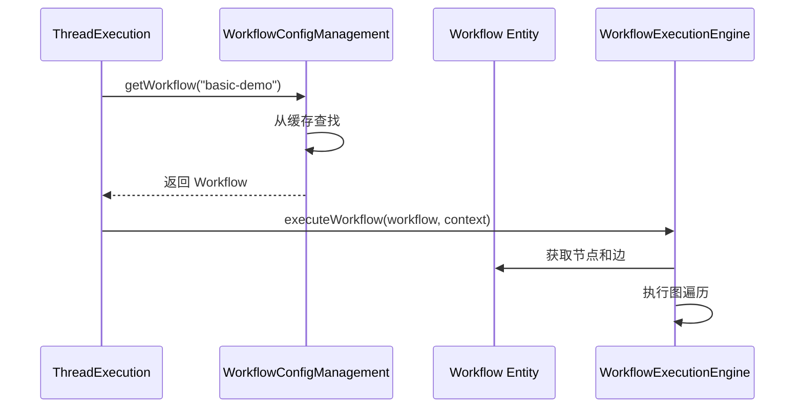

# 工作流配置管理核心功能设计

基于现有代码分析，工作流配置管理是连接静态配置与动态工作流实体的关键模块。以下是核心功能设计：

## 一、核心职责

工作流配置管理负责：
1. **配置加载**：从 TOML 文件加载工作流定义
2. **配置验证**：验证工作流配置的完整性和正确性
3. **配置转换**：将配置转换为 `Workflow` 实体
4. **配置缓存**：缓存已加载的工作流配置，避免重复加载
5. **配置查询**：提供工作流配置的查询接口

## 二、架构设计



## 三、核心功能模块

### 1. Infrastructure 层

#### WorkflowConfigLoader
- **职责**：从配置文件加载工作流定义
- **关键方法**：
  - `loadWorkflow(configPath: string): Promise<Workflow>`
  - `loadWorkflowsFromDirectory(dirPath: string): Promise<Map<string, Workflow>>`
  - `loadWorkflowByName(name: string): Promise<Workflow | null>`
- **配置格式**（TOML）：
```toml
[workflow]
name = "basic-demo"
description = "基础演示工作流"
type = "standard"
tags = ["demo", "basic"]

[workflow.config]
maxExecutionTime = 3600
retryCount = 3
timeoutSeconds = 1800
enableLogging = true

[[workflow.nodes]]
id = "start"
type = "start"
name = "开始节点"

[[workflow.nodes]]
id = "process"
type = "data-transform"
name = "处理节点"
properties = { script = "return { value: input.value * 2 }" }

[[workflow.edges]]
id = "edge1"
source = "start"
target = "process"
type = "control-flow"
```

#### WorkflowConfigValidator
- **职责**：验证工作流配置的正确性
- **验证规则**：
  - 节点 ID 唯一性
  - 边引用的节点存在
  - 开始/结束节点存在且唯一
  - 图连通性（无孤立节点）
  - 配置参数类型和范围
- **集成**：使用现有的 `SchemaRegistry` 和 `ValidationUtils`

### 2. Services 层

#### WorkflowConfigManagement
- **职责**：管理工作流配置的生命周期
- **关键功能**：
  - 加载和缓存工作流配置
  - 提供工作流查询接口（按名称、标签、类型）
  - 工作流配置的热重载
  - 工作流依赖管理（子工作流引用）

## 四、配置目录结构

```
configs/
├── workflow/                      # 工作流引擎配置（已有）
│   ├── engine.toml
│   ├── router.toml
│   └── state-manager.toml
├── workflows/                     # 工作流定义配置（新增）
│   ├── basic.toml                 # 基础演示工作流
│   ├── conditional.toml           # 条件路由工作流
│   └── tool-invocation.toml       # 工具调用工作流
└── cli/                          # CLI配置（新增）
    ├── cli.toml                   # CLI行为配置
    └── scenarios/                 # 演示场景配置
        ├── basic.toml
        └── conditional.toml
```

## 五、关键交互流程

### 1. CLI 启动时加载工作流



### 2. Thread 执行工作流



## 六、与现有系统的集成

### 1. 配置系统集成
- **复用** `ConfigLoadingModule` 的配置发现、加载、验证能力
- **复用** `SchemaRegistry` 的验证框架
- **遵循** 现有的配置继承和环境变量注入机制

### 2. 服务层集成
- **依赖** `WorkflowManagement` 进行工作流的持久化（如果需要）
- **依赖** `SessionManagement` 和 `ThreadExecution` 进行实际执行
- **不依赖** 任何应用层组件（保持层级约束）

### 3. 领域层集成
- **生成** `Workflow` 聚合根实体
- **生成** `WorkflowDefinition` 值对象
- **生成** `Node` 和 `Edge` 实体
- **遵循** 领域层的所有业务规则

## 七、错误处理策略

1. **配置加载失败**：记录错误，跳过该配置，继续加载其他
2. **配置验证失败**：记录详细错误信息，包括路径和原因
3. **工作流执行失败**：由 `ThreadExecution` 处理，支持重试和错误处理策略
4. **缓存失效**：自动重载机制，支持手动刷新

## 八、性能考虑

1. **缓存策略**：工作流配置在内存中缓存，避免重复解析
2. **延迟加载**：按需加载工作流配置，非启动时全部加载
3. **热重载**：支持配置文件变更时的热更新（开发模式）
4. **并发控制**：配置加载使用异步操作，支持并发加载

## 九、下一步实现计划

1. **Infrastructure 层**：
   - 实现 `WorkflowConfigLoader`（依赖 `ConfigLoadingModule`）
   - 实现 `WorkflowConfigValidator`（依赖 `SchemaRegistry`）
   - 创建工作流配置的 Zod Schema

2. **Services 层**：
   - 实现 `WorkflowConfigManagement` 服务
   - 集成到 DI 容器

3. **配置创建**：
   - 创建示例工作流配置（`configs/workflows/*.toml`）
   - 创建 CLI 配置（`configs/cli/*.toml`）

4. **Application 层**：
   - 实现 CLI 命令处理器
   - 集成 `WorkflowConfigManagement`

这个设计充分利用了现有的配置系统，保持了架构的一致性，同时为 CLI 提供了清晰的工作流配置管理能力。