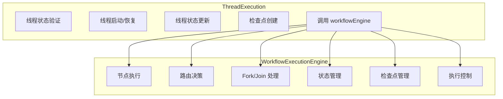
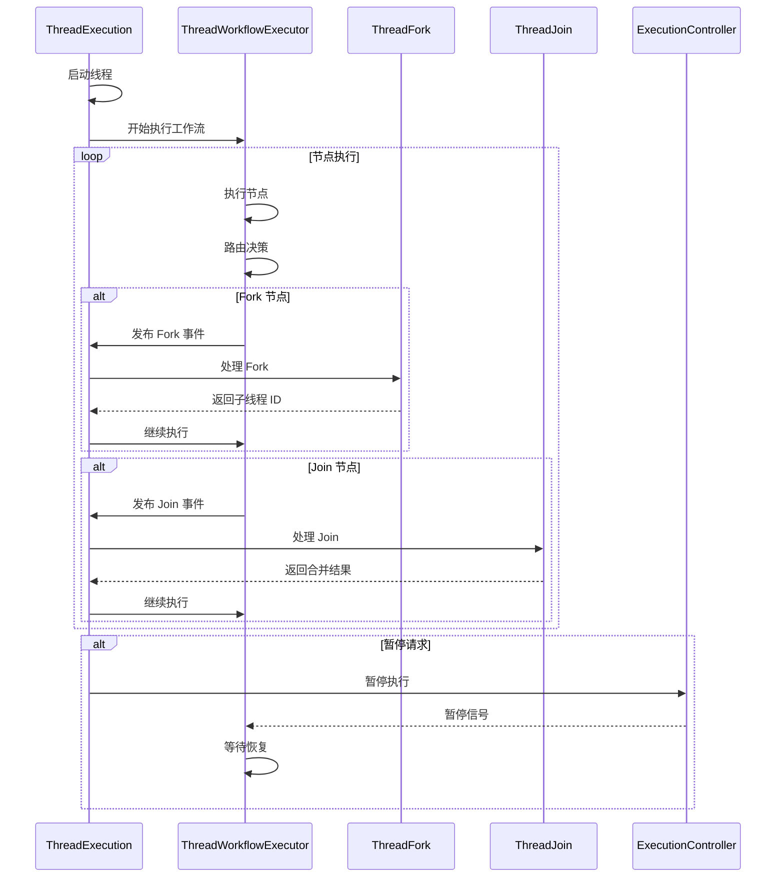
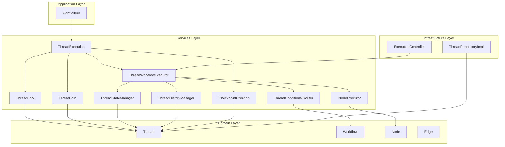
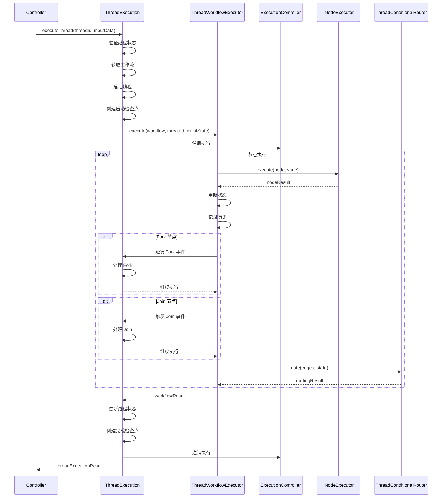
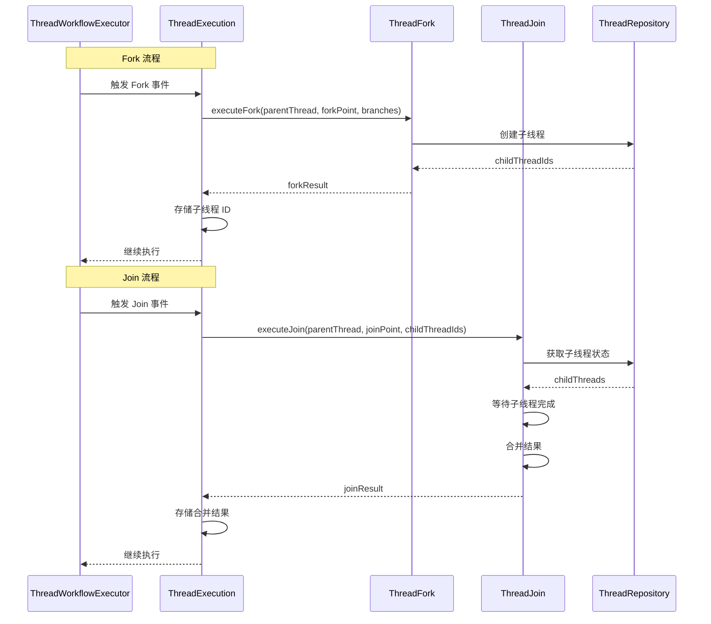

# ThreadExecution 和 WorkflowExecutionEngine 职责划分方案

## 一、当前职责分析

### 1.1 ThreadExecution 当前职责

基于实际代码逻辑，[`thread-execution.ts`](../src/services/threads/thread-execution.ts) 承担以下职责：

| 方法 | 职责 | 问题 |
|------|------|------|
| `executeThread` | 验证线程状态、获取工作流、启动线程、创建检查点、调用 workflowEngine、更新线程状态 | 职责清晰，但依赖 workflowEngine |
| `resumeThreadFromCheckpoint` | 验证线程状态、获取工作流、恢复线程、调用 workflowEngine.resumeFromCheckpoint | 依赖未实现的功能 |
| `getThreadCheckpoints` | 获取检查点列表 | 职责清晰 |
| `getLatestCheckpoint` | 获取最新检查点 | 职责清晰 |
| `cancelThreadExecution` | 取消线程执行 | 职责清晰 |
| `getThreadExecutionStatus` | 获取执行状态 | 职责清晰 |
| `updateThreadProgress` | 更新进度 | 职责清晰 |

**依赖的服务：**
- `WorkflowExecutionEngine` - 执行工作流
- `ThreadStateManager` - 状态管理（未使用）
- `ThreadHistoryManager` - 历史记录（未使用）
- `CheckpointManagement` - 检查点管理
- `CheckpointCreation` - 检查点创建
- `ThreadConditionalRouter` - 路由决策（未使用）
- `INodeExecutor` - 节点执行器（未使用）
- `FunctionRegistry` - 函数注册表（未使用）
- `WorkflowManagement` - 工作流管理

**问题：**
1. 注入了 10 个服务，但只使用了 4 个
2. 依赖 `WorkflowExecutionEngine`，但两者职责有重叠
3. `resumeThreadFromCheckpoint` 调用了未实现的功能

---

### 1.2 WorkflowExecutionEngine 当前职责

基于实际代码逻辑，[`workflow-execution-engine.ts`](../src/services/threads/workflow-execution-engine.ts) 承担以下职责：

| 方法 | 职责 | 问题 |
|------|------|------|
| `execute` | 初始化状态、查找起始节点、执行循环、节点执行、路由决策、处理 Fork/Join、管理检查点、错误处理 | 职责过重 |
| `resumeFromCheckpoint` | 从检查点恢复 | 未实现 |
| `pauseExecution` | 暂停执行 | 应该在基础设施层 |
| `resumeExecution` | 恢复执行 | 应该在基础设施层 |
| `cancelExecution` | 取消执行 | 应该在基础设施层 |
| `getExecutionController` | 获取执行控制器 | 应该在基础设施层 |

**依赖的服务：**
- `ThreadStateManager` - 状态管理
- `ThreadHistoryManager` - 历史记录
- `CheckpointManagement` - 检查点管理
- `ThreadConditionalRouter` - 路由决策
- `INodeExecutor` - 节点执行
- `FunctionRegistry` - 函数注册表
- `ThreadFork` - Fork 操作
- `ThreadJoin` - Join 操作
- `IThreadRepository` - 线程仓库

**问题：**
1. 职责过重：承担了节点执行、路由决策、Fork/Join、状态管理、检查点、执行控制等多个职责
2. Fork/Join 处理应该在 ThreadLifecycle 中
3. 执行控制逻辑应该在基础设施层
4. 检查点功能未完整实现

---

## 二、职责重叠分析

### 2.1 当前职责重叠



**重叠点：**
1. **检查点管理**：ThreadExecution 创建检查点，WorkflowExecutionEngine 也管理检查点
2. **状态管理**：ThreadExecution 更新线程状态，WorkflowExecutionEngine 管理执行状态
3. **执行控制**：ThreadExecution 取消线程，WorkflowExecutionEngine 控制执行

---

### 2.2 职责混乱的原因

1. **命名不当**：`WorkflowExecutionEngine` 实际执行的是 thread 的工作流
2. **分层不清**：执行控制逻辑应该在基础设施层
3. **职责过重**：WorkflowExecutionEngine 承担了太多职责
4. **依赖关系混乱**：两个服务相互依赖

---

## 三、职责划分方案

### 3.1 方案一：清晰职责划分（推荐）

**核心原则：**
- ThreadExecution 负责 **Thread 级别的业务逻辑**
- WorkflowExecutionEngine（重命名为 ThreadWorkflowExecutor）负责 **工作流节点执行协调**
- 执行控制逻辑移到基础设施层

#### 3.1.1 ThreadExecution 职责

**职责：**
1. 线程生命周期管理（启动、恢复、取消）
2. 线程状态验证和更新
3. 线程级别的检查点创建（里程碑检查点）
4. 调用 ThreadWorkflowExecutor 执行工作流
5. 处理执行结果，更新线程状态
6. Fork/Join 触发（通过事件或回调）

**不负责：**
1. 节点执行细节
2. 路由决策
3. 执行状态管理（由 ThreadWorkflowExecutor 负责）
4. 执行控制（由基础设施层负责）

**依赖：**
- `IThreadRepository` - 线程仓库
- `WorkflowManagement` - 工作流管理
- `ThreadWorkflowExecutor` - 工作流执行器
- `CheckpointCreation` - 检查点创建
- `ThreadFork` - Fork 操作
- `ThreadJoin` - Join 操作

#### 3.1.2 ThreadWorkflowExecutor 职责

**职责：**
1. 协调工作流节点执行顺序
2. 调用 INodeExecutor 执行单个节点
3. 调用 ThreadConditionalRouter 进行路由决策
4. 管理执行状态（通过 ThreadStateManager）
5. 记录执行历史（通过 ThreadHistoryManager）
6. 处理节点执行错误

**不负责：**
1. 线程生命周期管理
2. Fork/Join 处理（由 ThreadExecution 负责）
3. 执行控制（由基础设施层负责）
4. 检查点创建（由 ThreadExecution 负责）

**依赖：**
- `INodeExecutor` - 节点执行器
- `ThreadConditionalRouter` - 路由决策
- `ThreadStateManager` - 状态管理
- `ThreadHistoryManager` - 历史记录

#### 3.1.3 基础设施层职责

**新增组件：ExecutionController**

**职责：**
1. 执行控制（暂停、恢复、取消）
2. 执行超时管理
3. 并发控制

**依赖：**
- 无（独立组件）

---

### 3.2 方案二：事件驱动架构

**核心原则：**
- 使用事件机制解耦组件
- ThreadExecution 发布事件，其他组件订阅并处理

#### 3.2.1 事件流



#### 3.2.2 事件定义

```typescript
// 事件类型
enum ThreadEventType {
  THREAD_STARTED = 'THREAD_STARTED',
  THREAD_COMPLETED = 'THREAD_COMPLETED',
  THREAD_FAILED = 'THREAD_FAILED',
  THREAD_CANCELLED = 'THREAD_CANCELLED',
  NODE_EXECUTED = 'NODE_EXECUTED',
  FORK_TRIGGERED = 'FORK_TRIGGERED',
  JOIN_TRIGGERED = 'JOIN_TRIGGERED',
  ERROR_OCCURRED = 'ERROR_OCCURRED',
}

// 事件接口
interface ThreadEvent {
  type: ThreadEventType;
  threadId: string;
  timestamp: Date;
  data?: any;
}
```

---

### 3.3 方案三：分层重构

**核心原则：**
- 严格按照分层架构重构
- 每层只负责自己的职责

#### 3.3.1 分层结构

| 层 | 组件 | 职责 |
|----|------|------|
| **Application** | Controllers | HTTP/gRPC 接口 |
| **Services** | ThreadExecution | 线程生命周期管理 |
| | ThreadWorkflowExecutor | 工作流节点执行协调 |
| | ThreadFork | Fork 业务逻辑 |
| | ThreadJoin | Join 业务逻辑 |
| | ThreadStateManager | 状态管理 |
| | ThreadHistoryManager | 历史记录 |
| | CheckpointManagement | 检查点管理 |
| | ThreadConditionalRouter | 路由决策 |
| | INodeExecutor | 节点执行 |
| **Infrastructure** | ExecutionController | 执行控制 |
| | ThreadExecutionEngine | 执行引擎实现 |
| | ThreadRepositoryImpl | 持久化 |
| **Domain** | Thread | Thread 实体 |
| | Workflow | Workflow 实体 |
| | Node | 节点实体 |
| | Edge | 边实体 |

#### 3.3.2 依赖规则

```
Application → Services
Services → Domain + Infrastructure
Infrastructure → Domain
```

---

## 四、推荐方案详细设计

### 4.1 推荐方案：方案一（清晰职责划分）

#### 4.1.1 架构图



#### 4.1.2 ThreadExecution 接口

```typescript
interface ThreadExecution {
  // 线程生命周期管理
  executeThread(threadId: string, inputData: unknown, options?: ExecutionOptions): Promise<ThreadExecutionResult>;
  resumeThreadFromCheckpoint(threadId: string, checkpointId: string, options?: ExecutionOptions): Promise<ThreadExecutionResult>;
  cancelThreadExecution(threadId: string, userId?: string, reason?: string): Promise<Thread>;

  // 线程状态查询
  getThreadExecutionStatus(threadId: string): Promise<ThreadExecutionStatus | null>;
  updateThreadProgress(threadId: string, progress: number, currentStep?: string): Promise<Thread>;

  // 检查点管理
  getThreadCheckpoints(threadId: string): Promise<CheckpointInfo[]>;
  getLatestCheckpoint(threadId: string): Promise<CheckpointInfo | null>;

  // Fork/Join 触发
  handleForkEvent(event: ForkEvent): Promise<void>;
  handleJoinEvent(event: JoinEvent): Promise<void>;
}
```

#### 4.1.3 ThreadWorkflowExecutor 接口

```typescript
interface ThreadWorkflowExecutor {
  // 工作流执行
  execute(
    workflow: Workflow,
    threadId: string,
    initialState: Record<string, any>,
    options?: ExecutionOptions
  ): Promise<WorkflowExecutionResult>;

  // 节点执行
  executeNode(
    node: Node,
    state: ThreadWorkflowState,
    threadId: string
  ): Promise<NodeExecutionResult>;

  // 路由决策
  route(
    edges: Edge[],
    state: ThreadWorkflowState,
    options?: RoutingOptions
  ): Promise<RoutingResult | null>;
}
```

#### 4.1.4 ExecutionController 接口

```typescript
interface ExecutionController {
  // 执行控制
  pause(threadId: string): void;
  resume(threadId: string): void;
  cancel(threadId: string): void;

  // 状态查询
  isPaused(threadId: string): boolean;
  isCancelled(threadId: string): boolean;
  isCompleted(threadId: string): boolean;

  // 超时管理
  setTimeout(threadId: string, timeout: number): void;
  clearTimeout(threadId: string): void;
}
```

---

### 4.2 执行流程

#### 4.2.1 正常执行流程



#### 4.2.2 Fork/Join 流程



---

## 五、迁移计划

### 5.1 第一阶段：重命名和清理

1. **重命名文件**
   - `workflow-execution-engine.ts` → `thread-workflow-executor.ts`

2. **清理未使用的依赖**
   - ThreadExecution 移除未使用的依赖
   - ThreadWorkflowExecutor 移除 Fork/Join 相关依赖

3. **更新注释**
   - 更新类注释以反映实际职责

### 5.2 第二阶段：职责分离

1. **移除 Fork/Join 处理**
   - 从 ThreadWorkflowExecutor 移除 `handleForkNode` 和 `handleJoinNode`
   - 在 ThreadExecution 中添加 Fork/Join 事件处理

2. **移除执行控制逻辑**
   - 从 ThreadWorkflowExecutor 移除 `pauseExecution`、`resumeExecution`、`cancelExecution`
   - 创建基础设施层的 ExecutionController

3. **简化 ThreadWorkflowExecutor**
   - 只保留节点执行协调职责
   - 移除检查点管理逻辑

### 5.3 第三阶段：完善功能

1. **实现检查点恢复**
   - 在 ThreadWorkflowExecutor 中实现 `resumeFromCheckpoint`
   - 在 ThreadExecution 中调用恢复功能

2. **完善错误处理**
   - 实现完整的错误处理流程
   - 支持错误边的跳转

3. **添加事件机制**
   - 定义事件类型和接口
   - 实现事件发布和订阅

### 5.4 第四阶段：测试和优化

1. **单元测试**
   - 为每个组件编写单元测试
   - 确保职责清晰

2. **集成测试**
   - 测试组件之间的交互
   - 测试 Fork/Join 流程

3. **性能优化**
   - 优化执行流程
   - 减少不必要的依赖

---

## 六、总结

### 6.1 核心问题

1. **职责重叠**：ThreadExecution 和 WorkflowExecutionEngine 职责有重叠
2. **职责过重**：WorkflowExecutionEngine 承担了太多职责
3. **分层不清**：执行控制逻辑应该在基础设施层
4. **依赖混乱**：两个服务相互依赖

### 6.2 推荐方案

**方案一：清晰职责划分**

- ThreadExecution 负责 Thread 级别的业务逻辑
- ThreadWorkflowExecutor 负责工作流节点执行协调
- 执行控制逻辑移到基础设施层

### 6.3 预期收益

- **职责清晰**：每个组件职责明确
- **易于维护**：代码结构清晰，易于理解和修改
- **易于测试**：依赖减少，易于单元测试
- **易于扩展**：解耦组件，易于添加新功能
- **符合架构原则**：遵循分层架构和单一职责原则

---

## 附录

### A. 相关文件

- [`thread-execution.ts`](../src/services/threads/thread-execution.ts) - Thread 执行服务
- [`workflow-execution-engine.ts`](../src/services/threads/workflow-execution-engine.ts) - 工作流执行引擎
- [`thread-lifecycle.ts`](../src/services/threads/thread-lifecycle.ts) - Thread 生命周期管理
- [`thread-fork.ts`](../src/services/threads/thread-fork.ts) - Fork 操作
- [`thread-join.ts`](../src/services/threads/thread-join.ts) - Join 操作

### B. 参考资料

- [AGENTS.md](../AGENTS.md) - 项目架构文档
- [workflow-execution-engine-analysis.md](./workflow-execution-engine-analysis.md) - WorkflowExecutionEngine 分析报告