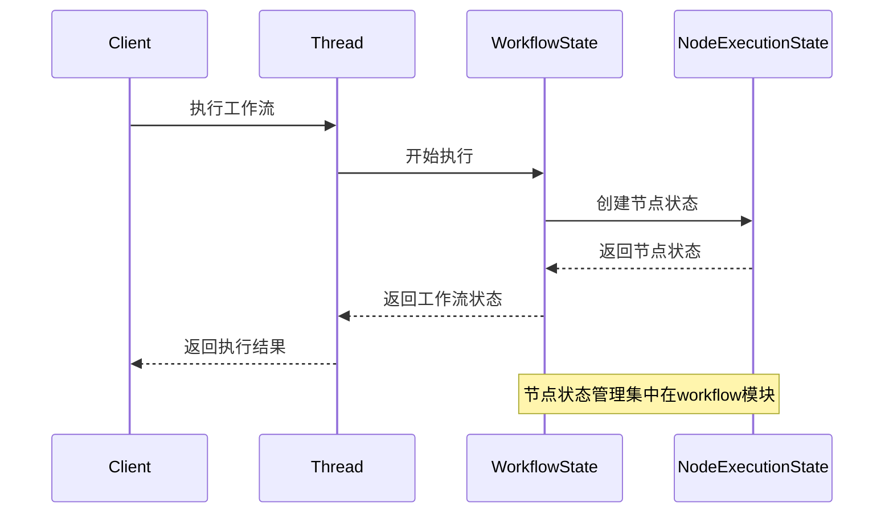

# Thread、Session实体中引入节点状态的分析报告

## 一、现状分析

### 1.1 Thread实体中的节点状态引入

**位置**: `src/domain/threads/entities/thread.ts`

**引入情况**:
- 第9行导入了 `NodeStatus`: `import { NodeStatus } from '../../workflow/value-objects/node-status';`
- 第576-597行定义了 `updateNodeState` 方法:
  ```typescript
  public updateNodeState(nodeId: string, status: NodeStatus, result?: unknown, error?: string): void {
    // ... 验证逻辑
    const newExecution = this.props.execution.updateNodeState(nodeId, status, result, error);
    // ...
  }
  ```

**实际行为**:
- `Thread.updateNodeState` 委托给 `ThreadExecution.updateNodeState`
- `ThreadExecution.updateNodeState` (第325-335行) 实际上**并未存储节点状态**，仅更新了 `lastActivityAt`:
  ```typescript
  public updateNodeState(nodeId: string, status: NodeStatus, result?: unknown, error?: string): ThreadExecution {
    // 这里只是更新最后活动时间，实际节点状态管理应该在专门的节点状态管理器中
    return new ThreadExecution({
      ...this.props,
      lastActivityAt: Timestamp.now()
    });
  }
  ```

### 1.2 Session实体中的节点状态引入

**位置**: `src/domain/sessions/entities/session.ts`

**引入情况**:
- **未引入任何节点状态相关代码**
- Session专注于会话生命周期管理，不涉及工作流执行细节

### 1.3 相关实体职责

| 实体 | 位置 | 职责 |
|------|------|------|
| `NodeExecutionState` | `src/domain/workflow/entities/node-execution-state.ts` | 表示单个节点的执行状态，包含节点ID、状态、重试次数、执行结果、错误信息、时间等完整信息 |
| `WorkflowState` | `src/domain/workflow/entities/workflow-state.ts` | 表示工作流执行过程中的整体状态，包含进度、当前节点、已完成/失败/跳过节点数等统计信息 |
| `ThreadExecution` | `src/domain/threads/value-objects/thread-execution.ts` | 表示线程的执行状态信息，包含执行进度、状态变化和时间信息 |

## 二、架构分析

### 2.1 当前设计的问题

#### 问题1: 职责混淆
- **Thread实体**引入了 `NodeStatus`，但实际上并不负责管理节点状态
- `ThreadExecution.updateNodeState` 方法存在但功能不完整，注释明确指出"实际节点状态管理应该在专门的节点状态管理器中"
- 这违反了单一职责原则

#### 问题2: 依赖关系不清晰
- Thread依赖workflow模块的 `NodeStatus`，但Thread属于threads模块
- 这造成了跨模块依赖，增加了耦合度

#### 问题3: 状态管理分散
- 节点状态应该由 `NodeExecutionState` 管理
- Thread通过 `ThreadExecution` 间接引用节点状态，但实际存储缺失
- 缺少明确的节点状态聚合机制

### 2.2 架构层次关系

```
┌─────────────────────────────────────────────────────────────┐
│                        Session (会话)                        │
│  职责: 会话生命周期管理、状态转换验证、业务不变性保证          │
└─────────────────────────────────────────────────────────────┘
                              │
                              │ 包含多个
                              ▼
┌─────────────────────────────────────────────────────────────┐
│                        Thread (线程)                        │
│  职责: 串行执行流程协调、单线程内的状态管理、执行步骤顺序控制  │
└─────────────────────────────────────────────────────────────┘
                              │
                              │ 执行
                              ▼
┌─────────────────────────────────────────────────────────────┐
│                    Workflow (工作流)                        │
│  职责: 工作流定义、节点编排、路由决策                        │
└─────────────────────────────────────────────────────────────┘
                              │
                              │ 包含多个
                              ▼
┌─────────────────────────────────────────────────────────────┐
│              NodeExecutionState (节点执行状态)              │
│  职责: 单个节点的执行状态管理                                │
└─────────────────────────────────────────────────────────────┘
```

## 三、设计建议

### 3.1 核心原则

**Thread和Session不应直接管理节点状态**

理由:
1. **职责分离**: Thread负责线程级别的协调，Session负责会话级别的管理，节点状态是工作流执行层面的细节
2. **层次清晰**: Session → Thread → Workflow → Node 的层次关系应保持清晰
3. **可维护性**: 节点状态管理集中在workflow模块，便于统一管理和扩展

### 3.2 具体建议

#### 建议1: 移除Thread中的节点状态相关代码

**操作**:
1. 移除 `Thread.ts` 第9行的 `NodeStatus` 导入
2. 移除 `Thread.updateNodeState` 方法（第576-597行）
3. 移除 `ThreadExecution.updateNodeState` 方法（第325-335行）

**理由**:
- Thread不应直接操作节点状态
- 节点状态应由workflow模块的 `NodeExecutionState` 管理

#### 建议2: 建立节点状态管理机制

**方案A: 通过WorkflowState管理节点状态**

```typescript
// WorkflowState 应该包含节点状态的集合
export interface WorkflowStateProps {
  // ... 现有属性
  nodeStates: Map<NodeId, NodeExecutionState>; // 新增
}
```

**方案B: 创建独立的节点状态管理器**

```typescript
// src/domain/workflow/services/node-state-manager.ts
export class NodeStateManager {
  private nodeStates: Map<NodeId, NodeExecutionState> = new Map();

  public updateNodeState(nodeId: NodeId, status: NodeStatus, result?: unknown, error?: string): void {
    // 更新节点状态逻辑
  }

  public getNodeState(nodeId: NodeId): NodeExecutionState | undefined {
    return this.nodeStates.get(nodeId);
  }
}
```

#### 建议3: Thread通过WorkflowState间接获取节点状态

```typescript
// Thread实体
export class Thread extends Entity {
  // ... 现有代码

  /**
   * 获取节点状态（通过workflowState）
   * @param nodeId 节点ID
   * @returns 节点执行状态
   */
  public getNodeState(nodeId: NodeId): NodeExecutionState | undefined {
    // 通过workflowState获取节点状态
    // 具体实现需要根据实际架构调整
  }
}
```

### 3.3 架构优化后的状态管理流程



## 四、总结

### 4.1 结论

**Thread和Session实体中引入节点状态是不合适的**

原因:
1. 违反单一职责原则
2. 造成跨模块依赖
3. 状态管理分散，难以维护
4. 当前实现不完整，存在误导性

### 4.2 推荐方案

1. **移除Thread中的节点状态相关代码**
2. **在workflow模块中集中管理节点状态**
3. **Thread通过WorkflowState间接访问节点状态**
4. **保持清晰的层次关系**: Session → Thread → Workflow → Node

### 4.3 实施步骤

1. 移除 `Thread.ts` 中的 `NodeStatus` 导入和 `updateNodeState` 方法
2. 移除 `ThreadExecution.ts` 中的 `updateNodeState` 方法
3. 在 `WorkflowState` 中添加节点状态集合管理
4. 更新相关服务和仓储以支持新的状态管理方式
5. 编写测试验证修改的正确性

---

**报告生成时间**: 2025-01-XX
**分析范围**: src/domain/threads, src/domain/sessions, src/domain/workflow