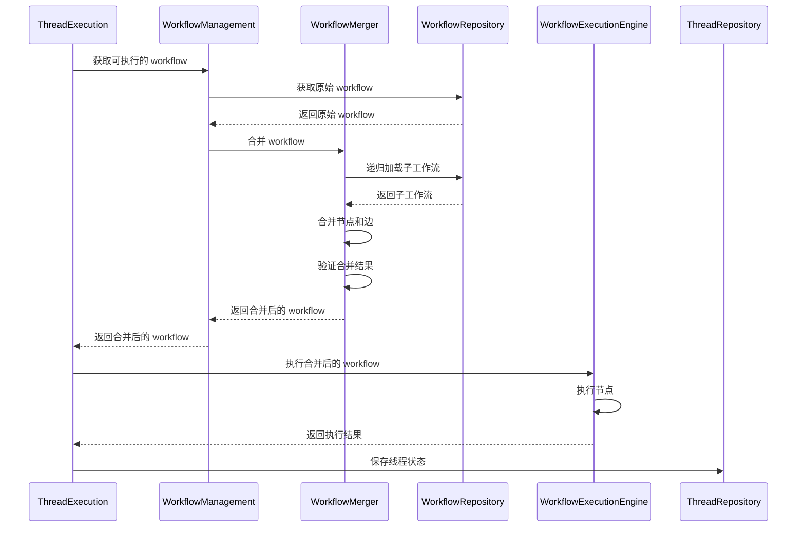

# Thread 与 Workflow 集成问题分析

## 问题概述

当前实现中，`ThreadExecution` 在执行线程时直接使用从 repository 获取的原始 workflow，而没有先通过 `WorkflowMerger` 进行合并处理。这导致包含子工作流引用的工作流无法正确执行。

**重要发现**：经过架构分析，合并逻辑应该在 workflow 层完成，而不是在 thread 层。

## 当前实现分析

### 1. ThreadExecution 执行流程

**文件**: `src/services/threads/thread-execution.ts`

```typescript
// 第 98-242 行：executeThread 方法
async executeThread(
  threadId: string,
  inputData: unknown,
  options?: {...}
): Promise<ThreadExecutionResult> {
  // ...
  
  // 第 120 行：从 repository 获取 workflow
  const workflow = await this.workflowRepository.findById(thread.workflowId);
  if (!workflow) {
    throw new Error(`工作流不存在: ${thread.workflowId.toString()}`);
  }
  
  // ...
  
  // 第 148-159 行：直接将原始 workflow 传递给 workflowEngine
  const workflowResult = await this.workflowEngine.execute(
    workflow,  // ❌ 这里是原始 workflow，未经过合并
    thread.id.value,
    inputData as Record<string, any>,
    {...}
  );
  
  // ...
}
```

**问题**：直接使用原始 workflow，没有经过 WorkflowMerger 合并处理。

### 2. WorkflowMerger 的存在

**文件**: `src/services/workflow/workflow-merger.ts`

WorkflowMerger 提供了完整的工作流合并功能：

```typescript
// 第 72-165 行：mergeWorkflow 方法
async mergeWorkflow(workflow: Workflow): Promise<WorkflowMergeResult> {
  // 1. 检查缓存
  // 2. 获取子工作流引用
  // 3. 递归合并子工作流
  // 4. 验证合并后的工作流结构
  // 5. 返回合并后的 workflow
}
```

**主要功能**：
- 递归加载子工作流
- 静态检查子工作流标准
- 合并节点和边（使用 `referenceId.nodeId` 格式重命名节点）
- 连接子工作流到父工作流
- 验证合并后的工作流结构

### 3. 依赖注入配置

**文件**: `src/di/bindings/services-bindings.ts`

```typescript
// 第 85 行：WorkflowExecutionEngine 已绑定
bind(TYPES.WorkflowExecutionEngine).to(WorkflowExecutionEngine).inSingletonScope();

// 第 119 行：WorkflowManagement 已绑定
bind(TYPES.WorkflowManagement).to(WorkflowManagement).inSingletonScope();
```

**重要发现**：[`WorkflowManagement`](src/services/workflow/workflow-management.ts:156) 已经注入了 [`WorkflowMerger`](src/services/workflow/workflow-merger.ts:57)（第159行），合并逻辑应该在 workflow 层完成。

### 4. WorkflowExecutionEngine 的职责

**文件**: `src/services/threads/workflow-execution-engine.ts`

```typescript
// 第 185-372 行：execute 方法
async execute(
  workflow: Workflow,  // 接收已合并的 workflow
  threadId: string,
  initialState: Record<string, any>,
  options: WorkflowExecutionOptions = {}
): Promise<WorkflowExecutionResult> {
  // 直接执行 workflow，不负责合并逻辑
  // ...
}
```

**职责**：协调工作流的执行，管理节点执行顺序，处理路由决策等。

**注意**：WorkflowExecutionEngine 不应该负责合并逻辑，它应该接收已经合并好的 workflow。

## 问题影响

### 1. 子工作流无法执行

当 workflow 包含子工作流引用（`subworkflow` 类型的节点）时：
- ThreadExecution 直接执行原始 workflow
- 遇到 `subworkflow` 节点时，节点执行器无法找到对应的子工作流逻辑
- 执行失败或产生错误结果

### 2. 节点 ID 冲突

如果多个子工作流包含相同 ID 的节点：
- 原始 workflow 中节点 ID 可能冲突
- WorkflowMerger 通过 `referenceId.nodeId` 格式重命名节点来避免冲突
- 但如果不合并，冲突无法解决

### 3. 边连接错误

子工作流的入口和出口节点需要与父工作流的边正确连接：
- WorkflowMerger 负责重定向边连接
- 不合并的情况下，边连接指向错误的节点

### 4. 检查点恢复问题

检查点中保存的是合并后的节点 ID（如 `subworkflow1.node1`）：
- 如果执行时使用原始 workflow，节点 ID 不匹配
- 检查点恢复失败

## 正确的处理逻辑

根据架构设计，正确的处理逻辑应该是：



**架构原则**：
- Workflow 层负责工作流的管理和合并（静态处理）
- Thread 层负责线程的执行编排（动态执行）
- ThreadExecution 通过 WorkflowManagement 获取已合并的 workflow

## 解决方案

### 方案 1：在 WorkflowManagement 中提供获取可执行 workflow 的方法（推荐）

**优点**：
- 符合分层架构原则：Workflow 层负责工作流的管理和合并
- WorkflowManagement 已经注入了 WorkflowMerger，无需额外配置
- ThreadExecution 保持简单，只负责执行编排
- 合并逻辑集中在 workflow 层，易于维护和测试
- 符合单一职责原则

**实现步骤**：

1. **在 WorkflowManagement 中添加获取可执行 workflow 的方法**

```typescript
// src/services/workflow/workflow-management.ts

/**
 * 获取可执行的工作流（已合并子工作流）
 * @param workflowId 工作流ID
 * @returns 合并后的工作流
 */
async getExecutableWorkflow(workflowId: string): Promise<Workflow> {
  return this.executeBusinessOperation(
    '获取可执行工作流',
    async () => {
      const id = this.parseId(workflowId, '工作流ID');
      
      // 获取原始 workflow
      const workflow = await this.workflowRepository.findByIdOrFail(id);
      
      // 合并 workflow
      const mergeResult = await this.workflowMerger.mergeWorkflow(workflow);
      const mergedWorkflow = mergeResult.mergedWorkflow;
      
      // 记录合并信息
      this.logger.info('工作流合并完成', {
        workflowId: workflow.workflowId.toString(),
        originalNodeCount: mergeResult.statistics.originalNodeCount,
        mergedNodeCount: mergeResult.statistics.mergedNodeCount,
        subWorkflowCount: mergeResult.statistics.subWorkflowCount,
      });
      
      return mergedWorkflow;
    },
    { workflowId }
  );
}
```

2. **在 ThreadExecution 中注入 WorkflowManagement**

```typescript
// src/services/threads/thread-execution.ts
constructor(
  @inject(TYPES.ThreadRepository) private readonly threadRepository: IThreadRepository,
  @inject(TYPES.WorkflowManagement) private readonly workflowManagement: WorkflowManagement,  // 修改：使用 WorkflowManagement
  @inject(TYPES.WorkflowExecutionEngine) workflowEngine: WorkflowExecutionEngine,
  // ... 其他依赖
) {
  // ...
}
```

3. **在 executeThread 中使用 WorkflowManagement 获取已合并的 workflow**

```typescript
async executeThread(
  threadId: string,
  inputData: unknown,
  options?: {...}
): Promise<ThreadExecutionResult> {
  // ...
  
  // ✅ 通过 WorkflowManagement 获取已合并的 workflow
  const workflow = await this.workflowManagement.getExecutableWorkflow(
    thread.workflowId.toString()
  );
  
  // 验证工作流状态
  if (!workflow.status.isActive()) {
    throw new Error(`工作流不是活跃状态，当前状态: ${workflow.status.toString()}`);
  }
  
  // 启动线程
  thread.start();
  await this.threadRepository.save(thread);
  
  // ✅ 使用合并后的 workflow 执行
  const workflowResult = await this.workflowEngine.execute(
    workflow,  // workflow 已经是合并后的
    thread.id.value,
    inputData as Record<string, any>,
    {...}
  );
  
  // ...
}
```

4. **在 resumeThreadFromCheckpoint 中也使用 WorkflowManagement**

```typescript
async resumeThreadFromCheckpoint(
  threadId: string,
  checkpointId: string,
  options?: {...}
): Promise<ThreadExecutionResult> {
  // ...
  
  // ✅ 通过 WorkflowManagement 获取已合并的 workflow
  const workflow = await this.workflowManagement.getExecutableWorkflow(
    thread.workflowId.toString()
  );
  
  // 验证工作流状态
  if (!workflow.status.isActive()) {
    throw new Error(`工作流不是活跃状态，当前状态: ${workflow.status.toString()}`);
  }
  
  // 恢复线程
  thread.resume();
  await this.threadRepository.save(thread);
  
  // ✅ 使用合并后的 workflow 恢复执行
  const workflowResult = await this.workflowEngine.resumeFromCheckpoint(
    workflow,  // workflow 已经是合并后的
    thread.id.value,
    checkpointId,
    {...}
  );
  
  // ...
}
```

### 方案 2：在 ThreadExecution 中直接注入 WorkflowMerger（不推荐）

**缺点**：
- 违反分层架构原则：Thread 层不应该直接处理 workflow 的合并逻辑
- 合并逻辑分散在多个地方，难以维护
- ThreadExecution 职责过重

**不推荐原因**：合并逻辑应该在 workflow 层完成，Thread 层只负责执行编排。

## 需要修改的文件清单

1. **src/services/workflow/workflow-management.ts**
   - 添加 `getExecutableWorkflow` 方法

2. **src/services/threads/thread-execution.ts**
   - 修改依赖注入：使用 WorkflowManagement 替代 WorkflowRepository
   - 在 executeThread 中使用 `getExecutableWorkflow` 获取已合并的 workflow
   - 在 resumeThreadFromCheckpoint 中使用 `getExecutableWorkflow` 获取已合并的 workflow

3. **src/di/bindings/services-bindings.ts**
   - 无需修改（WorkflowManagement 已经绑定）

4. **src/di/service-keys.ts**
   - 无需修改（WorkflowManagement 已经定义）

5. **src/services/threads/workflow-execution-engine.ts**
   - 无需修改（保持接收已合并的 workflow）

## 测试建议

1. **单元测试**
   - 测试 WorkflowMerger 的合并逻辑
   - 测试 ThreadExecution 在合并后的 workflow 上执行

2. **集成测试**
   - 测试包含子工作流的完整执行流程
   - 测试检查点创建和恢复

3. **边界测试**
   - 测试没有子工作流的 workflow（应该直接执行）
   - 测试多层嵌套的子工作流
   - 测试循环引用检测

## 总结

**核心问题**：ThreadExecution 直接使用原始 workflow 执行，没有先通过 WorkflowMerger 进行合并处理。

**推荐方案**：在 WorkflowManagement 中提供 `getExecutableWorkflow` 方法，ThreadExecution 通过该方法获取已合并的 workflow。

**架构优势**：
- 符合分层架构原则：Workflow 层负责管理和合并，Thread 层负责执行编排
- WorkflowManagement 已经注入了 WorkflowMerger，无需额外配置
- 合并逻辑集中在 workflow 层，易于维护和测试
- ThreadExecution 职责清晰，只负责执行编排

**影响范围**：需要修改 2 个文件：
1. `src/services/workflow/workflow-management.ts` - 添加获取可执行 workflow 的方法
2. `src/services/threads/thread-execution.ts` - 使用 WorkflowManagement 获取已合并的 workflow

**优先级**：高 - 这是一个功能缺陷，会导致包含子工作流的工作流无法正确执行。