# ToolRegistry 简化方案

## 问题分析

### 当前架构的问题

1. **重复的内存存储**
   - `ConfigLoadingModule` 已经在内存中缓存了所有配置（`this.configs`）
   - `ToolRegistry` 又维护了自己的 `this.tools` Map，存储了 Tool 实体
   - 这导致同一份数据在内存中存储了两次

2. **不必要的深度克隆**
   - `ConfigLoadingModule.getAllConfigs()` 返回深度克隆的配置对象
   - `ToolRegistry.loadToolsFromConfig()` 调用 `getAllConfigs()` 后又进行转换
   - 每次获取配置都会进行深度克隆，造成性能浪费

3. **热更新支持不完善**
   - 如果配置文件更新，`ConfigLoadingModule.refresh()` 会重新加载配置
   - 但 `ToolRegistry` 中的 `this.tools` Map 不会自动更新
   - 需要手动调用 `ToolRegistry` 的刷新方法（如果有的话）

4. **职责不清**
   - `ToolRegistry` 既负责工具查找，又负责工具执行，还负责配置加载
   - 配置加载逻辑应该在 ConfigLoadingModule 内部完成
   - ToolRegistry 应该专注于工具查找和执行

### ConfigLoadingModule 的现有能力

```typescript
// ConfigLoadingModule 已经具备的能力：
private configs: Record<string, any> = {};  // 内存中存储所有配置
private configCache: Map<string, { config: any; timestamp: number }> = new Map();  // 缓存机制

get<T>(key: string, defaultValue?: T): T  // 获取单个配置值
getAllConfigs(): Record<string, any>  // 获取所有配置（带深度克隆）
refresh(): Promise<void>  // 支持热更新
```

## 简化方案

### 方案一：ToolRegistry 直接访问 ConfigLoadingModule（推荐）

**核心思想**：ToolRegistry 不维护自己的工具 Map，每次需要时直接从 ConfigLoadingModule 获取配置并转换为 Tool 实体。

#### 优点
- ✅ 消除重复的内存存储
- ✅ 自动支持热更新（配置更新后立即生效）
- ✅ 职责清晰：ConfigLoadingModule 负责配置管理，ToolRegistry 负责工具查找和执行
- ✅ 实现简单，改动最小

#### 缺点
- ❌ 每次查找工具都需要从配置转换，可能影响性能
- ❌ 需要优化 ConfigLoadingModule 的访问方式，避免深度克隆

#### 实现方案

```typescript
@injectable()
export class ToolRegistry {
  constructor(
    @inject('Logger') private readonly logger: ILogger,
    @inject('ConfigLoadingModule') private readonly configManager: ConfigLoadingModule,
    @inject('BuiltinExecutor') private readonly builtinExecutor: BuiltinExecutor,
    @inject('NativeExecutor') private readonly nativeExecutor: NativeExecutor,
    @inject('RestExecutor') private readonly restExecutor: RestExecutor,
    @inject('McpExecutor') private readonly mcpExecutor: McpExecutor
  ) {
    // 注册执行器
    this.executors.set('builtin', this.builtinExecutor);
    this.executors.set('native', this.nativeExecutor);
    this.executors.set('rest', this.restExecutor);
    this.executors.set('http', this.restExecutor);
    this.executors.set('api', this.restExecutor);
    this.executors.set('mcp', this.mcpExecutor);
  }

  /**
   * 获取工具（直接从配置获取）
   */
  get(toolId: string): Tool | undefined {
    const toolConfig = this.configManager.get(`tools.tools.${toolId}`);
    if (!toolConfig) {
      return undefined;
    }
    return this.convertConfigToTool(toolId, toolConfig);
  }

  /**
   * 获取所有工具（直接从配置获取）
   */
  getAll(): Tool[] {
    const toolsConfig = this.configManager.get('tools.tools', {});
    return Object.entries(toolsConfig).map(([name, config]) => 
      this.convertConfigToTool(name, config)
    );
  }

  // ... 其他方法
}
```

#### 需要的 ConfigLoadingModule 改进

```typescript
// 在 ConfigLoadingModule 中添加：
/**
 * 获取配置值（不克隆，直接返回引用）
 * 用于频繁访问的场景，调用者不应修改返回的对象
 */
getRef<T = any>(key: string): T | undefined {
  if (!this.isInitialized) {
    throw new ConfigurationError('配置加载模块尚未初始化');
  }
  return this.getNestedValue(this.configs, key);
}

/**
 * 获取模块配置（不克隆，直接返回引用）
 */
getModuleConfig(moduleType: string): Record<string, any> | undefined {
  return this.configs[moduleType];
}
```

### 方案二：ConfigLoadingModule 内部缓存 Tool 实体

**核心思想**：在 ConfigLoadingModule 内部实现 Tool 实体的缓存和转换逻辑，ToolRegistry 直接使用缓存。

#### 优点
- ✅ 消除重复的内存存储
- ✅ 性能最优（只转换一次，后续直接使用缓存）
- ✅ 自动支持热更新（refresh 时清空缓存）
- ✅ 配置管理逻辑集中在 ConfigLoadingModule

#### 缺点
- ❌ ConfigLoadingModule 需要知道 Tool 实体的结构，增加了耦合
- ❌ ConfigLoadingModule 的职责变重
- ❌ 需要较大的改动

#### 实现方案

```typescript
// 在 ConfigLoadingModule 中添加：
private toolCache: Map<string, Tool> = new Map();

/**
 * 获取工具（带缓存）
 */
getTool(toolId: string): Tool | undefined {
  // 检查缓存
  if (this.toolCache.has(toolId)) {
    return this.toolCache.get(toolId);
  }

  // 从配置获取
  const toolConfig = this.getRef(`tools.tools.${toolId}`);
  if (!toolConfig) {
    return undefined;
  }

  // 转换并缓存
  const tool = this.convertConfigToTool(toolId, toolConfig);
  this.toolCache.set(toolId, tool);
  return tool;
}

/**
 * 获取所有工具（带缓存）
 */
getAllTools(): Tool[] {
  const toolsConfig = this.getRef('tools.tools', {});
  return Object.entries(toolsConfig).map(([name, config]) => {
    if (this.toolCache.has(name)) {
      return this.toolCache.get(name)!;
    }
    const tool = this.convertConfigToTool(name, config);
    this.toolCache.set(name, tool);
    return tool;
  });
}

/**
 * 刷新配置时清空工具缓存
 */
async refresh(): Promise<void> {
  // 清空工具缓存
  this.toolCache.clear();
  
  // ... 原有的刷新逻辑
}
```

```typescript
// ToolRegistry 简化为：
@injectable()
export class ToolRegistry {
  constructor(
    @inject('Logger') private readonly logger: ILogger,
    @inject('ConfigLoadingModule') private readonly configManager: ConfigLoadingModule,
    // ... 执行器
  ) {}

  get(toolId: string): Tool | undefined {
    return this.configManager.getTool(toolId);
  }

  getAll(): Tool[] {
    return this.configManager.getAllTools();
  }

  // ... 其他方法
}
```

### 方案三：混合方案（缓存 + 懒加载）

**核心思想**：ToolRegistry 维护自己的缓存，但使用 ConfigLoadingModule 的 `getRef()` 方法避免深度克隆。

#### 优点
- ✅ 性能最优（缓存 Tool 实体）
- ✅ 避免深度克隆
- ✅ 职责相对清晰（ToolRegistry 负责工具缓存，ConfigLoadingModule 负责配置管理）
- ✅ 改动适中

#### 缺点
- ❌ 仍然有重复的内存存储（但只在需要时才创建）
- ❌ 需要实现缓存失效机制

#### 实现方案

```typescript
@injectable()
export class ToolRegistry {
  private readonly toolCache: Map<string, Tool> = new Map();
  private readonly configVersion: number = 0;

  constructor(
    @inject('Logger') private readonly logger: ILogger,
    @inject('ConfigLoadingModule') private readonly configManager: ConfigLoadingModule,
    // ... 执行器
  ) {
    // 监听配置更新
    this.configManager.on('refresh', () => {
      this.toolCache.clear();
      this.configVersion++;
    });
  }

  /**
   * 获取工具（带缓存）
   */
  get(toolId: string): Tool | undefined {
    // 检查缓存
    if (this.toolCache.has(toolId)) {
      return this.toolCache.get(toolId);
    }

    // 从配置获取（使用 getRef 避免克隆）
    const toolConfig = this.configManager.getRef(`tools.tools.${toolId}`);
    if (!toolConfig) {
      return undefined;
    }

    // 转换并缓存
    const tool = this.convertConfigToTool(toolId, toolConfig);
    this.toolCache.set(toolId, tool);
    return tool;
  }

  /**
   * 获取所有工具（带缓存）
   */
  getAll(): Tool[] {
    const toolsConfig = this.configManager.getRef('tools.tools', {});
    return Object.entries(toolsConfig).map(([name, config]) => {
      if (this.toolCache.has(name)) {
        return this.toolCache.get(name)!;
      }
      const tool = this.convertConfigToTool(name, config);
      this.toolCache.set(name, tool);
      return tool;
    });
  }

  // ... 其他方法
}
```

## 推荐方案

**推荐使用方案一（ToolRegistry 直接访问 ConfigLoadingModule）**，理由如下：

1. **架构清晰**：职责分离明确，ConfigLoadingModule 负责配置管理，ToolRegistry 负责工具查找和执行
2. **实现简单**：改动最小，风险最低
3. **自动支持热更新**：配置更新后立即生效，无需额外处理
4. **性能可接受**：如果性能成为问题，可以后续优化为方案三

## 实施步骤

### 阶段一：改进 ConfigLoadingModule

1. 添加 `getRef()` 方法，返回配置引用而不克隆
2. 添加 `getModuleConfig()` 方法，获取模块配置
3. 添加文档说明 `getRef()` 的使用注意事项

### 阶段二：重构 ToolRegistry

1. 移除 `this.tools` Map
2. 修改 `get()` 方法，直接从 ConfigLoadingModule 获取配置
3. 修改 `getAll()` 方法，直接从 ConfigLoadingModule 获取配置
4. 移除 `loadToolsFromConfig()` 方法
5. 简化构造函数

### 阶段三：验证和测试

1. 运行类型检查
2. 运行单元测试
3. 测试热更新功能
4. 性能测试（如果需要）

## 架构图

```mermaid
graph TB
    subgraph "当前架构"
        A[ConfigLoadingModule] -->|getAllConfigs 深度克隆| B[ToolRegistry]
        B -->|维护| C[tools Map]
        C -->|使用| D[ToolExecutor]
    end

    subgraph "简化后架构（方案一）"
        E[ConfigLoadingModule] -->|getRef 直接引用| F[ToolRegistry]
        F -->|直接使用| G[ToolExecutor]
    end

    subgraph "优化后架构（方案三）"
        H[ConfigLoadingModule] -->|getRef 直接引用| I[ToolRegistry]
        I -->|缓存| J[toolCache Map]
        J -->|使用| K[ToolExecutor]
    end
```



## 总结

当前 ToolRegistry 的设计存在重复存储和不必要的深度克隆问题。通过让 ToolRegistry 直接访问 ConfigLoadingModule 的配置引用，可以：

1. 消除重复的内存存储
2. 避免不必要的深度克隆
3. 自动支持热更新
4. 简化代码，提高可维护性

推荐采用方案一，如果后续性能成为问题，可以优化为方案三。