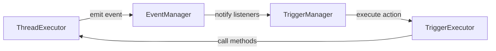
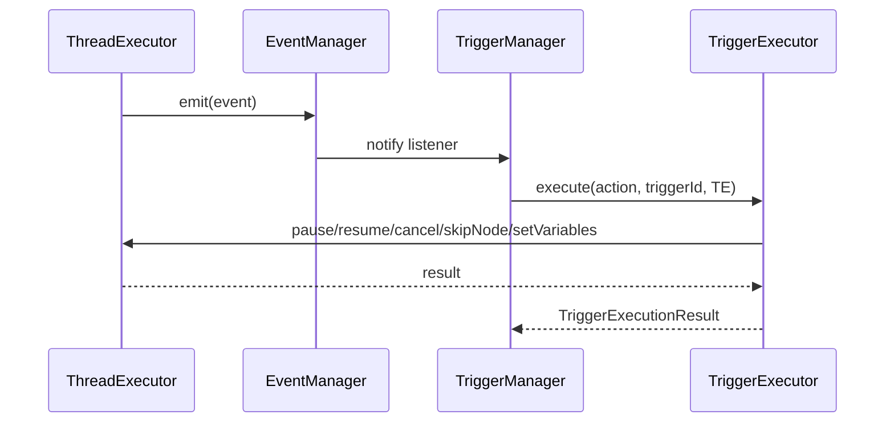

# Trigger 模块迁移分析报告

## 一、当前架构分析

### 1.1 现有文件结构

```
sdk/core/
├── trigger/
│   ├── index.ts
│   ├── trigger-manager.ts      # 触发器管理器
│   ├── trigger-executor.ts     # 触发器执行器
│   └── __tests__/
└── execution/
    ├── event-manager.ts        # 事件管理器
    ├── thread-executor.ts      # 线程执行器
    ├── executors/
    │   ├── node-executor-factory.ts
    │   └── node/               # 节点执行器
    │       ├── base-node-executor.ts
    │       ├── start-node-executor.ts
    │       ├── end-node-executor.ts
    │       └── ...
    └── trigger/                # 空目录（已存在）
```

### 1.2 当前依赖关系

```
TriggerManager
  ├── EventManager (依赖)
  └── TriggerExecutor (依赖)

TriggerExecutor
  └── 独立执行器，无依赖

EventManager
  └── 独立事件管理器

ThreadExecutor
  └── EventManager (使用)
```

### 1.3 TriggerExecutor 支持的动作类型

根据 [`sdk/types/trigger.ts`](sdk/types/trigger.ts:36-53)，当前支持以下动作：

1. **START_WORKFLOW** - 启动工作流
2. **STOP_THREAD** - 停止线程
3. **PAUSE_THREAD** - 暂停线程
4. **RESUME_THREAD** - 恢复线程
5. **SKIP_NODE** - 跳过节点
6. **SET_VARIABLE** - 设置变量
7. **SEND_NOTIFICATION** - 发送通知
8. **CUSTOM** - 自定义动作

**注意：** 所有动作当前都是空实现（TODO）

## 二、迁移必要性分析

### 2.1 支持迁移的理由

#### 2.1.1 架构一致性
- **执行逻辑统一管理**：TriggerExecutor 执行的动作与线程执行直接相关，应该与 node 执行器放在同一层级
- **符合现有模式**：execution/executors/ 目录已经存在 node 执行器，添加 trigger 执行器符合现有架构模式
- **职责清晰**：execution 目录专门负责执行逻辑，trigger 执行属于执行逻辑的一部分

#### 2.1.2 代码组织
- **减少跨目录依赖**：当前 TriggerManager 在 trigger/ 目录，但依赖 execution/ 目录的 EventManager
- **逻辑内聚**：所有执行相关的代码集中在 execution 目录，便于理解和维护
- **目录结构清晰**：execution/executors/ 下有 node/ 和 trigger/ 两个子目录，分别管理不同类型的执行器

#### 2.1.3 扩展性
- **便于添加新的执行器类型**：未来可能需要添加其他类型的执行器（如 workflow 执行器）
- **统一执行器接口**：可以设计统一的执行器基类或接口
- **便于测试**：执行器集中管理，便于编写统一的测试框架

### 2.2 反对迁移的理由

#### 2.2.1 职责分离
- **TriggerManager 是管理器**：它负责触发器的生命周期管理（注册、注销、启用、禁用），不仅仅是执行
- **TriggerExecutor 执行的动作类型多样**：不仅仅是节点执行，还包括线程控制、变量设置等
- **独立模块更清晰**：trigger 作为独立模块，职责明确，便于理解

#### 2.2.2 依赖关系
- **TriggerManager 依赖 EventManager**：如果迁移到 execution 目录，会形成循环依赖的风险
- **EventManager 是基础设施**：不应该依赖具体的执行器实现

#### 2.2.3 迁移成本
- **需要修改多处代码**：所有引用 TriggerManager 和 TriggerExecutor 的地方都需要更新
- **测试需要调整**：现有的测试用例需要修改
- **文档需要更新**：架构文档和使用文档都需要更新

### 2.3 综合评估

**结论：建议进行迁移**

**理由：**
1. **架构一致性更重要**：TriggerExecutor 执行的动作与线程执行直接相关，应该与 node 执行器放在同一层级
2. **代码组织更清晰**：所有执行相关的代码集中在 execution 目录，便于理解和维护
3. **符合 SDK 架构原则**：SDK 的核心层（core）应该按照功能模块组织，execution 目录专门负责执行逻辑
4. **便于未来扩展**：统一管理执行器，便于添加新的执行器类型

**注意事项：**
1. 需要仔细设计接口，避免循环依赖
2. 需要保持 TriggerManager 的管理职责，不要将其与执行逻辑混淆
3. 需要逐步迁移，确保不影响现有功能

## 三、新架构设计

### 3.1 目标目录结构

```
sdk/core/
├── execution/
│   ├── event-manager.ts
│   ├── thread-executor.ts
│   ├── executors/
│   │   ├── node-executor-factory.ts
│   │   ├── node/
│   │   │   ├── base-node-executor.ts
│   │   │   ├── start-node-executor.ts
│   │   │   └── ...
│   │   └── trigger/
│   │       ├── base-trigger-executor.ts
│   │       ├── stop-thread-executor.ts
│   │       ├── pause-thread-executor.ts
│   │       ├── resume-thread-executor.ts
│   │       ├── skip-node-executor.ts
│   │       ├── set-variable-executor.ts
│   │       ├── send-notification-executor.ts
│   │       ├── start-workflow-executor.ts
│   │       ├── custom-executor.ts
│   │       └── index.ts
│   └── trigger-manager.ts          # 从 trigger/ 迁移过来
└── trigger/
    └── index.ts                     # 重新导出，保持向后兼容
```

### 3.2 执行器架构设计

#### 3.2.1 基类设计

```typescript
// sdk/core/execution/executors/trigger/base-trigger-executor.ts

import type { TriggerAction, TriggerExecutionResult } from '../../../../types/trigger';
import type { ThreadExecutor } from '../../thread-executor';

/**
 * 触发器执行器基类
 */
export abstract class BaseTriggerExecutor {
  /**
   * 执行触发动作
   * @param action 触发动作
   * @param triggerId 触发器 ID
   * @param threadExecutor 线程执行器（用于执行线程相关操作）
   * @returns 执行结果
   */
  abstract execute(
    action: TriggerAction,
    triggerId: string,
    threadExecutor: ThreadExecutor
  ): Promise<TriggerExecutionResult>;

  /**
   * 验证动作参数
   * @param action 触发动作
   * @returns 是否验证通过
   */
  protected validate(action: TriggerAction): boolean {
    return !!action && !!action.type && !!action.parameters;
  }
}
```

#### 3.2.2 具体执行器设计

**StopThreadExecutor**
```typescript
export class StopThreadExecutor extends BaseTriggerExecutor {
  async execute(
    action: TriggerAction,
    triggerId: string,
    threadExecutor: ThreadExecutor
  ): Promise<TriggerExecutionResult> {
    const { threadId } = action.parameters;
    await threadExecutor.cancel(threadId);
    return { success: true, ... };
  }
}
```

**PauseThreadExecutor**
```typescript
export class PauseThreadExecutor extends BaseTriggerExecutor {
  async execute(
    action: TriggerAction,
    triggerId: string,
    threadExecutor: ThreadExecutor
  ): Promise<TriggerExecutionResult> {
    const { threadId } = action.parameters;
    await threadExecutor.pause(threadId);
    return { success: true, ... };
  }
}
```

**ResumeThreadExecutor**
```typescript
export class ResumeThreadExecutor extends BaseTriggerExecutor {
  async execute(
    action: TriggerAction,
    triggerId: string,
    threadExecutor: ThreadExecutor
  ): Promise<TriggerExecutionResult> {
    const { threadId } = action.parameters;
    await threadExecutor.resume(threadId);
    return { success: true, ... };
  }
}
```

**SkipNodeExecutor**
```typescript
export class SkipNodeExecutor extends BaseTriggerExecutor {
  async execute(
    action: TriggerAction,
    triggerId: string,
    threadExecutor: ThreadExecutor
  ): Promise<TriggerExecutionResult> {
    const { threadId, nodeId } = action.parameters;
    // 需要在 ThreadExecutor 中添加 skipNode 方法
    await threadExecutor.skipNode(threadId, nodeId);
    return { success: true, ... };
  }
}
```

**SetVariableExecutor**
```typescript
export class SetVariableExecutor extends BaseTriggerExecutor {
  async execute(
    action: TriggerAction,
    triggerId: string,
    threadExecutor: ThreadExecutor
  ): Promise<TriggerExecutionResult> {
    const { threadId, variables } = action.parameters;
    // 需要在 ThreadExecutor 中添加 setVariables 方法
    await threadExecutor.setVariables(threadId, variables);
    return { success: true, ... };
  }
}
```

**SendNotificationExecutor**
```typescript
export class SendNotificationExecutor extends BaseTriggerExecutor {
  async execute(
    action: TriggerAction,
    triggerId: string,
    threadExecutor: ThreadExecutor
  ): Promise<TriggerExecutionResult> {
    const { message, recipients } = action.parameters;
    // 实现通知发送逻辑
    console.log(`[SendNotification] 发送通知: ${message} 到 ${recipients}`);
    return { success: true, ... };
  }
}
```

**StartWorkflowExecutor**
```typescript
export class StartWorkflowExecutor extends BaseTriggerExecutor {
  async execute(
    action: TriggerAction,
    triggerId: string,
    threadExecutor: ThreadExecutor
  ): Promise<TriggerExecutionResult> {
    const { workflow, options } = action.parameters;
    const result = await threadExecutor.execute(workflow, options);
    return { success: true, result, ... };
  }
}
```

**CustomExecutor**
```typescript
export class CustomExecutor extends BaseTriggerExecutor {
  async execute(
    action: TriggerAction,
    triggerId: string,
    threadExecutor: ThreadExecutor
  ): Promise<TriggerExecutionResult> {
    const { handler } = action.parameters;
    // 执行自定义处理函数
    const result = await handler(action.parameters, threadExecutor);
    return { success: true, result, ... };
  }
}
```

#### 3.2.3 执行器工厂

```typescript
// sdk/core/execution/executors/trigger/index.ts

import { TriggerActionType } from '../../../../types/trigger';
import { BaseTriggerExecutor } from './base-trigger-executor';
import { StopThreadExecutor } from './stop-thread-executor';
import { PauseThreadExecutor } from './pause-thread-executor';
import { ResumeThreadExecutor } from './resume-thread-executor';
import { SkipNodeExecutor } from './skip-node-executor';
import { SetVariableExecutor } from './set-variable-executor';
import { SendNotificationExecutor } from './send-notification-executor';
import { StartWorkflowExecutor } from './start-workflow-executor';
import { CustomExecutor } from './custom-executor';

/**
 * 触发器执行器工厂
 */
export class TriggerExecutorFactory {
  private static executorMap: Map<TriggerActionType, new () => BaseTriggerExecutor> = new Map();

  /**
   * 初始化执行器映射
   */
  private static initializeExecutorMap(): void {
    this.executorMap.set(TriggerActionType.STOP_THREAD, StopThreadExecutor);
    this.executorMap.set(TriggerActionType.PAUSE_THREAD, PauseThreadExecutor);
    this.executorMap.set(TriggerActionType.RESUME_THREAD, ResumeThreadExecutor);
    this.executorMap.set(TriggerActionType.SKIP_NODE, SkipNodeExecutor);
    this.executorMap.set(TriggerActionType.SET_VARIABLE, SetVariableExecutor);
    this.executorMap.set(TriggerActionType.SEND_NOTIFICATION, SendNotificationExecutor);
    this.executorMap.set(TriggerActionType.START_WORKFLOW, StartWorkflowExecutor);
    this.executorMap.set(TriggerActionType.CUSTOM, CustomExecutor);
  }

  /**
   * 创建触发器执行器
   * @param actionType 动作类型
   * @returns 触发器执行器实例
   */
  static createExecutor(actionType: TriggerActionType): BaseTriggerExecutor {
    if (this.executorMap.size === 0) {
      this.initializeExecutorMap();
    }

    const ExecutorClass = this.executorMap.get(actionType);
    if (!ExecutorClass) {
      throw new Error(`No executor found for trigger action type: ${actionType}`);
    }

    return new ExecutorClass();
  }

  /**
   * 注册自定义执行器
   * @param actionType 动作类型
   * @param ExecutorClass 执行器类
   */
  static registerExecutor(
    actionType: TriggerActionType,
    ExecutorClass: new () => BaseTriggerExecutor
  ): void {
    this.executorMap.set(actionType, ExecutorClass);
  }
}
```

### 3.3 TriggerManager 重构

```typescript
// sdk/core/execution/trigger-manager.ts

import type {
  Trigger,
  TriggerCondition,
  TriggerAction,
  TriggerStatus,
  TriggerExecutionResult
} from '../../types/trigger';
import type { BaseEvent, EventType } from '../../types/events';
import type { ID, Timestamp } from '../../types/common';
import { EventManager } from './event-manager';
import { TriggerExecutorFactory } from './executors/trigger';
import { ThreadExecutor } from './thread-executor';

/**
 * TriggerManager - 触发器管理器
 * 负责触发器的注册、注销、监听事件和执行触发动作
 */
export class TriggerManager {
  private triggers: Map<ID, Trigger> = new Map();
  private eventListeners: Map<ID, () => void> = new Map();

  constructor(
    private eventManager: EventManager,
    private threadExecutor: ThreadExecutor
  ) {}

  /**
   * 注册触发器
   * @param trigger 触发器
   */
  register(trigger: Trigger): void {
    // 验证触发器
    if (!trigger.id) {
      throw new Error('触发器 ID 不能为空');
    }
    if (!trigger.name) {
      throw new Error('触发器名称不能为空');
    }
    if (!trigger.condition || !trigger.condition.eventType) {
      throw new Error('触发条件不能为空');
    }
    if (!trigger.action || !trigger.action.type) {
      throw new Error('触发动作不能为空');
    }

    // 检查是否已存在
    if (this.triggers.has(trigger.id)) {
      throw new Error(`触发器 ${trigger.id} 已存在`);
    }

    // 存储触发器
    this.triggers.set(trigger.id, trigger);

    // 注册事件监听器
    const unregister = this.eventManager.on(
      trigger.condition.eventType,
      this.handleEvent.bind(this)
    );
    this.eventListeners.set(trigger.id, unregister);

    console.log(`[TriggerManager] 注册触发器: ${trigger.id} - ${trigger.name}`);
  }

  /**
   * 注销触发器
   * @param triggerId 触发器 ID
   */
  unregister(triggerId: ID): void {
    const trigger = this.triggers.get(triggerId);
    if (!trigger) {
      throw new Error(`触发器 ${triggerId} 不存在`);
    }

    // 注销事件监听器
    const unregister = this.eventListeners.get(triggerId);
    if (unregister) {
      unregister();
      this.eventListeners.delete(triggerId);
    }

    // 删除触发器
    this.triggers.delete(triggerId);

    console.log(`[TriggerManager] 注销触发器: ${triggerId}`);
  }

  /**
   * 启用触发器
   * @param triggerId 触发器 ID
   */
  enable(triggerId: ID): void {
    const trigger = this.triggers.get(triggerId);
    if (!trigger) {
      throw new Error(`触发器 ${triggerId} 不存在`);
    }

    if (trigger.status !== 'disabled' as TriggerStatus) {
      console.warn(`[TriggerManager] 触发器 ${triggerId} 当前状态不是 disabled`);
      return;
    }

    // 更新触发器状态
    trigger.status = 'enabled' as TriggerStatus;
    trigger.updatedAt = Date.now();

    console.log(`[TriggerManager] 启用触发器: ${triggerId}`);
  }

  /**
   * 禁用触发器
   * @param triggerId 触发器 ID
   */
  disable(triggerId: ID): void {
    const trigger = this.triggers.get(triggerId);
    if (!trigger) {
      throw new Error(`触发器 ${triggerId} 不存在`);
    }

    if (trigger.status !== 'enabled' as TriggerStatus) {
      console.warn(`[TriggerManager] 触发器 ${triggerId} 当前状态不是 enabled`);
      return;
    }

    // 更新触发器状态
    trigger.status = 'disabled' as TriggerStatus;
    trigger.updatedAt = Date.now();

    console.log(`[TriggerManager] 禁用触发器: ${triggerId}`);
  }

  /**
   * 获取触发器
   * @param triggerId 触发器 ID
   * @returns 触发器
   */
  get(triggerId: ID): Trigger | undefined {
    return this.triggers.get(triggerId);
  }

  /**
   * 获取所有触发器
   * @returns 触发器数组
   */
  getAll(): Trigger[] {
    return Array.from(this.triggers.values());
  }

  /**
   * 处理事件
   * @param event 事件对象
   */
  private async handleEvent(event: BaseEvent): Promise<void> {
    console.log(`[TriggerManager] 收到事件: ${event.type}`);

    // 获取所有监听该事件类型的触发器
    const triggers = Array.from(this.triggers.values()).filter(
      (trigger) =>
        trigger.condition.eventType === event.type &&
        trigger.status === 'enabled' as TriggerStatus
    );

    // 评估并执行触发器
    for (const trigger of triggers) {
      try {
        // 检查触发次数限制
        if (trigger.maxTriggers && trigger.maxTriggers > 0 && trigger.triggerCount >= trigger.maxTriggers) {
          console.log(`[TriggerManager] 触发器 ${trigger.id} 已达到最大触发次数`);
          continue;
        }

        // 检查关联关系
        if (trigger.workflowId && event.workflowId !== trigger.workflowId) {
          continue;
        }
        if (trigger.threadId && event.threadId !== trigger.threadId) {
          continue;
        }

        // 执行触发器
        await this.executeTrigger(trigger, event);
      } catch (error) {
        console.error(`[TriggerManager] 执行触发器 ${trigger.id} 时出错:`, error);
      }
    }
  }

  /**
   * 执行触发器
   * @param trigger 触发器
   * @param event 事件对象
   */
  private async executeTrigger(trigger: Trigger, event: BaseEvent): Promise<void> {
    console.log(`[TriggerManager] 执行触发器: ${trigger.id} - ${trigger.name}`);

    // 使用工厂创建执行器
    const executor = TriggerExecutorFactory.createExecutor(trigger.action.type);

    // 执行触发动作
    const result = await executor.execute(trigger.action, trigger.id, this.threadExecutor);

    // 更新触发器状态
    trigger.triggerCount++;
    trigger.updatedAt = Date.now();

    if (result.success) {
      console.log(`[TriggerManager] 触发器 ${trigger.id} 执行成功`);
    } else {
      console.error(`[TriggerManager] 触发器 ${trigger.id} 执行失败:`, result.error);
    }
  }

  /**
   * 清空所有触发器
   */
  clear(): void {
    // 注销所有事件监听器
    for (const unregister of this.eventListeners.values()) {
      unregister();
    }
    this.eventListeners.clear();

    // 清空触发器
    this.triggers.clear();

    console.log('[TriggerManager] 清空所有触发器');
  }
}
```

## 四、集成方案

### 4.1 与 EventManager 的集成

**现状分析：**
- [`EventManager`](sdk/core/execution/event-manager.ts:20) 是独立的事件管理器，提供事件监听和分发机制
- [`TriggerManager`](sdk/core/trigger/trigger-manager.ts:21) 依赖 EventManager 来监听事件
- EventManager 不依赖任何执行器，保持独立性

**集成方案：**
1. **保持 EventManager 独立性**：EventManager 不应该依赖 TriggerManager 或任何执行器
2. **TriggerManager 作为 EventManager 的客户端**：TriggerManager 使用 EventManager 的 API 来注册事件监听器
3. **事件流向**：ThreadExecutor → EventManager → TriggerManager → TriggerExecutor → ThreadExecutor

**事件流向图：**


**代码示例：**
```typescript
// 在 ThreadExecutor 中创建 TriggerManager
constructor() {
  this.stateManager = new ThreadStateManager();
  this.historyManager = new HistoryManager();
  this.router = new Router();
  this.eventManager = new EventManager();
  this.threadCoordinator = new ThreadCoordinator(this.stateManager, this, this.eventManager);
  this.llmWrapper = new LLMWrapper();
  this.toolService = new ToolService();
  
  // 创建 TriggerManager
  this.triggerManager = new TriggerManager(this.eventManager, this);
}

/**
 * 获取触发器管理器
 * @returns 触发器管理器
 */
getTriggerManager(): TriggerManager {
  return this.triggerManager;
}
```

### 4.2 与 ThreadExecutor 的集成

**现状分析：**
- [`ThreadExecutor`](sdk/core/execution/thread-executor.ts:29) 负责执行线程，管理线程的完整生命周期
- ThreadExecutor 已经有 `pause()`, `resume()`, `cancel()` 等方法
- TriggerExecutor 需要调用 ThreadExecutor 的方法来执行触发动作

**需要添加的方法：**

1. **skipNode()** - 跳过节点
```typescript
/**
 * 跳过节点
 * @param threadId 线程ID
 * @param nodeId 节点ID
 */
async skipNode(threadId: string, nodeId: string): Promise<void> {
  const thread = this.stateManager.getThread(threadId);
  if (!thread) {
    throw new NotFoundError(`Thread not found: ${threadId}`, 'Thread', threadId);
  }

  // 标记节点为跳过状态
  const result: NodeExecutionResult = {
    nodeId,
    nodeType: 'UNKNOWN',
    status: 'SKIPPED',
    executionTime: 0
  };
  
  thread.nodeResults.set(nodeId, result);
  
  // 触发 NODE_COMPLETED 事件（状态为 SKIPPED）
  const completedEvent: NodeCompletedEvent = {
    type: EventType.NODE_COMPLETED,
    timestamp: Date.now(),
    workflowId: thread.workflowId,
    threadId: thread.id,
    nodeId,
    output: null,
    executionTime: 0
  };
  await this.eventManager.emit(completedEvent);
}
```

2. **setVariables()** - 设置变量
```typescript
/**
 * 设置变量
 * @param threadId 线程ID
 * @param variables 变量对象
 */
async setVariables(threadId: string, variables: Record<string, any>): Promise<void> {
  const thread = this.stateManager.getThread(threadId);
  if (!thread) {
    throw new NotFoundError(`Thread not found: ${threadId}`, 'Thread', threadId);
  }

  // 更新线程变量
  if (!thread.variables) {
    thread.variables = {};
  }
  Object.assign(thread.variables, variables);
  
  console.log(`[ThreadExecutor] 设置变量: ${JSON.stringify(variables)}`);
}
```

**集成方式：**
1. **依赖注入**：TriggerManager 通过构造函数接收 ThreadExecutor 实例
2. **方法调用**：TriggerExecutor 调用 ThreadExecutor 的方法来执行触发动作
3. **事件驱动**：ThreadExecutor 触发事件，EventManager 分发事件，TriggerManager 监听事件并执行动作

**集成流程图：**


### 4.3 初始化流程

**在 ThreadExecutor 中初始化 TriggerManager：**

```typescript
export class ThreadExecutor {
  private stateManager: ThreadStateManager;
  private historyManager: HistoryManager;
  private router: Router;
  private eventManager: EventManager;
  private threadCoordinator: ThreadCoordinator;
  private workflowContexts: Map<string, WorkflowContext> = new Map();
  private llmWrapper: LLMWrapper;
  private toolService: ToolService;
  private triggerManager: TriggerManager;  // 新增

  constructor() {
    this.stateManager = new ThreadStateManager();
    this.historyManager = new HistoryManager();
    this.router = new Router();
    this.eventManager = new EventManager();
    this.threadCoordinator = new ThreadCoordinator(this.stateManager, this, this.eventManager);
    this.llmWrapper = new LLMWrapper();
    this.toolService = new ToolService();
    
    // 初始化 TriggerManager
    this.triggerManager = new TriggerManager(this.eventManager, this);
  }

  /**
   * 获取触发器管理器
   * @returns 触发器管理器
   */
  getTriggerManager(): TriggerManager {
    return this.triggerManager;
  }
}
```

**使用示例：**
```typescript
// 创建 ThreadExecutor
const threadExecutor = new ThreadExecutor();

// 获取 TriggerManager
const triggerManager = threadExecutor.getTriggerManager();

// 注册触发器
triggerManager.register({
  id: 'trigger-1',
  name: '错误时暂停线程',
  description: '当节点失败时暂停线程',
  type: TriggerType.EVENT,
  condition: {
    eventType: EventType.NODE_FAILED
  },
  action: {
    type: TriggerActionType.PAUSE_THREAD,
    parameters: {
      threadId: '${threadId}'  // 从事件中获取
    }
  },
  status: TriggerStatus.ENABLED,
  triggerCount: 0,
  createdAt: Date.now(),
  updatedAt: Date.now()
});

// 执行工作流
const result = await threadExecutor.execute(workflow);
```

## 五、迁移步骤

### 5.1 阶段一：创建新的执行器结构

1. **创建基类**
   - 创建 `sdk/core/execution/executors/trigger/base-trigger-executor.ts`
   - 定义 `BaseTriggerExecutor` 抽象类

2. **创建具体执行器**
   - 创建 `sdk/core/execution/executors/trigger/stop-thread-executor.ts`
   - 创建 `sdk/core/execution/executors/trigger/pause-thread-executor.ts`
   - 创建 `sdk/core/execution/executors/trigger/resume-thread-executor.ts`
   - 创建 `sdk/core/execution/executors/trigger/skip-node-executor.ts`
   - 创建 `sdk/core/execution/executors/trigger/set-variable-executor.ts`
   - 创建 `sdk/core/execution/executors/trigger/send-notification-executor.ts`
   - 创建 `sdk/core/execution/executors/trigger/start-workflow-executor.ts`
   - 创建 `sdk/core/execution/executors/trigger/custom-executor.ts`

3. **创建工厂类**
   - 创建 `sdk/core/execution/executors/trigger/index.ts`
   - 实现 `TriggerExecutorFactory`

### 5.2 阶段二：扩展 ThreadExecutor

1. **添加新方法**
   - 在 `ThreadExecutor` 中添加 `skipNode()` 方法
   - 在 `ThreadExecutor` 中添加 `setVariables()` 方法

2. **集成 TriggerManager**
   - 在 `ThreadExecutor` 构造函数中创建 `TriggerManager` 实例
   - 添加 `getTriggerManager()` 方法

### 5.3 阶段三：迁移 TriggerManager

1. **移动文件**
   - 将 `sdk/core/trigger/trigger-manager.ts` 移动到 `sdk/core/execution/trigger-manager.ts`
   - 更新导入路径

2. **重构 TriggerManager**
   - 移除对 `TriggerExecutor` 的依赖
   - 使用 `TriggerExecutorFactory` 创建执行器
   - 更新构造函数，接收 `ThreadExecutor` 实例

3. **删除旧文件**
   - 删除 `sdk/core/trigger/trigger-executor.ts`
   - 删除 `sdk/core/trigger/trigger-manager.ts`

### 5.4 阶段四：更新导出

1. **更新 trigger/index.ts**
   ```typescript
   // sdk/core/trigger/index.ts
   export { TriggerManager } from '../execution/trigger-manager';
   ```

2. **更新 execution/index.ts**
   ```typescript
   // sdk/core/execution/index.ts
   export { TriggerManager } from './trigger-manager';
   ```

### 5.5 阶段五：更新测试

1. **更新测试用例**
   - 更新所有引用 `TriggerManager` 和 `TriggerExecutor` 的测试
   - 更新导入路径

2. **添加新测试**
   - 为新的执行器添加单元测试
   - 为 `TriggerExecutorFactory` 添加测试

### 5.6 阶段六：更新文档

1. **更新架构文档**
   - 更新 SDK 架构文档
   - 更新目录结构说明

2. **更新使用文档**
   - 更新 TriggerManager 使用示例
   - 添加自定义执行器注册示例

## 六、风险评估

### 6.1 技术风险

| 风险 | 影响 | 概率 | 缓解措施 |
|------|------|------|----------|
| 循环依赖 | 高 | 中 | 仔细设计接口，使用依赖注入 |
| 破坏现有功能 | 高 | 低 | 充分测试，逐步迁移 |
| 性能下降 | 中 | 低 | 优化执行器创建逻辑 |
| 接口不兼容 | 中 | 中 | 保持向后兼容，使用重新导出 |

### 6.2 业务风险

| 风险 | 影响 | 概率 | 缓解措施 |
|------|------|------|----------|
| 用户需要更新代码 | 中 | 高 | 保持向后兼容，提供迁移指南 |
| 文档更新不及时 | 低 | 中 | 同步更新文档 |
| 测试覆盖不足 | 高 | 中 | 增加测试用例，提高覆盖率 |

## 七、总结

### 7.1 迁移建议

**建议进行迁移**，理由如下：

1. **架构一致性**：TriggerExecutor 执行的动作与线程执行直接相关，应该与 node 执行器放在同一层级
2. **代码组织**：所有执行相关的代码集中在 execution 目录，便于理解和维护
3. **扩展性**：统一管理执行器，便于添加新的执行器类型
4. **符合 SDK 架构原则**：SDK 的核心层应该按照功能模块组织

### 7.2 关键要点

1. **保持 EventManager 独立性**：EventManager 不应该依赖任何执行器
2. **使用依赖注入**：TriggerManager 通过构造函数接收 ThreadExecutor 实例
3. **保持向后兼容**：通过重新导出保持 API 兼容性
4. **逐步迁移**：分阶段进行，确保不影响现有功能
5. **充分测试**：更新测试用例，确保功能正确性

### 7.3 后续工作

1. 实现所有触发动作的具体逻辑
2. 添加单元测试和集成测试
3. 更新架构文档和使用文档
4. 提供迁移指南和示例代码