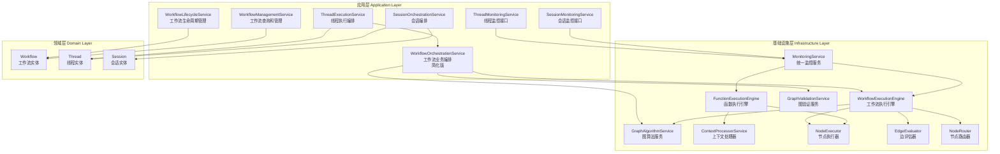
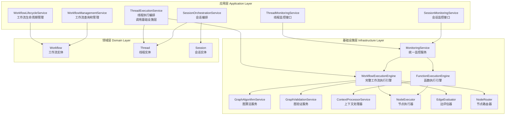

# Workflow模块架构分析报告

## 执行摘要

本报告分析了当前workflow模块在应用层和基础设施层的实现，识别了职责重复和架构不清晰的问题，并提出了重构建议。

## 一、当前架构概览

### 1.1 应用层Workflow服务

| 服务名称 | 文件路径 | 主要职责 |
|---------|---------|---------|
| `WorkflowLifecycleService` | `src/application/workflow/services/workflow-lifecycle-service.ts` | 工作流生命周期管理（创建、激活、停用、归档、删除） |
| `WorkflowManagementService` | `src/application/workflow/services/workflow-management-service.ts` | 工作流查询、列表、搜索、更新、标签管理 |
| `WorkflowOrchestrationService` | `src/application/workflow/services/workflow-orchestration-service.ts` | 工作流执行编排、验证、路径查询 |
| `FunctionOrchestrationService` | `src/application/workflow/services/function-orchestration-service.ts` | 函数编排执行、上下文管理 |
| `FunctionMonitoringService` | `src/application/workflow/services/function-monitoring-service.ts` | 函数执行监控、指标收集、告警 |
| `FunctionManagementService` | `src/application/workflow/services/function-management-service.ts` | 函数管理（未详细分析） |

### 1.2 基础设施层Workflow服务

| 服务名称 | 文件路径 | 主要职责 |
|---------|---------|---------|
| `WorkflowExecutionEngine` | `src/infrastructure/workflow/services/workflow-execution-engine.ts` | 工作流图遍历、节点执行、路由决策 |
| `GraphAlgorithmServiceImpl` | `src/infrastructure/workflow/services/graph-algorithm-service.ts` | 图算法（拓扑排序、循环检测、路径查找） |
| `GraphValidationServiceImpl` | `src/infrastructure/workflow/services/graph-validation-service.ts` | 图结构验证、业务规则验证 |
| `ContextProcessorServiceImpl` | `src/infrastructure/workflow/services/context-processor-service.ts` | 上下文处理器注册和执行 |
| `NodeExecutor` | `src/infrastructure/workflow/nodes/node-executor.ts` | 节点执行器 |
| `EdgeEvaluator` | `src/infrastructure/workflow/services/edge-evaluator.ts` | 边条件评估 |
| `NodeRouter` | `src/infrastructure/workflow/services/node-router.ts` | 节点路由决策 |

## 二、问题识别

### 2.1 职责重复问题

#### 问题1：工作流执行逻辑重复

**位置**：
- [`WorkflowOrchestrationService.executeWorkflow()`](src/application/workflow/services/workflow-orchestration-service.ts:80)
- [`WorkflowExecutionEngine.execute()`](src/infrastructure/workflow/services/workflow-execution-engine.ts:88)

**问题描述**：
- `WorkflowOrchestrationService` 包含了工作流执行的编排逻辑
- `WorkflowExecutionEngine` 提供了工作流执行的技术实现
- 两者职责边界不清晰，导致执行逻辑分散

**影响**：
- 代码重复
- 维护困难
- 违反单一职责原则

#### 问题2：验证逻辑重复

**位置**：
- [`WorkflowOrchestrationService.validateWorkflowExecutionEligibility()`](src/application/workflow/services/workflow-orchestration-service.ts:128)
- [`WorkflowOrchestrationService.validateWorkflowExecutable()`](src/application/workflow/services/workflow-orchestration-service.ts:207)
- [`GraphValidationServiceImpl.validateExecutable()`](src/infrastructure/workflow/services/graph-validation-service.ts:510)

**问题描述**：
- 应用层和基础设施层都有验证逻辑
- 验证规则分散在多处
- 业务规则验证和技术验证混合

**影响**：
- 验证逻辑不一致
- 难以统一管理验证规则

#### 问题3：函数编排与工作流执行重叠

**位置**：
- [`FunctionOrchestrationService`](src/application/workflow/services/function-orchestration-service.ts)
- [`WorkflowExecutionEngine`](src/infrastructure/workflow/services/workflow-execution-engine.ts)

**问题描述**：
- `FunctionOrchestrationService` 实现了函数级别的编排
- `WorkflowExecutionEngine` 已经包含了节点（函数）的执行逻辑
- 两者功能重叠，概念混淆

**影响**：
- 架构复杂度增加
- 开发者理解困难

### 2.2 职责不清问题

#### 问题4：应用层包含技术实现细节

**位置**：
- [`WorkflowOrchestrationService`](src/application/workflow/services/workflow-orchestration-service.ts)
- [`FunctionOrchestrationService`](src/application/workflow/services/function-orchestration-service.ts)
- [`FunctionMonitoringService`](src/application/workflow/services/function-monitoring-service.ts)

**问题描述**：
- 应用层服务包含了大量技术实现细节
- 执行策略、上下文管理等技术关注点在应用层
- 违反了分层架构原则

**影响**：
- 应用层职责过重
- 难以替换技术实现
- 测试困难

#### 问题5：监控服务归属不明确

**位置**：
- [`FunctionMonitoringService`](src/application/workflow/services/function-monitoring-service.ts)

**问题描述**：
- 监控是技术关注点，但在应用层实现
- 监控数据收集、指标计算等技术细节在应用层
- 缺乏统一的监控管理

**影响**：
- 监控逻辑分散
- 难以统一监控策略
- 技术债务累积

### 2.3 架构不一致问题

#### 问题6：依赖关系混乱

**问题描述**：
- `WorkflowOrchestrationService` 依赖 `WorkflowExecutionEngine`（应用层依赖基础设施层，正确）
- `ThreadExecutionService` 依赖 `WorkflowOrchestrationService`（应用层内部依赖，正确）
- 但 `WorkflowOrchestrationService` 包含了太多技术实现细节

**影响**：
- 层次边界模糊
- 难以理解和维护

## 三、架构原则分析

### 3.1 当前架构违反的原则

1. **单一职责原则（SRP）**
   - `WorkflowOrchestrationService` 职责过多（执行、验证、编排）
   - `FunctionOrchestrationService` 和 `FunctionMonitoringService` 职责不清

2. **依赖倒置原则（DIP）**
   - 应用层包含技术实现细节，应该依赖抽象

3. **关注点分离（SoC）**
   - 业务逻辑和技术实现混合
   - 监控逻辑分散

4. **分层架构原则**
   - 应用层包含基础设施层的职责
   - 层次边界不清晰

### 3.2 Workflow作为执行引擎的定位

**核心观点**：Workflow主要是作为执行引擎存在，应该主要在基础设施层实现。

**理由**：
1. 工作流执行是技术关注点，不是业务关注点
2. 工作流执行涉及图算法、节点路由、上下文管理等技术细节
3. 业务层只需要调用执行引擎，不需要了解执行细节
4. 执行引擎可以独立演进和优化

## 四、重构建议

### 4.1 核心重构原则

1. **Workflow执行引擎下沉到基础设施层**
   - 所有执行相关的逻辑都在基础设施层
   - 应用层只保留业务编排和协调

2. **应用层只保留必要的业务功能**
   - 工作流生命周期管理
   - 工作流查询和管理
   - 与thread交互的必要功能

3. **监控服务统一管理**
   - 监控是技术关注点，应该在基础设施层实现
   - 在thread或session层提供统一的监控接口

### 4.2 具体重构方案

#### 方案A：最小改动方案（推荐）

**目标**：最小化改动，逐步优化

**步骤**：

1. **保留应用层服务，但明确职责**
   - `WorkflowLifecycleService`：保留，职责清晰
   - `WorkflowManagementService`：保留，职责清晰
   - `WorkflowOrchestrationService`：简化，只保留业务编排
   - `FunctionOrchestrationService`：删除，功能合并到基础设施层
   - `FunctionMonitoringService`：移动到基础设施层

2. **增强基础设施层执行引擎**
   - `WorkflowExecutionEngine`：增强，承担更多执行逻辑
   - 新增 `FunctionExecutionEngine`：负责函数级别的执行
   - 新增 `MonitoringService`：统一监控服务

3. **监控服务归属**
   - 在基础设施层实现 `MonitoringService`
   - 在thread层提供 `ThreadMonitoringService`（应用层）
   - 在session层提供 `SessionMonitoringService`（应用层）

**架构图**：

#### 方案B：彻底重构方案

**目标**：彻底解决架构问题，但改动较大

**步骤**：

1. **删除应用层的执行相关服务**
   - 删除 `WorkflowOrchestrationService`
   - 删除 `FunctionOrchestrationService`
   - 删除 `FunctionMonitoringService`

2. **在基础设施层实现完整的执行引擎**
   - `WorkflowExecutionEngine`：完整的工作流执行引擎
   - `FunctionExecutionEngine`：函数执行引擎
   - `MonitoringService`：统一监控服务

3. **在应用层只保留业务服务**
   - `WorkflowLifecycleService`：工作流生命周期管理
   - `WorkflowManagementService`：工作流查询和管理
   - `ThreadExecutionService`：线程执行编排（调用基础设施层执行引擎）
   - `ThreadMonitoringService`：线程监控接口
   - `SessionOrchestrationService`：会话编排
   - `SessionMonitoringService`：会话监控接口

**架构图**：

### 4.3 监控服务归属建议

**建议**：监控服务应该在thread层或session层统一管理

**理由**：
1. 监控是跨工作流的关注点
2. thread是执行单元，监控thread更合理
3. session是业务单元，监控session可以提供业务视角
4. 统一监控可以避免重复代码

**实现方案**：

1. **基础设施层**：`MonitoringService`
   - 负责监控数据收集
   - 负责指标计算
   - 负责告警判断
   - 提供监控数据查询接口

2. **应用层**：`ThreadMonitoringService`
   - 提供thread级别的监控接口
   - 调用基础设施层的 `MonitoringService`
   - 提供业务相关的监控视图

3. **应用层**：`SessionMonitoringService`
   - 提供session级别的监控接口
   - 调用基础设施层的 `MonitoringService`
   - 提供业务相关的监控视图

## 五、重构优先级

### 高优先级（立即执行）

1. **删除 `FunctionOrchestrationService`**
   - 功能与 `WorkflowExecutionEngine` 重复
   - 概念混淆，增加复杂度

2. **移动 `FunctionMonitoringService` 到基础设施层**
   - 监控是技术关注点
   - 应该在基础设施层实现

3. **简化 `WorkflowOrchestrationService`**
   - 只保留业务编排逻辑
   - 将技术实现细节移到基础设施层

### 中优先级（近期执行）

1. **增强 `WorkflowExecutionEngine`**
   - 承担更多执行逻辑
   - 提供更完整的执行功能

2. **创建统一的 `MonitoringService`**
   - 在基础设施层实现
   - 提供统一的监控接口

3. **在thread层创建 `ThreadMonitoringService`**
   - 提供thread级别的监控接口
   - 调用基础设施层的监控服务

### 低优先级（长期优化）

1. **在session层创建 `SessionMonitoringService`**
   - 提供session级别的监控接口
   - 提供业务相关的监控视图

2. **优化验证逻辑**
   - 统一验证规则
   - 分离业务规则验证和技术验证

3. **优化依赖关系**
   - 明确层次边界
   - 减少层间耦合

## 六、风险评估

### 6.1 重构风险

1. **破坏现有功能**
   - 需要充分测试
   - 需要逐步重构

2. **影响现有接口**
   - 需要保持接口兼容性
   - 需要提供迁移路径

3. **增加开发成本**
   - 需要额外的开发时间
   - 需要团队学习新架构

### 6.2 不重构的风险

1. **技术债务累积**
   - 代码重复增加
   - 维护成本增加

2. **架构腐化**
   - 职责边界模糊
   - 难以扩展和优化

3. **开发效率降低**
   - 新功能开发困难
   - bug修复困难

## 七、总结

### 7.1 核心问题

1. **职责重复**：工作流执行逻辑在应用层和基础设施层重复
2. **职责不清**：应用层包含技术实现细节
3. **监控归属不明确**：监控服务在应用层，但应该是技术关注点

### 7.2 核心建议

1. **Workflow执行引擎主要在基础设施层实现**
2. **应用层只保留必要的业务功能**
3. **监控服务在thread或session层统一管理**

### 7.3 推荐方案

**推荐方案A（最小改动方案）**：
- 保留应用层服务，但明确职责
- 增强基础设施层执行引擎
- 监控服务统一管理

**理由**：
- 改动最小，风险可控
- 可以逐步优化
- 不影响现有功能

### 7.4 下一步行动

1. 与团队讨论本分析报告
2. 确认重构方案
3. 制定详细的重构计划
4. 开始执行重构