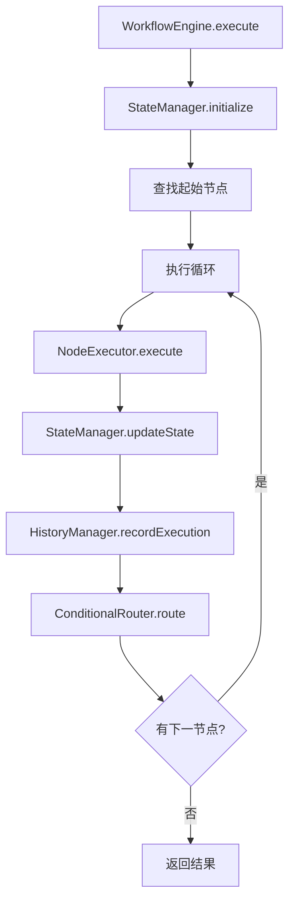

# 工作流基础功能差距分析与改进方案

## 概述

本文档重点分析当前项目工作流和状态相关实现的基础功能差距，识别需要改进的核心功能点，确保基础功能完整实现。

## 一、当前基础功能现状

### 1.1 已实现的基础功能

| 组件 | 实现状态 | 文件位置 |
|------|---------|---------|
| 工作流引擎 | ✅ 基本实现 | `src/domain/workflow/services/workflow-engine.ts` |
| 条件路由器 | ✅ 基本实现 | `src/domain/workflow/services/conditional-router.ts` |
| 表达式评估器 | ✅ 基本实现 | `src/domain/workflow/services/expression-evaluator.ts` |
| 状态管理器 | ✅ 基本实现 | `src/domain/workflow/services/state-manager.ts` |
| 历史管理器 | ✅ 基本实现 | `src/domain/workflow/services/history-manager.ts` |
| 节点执行器 | ⚠️ 部分实现 | `src/infrastructure/workflow/nodes/node-executor.ts` |
| 边值对象 | ✅ 完整实现 | `src/domain/workflow/value-objects/edge/` |
| 节点实体 | ✅ 完整实现 | `src/domain/workflow/entities/node.ts` |
| 工作流状态 | ✅ 基本实现 | `src/domain/workflow/value-objects/workflow-state.ts` |

### 1.2 核心执行流程



## 二、基础功能差距分析

### 2.1 节点执行器（NodeExecutor）

#### 当前实现

```typescript
// src/infrastructure/workflow/nodes/node-executor.ts
export class NodeExecutor {
  async execute(node: Node, context: WorkflowExecutionContext): Promise<any> {
    // 1. 验证节点配置
    const validation = node.validate();
    if (!validation.valid) {
      return { success: false, error: '验证失败' };
    }
    
    // 2. 直接执行节点
    const result = await node.execute(context);
    return result;
  }
  
  getSupportedNodeTypes(): string[] {
    return ['llm', 'tool', 'condition', 'task'];
  }
}
```

#### 存在的问题

1. **缺少具体节点类型执行逻辑**
   - 没有 LLM 节点执行器
   - 没有 Tool 节点执行器
   - 没有 Condition 节点执行器
   - 没有 Task 节点执行器

2. **错误处理不完善**
   - 没有节点执行超时机制
   - 没有重试逻辑
   - 没有详细的错误分类

3. **缺少执行上下文准备**
   - 没有节点参数解析
   - 没有变量替换
   - 没有依赖注入

#### 改进方案

```typescript
// src/infrastructure/workflow/nodes/node-executor.ts
export class NodeExecutor {
  private llmExecutor: LLMNodeExecutor;
  private toolExecutor: ToolNodeExecutor;
  private conditionExecutor: ConditionNodeExecutor;
  private taskExecutor: TaskNodeExecutor;
  
  constructor(
    @inject('Logger') private readonly logger: ILogger,
    @inject('LLMService') private readonly llmService: ILLMService,
    @inject('ToolRegistry') private readonly toolRegistry: IToolRegistry
  ) {
    this.llmExecutor = new LLMNodeExecutor(llmService, logger);
    this.toolExecutor = new ToolNodeExecutor(toolRegistry, logger);
    this.conditionExecutor = new ConditionNodeExecutor(logger);
    this.taskExecutor = new TaskNodeExecutor(logger);
  }
  
  async execute(node: Node, context: WorkflowExecutionContext): Promise<NodeExecutionResult> {
    try {
      // 1. 验证节点
      const validation = await this.validateNode(node, context);
      if (!validation.valid) {
        return this.createErrorResult(node, 'VALIDATION_ERROR', validation.errors);
      }
      
      // 2. 准备执行上下文
      const executionContext = await this.prepareExecutionContext(node, context);
      
      // 3. 执行节点（根据类型分发）
      const result = await this.executeByType(node, executionContext);
      
      // 4. 处理执行结果
      return await this.processExecutionResult(node, result);
      
    } catch (error) {
      return this.handleExecutionError(node, error);
    }
  }
  
  private async executeByType(
    node: Node, 
    context: WorkflowExecutionContext
  ): Promise<NodeExecutionResult> {
    switch (node.type.value) {
      case 'llm':
        return this.llmExecutor.execute(node, context);
      case 'tool':
        return this.toolExecutor.execute(node, context);
      case 'condition':
        return this.conditionExecutor.execute(node, context);
      case 'task':
        return this.taskExecutor.execute(node, context);
      default:
        throw new Error(`不支持的节点类型: ${node.type.value}`);
    }
  }
}
```

### 2.2 路由控制（ConditionalRouter）

#### 当前实现

```typescript
// src/domain/workflow/services/conditional-router.ts
export class ConditionalRouter {
  async route(
    edges: EdgeValueObject[],
    state: WorkflowState,
    options: RoutingOptions = {}
  ): Promise<RoutingResult | null> {
    // 1. 构建上下文
    const context = this.buildContext(state, options.customContext);
    
    // 2. 评估每条边
    for (const edge of edges) {
      const result = await this.evaluateEdge(edge, context);
      if (result.matched) {
        return {
          targetNodeId: edge.toNodeId.value,
          edgeId: edge.id.value,
          conditionResult: result.conditionResult
        };
      }
    }
    
    // 3. 检查默认边
    if (options.useDefaultEdge) {
      const defaultEdge = edges.find(edge => edge.isDefault());
      if (defaultEdge) {
        return {
          targetNodeId: defaultEdge.toNodeId.value,
          edgeId: defaultEdge.id.value,
          conditionResult: true
        };
      }
    }
    
    return null;
  }
}
```

#### 存在的问题

1. **缺少多路分支支持**
   - 只能返回单条边
   - 不支持并行路由
   - 不支持广播路由（一条边到多个目标）

2. **路由决策不透明**
   - 没有路由决策日志
   - 没有调试信息
   - 无法追踪为什么选择了某条边

3. **缺少路由策略**
   - 没有权重优先策略
   - 没有随机选择策略
   - 没有轮询策略

#### 改进方案

```typescript
// src/domain/workflow/services/conditional-router.ts
export class ConditionalRouter {
  /**
   * 单路路由（当前行为）
   */
  async route(
    edges: EdgeValueObject[],
    state: WorkflowState,
    options: RoutingOptions = {}
  ): Promise<RoutingResult | null> {
    // ... 现有实现 ...
  }
  
  /**
   * 多路路由（新增）
   * 返回所有匹配的边
   */
  async routeMultiple(
    edges: EdgeValueObject[],
    state: WorkflowState,
    options: RoutingOptions = {}
  ): Promise<RoutingResult[]> {
    const context = this.buildContext(state, options.customContext);
    const results: RoutingResult[] = [];
    
    // 评估所有边，收集匹配的
    for (const edge of edges) {
      const evaluation = await this.evaluateEdgeWithLogging(edge, context);
      
      if (evaluation.matched) {
        results.push({
          targetNodeId: edge.toNodeId.value,
          edgeId: edge.id.value,
          conditionResult: evaluation.conditionResult,
          metadata: {
            evaluationDetails: evaluation.details
          }
        });
      }
    }
    
    // 记录路由决策
    this.logRoutingDecision(state.workflowId.value, edges, results);
    
    return results;
  }
  
  /**
   * 带日志的边评估
   */
  private async evaluateEdgeWithLogging(
    edge: EdgeValueObject,
    context: Record<string, any>
  ): Promise<{
    matched: boolean;
    conditionResult?: boolean;
    details: any;
  }> {
    const startTime = Date.now();
    
    try {
      const result = await this.evaluateEdge(edge, context);
      
      return {
        ...result,
        details: {
          edgeId: edge.id.value,
          edgeType: edge.type.value,
          condition: edge.condition,
          evaluationTime: Date.now() - startTime,
          timestamp: new Date().toISOString()
        }
      };
    } catch (error) {
      return {
        matched: false,
        details: {
          edgeId: edge.id.value,
          error: error instanceof Error ? error.message : String(error),
          evaluationTime: Date.now() - startTime,
          timestamp: new Date().toISOString()
        }
      };
    }
  }
}
```

### 2.3 工作流引擎（WorkflowEngine）

#### 当前实现

```typescript
// src/domain/workflow/services/workflow-engine.ts
export class WorkflowEngine {
  async execute(
    workflow: Workflow,
    threadId: string,
    initialState: Record<string, any>,
    options: WorkflowExecutionOptions = {}
  ): Promise<WorkflowExecutionResult> {
    // 1. 初始化状态
    this.stateManager.initialize(threadId, workflow.workflowId, initialState);
    
    // 2. 查找起始节点
    let currentNodeId = this.findStartNode(workflow);
    
    // 3. 执行循环
    while (currentNodeId && executedNodes < maxSteps) {
      // 执行节点...
      
      // 路由决策
      const routingResult = await this.router.route(outgoingEdges, currentState);
      
      if (!routingResult) {
        break;  // 没有可用的路由
      }
      
      currentNodeId = routingResult.targetNodeId;
    }
    
    return { success: true, finalState, executedNodes };
  }
}
```

#### 存在的问题

1. **错误处理不完善**
   - 没有节点级错误处理
   - 没有工作流级错误恢复
   - 没有重试机制

2. **缺少执行控制**
   - 不能暂停/恢复执行
   - 不能取消执行
   - 没有执行进度报告

3. **缺少检查点机制**
   - 检查点创建逻辑简单
   - 没有检查点清理
   - 恢复机制不完善

#### 改进方案

```typescript
// src/domain/workflow/services/workflow-engine.ts
export class WorkflowEngine {
  private activeExecutions: Map<string, ExecutionController>;
  
  constructor(...) {
    this.activeExecutions = new Map();
  }
  
  async execute(
    workflow: Workflow,
    threadId: string,
    initialState: Record<string, any>,
    options: WorkflowExecutionOptions = {}
  ): Promise<WorkflowExecutionResult> {
    const controller = new ExecutionController(threadId);
    this.activeExecutions.set(threadId, controller);
    
    try {
      return await this.executeWithControl(workflow, threadId, initialState, options, controller);
    } finally {
      this.activeExecutions.delete(threadId);
    }
  }
  
  private async executeWithControl(
    workflow: Workflow,
    threadId: string,
    initialState: Record<string, any>,
    options: WorkflowExecutionOptions,
    controller: ExecutionController
  ): Promise<WorkflowExecutionResult> {
    // 1. 初始化
    await this.initializeExecution(workflow, threadId, initialState);
    
    // 2. 执行循环（带控制）
    while (this.shouldContinueExecution(controller, executedNodes, maxSteps)) {
      // 检查是否暂停
      if (controller.isPaused) {
        await controller.waitForResume();
      }
      
      // 检查是否取消
      if (controller.isCancelled) {
        throw new Error('Execution cancelled');
      }
      
      try {
        // 执行节点（带错误处理）
        const result = await this.executeNodeWithRetry(
          node,
          nodeContext,
          options.maxRetries || 0
        );
        
        // 更新状态
        this.updateExecutionState(threadId, result, node);
        
        // 创建检查点
        await this.createCheckpointIfNeeded(
          threadId,
          workflow,
          currentNodeId,
          executedNodes,
          options
        );
        
      } catch (error) {
        // 节点执行错误处理
        const handled = await this.handleNodeExecutionError(
          error,
          node,
          threadId,
          workflow
        );
        
        if (!handled) {
          throw error;  // 无法处理，抛出异常
        }
      }
      
      // 路由决策
      const routingResult = await this.router.route(outgoingEdges, currentState);
      
      if (!routingResult) {
        controller.setCompleted();
        break;
      }
      
      currentNodeId = routingResult.targetNodeId;
      executedNodes++;
    }
    
    return this.buildExecutionResult(threadId, executedNodes, startTime);
  }
  
  /**
   * 暂停执行
   */
  pauseExecution(threadId: string): void {
    const controller = this.activeExecutions.get(threadId);
    if (controller) {
      controller.pause();
    }
  }
  
  /**
   * 恢复执行
   */
  resumeExecution(threadId: string): void {
    const controller = this.activeExecutions.get(threadId);
    if (controller) {
      controller.resume();
    }
  }
  
  /**
   * 取消执行
   */
  cancelExecution(threadId: string): void {
    const controller = this.activeExecutions.get(threadId);
    if (controller) {
      controller.cancel();
    }
  }
}

/**
 * 执行控制器
 */
class ExecutionController {
  public isPaused = false;
  public isCancelled = false;
  public isCompleted = false;
  private resumePromise?: Promise<void>;
  private resumeResolve?: () => void;
  
  constructor(public readonly threadId: string) {}
  
  pause(): void {
    this.isPaused = true;
  }
  
  resume(): void {
    this.isPaused = false;
    if (this.resumeResolve) {
      this.resumeResolve();
      this.resumeResolve = undefined;
    }
  }
  
  cancel(): void {
    this.isCancelled = true;
    this.resume();
  }
  
  setCompleted(): void {
    this.isCompleted = true;
  }
  
  async waitForResume(): Promise<void> {
    if (!this.isPaused) return;
    
    this.resumePromise = new Promise(resolve => {
      this.resumeResolve = resolve;
    });
    
    await this.resumePromise;
  }
}
```

### 2.4 状态管理（StateManager）

#### 当前实现

```typescript
// src/domain/workflow/services/state-manager.ts
export class StateManager {
  private states: Map<string, WorkflowState>;
  
  initialize(threadId: string, workflowId: ID, initialState: Record<string, any> = {}): void {
    const state = WorkflowState.initial(workflowId);
    const updatedState = this.updateStateData(state, initialState);
    this.states.set(threadId, updatedState);
  }
  
  updateState(threadId: string, updates: Record<string, any>): WorkflowState {
    const currentState = this.states.get(threadId);
    const updatedState = this.updateStateData(currentState, updates);
    this.states.set(threadId, updatedState);
    return updatedState;
  }
}
```

#### 存在的问题

1. **缺少状态验证**
   - 没有状态模式验证
   - 没有必填字段检查
   - 没有类型验证

2. **状态更新不透明**
   - 没有更新日志
   - 无法追踪状态变化
   - 没有变更事件

3. **缺少状态查询功能**
   - 不支持复杂查询
   - 没有状态快照
   - 无法比较状态差异

#### 改进方案

```typescript
// src/domain/workflow/services/state-manager.ts
export class StateManager {
  private states: Map<string, WorkflowState>;
  private stateHistory: Map<string, StateChange[]>;
  private stateValidators: Map<string, StateValidator>;
  
  constructor() {
    this.states = new Map();
    this.stateHistory = new Map();
    this.stateValidators = new Map();
  }
  
  /**
   * 注册状态验证器
   */
  registerValidator(workflowId: string, validator: StateValidator): void {
    this.stateValidators.set(workflowId, validator);
  }
  
  /**
   * 初始化状态（带验证）
   */
  initialize(
    threadId: string,
    workflowId: ID,
    initialState: Record<string, any> = {},
    schema?: StateSchema
  ): void {
    // 验证初始状态
    if (schema) {
      const validation = schema.validate(initialState);
      if (!validation.valid) {
        throw new Error(`状态验证失败: ${validation.errors.join(', ')}`);
      }
    }
    
    // 创建初始状态
    let state = WorkflowState.initial(workflowId);
    
    // 如果有 schema，使用 schema 创建初始状态
    if (schema) {
      const validatedState = schema.createInitialState();
      state = this.updateStateData(state, validatedState);
    }
    
    // 应用用户提供的初始值
    if (Object.keys(initialState).length > 0) {
      state = this.updateStateData(state, initialState);
    }
    
    this.states.set(threadId, state);
    
    // 记录初始化历史
    this.recordStateChange(threadId, 'initialize', {}, state.data);
  }
  
  /**
   * 更新状态（带验证和日志）
   */
  updateState(
    threadId: string,
    updates: Record<string, any>,
    options: UpdateOptions = {}
  ): WorkflowState {
    const currentState = this.states.get(threadId);
    
    if (!currentState) {
      throw new Error(`线程 ${threadId} 的状态不存在`);
    }
    
    // 验证更新
    if (options.validate !== false) {
      const validator = this.stateValidators.get(currentState.workflowId.value);
      if (validator) {
        const validation = validator.validateUpdates(currentState.data, updates);
        if (!validation.valid) {
          throw new Error(`状态更新验证失败: ${validation.errors.join(', ')}`);
        }
      }
    }
    
    // 记录变更前状态
    const beforeState = { ...currentState.data };
    
    // 更新状态
    let updatedState: WorkflowState;
    if (currentState.schema) {
      // 使用 schema 的 reducer 更新
      const newData = currentState.schema.updateState(currentState.data, updates);
      updatedState = WorkflowState.fromProps({
        ...currentState.toProps(),
        data: newData,
        updatedAt: Timestamp.now()
      });
    } else {
      // 回退到简单合并
      updatedState = this.updateStateData(currentState, updates);
    }
    
    // 保存状态
    this.states.set(threadId, updatedState);
    
    // 记录变更历史
    this.recordStateChange(threadId, 'update', beforeState, updatedState.data, updates);
    
    // 触发变更事件
    if (options.emitEvent !== false) {
      this.emitStateChangeEvent(threadId, beforeState, updatedState.data, updates);
    }
    
    return updatedState;
  }
  
  /**
   * 获取状态变更历史
   */
  getStateHistory(threadId: string, limit?: number): StateChange[] {
    const history = this.stateHistory.get(threadId) || [];
    return limit ? history.slice(-limit) : history;
  }
  
  /**
   * 记录状态变更（私有方法）
   */
  private recordStateChange(
    threadId: string,
    type: string,
    before: Record<string, any>,
    after: Record<string, any>,
    updates?: Record<string, any>
  ): void {
    if (!this.stateHistory.has(threadId)) {
      this.stateHistory.set(threadId, []);
    }
    
    const history = this.stateHistory.get(threadId)!;
    const change: StateChange = {
      type,
      timestamp: Date.now(),
      before,
      after,
      updates,
      diff: this.calculateDiff(before, after)
    };
    
    history.push(change);
    
    // 限制历史记录数量
    if (history.length > 1000) {
      history.shift();
    }
  }
  
  /**
   * 计算状态差异（私有方法）
   */
  private calculateDiff(
    before: Record<string, any>,
    after: Record<string, any>
  ): Record<string, { before: any; after: any }> {
    const diff: Record<string, { before: any; after: any }> = {};
    
    // 检查所有键
    const allKeys = new Set([...Object.keys(before), ...Object.keys(after)]);
    
    for (const key of allKeys) {
      const beforeValue = before[key];
      const afterValue = after[key];
      
      if (JSON.stringify(beforeValue) !== JSON.stringify(afterValue)) {
        diff[key] = { before: beforeValue, after: afterValue };
      }
    }
    
    return diff;
  }
}

/**
 * 状态变更接口
 */
interface StateChange {
  type: string;
  timestamp: number;
  before: Record<string, any>;
  after: Record<string, any>;
  updates?: Record<string, any>;
  diff: Record<string, { before: any; after: any }>;
}

/**
 * 更新选项接口
 */
interface UpdateOptions {
  validate?: boolean;
  emitEvent?: boolean;
}

/**
 * 状态验证器接口
 */
interface StateValidator {
  validateUpdates(current: Record<string, any>, updates: Record<string, any>): ValidationResult;
}
```

## 三、基础功能改进优先级

### 3.1 高优先级（核心功能）

1. **节点执行器增强**
   - 实现 LLM 节点执行器
   - 实现 Tool 节点执行器
   - 实现 Condition 节点执行器
   - 添加执行超时机制
   - 添加重试逻辑

2. **路由控制增强**
   - 实现多路路由（routeMultiple）
   - 添加路由决策日志
   - 支持并行路由

3. **工作流引擎增强**
   - 完善错误处理机制
   - 添加节点级错误恢复
   - 实现执行暂停/恢复/取消

### 3.2 中优先级（重要功能）

1. **状态管理增强**
   - 添加状态验证
   - 实现状态变更日志
   - 添加状态查询功能

2. **检查点机制**
   - 完善检查点创建逻辑
   - 实现检查点清理
   - 增强恢复机制

3. **历史管理**
   - 添加执行历史查询
   - 实现历史数据分析
   - 添加历史清理机制

### 3.3 低优先级（优化功能）

1. **性能优化**
   - 添加执行缓存
   - 优化状态更新
   - 减少内存占用

2. **监控和日志**
   - 添加执行指标
   - 实现性能监控
   - 添加调试信息

## 四、实施建议

### 4.1 第一阶段：节点执行器完善（1-2周）

1. 创建具体的节点执行器类
2. 实现节点参数解析和验证
3. 添加执行超时和重试机制
4. 编写单元测试

### 4.2 第二阶段：路由控制增强（1周）

1. 实现多路路由方法
2. 添加路由决策日志
3. 支持并行路由场景
4. 集成到工作流引擎

### 4.3 第三阶段：工作流引擎完善（1-2周）

1. 完善错误处理机制
2. 实现执行控制（暂停/恢复/取消）
3. 增强检查点机制
4. 集成测试

### 4.4 第四阶段：状态管理增强（1周）

1. 添加状态验证
2. 实现状态变更日志
3. 添加状态查询功能
4. 性能优化

## 五、验收标准

### 5.1 节点执行器

- [ ] 支持 LLM、Tool、Condition、Task 四种节点类型
- [ ] 执行超时机制正常工作
- [ ] 重试逻辑正确实现
- [ ] 错误处理完善
- [ ] 单元测试覆盖率 > 80%

### 5.2 路由控制

- [ ] 多路路由返回所有匹配的边
- [ ] 路由决策日志完整记录
- [ ] 支持并行路由场景
- [ ] 集成测试通过

### 5.3 工作流引擎

- [ ] 错误处理机制完善
- [ ] 支持暂停/恢复/取消执行
- [ ] 检查点机制正常工作
- [ ] 恢复机制正确实现
- [ ] 集成测试通过

### 5.4 状态管理

- [ ] 状态验证正常工作
- [ ] 状态变更日志完整记录
- [ ] 状态查询功能正常
- [ ] 性能满足要求

## 六、风险评估

### 6.1 技术风险

| 风险 | 概率 | 影响 | 应对措施 |
|------|------|------|---------|
| 节点执行器复杂度超预期 | 中 | 高 | 提前设计，分阶段实现 |
| 路由控制性能问题 | 低 | 中 | 性能测试，优化算法 |
| 状态管理内存占用过高 | 低 | 中 | 限制历史记录，定期清理 |

### 6.2 进度风险

| 风险 | 概率 | 影响 | 应对措施 |
|------|------|------|---------|
| 需求变更 | 中 | 中 | 保持沟通，灵活调整 |
| 依赖服务不稳定 | 低 | 高 | 添加降级方案，增加重试 |

## 七、下一步行动

1. **立即行动**（本周）
   - 评审本分析文档
   - 确定优先级和排期
   - 分配开发资源

2. **短期行动**（下周）
   - 开始节点执行器实现
   - 设计详细接口
   - 编写单元测试

3. **中期行动**（本月）
   - 完成核心功能实现
   - 进行集成测试
   - 性能优化

4. **长期行动**（下月）
   - 完善监控和日志
   - 文档编写
   - 用户验收测试