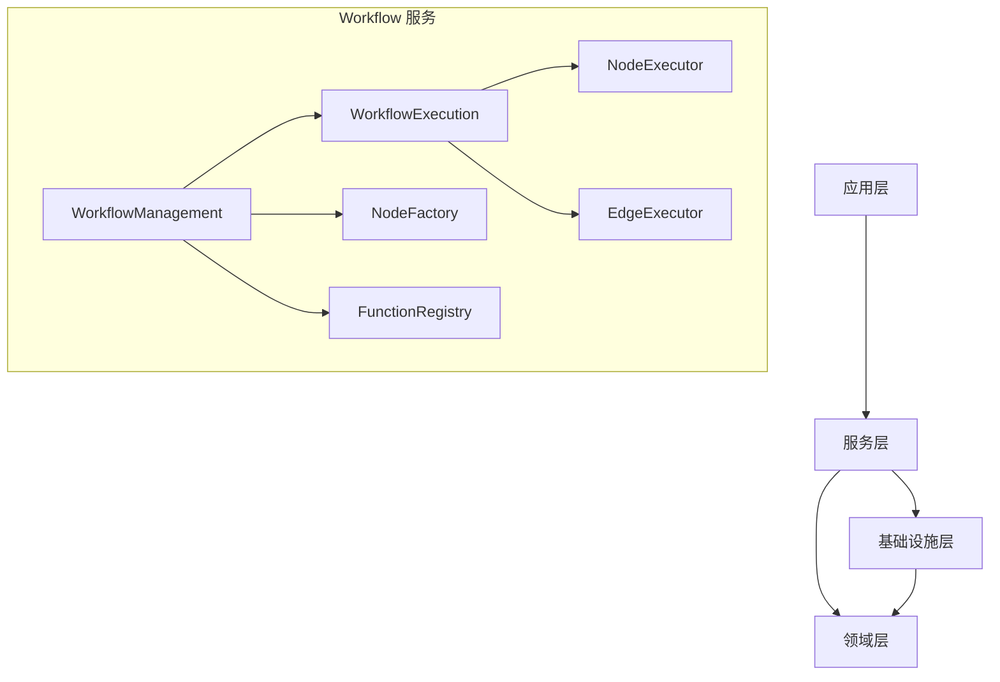

# Workflow 组件分析报告

## 概述
本报告分析了 `src/services/workflow` 目录中各个组件的创建方式和现有实现问题。

**注意**: 项目已有完善的错误处理机制（`src/infrastructure/common/error-handlers/error-handler.ts`），无需额外创建错误类型。

## 目录结构分析
`src/services/workflow` 目录包含以下主要组件：

### 核心服务
- `workflow-management.ts` - 工作流管理服务
- `workflow-execution.ts` - 工作流执行引擎
- `workflow-lifecycle.ts` - 工作流生命周期管理
- `workflow-merger.ts` - 工作流合并器
- `workflow-validator.ts` - 工作流验证器

### 节点相关
- `nodes/` - 节点实现和工厂
  - `node-factory.ts` - 节点工厂
  - `node-executor.ts` - 节点执行器
  - 各种节点类型：LLM、工具调用、条件等

### 函数相关
- `functions/` - 函数注册表和各类函数
  - `function-registry.ts` - 函数注册表
  - `function-execution-engine.ts` - 函数执行引擎
  - 各类函数：条件、路由、触发器、钩子等

### 其他组件
- `edges/` - 边执行器
- `hooks/` - 钩子执行器
- `triggers/` - 触发器执行器
- `validators/` - 验证器
- `dtos/` - 数据传输对象

## 组件创建模式分析

### 1. 工厂模式 (Factory Pattern)
- **节点工厂** (`NodeFactory`): 使用配置驱动的创建方式，支持多种节点类型
- **钩子工厂** (`HookFactory`): 创建钩子实例
- **函数工厂** (`FunctionFactory`): 支持动态配置的函数创建

### 2. 注册表模式 (Registry Pattern)
- **函数注册表** (`FunctionRegistry`): 支持单例和工厂两种注册模式
  - 单例模式：注册预实例化的函数
  - 工厂模式：注册函数工厂，支持动态配置
  - 类型化映射：按函数类型（条件、路由、触发器等）组织

### 3. 依赖注入 (Dependency Injection)
- 使用 `inversify` 框架进行依赖注入
- 所有服务类都使用 `@injectable()` 装饰器
- 构造函数注入依赖，符合依赖倒置原则

### 4. 配置驱动创建
- 节点创建通过 `NodeConfig` 接口统一配置
- 函数创建支持运行时配置注入
- 支持环境变量和配置文件加载

## 依赖关系分析

### 架构约束符合性
根据项目架构规范，各层依赖关系应为：
- **Domain层**: 不依赖任何其他层
- **Infrastructure层**: 只能依赖Domain层
- **Services层**: 可以依赖Domain层和Infrastructure层
- **Application层**: 只能依赖Services层

**分析结果**:
1. **Services层组件** (`src/services/workflow/`) 主要依赖：
   - Domain层：正确
   - Infrastructure层：正确
   - 其他Services层组件：允许

2. **未发现** Services层直接依赖Application层的情况

3. **潜在问题**: 部分组件可能过度耦合，但整体符合架构约束

## 现有实现问题识别

### 1. 类型安全问题
- **问题**: `workflow-management.ts` 中使用 `require()` 动态导入
  ```typescript
  private parseWorkflowStatus(status: string) {
    const { WorkflowStatus } = require('../../domain/workflow');
    return WorkflowStatus.fromString(status);
  }
  ```
- **影响**: 破坏TypeScript的类型检查和静态分析
- **建议**: 改为静态导入

### 2. 硬编码问题
- **问题**: `NodeFactory` 中硬编码了类型别名映射
  ```typescript
  this.typeAliases = new Map<string, NodeTypeValue>([
    ['start', NodeTypeValue.START],
    ['end', NodeTypeValue.END],
    // ...
  ]);
  ```
- **影响**: 扩展新节点类型需要修改代码
- **建议**: 改为配置驱动或自动发现机制

### 3. 循环依赖风险
- **问题**: 组件间可能存在隐式循环依赖
  - `WorkflowExecutionEngine` 依赖 `NodeExecutor`
  - `NodeExecutor` 可能间接依赖其他执行组件
- **影响**: 可能导致运行时错误或初始化问题
- **建议**: 进行依赖图分析，确保无循环依赖

### 4. 错误处理不一致
- **问题**: 不同组件的错误处理策略不一致
  - 有些使用 `throw new Error()`
  - 有些返回 `{ success: false, error: ... }`
  - 有些使用自定义错误类型
- **影响**: 调用方需要处理多种错误格式
- **建议**: 统一错误处理策略和错误类型

### 5. 性能问题
- **问题**: `workflow-management.ts` 中的列表查询实现
  ```typescript
  // 获取所有工作流再过滤（内存中过滤）
  const allWorkflows = await this.workflowRepository.findAll();
  // ... 应用过滤条件
  ```
- **影响**: 数据量大时性能问题
- **建议**: 在仓储层实现分页和过滤

### 6. 可测试性问题
- **问题**: 部分组件构造函数参数过多
  ```typescript
  constructor(
    @inject('NodeRouter') nodeRouter: NodeRouter,
    @inject('NodeExecutor') nodeExecutor: NodeExecutor,
    @inject('EdgeExecutor') edgeExecutor: EdgeExecutor,
    @inject(TYPES.ContextManagement) contextManagement: ContextManagement,
    @inject('Logger') logger: ILogger
  )
  ```
- **影响**: 单元测试时需要大量mock
- **建议**: 使用聚合服务或参数对象

### 6. 配置复杂性
- **问题**: `NodeConfig` 接口过于复杂
  ```typescript
  export interface NodeConfig {
    // 通用属性
    id?: string;
    type: string;
    // ... 各种节点类型的配置混合在一起
  }
  ```
- **影响**: 配置容易出错，类型安全难以保证
- **建议**: 使用 discriminated union 或子接口

## 改进建议

### 1. 类型安全改进
- 将所有 `require()` 调用改为静态导入
- 为配置接口添加更严格的类型约束
- 使用 TypeScript 的 discriminated union 处理不同类型配置

### 2. 配置驱动优化
- 将硬编码的类型映射移到配置文件
- 支持插件式扩展新节点类型
- 实现自动发现机制

### 3. 性能优化
- 在仓储层实现分页、过滤、排序
- 添加查询缓存机制
- 优化工作流执行时的上下文管理

### 4. 测试性改进
- 提取参数对象减少构造函数参数
- 提供测试辅助工具
- 增加接口抽象层

### 5. 架构优化


### 7. 代码质量提升
- 增加代码覆盖率要求
- 实施代码审查规范
- 添加性能监控和日志

## 总结

`src/services/workflow` 目录的实现整体质量较高，体现了良好的架构设计思想，包括：

**优点**:
1. 清晰的层次结构和职责分离
2. 灵活的工厂和注册表模式
3. 完善的依赖注入支持
4. 丰富的功能组件覆盖
5. 已有完善的错误处理机制

**需要改进的方面**:
1. 类型安全和静态分析
2. 配置管理和扩展性
3. 性能和可测试性

**优先级建议**:
1. **高优先级**: 修复类型安全问题
2. **中优先级**: 优化性能，改进配置管理
3. **低优先级**: 架构重构，测试性改进

通过实施上述改进建议，可以显著提升系统的可维护性、可扩展性和可靠性。

## 已完成的改进

### 1. 修复类型安全问题 ✅
- 将 `workflow-management.ts` 中的 `require()` 改为静态导入
- 添加了 `WorkflowType` 的静态导入
- 修改了方法的返回类型注解

### 2. 优化列表查询性能 ✅
- 在仓储层添加了 `WorkflowQueryFilter`、`PaginationParams` 和 `PaginatedResult` 接口
- 添加了 `queryWithFilter()` 方法，支持数据库层面的过滤和分页
- 修改了 `listWorkflows()` 方法，使用仓储层的复合查询替代内存过滤

### 3. 改进 NodeFactory 配置管理 ✅
- 创建了 `NodeTypeConfig` 类，集中管理节点类型映射
- 支持动态注册和注销节点类型
- 消除了硬编码的类型别名映射

### 4. 简化 NodeConfig 接口 ✅
- 使用 discriminated union 重构 `NodeConfig` 类型
- 为每种节点类型创建了独立的配置接口
- 提供了完整的类型安全保证