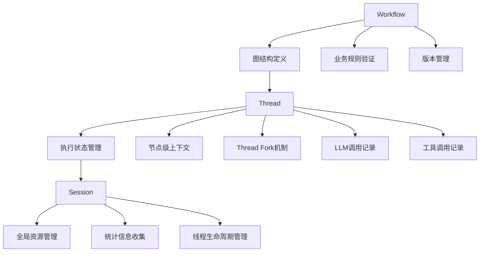

# Workflow Entities状态管理分析报告

## 概述

本报告分析了src\domain\workflow\entities目录中状态相关实体的设计问题，并提出了符合Workflow-Thread-Session架构的重构方案。

## 当前状态管理架构分析

### entities目录中的状态相关实体

**存在问题的实体：**
- [`execution-state.ts`](src/domain/workflow/entities/execution-state.ts:1) - 执行状态实体
- [`workflow-state.ts`](src/domain/workflow/entities/workflow-state.ts:1) - 工作流状态实体  
- [`node-execution-state.ts`](src/domain/workflow/entities/node-execution-state.ts:1) - 节点执行状态实体

### value-objects目录中的相关定义

**可以保留的值对象：**
- [`execution-status.ts`](src/domain/workflow/value-objects/execution-status.ts:1) - 执行状态值对象
- [`workflow-status.ts`](src/domain/workflow/value-objects/workflow-status.ts:1) - 工作流状态值对象
- [`node-status.ts`](src/domain/workflow/value-objects/node-status.ts:1) - 节点状态值对象

## 设计理念符合性分析

### 不符合设计理念的问题

#### 1. 职责边界混淆

**问题：** Workflow实体包含了本应由Thread管理的执行状态

**证据：**
- [`workflow.ts`](src/domain/workflow/entities/workflow.ts:1)实体包含了执行状态相关属性
- [`execution-state.ts`](src/domain/workflow/entities/execution-state.ts:1)实体管理了执行状态

**违反原则：**
- Workflow应该作为"静态蓝图"，专注于图结构定义
- 执行状态管理应该由Thread负责

#### 2. 状态管理职责错位

**问题：** 执行状态管理分散在多个实体中

**影响：**
- 职责不清晰，难以维护
- 不符合Workflow-Thread-Session的职责划分
- 增加了系统的复杂性

### 符合设计理念的部分

#### Thread实体设计良好

**优点：**
- [`thread.ts`](src/domain/threads/entities/thread.ts:1)实体设计符合Thread作为"执行引擎"的职责
- 包含了完整的执行状态管理
- 支持状态转换和进度跟踪

#### 值对象设计合理

**优点：**
- 相关的状态值对象设计良好
- 可以作为静态的类型定义使用
- 支持不变性和验证

## 重构方案

### 需要删除的实体

**建议直接删除：**
- `execution-state.ts` - 执行状态应该由Thread管理
- `workflow-state.ts` - 工作流状态应该由Thread管理  
- `node-execution-state.ts` - 节点执行状态应该由Thread管理

**删除理由：**
1. 这些实体违反了职责分离原则
2. 执行状态管理应该集中在Thread实体中
3. 简化架构，减少不必要的复杂性

### 需要简化的实体

**Workflow实体简化：**
- 移除所有执行状态相关属性
- 专注于图结构定义和验证
- 保持Workflow的静态性和可重用性

**简化后的Workflow职责：**
```typescript
// Workflow应该只关注图结构定义
interface SimplifiedWorkflow {
  // 图结构定义
  nodes: Map<NodeId, NodeData>;
  edges: Map<EdgeId, EdgeData>;
  
  // 业务规则验证
  validateStructure(): ValidationResult;
  validateBusinessRules(): ValidationResult;
  
  // 版本管理
  version: Version;
  createdAt: Timestamp;
}
```

### 需要增强的实体

#### Thread实体增强(直接在现有基础上增加即可，不需要新的接口定义)

**需要添加的功能：**
1. **节点级上下文管理**
   - 每个节点可以拥有独立的上下文
   - 支持复杂的工作流场景

2. **LLM调用记录**
   - 按节点记录LLM调用信息
   - 支持token使用统计

3. **工具调用记录**
   - 按节点记录工具调用结果
   - 支持错误处理和重试

4. **Thread Fork机制**
   - 支持上下文压缩和继承
   - 实现灵活的上下文管理

**增强后的ThreadExecution：**
```typescript
interface ThreadExecution {
  // 基础执行状态
  status: ThreadStatus;
  progress: number;
  
  // 节点级状态管理
  nodeStates: Map<NodeId, NodeExecutionState>;
  
  // 上下文管理
  contextVariables: Map<string, any>;
  promptContexts: Map<NodeId, PromptContext>;
  
  // LLM和工具调用记录
  llmCallRecords: Map<NodeId, LLMCallRecord[]>;
  toolCallRecords: Map<NodeId, ToolCallRecord[]>;
  
  // Thread Fork支持
  parentThreadId?: ID;
  forkPoint?: NodeId;
}
```

### 保留的内容

**value-objects目录中的定义可以保留：**
- 这些值对象可以作为静态的类型定义
- 支持Thread实体的状态管理
- 保持类型安全和验证

## 重构实施计划

### 阶段1：清理Workflow实体（高优先级）

**目标：** 删除不符合设计理念的状态相关实体

**任务：**
1. 删除`execution-state.ts`、`workflow-state.ts`、`node-execution-state.ts`
2. 简化Workflow实体，移除执行状态相关属性
3. 更新相关依赖和引用

**预计时间：** 1-2周

### 阶段2：增强Thread实体（中优先级）

**目标：** 实现完整的Thread级状态管理

**任务：**
1. 增强ThreadExecution值对象
2. 实现节点级上下文管理
3. 添加LLM和工具调用记录
4. 实现Thread Fork机制

**预计时间：** 3-4周

### 阶段3：完善Session实体（低优先级）

**目标：** 实现Session级统计管理

**任务：**
1. 实现Session级资源使用统计
2. 添加LLM使用统计
3. 实现性能监控

**预计时间：** 2-3周

## 架构调整后的状态管理



## 风险评估

### 技术风险
- **代码迁移风险**：需要重构现有代码，可能影响现有功能
- **兼容性风险**：需要确保现有工作流的兼容性
- **性能风险**：Thread级状态管理可能增加内存使用

### 实施风险
- **开发复杂度**：需要协调多个组件的重构
- **测试覆盖**：需要确保重构后的测试覆盖率
- **迁移计划**：需要制定详细的迁移计划

## 结论

**src\domain\workflow\entities目录中的状态相关实体定义不符合设计理念，应该：**

1. **直接删除**：`execution-state.ts`、`workflow-state.ts`、`node-execution-state.ts`
2. **转移功能**：相关的状态管理功能应该转移到Thread实体中
3. **简化Workflow**：移除所有执行状态相关属性，专注于图结构定义

这种重构将使架构更加符合Workflow-Thread-Session的职责划分，实现更清晰的状态管理职责分离。

## 下一步行动

1. **详细技术设计**：为每个重构阶段制定详细的技术设计方案
2. **原型验证**：实现关键功能原型进行验证
3. **分阶段实施**：按照优先级分阶段实施重构
4. **测试策略**：制定全面的测试策略确保重构质量
5. **迁移计划**：制定详细的代码迁移计划