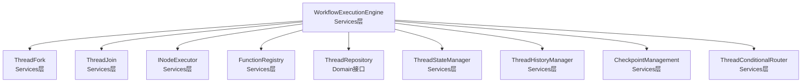
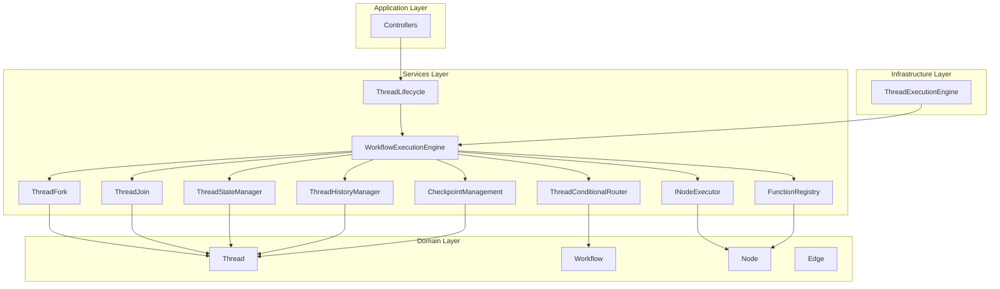
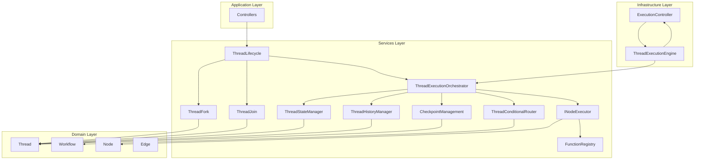
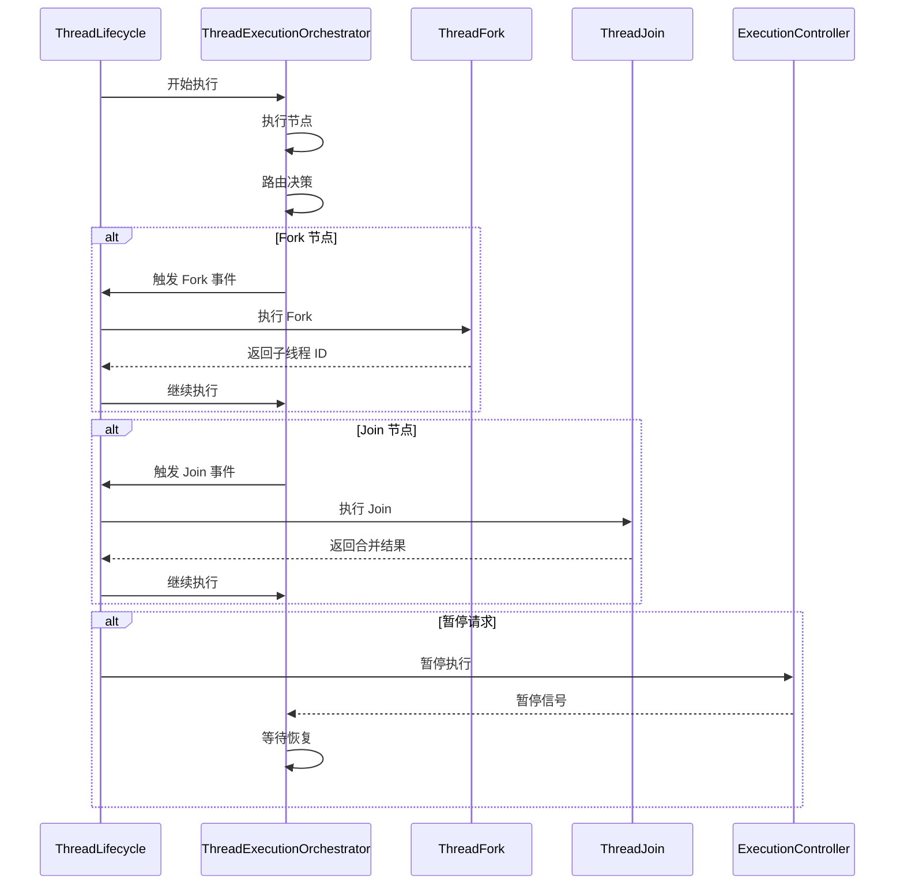

# WorkflowExecutionEngine 设计分析报告

## 执行摘要

[`workflow-execution-engine.ts`](../src/services/threads/workflow-execution-engine.ts) 存在多个设计问题，与项目的分层架构原则和职责划分不一致。主要问题包括命名不当、职责过重、违反分层架构、依赖关系混乱等。

---

## 一、核心问题分析

### 1.1 命名与职责不匹配

**问题描述：**
- 文件名为 `workflow-execution-engine.ts`，但实际上执行的是 **thread** 的工作流
- 注释声称"属于基础设施层"，但实际位于 `src/services/threads/` 目录（services 层）
- 职责描述为"协调工作流的执行"，但实际是在协调 **thread 的执行**

**影响：**
- 造成概念混淆，难以理解代码的真实职责
- 违反了"workflow 只提供定义，不承担执行逻辑"的架构原则

**建议：**
- 重命名为 `thread-workflow-executor.ts` 或 `thread-execution-orchestrator.ts`
- 明确其职责：协调 thread 内的工作流节点执行

---

### 1.2 违反分层架构原则

**问题描述：**

根据项目的分层架构规则：
- **Domain 层**：提供业务规则和实体
- **Infrastructure 层**：只能依赖 Domain 层
- **Services 层**：只能依赖 Domain 层和 Infrastructure 层
- **Application 层**：只能依赖 Services 层

当前设计的问题：



**违反点：**
1. 执行引擎承担了太多基础设施层的职责（执行控制、暂停/恢复/取消）
2. 直接处理 Fork/Join 逻辑，这些应该由 thread 层的专门服务处理
3. 混合了业务逻辑编排和技术实现细节

**建议：**
- 将执行控制逻辑（暂停/恢复/取消）移到基础设施层
- Fork/Join 处理应该由 ThreadFork 和 ThreadJoin 服务独立完成
- 执行引擎只负责节点执行顺序的协调

---

### 1.3 职责过重（违反单一职责原则）

**当前承担的职责：**

| 职责 | 方法 | 问题 |
|------|------|------|
| 节点执行 | `executeNodeWithRetry` | 应该由 INodeExecutor 负责 |
| 路由决策 | 调用 `router.route` | 应该由 ThreadConditionalRouter 负责 |
| Fork 处理 | `handleForkNode` | 应该由 ThreadFork 负责 |
| Join 处理 | `handleJoinNode` | 应该由 ThreadJoin 负责 |
| 状态管理 | 调用 `stateManager` | 应该由 ThreadStateManager 负责 |
| 检查点管理 | 创建检查点逻辑 | 应该由 CheckpointManagement 负责 |
| 执行控制 | `pauseExecution`, `resumeExecution`, `cancelExecution` | 应该在基础设施层 |
| 错误处理 | `handleNodeExecutionError` | 职责不清晰 |
| 子线程管理 | `startChildThread` | 应该由 ThreadLifecycle 负责 |
| 历史记录 | 调用 `historyManager` | 应该由 ThreadHistoryManager 负责 |

**问题：**
- 一个类承担了 10+ 个不同的职责
- 违反了单一职责原则（SRP）
- 难以测试、维护和扩展

**建议：**
- 将执行引擎重构为轻量级的协调器
- 每个职责由专门的服务负责
- 执行引擎只负责调用这些服务并协调执行顺序

---

### 1.4 与架构设计不一致

**项目架构原则：**
> "workflow 主要是用于提供工作流定义的，不承担执行逻辑"
> "fork、join 等操作也都是在 thread 层实现的"

**当前实现的问题：**

```typescript
// 第 296-304 行：直接处理 Fork/Join 节点
if (node instanceof ForkNode && nodeResult.success) {
  await this.handleForkNode(node, currentState, threadId, workflow);
}

if (node instanceof JoinNode && nodeResult.success) {
  await this.handleJoinNode(node, currentState, threadId);
}
```

**问题：**
- Fork/Join 节点的处理逻辑应该在 thread 层，而不是在执行引擎中
- 执行引擎不应该知道 ForkNode 和 JoinNode 的存在
- 这违反了"workflow 不承担执行逻辑"的原则

**建议：**
- Fork/Join 应该作为 thread 层的独立操作
- 执行引擎只负责执行普通节点
- Fork/Join 的触发应该由 ThreadLifecycle 或专门的协调器处理

---

### 1.5 依赖关系混乱

**当前依赖：**

```typescript
constructor(
  @inject(TYPES.ThreadStateManager) stateManager: ThreadStateManager,
  @inject(TYPES.ThreadHistoryManager) historyManager: ThreadHistoryManager,
  @inject(TYPES.CheckpointManagement) checkpointManagement: CheckpointManagement,
  @inject(TYPES.ThreadConditionalRouter) router: ThreadConditionalRouter,
  @inject(TYPES.NodeExecutor) nodeExecutor: INodeExecutor,
  @inject(TYPES.FunctionRegistry) functionRegistry: FunctionRegistry,
  @inject(TYPES.ThreadFork) threadFork: ThreadFork,
  @inject(TYPES.ThreadJoin) threadJoin: ThreadJoin,
  @inject(TYPES.ThreadRepository) threadRepository: IThreadRepository
)
```

**问题：**
1. 依赖了 9 个不同的服务，耦合度过高
2. 同时依赖了 thread 层和 workflow 层的服务
3. ThreadFork 和 ThreadJoin 的依赖表明职责划分不清

**建议：**
- 减少依赖，只保留核心依赖
- 通过事件或回调机制解耦
- Fork/Join 应该通过外部触发，而不是内部处理

---

### 1.6 检查点功能未实现

**问题代码：**

```typescript
// 第 268-274 行：检查点创建逻辑
if (enableCheckpoints && executedNodes - lastCheckpointStep >= checkpointInterval) {
  // 注意：这里需要通过 CheckpointManagement 创建检查点
  // 由于 CheckpointManagement 需要 Thread 对象，这里暂时跳过
  // 实际实现需要重构以支持直接创建检查点
  checkpointCount++;
  lastCheckpointStep = executedNodes;
}

// 第 408-418 行：恢复功能未实现
async resumeFromCheckpoint(
  workflow: Workflow,
  threadId: string,
  checkpointId: string,
  options: WorkflowExecutionOptions = {}
): Promise<WorkflowExecutionResult> {
  throw new Error('从检查点恢复功能需要重构以支持新的 CheckpointManagement 接口');
}
```

**问题：**
- 检查点创建逻辑不完整
- 恢复功能完全未实现
- 接口设计不兼容

**建议：**
- 重新设计检查点接口
- 实现完整的检查点创建和恢复逻辑
- 或者移除未实现的功能

---

### 1.7 子线程管理不当

**问题代码：**

```typescript
// 第 634-674 行：递归调用 execute 方法
private async startChildThread(
  childThreadId: string,
  workflow: Workflow,
  parentState: ThreadWorkflowState
): Promise<void> {
  // ...
  await this.execute(
    workflow,
    childThreadId,
    parentState.data,
    {
      enableCheckpoints: false,
      maxSteps: 1000,
      timeout: 300000,
    }
  );
}
```

**问题：**
- 递归调用可能导致执行栈过深
- 子线程应该由 ThreadLifecycle 管理，而不是执行引擎
- 缺乏对子线程生命周期的控制

**建议：**
- 子线程的启动应该由 ThreadLifecycle 负责
- 执行引擎只负责当前 thread 的执行
- 通过事件或回调机制通知 ThreadLifecycle 启动子线程

---

### 1.8 类型安全问题

**问题代码：**

```typescript
// 第 492-512 行：使用 any 类型
private async executeNodeWithRetry(
  node: any,  // ❌ 应该使用具体类型
  state: ThreadWorkflowState,
  threadId: string,
  options: { timeout: number; maxRetries: number; retryDelay: number }
): Promise<any> {  // ❌ 应该使用具体类型
  // ...
}

// 第 751-773 行：返回 any 类型
private buildNodeContext(state: ThreadWorkflowState, threadId: string): any {  // ❌
  // ...
}
```

**问题：**
- 使用 `any` 类型降低了类型安全性
- 难以进行静态类型检查
- 容易引入运行时错误

**建议：**
- 定义明确的接口类型
- 使用泛型或联合类型
- 避免使用 `any`

---

### 1.9 错误处理不完善

**问题代码：**

```typescript
// 第 685-720 行：错误处理逻辑
private async handleNodeExecutionError(
  error: any,  // ❌ 应该使用 Error 类型
  node: any,   // ❌ 应该使用具体类型
  threadId: string,
  workflow: Workflow,
  enableErrorRecovery: boolean
): Promise<boolean> {
  // ...
  if (enableErrorRecovery) {
    const errorEdges = workflow.getOutgoingEdges(node.nodeId).filter(edge => edge.isError());

    if (errorEdges.length > 0) {
      // 找到错误处理边，返回 true 表示已处理
      return true;  // ❌ 但实际上没有跳转到错误处理边
    }
  }
  // ...
}
```

**问题：**
- 错误处理逻辑不完整
- 找到错误处理边后没有实际跳转
- 错误恢复机制不可用

**建议：**
- 实现完整的错误处理流程
- 支持错误边的跳转
- 提供更详细的错误信息

---

### 1.10 执行控制机制复杂

**问题代码：**

```typescript
// 第 96-135 行：执行控制器
class WorkflowExecutionController implements ExecutionController {
  public isPaused = false;
  public isCancelled = false;
  public isCompleted = false;
  private resumePromise?: Promise<void>;
  private resumeResolve?: () => void;

  // ...
  async waitForResume(): Promise<void> {
    if (!this.isPaused) return;

    this.resumePromise = new Promise(resolve => {
      this.resumeResolve = resolve;
    });

    await this.resumePromise;
  }
}
```

**问题：**
- 执行控制逻辑应该在基础设施层
- 使用 Promise 实现暂停/恢复机制不够优雅
- 缺乏对并发执行的支持

**建议：**
- 将执行控制移到基础设施层
- 使用更成熟的并发控制机制（如信号量、锁）
- 支持多个 thread 的并发执行控制

---

## 二、架构问题总结

### 2.1 当前架构图



### 2.2 问题标注

1. **WorkflowExecutionEngine 职责过重**：依赖了 9 个服务
2. **Fork/Join 处理位置不当**：应该在 ThreadLifecycle 中处理
3. **执行控制逻辑位置错误**：应该在基础设施层
4. **检查点功能未实现**：接口不兼容
5. **子线程管理混乱**：递归调用可能导致问题

---

## 三、改进建议

### 3.1 重构方案一：简化执行引擎

**目标：** 将 WorkflowExecutionEngine 重构为轻量级的节点执行协调器

**职责划分：**

| 组件 | 职责 |
|------|------|
| **ThreadExecutionOrchestrator** | 协调节点执行顺序，调用各个服务 |
| **ThreadLifecycle** | 管理 thread 生命周期，处理 Fork/Join |
| **ThreadStateManager** | 管理状态 |
| **ThreadHistoryManager** | 管理历史记录 |
| **CheckpointManagement** | 管理检查点 |
| **ThreadConditionalRouter** | 处理路由决策 |
| **INodeExecutor** | 执行单个节点 |
| **ExecutionController** (Infrastructure) | 控制执行（暂停/恢复/取消） |

**新的架构图：**



**关键改进：**
1. Fork/Join 由 ThreadLifecycle 触发，不在执行引擎中处理
2. 执行控制逻辑移到基础设施层
3. 执行引擎只负责节点执行顺序的协调
4. 减少依赖，提高可测试性

---

### 3.2 重构方案二：事件驱动架构

**目标：** 使用事件机制解耦各个组件

**事件流：**



**关键改进：**
1. 使用事件机制解耦组件
2. Fork/Join 由 ThreadLifecycle 处理
3. 执行控制通过事件传递
4. 更灵活的扩展性

---

### 3.3 重构方案三：分层重构

**目标：** 严格按照分层架构重构

**新的分层：**

| 层 | 组件 | 职责 |
|----|------|------|
| **Application** | Controllers | HTTP/gRPC 接口 |
| **Services** | ThreadLifecycle | 业务逻辑编排 |
| | ThreadExecutionOrchestrator | 节点执行协调 |
| | ThreadFork | Fork 业务逻辑 |
| | ThreadJoin | Join 业务逻辑 |
| | ThreadStateManager | 状态管理 |
| | ThreadHistoryManager | 历史记录 |
| | CheckpointManagement | 检查点管理 |
| | ThreadConditionalRouter | 路由决策 |
| | INodeExecutor | 节点执行 |
| **Infrastructure** | ExecutionController | 执行控制 |
| | ThreadExecutionEngine | 执行引擎实现 |
| | ThreadRepositoryImpl | 持久化 |
| **Domain** | Thread | Thread 实体 |
| | Workflow | Workflow 实体 |
| | Node | 节点实体 |
| | Edge | 边实体 |

**依赖规则：**
- Application → Services
- Services → Domain + Infrastructure
- Infrastructure → Domain

---

## 四、具体改进建议

### 4.1 立即改进（高优先级）

1. **重命名文件**
   - `workflow-execution-engine.ts` → `thread-execution-orchestrator.ts`

2. **移除 Fork/Join 处理**
   - 删除 `handleForkNode` 和 `handleJoinNode` 方法
   - Fork/Join 由 ThreadLifecycle 处理

3. **修复类型安全问题**
   - 定义明确的接口类型
   - 移除 `any` 类型

4. **实现或移除检查点功能**
   - 完整实现检查点创建和恢复
   - 或者移除相关代码

### 4.2 中期改进（中优先级）

1. **减少依赖**
   - 只保留核心依赖
   - 通过事件或回调机制解耦

2. **重构执行控制**
   - 将执行控制逻辑移到基础设施层
   - 使用更成熟的并发控制机制

3. **改进错误处理**
   - 实现完整的错误处理流程
   - 支持错误边的跳转

### 4.3 长期改进（低优先级）

1. **考虑事件驱动架构**
   - 使用事件机制解耦组件
   - 提高扩展性

2. **优化子线程管理**
   - 由 ThreadLifecycle 管理子线程
   - 避免递归调用

3. **完善文档和注释**
   - 更新注释以反映实际职责
   - 添加架构文档

---

## 五、总结

### 5.1 主要问题

1. **命名不当**：文件名和职责不匹配
2. **职责过重**：承担了太多不同的职责
3. **违反分层架构**：混合了业务逻辑和技术实现
4. **依赖关系混乱**：依赖了太多服务
5. **功能未实现**：检查点恢复功能缺失
6. **类型安全问题**：使用了 `any` 类型
7. **错误处理不完善**：错误恢复机制不可用
8. **执行控制复杂**：控制逻辑位置不当

### 5.2 核心建议

1. **重命名**：`workflow-execution-engine.ts` → `thread-execution-orchestrator.ts`
2. **简化职责**：只负责节点执行顺序的协调
3. **移除 Fork/Join**：由 ThreadLifecycle 处理
4. **重构执行控制**：移到基础设施层
5. **修复类型安全**：定义明确的接口类型
6. **实现或移除检查点**：完整实现或移除
7. **减少依赖**：通过事件或回调机制解耦

### 5.3 预期收益

- **提高可维护性**：职责清晰，易于理解和修改
- **提高可测试性**：依赖减少，易于单元测试
- **提高可扩展性**：解耦组件，易于添加新功能
- **符合架构原则**：遵循分层架构和单一职责原则
- **降低复杂度**：简化代码，减少 bug

---

## 附录

### A. 相关文件

- [`workflow-execution-engine.ts`](../src/services/threads/workflow-execution-engine.ts) - 当前文件
- [`thread-lifecycle.ts`](../src/services/threads/thread-lifecycle.ts) - Thread 生命周期管理
- [`thread-fork.ts`](../src/services/threads/thread-fork.ts) - Fork 操作
- [`thread-join.ts`](../src/services/threads/thread-join.ts) - Join 操作
- [`workflow.ts`](../src/domain/workflow/entities/workflow.ts) - Workflow 实体

### B. 参考资料

- [AGENTS.md](../AGENTS.md) - 项目架构文档
- [分层架构原则](https://martinfowler.com/bliki/PresentationDomainDataLayering.html)
- [单一职责原则](https://en.wikipedia.org/wiki/Single-responsibility_principle)