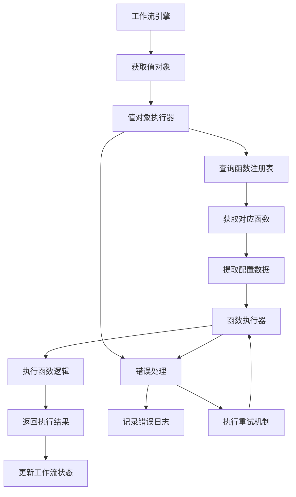

# Workflow 函数式编程集成设计方案

## 概述

本文档基于现有的函数式编程集成分析，提供一个更具体的设计方案，旨在实现真正的函数式编程风格，通过预定义函数执行内部逻辑。

## 设计目标

1. **数据与行为分离**：值对象负责数据封装，函数负责行为逻辑
2. **统一执行接口**：为所有值对象类型提供统一的执行接口
3. **动态函数映射**：支持值对象类型到函数的动态映射
4. **函数组合支持**：支持函数的组合执行，实现复杂业务逻辑
5. **错误处理统一**：提供统一的错误处理和重试机制

## 当前架构分析

### 已实现的基础设施

✅ **值对象封装**：
- [`NodeValueObject`](src/domain/workflow/value-objects/node-value-object.ts)
- [`EdgeValueObject`](src/domain/workflow/value-objects/edge-value-object.ts)  
- [`TriggerValueObject`](src/domain/workflow/value-objects/trigger-value-object.ts)
- [`HookValueObject`](src/domain/workflow/value-objects/hook-value-object.ts)

✅ **函数基础设施**：
- [`BaseWorkflowFunction`](src/infrastructure/workflow/functions/base/base-workflow-function.ts)
- [`FunctionRegistry`](src/infrastructure/workflow/functions/registry/function-registry.ts)
- [`FunctionExecutor`](src/infrastructure/workflow/functions/executors/function-executor.ts)

### 需要改进的关键点

⚠️ **值对象与函数映射关系不明确**：
- 当前值对象的 `type` 属性需要与函数名称对应
- 缺少明确的映射配置机制

⚠️ **执行接口不统一**：
- 各组件（节点执行器、边评估器等）各自实现
- 缺少统一的值对象执行接口

⚠️ **函数组合支持不足**：
- 当前架构不支持函数的组合执行
- 缺乏高级执行策略

## 详细设计方案

### 1. 扩展的函数注册表设计

#### 核心接口扩展

```typescript
// src/infrastructure/workflow/functions/registry/enhanced-function-registry.ts

export class EnhancedFunctionRegistry extends FunctionRegistry {
  private valueObjectTypeMapping: Map<string, string> = new Map();
  
  /**
   * 注册值对象类型与函数的映射关系
   */
  registerValueObjectMapping(valueObjectType: string, functionName: string): void {
    if (this.valueObjectTypeMapping.has(valueObjectType)) {
      throw new Error(`值对象类型 ${valueObjectType} 的映射关系已存在`);
    }
    this.valueObjectTypeMapping.set(valueObjectType, functionName);
  }
  
  /**
   * 根据值对象获取对应的函数
   */
  getFunctionByValueObject(valueObject: ValueObject): BaseWorkflowFunction | null {
    const valueObjectType = this.getValueObjectType(valueObject);
    const functionName = this.valueObjectTypeMapping.get(valueObjectType);
    
    if (!functionName) {
      return null;
    }
    
    return this.getFunctionByName(functionName);
  }
  
  /**
   * 获取支持特定值对象类型的函数列表
   */
  getFunctionsByValueObjectType(valueObjectType: string): BaseWorkflowFunction[] {
    const functionName = this.valueObjectTypeMapping.get(valueObjectType);
    if (!functionName) {
      return [];
    }
    
    const func = this.getFunctionByName(functionName);
    return func ? [func] : [];
  }
  
  /**
   * 获取值对象的类型标识
   */
  private getValueObjectType(valueObject: ValueObject): string {
    if (valueObject instanceof NodeValueObject) {
      return `node_${valueObject.type.toString()}`;
    } else if (valueObject instanceof EdgeValueObject) {
      return `edge_${valueObject.type.toString()}`;
    } else if (valueObject instanceof TriggerValueObject) {
      return `trigger_${valueObject.type.toString()}`;
    } else if (valueObject instanceof HookValueObject) {
      return `hook_${valueObject.hookPoint.toString()}`;
    }
    return 'unknown';
  }
}
```

#### 映射配置机制

支持多种映射配置方式：

1. **代码配置**：
```typescript
registry.registerValueObjectMapping('node_llm', 'llm_processing_function');
registry.registerValueObjectMapping('edge_conditional', 'conditional_routing_function');
```

2. **配置文件**：
```toml
[mappings]
node_llm = "llm_processing_function"
edge_conditional = "conditional_routing_function"
trigger_time = "time_trigger_function"
```

3. **注解方式**：
```typescript
@ValueObjectMapping('node_llm')
class LLMProcessingFunction extends BaseWorkflowFunction {
  // 函数实现
}
```

### 2. 统一的值对象执行接口

#### 核心接口定义

```typescript
// src/infrastructure/workflow/functions/interfaces/value-object-executor.interface.ts

export interface IValueObjectExecutor {
  /**
   * 执行单个值对象
   */
  executeValueObject(valueObject: ValueObject, context: ExecutionContext): Promise<any>;
  
  /**
   * 批量执行值对象
   */
  executeBatch(valueObjects: ValueObject[], context: ExecutionContext): Promise<any[]>;
  
  /**
   * 验证值对象与函数的映射关系
   */
  validateMapping(valueObject: ValueObject): ValidationResult;
  
  /**
   * 获取执行统计信息
   */
  getExecutionStats(): ExecutionStats;
}

/**
 * 执行上下文接口
 */
export interface ExecutionContext {
  workflowId: string;
  executionId: string;
  variables: Map<string, any>;
  getVariable(key: string): any;
  setVariable(key: string, value: any): void;
  getNodeResult(nodeId: string): any;
  setNodeResult(nodeId: string, result: any): void;
}

/**
 * 执行统计信息
 */
export interface ExecutionStats {
  totalExecutions: number;
  successfulExecutions: number;
  failedExecutions: number;
  averageExecutionTime: number;
  executionHistory: ExecutionRecord[];
}
```

#### 执行策略配置

```typescript
// src/infrastructure/workflow/functions/executors/execution-strategy.ts

export interface ExecutionStrategy {
  name: string;
  description: string;
  
  /**
   * 执行函数列表
   */
  execute(functions: BaseWorkflowFunction[], context: any): Promise<any[]>;
  
  /**
   * 验证策略配置
   */
  validate(config: any): ValidationResult;
}

// 顺序执行策略
export class SequentialStrategy implements ExecutionStrategy {
  // 实现细节
}

// 并行执行策略
export class ParallelStrategy implements ExecutionStrategy {
  // 实现细节
}

// 条件执行策略
export class ConditionalStrategy implements ExecutionStrategy {
  // 实现细节
}
```

### 3. 值对象执行器实现

#### 核心实现类

```typescript
// src/infrastructure/workflow/functions/executors/value-object-executor.ts

@injectable()
export class ValueObjectExecutor implements IValueObjectExecutor {
  constructor(
    @inject('EnhancedFunctionRegistry') private readonly registry: EnhancedFunctionRegistry,
    @inject('FunctionExecutor') private readonly functionExecutor: FunctionExecutor,
    @inject('Logger') private readonly logger: ILogger
  ) {}
  
  async executeValueObject(valueObject: ValueObject, context: ExecutionContext): Promise<any> {
    const startTime = Date.now();
    
    try {
      // 1. 验证映射关系
      const validation = this.validateMapping(valueObject);
      if (!validation.valid) {
        throw new Error(`映射验证失败: ${validation.errors.join(', ')}`);
      }
      
      // 2. 获取对应的函数
      const func = this.registry.getFunctionByValueObject(valueObject);
      if (!func) {
        throw new Error(`未找到值对象类型 ${this.getValueObjectType(valueObject)} 对应的函数`);
      }
      
      // 3. 提取配置数据
      const config = this.extractConfigFromValueObject(valueObject);
      
      // 4. 执行函数
      const result = await this.functionExecutor.execute({
        functions: [{ function: func, config }],
        context: context.variables,
        executionConfig: { strategy: 'sequential' }
      });
      
      const executionTime = Date.now() - startTime;
      
      this.logger.info('值对象执行完成', {
        valueObjectType: this.getValueObjectType(valueObject),
        functionName: func.name,
        executionTime,
        success: true
      });
      
      return result[0]?.result;
      
    } catch (error) {
      const executionTime = Date.now() - startTime;
      
      this.logger.error('值对象执行失败', error instanceof Error ? error : new Error(String(error)), {
        valueObjectType: this.getValueObjectType(valueObject),
        executionTime,
        success: false
      });
      
      throw error;
    }
  }
  
  async executeBatch(valueObjects: ValueObject[], context: ExecutionContext): Promise<any[]> {
    const results: any[] = [];
    
    for (const valueObject of valueObjects) {
      try {
        const result = await this.executeValueObject(valueObject, context);
        results.push(result);
      } catch (error) {
        results.push({ error: error instanceof Error ? error.message : String(error) });
      }
    }
    
    return results;
  }
  
  validateMapping(valueObject: ValueObject): ValidationResult {
    const valueObjectType = this.getValueObjectType(valueObject);
    const functionName = this.registry.getValueObjectTypeMapping().get(valueObjectType);
    
    const errors: string[] = [];
    
    if (!functionName) {
      errors.push(`值对象类型 ${valueObjectType} 未配置映射关系`);
    } else {
      const func = this.registry.getFunctionByName(functionName);
      if (!func) {
        errors.push(`映射的函数 ${functionName} 不存在`);
      }
    }
    
    return {
      valid: errors.length === 0,
      errors
    };
  }
  
  private extractConfigFromValueObject(valueObject: ValueObject): any {
    if (valueObject instanceof NodeValueObject) {
      return {
        ...valueObject.properties,
        _metadata: {
          nodeId: valueObject.id.toString(),
          nodeType: valueObject.type.toString(),
          nodeName: valueObject.name
        }
      };
    } else if (valueObject instanceof EdgeValueObject) {
      return {
        ...valueObject.properties,
        condition: valueObject.condition,
        _metadata: {
          edgeId: valueObject.id.toString(),
          edgeType: valueObject.type.toString(),
          fromNodeId: valueObject.fromNodeId.toString(),
          toNodeId: valueObject.toNodeId.toString()
        }
      };
    } else if (valueObject instanceof TriggerValueObject) {
      return {
        ...valueObject.config,
        _metadata: {
          triggerId: valueObject.id.toString(),
          triggerType: valueObject.type.toString(),
          triggerName: valueObject.name,
          action: valueObject.action.toString()
        }
      };
    } else if (valueObject instanceof HookValueObject) {
      return {
        ...valueObject.config,
        _metadata: {
          hookId: valueObject.id.toString(),
          hookPoint: valueObject.hookPoint.toString(),
          hookName: valueObject.name,
          priority: valueObject.priority,
          enabled: valueObject.enabled
        }
      };
    }
    
    return {};
  }
  
  private getValueObjectType(valueObject: ValueObject): string {
    // 实现同 EnhancedFunctionRegistry
  }
}
```

### 4. 函数组合机制设计

#### 组合函数接口

```typescript
// src/infrastructure/workflow/functions/composition/composite-function.ts

export class CompositeFunction extends BaseWorkflowFunction {
  private functions: BaseWorkflowFunction[] = [];
  private compositionStrategy: CompositionStrategy;
  
  constructor(
    id: string,
    name: string,
    description: string,
    strategy: CompositionStrategy
  ) {
    super(id, name, description, '1.0.0', WorkflowFunctionType.NODE, true, 'composite');
    this.compositionStrategy = strategy;
  }
  
  /**
   * 添加函数到组合
   */
  addFunction(func: BaseWorkflowFunction): void {
    this.functions.push(func);
  }
  
  /**
   * 执行组合函数
   */
  async execute(context: any, config: any): Promise<any> {
    return await this.compositionStrategy.execute(this.functions, context, config);
  }
  
  /**
   * 获取组合函数的参数
   */
  getParameters(): FunctionParameter[] {
    const parameters: FunctionParameter[] = [];
    
    // 合并所有子函数的参数
    for (const func of this.functions) {
      parameters.push(...func.getParameters());
    }
    
    // 去重处理
    return this.deduplicateParameters(parameters);
  }
}

/**
 * 组合策略接口
 */
export interface CompositionStrategy {
  execute(functions: BaseWorkflowFunction[], context: any, config: any): Promise<any>;
  validate(functions: BaseWorkflowFunction[]): ValidationResult;
}

/**
 * 顺序组合策略
 */
export class SequentialCompositionStrategy implements CompositionStrategy {
  async execute(functions: BaseWorkflowFunction[], context: any, config: any): Promise<any> {
    let result = context;
    
    for (const func of functions) {
      result = await func.execute(result, config);
    }
    
    return result;
  }
  
  validate(functions: BaseWorkflowFunction[]): ValidationResult {
    // 验证函数链的兼容性
    const errors: string[] = [];
    
    for (let i = 0; i < functions.length - 1; i++) {
      const currentFunc = functions[i];
      const nextFunc = functions[i + 1];
      
      // 检查输出类型与输入类型的兼容性
      if (!this.areTypesCompatible(currentFunc.getReturnType(), nextFunc.getParameters())) {
        errors.push(`函数 ${currentFunc.name} 的输出与函数 ${nextFunc.name} 的输入不兼容`);
      }
    }
    
    return { valid: errors.length === 0, errors };
  }
  
  private areTypesCompatible(outputType: string, inputParameters: FunctionParameter[]): boolean {
    // 实现类型兼容性检查
    return true; // 简化实现
  }
}
```

#### 组合构建器

```typescript
// src/infrastructure/workflow/functions/composition/function-composition-builder.ts

export class FunctionCompositionBuilder {
  private functions: BaseWorkflowFunction[] = [];
  private strategy: CompositionStrategy = new SequentialCompositionStrategy();
  
  /**
   * 添加函数
   */
  addFunction(func: BaseWorkflowFunction): FunctionCompositionBuilder {
    this.functions.push(func);
    return this;
  }
  
  /**
   * 设置组合策略
   */
  withStrategy(strategy: CompositionStrategy): FunctionCompositionBuilder {
    this.strategy = strategy;
    return this;
  }
  
  /**
   * 构建组合函数
   */
  build(id: string, name: string, description: string): CompositeFunction {
    const compositeFunc = new CompositeFunction(id, name, description, this.strategy);
    
    for (const func of this.functions) {
      compositeFunc.addFunction(func);
    }
    
    return compositeFunc;
  }
}

// 使用示例
const compositeFunction = new FunctionCompositionBuilder()
  .addFunction(llmFunction)
  .addFunction(validationFunction)
  .addFunction(transformationFunction)
  .withStrategy(new SequentialCompositionStrategy())
  .build('composite_1', 'LLM处理流程', 'LLM响应验证和转换流程');
```

### 5. 集成架构优化

#### 执行流程优化



#### 错误处理策略

**映射失败处理**：
- 值对象类型未找到对应函数时抛出明确的错误信息
- 提供建议的映射配置
- 支持动态注册缺失的映射关系

**执行失败处理**：
- 基于配置的重试机制（次数、间隔、退避策略）
- 错误分类和分级处理
- 执行上下文的状态回滚

**配置验证**：
- 执行前验证值对象配置的有效性
- 函数参数的自动类型转换
- 配置模板和默认值支持

### 6. 实施计划

#### 第一阶段：核心功能实现（高优先级）

1. **实现 EnhancedFunctionRegistry**
   - 扩展现有的 FunctionRegistry
   - 添加值对象类型映射功能
   - 实现映射配置的加载和验证

2. **实现 ValueObjectExecutor**
   - 创建统一的值对象执行接口
   - 实现基本的执行逻辑
   - 添加错误处理和日志记录

3. **更新现有执行器**
   - 修改节点执行器使用统一接口
   - 修改边评估器使用统一接口
   - 确保向后兼容性

#### 第二阶段：高级功能实现（中优先级）

1. **实现函数组合机制**
   - 创建 CompositeFunction 类
   - 实现多种组合策略
   - 添加组合验证功能

2. **增强执行策略**
   - 实现并行执行策略
   - 实现条件执行策略
   - 添加执行策略配置

3. **优化性能**
   - 添加函数执行缓存
   - 实现懒加载机制
   - 优化资源使用

#### 第三阶段：监控和调试（低优先级）

1. **添加监控功能**
   - 执行统计和指标收集
   - 性能监控和告警
   - 资源使用监控

2. **增强调试工具**
   - 执行轨迹记录
   - 调试信息输出
   - 可视化执行流程

3. **文档和示例**
   - 更新架构文档
   - 添加使用示例
   - 创建最佳实践指南

## 总结

这个设计方案实现了真正的函数式编程风格，通过预定义函数执行内部逻辑，同时保持了架构的灵活性和可扩展性。关键改进包括：

1. **统一的值对象执行接口**：为所有值对象类型提供一致的执行方式
2. **动态函数映射**：支持运行时配置值对象类型到函数的映射关系
3. **函数组合支持**：允许创建复杂的函数执行流程
4. **增强的错误处理**：提供统一的异常处理和重试机制

通过这个设计方案，工作流组件能够更灵活地与函数模块集成，实现真正的函数式编程范式。