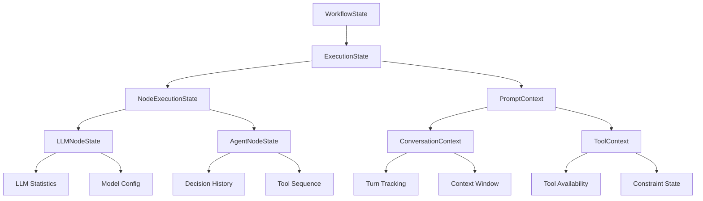

# Workflow状态管理分析报告 - LLM Agent图工作流

## 概述

本报告分析了当前workflow状态管理架构，针对实现完整的LLM agent图工作流，识别了需要补充的状态管理内容，并制定了详细的改进计划。

## 当前状态管理架构分析

### 现有组件概览

#### 1. Workflow状态接口 ([`src/domain/workflow/state/workflow-state.ts`](src/domain/workflow/state/workflow-state.ts:1))
- 基础的工作流状态定义
- 包含执行上下文数据、历史记录等基础属性

#### 2. 执行状态实体 ([`src/domain/workflow/entities/execution-state.ts`](src/domain/workflow/entities/execution-state.ts:1))
- 完整的执行状态管理
- 包含工作流状态、节点状态、提示词上下文等

#### 3. 工作流状态实体 ([`src/domain/workflow/entities/workflow-state.ts`](src/domain/workflow/entities/workflow-state.ts:1))
- 工作流级别的状态跟踪
- 进度管理、节点统计等功能

#### 4. 提示词上下文 ([`src/domain/workflow/value-objects/prompt-context.ts`](src/domain/workflow/value-objects/prompt-context.ts:1))
- 完善的提示词上下文管理
- 模板、变量、历史记录等功能

## LLM Agent工作流状态管理缺失内容

### 1. LLM特定状态属性缺失

**当前问题：**
- LLM节点的执行状态（token使用、模型信息、响应时间等）没有专门的跟踪
- LLM对话历史的管理不够完善

**需要补充：**
- LLM执行统计信息（token消耗、响应时间、模型版本）
- LLM对话上下文管理（多轮对话状态）
- LLM错误处理和重试状态

### 2. Agent特定状态管理缺失

**当前问题：**
- Agent决策过程的状态跟踪不完整
- Agent工具调用历史的状态管理
- Agent推理链的状态跟踪

**需要补充：**
- Agent决策历史状态
- 工具调用序列状态
- 推理步骤状态跟踪

### 3. 提示词上下文管理需要增强

**当前状态：**
- [`PromptContext`](src/domain/workflow/value-objects/prompt-context.ts:38) 类已经比较完善
- 包含模板、变量、历史记录等

**需要补充：**
- 多轮对话的上下文管理
- 动态提示词更新的状态跟踪
- 上下文压缩和摘要功能

### 4. 状态持久化和恢复机制缺失

**当前问题：**
- 状态管理器接口 ([`src/domain/workflow/state/index.ts`](src/domain/workflow/state/index.ts:7)) 定义不完整
- 缺少具体的持久化实现

**需要补充：**
- 完整的持久化状态管理器
- 状态恢复和续传机制
- 状态快照和检查点

## 具体需要补充的属性

### WorkflowState需要补充的属性：

1. **LLM相关统计**
   - `llmCallCount: number` - LLM调用次数统计
   - `totalTokensUsed: number` - Token消耗总量
   - `averageResponseTime: number` - 平均响应时间
   - `modelUsage: Map<string, number>` - 模型使用分布

2. **Agent执行状态**
   - `agentDecisionPath: string[]` - Agent决策路径记录
   - `toolCallSequence: ToolCallRecord[]` - 工具调用序列
   - `reasoningStepCount: number` - 推理步骤计数器

3. **上下文管理增强**
   - `conversationTurn: number` - 对话轮次跟踪
   - `contextLength: number` - 上下文长度管理
   - `dynamicContextUpdate: boolean` - 动态上下文更新标记

### ExecutionState需要补充的属性：

1. **LLM节点详细状态**
   - `llmNodeStates: Map<string, LLMNodeState>` - LLM节点详细状态
   - `modelConfigSnapshot: ModelConfig` - 模型配置快照
   - `errorRetryState: ErrorRetryState` - 错误重试状态

2. **Agent执行流程状态**
   - `agentExecutionFlow: AgentFlowState` - Agent执行流程状态
   - `toolCallResults: ToolCallResult[]` - 工具调用结果链
   - `reasoningProcess: ReasoningStep[]` - 推理过程记录

## 提示词上下文属性补充需求

### 需要扩展PromptContext：

1. **Agent特定上下文属性**
   - `agentRole: string` - Agent角色定义
   - `availableTools: string[]` - 可用工具列表
   - `decisionConstraints: Constraint[]` - 决策约束条件

2. **多轮对话管理**
   - `conversationTurns: ConversationTurn[]` - 对话轮次记录
   - `contextWindowSize: number` - 上下文窗口大小
   - `historySummary: string` - 历史摘要

3. **动态上下文更新**
   - `contextCompression: boolean` - 上下文压缩标记
   - `importantInfoExtracted: boolean` - 重要信息提取状态
   - `contextPriority: ContextPriority` - 上下文优先级管理

## 改进计划

### 阶段1：基础状态属性补充（高优先级）

**目标：** 添加LLM Agent工作流必需的核心状态属性

**任务：**
1. 扩展WorkflowState接口，添加LLM统计和Agent执行状态属性
2. 增强ExecutionState实体，添加LLM节点详细状态和Agent流程状态
3. 创建LLMNodeState和AgentFlowState值对象

**预计时间：** 2-3周

### 阶段2：上下文管理优化（中优先级）

**目标：** 增强提示词上下文管理，支持多轮对话和动态更新

**任务：**
1. 扩展PromptContext值对象，添加Agent特定上下文属性
2. 实现多轮对话管理和上下文压缩功能
3. 添加动态上下文更新机制

**预计时间：** 3-4周

### 阶段3：状态持久化机制完善（中优先级）

**目标：** 实现完整的状态管理和恢复功能

**任务：**
1. 完善状态管理器接口和实现
2. 添加状态快照和检查点机制
3. 实现状态恢复和续传功能

**预计时间：** 4-5周

### 阶段4：高级功能实现（低优先级）

**目标：** 添加状态监控和性能优化功能

**任务：**
1. 实现状态监控和告警机制
2. 添加性能分析和优化功能
3. 实现状态缓存机制

**预计时间：** 2-3周

## 架构设计建议

## 风险评估

### 技术风险
- **状态数据量增加**：需要优化存储和性能
- **状态一致性**：需要确保分布式环境下的状态一致性
- **向后兼容性**：需要确保现有工作流的兼容性

### 实施风险
- **开发复杂度**：状态管理涉及多个组件，需要协调开发
- **测试覆盖**：需要确保新功能的测试覆盖率
- **性能影响**：需要监控状态管理对性能的影响

## 结论

当前workflow状态管理基础架构良好，但针对完整的LLM agent图工作流，需要补充以下关键内容：

1. **LLM特定状态跟踪** - 增强LLM节点执行状态管理
2. **Agent工作流状态增强** - 完善Agent决策和工具调用状态跟踪
3. **提示词上下文属性补充** - 增强多轮对话和动态上下文管理
4. **状态持久化机制完善** - 实现完整的状态管理和恢复功能

这些补充将使系统能够更好地支持复杂的LLM agent工作流场景，提供更完整的状态跟踪和管理能力。建议按照优先级分阶段实施，确保系统的稳定性和可维护性。

## 下一步行动

1. **详细设计**：为每个阶段制定详细的技术设计方案
2. **原型验证**：实现关键功能原型进行验证
3. **逐步实施**：按照优先级分阶段实施改进
4. **测试验证**：确保新功能的质量和性能
5. **文档更新**：更新相关文档和API说明