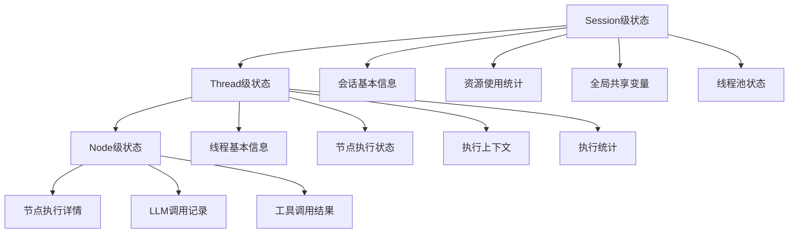
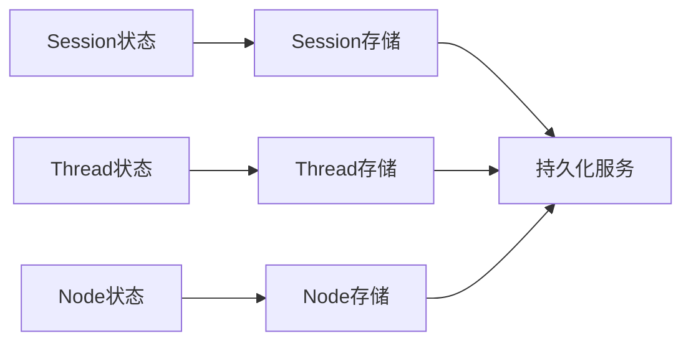

# Workflow状态管理重新设计 - 基于Workflow-Thread-Session架构

## 概述

基于您提供的Workflow-Thread-Session职责划分设计，本报告重新分析了状态管理需求，提出了符合新架构理念的设计方案。

## 核心设计理念

### 1. 职责边界清晰化

**Workflow（蓝图/模板）**
- 专注于图结构定义和验证
- 静态的、不可变的业务逻辑声明
- 不管理执行状态

**Thread（执行引擎）**
- 专注于图执行流程协调
- 管理节点执行状态和上下文
- 负责单个工作流的执行

**Session（资源调度器）**
- 专注于多线程生命周期管理
- 管理全局资源和统计信息
- 负责跨线程协调

### 2. 状态管理分层



## 当前架构分析

### 现有状态管理组件

#### 1. Workflow状态管理（需要简化）
- **当前问题**：Workflow实体包含了过多的执行状态管理
- **改进方向**：Workflow应该只关注图结构定义，移除执行状态相关属性

#### 2. Thread状态管理（需要增强）
- **当前问题**：Thread级别的状态管理不够完善
- **改进方向**：Thread应该成为执行状态管理的核心

#### 3. Session状态管理（需要实现）
- **当前问题**：Session级别的状态管理缺失
- **改进方向**：实现完整的Session级状态管理

## 重新设计的状态管理方案

### 1. Workflow状态管理（简化）

**目标**：Workflow只负责图结构定义，不管理执行状态

**需要移除的属性**：
- 执行状态相关属性
- 进度跟踪属性
- 节点执行统计

**保留的属性**：
- 图结构定义（节点、边）
- 业务规则验证
- 版本管理

### 2. Thread状态管理（增强）

#### ThreadExecutionState实体

```typescript
interface ThreadExecutionState {
  // 线程基本信息
  threadId: ID;
  workflowId: ID;
  status: ThreadStatus;
  
  // 节点执行状态
  nodeStates: Map<NodeId, NodeExecutionState>;
  
  // 执行上下文（每个节点可拥有不同上下文）
  contextVariables: Map<string, any>;
  promptContexts: Map<NodeId, PromptContext>;
  
  // 执行统计
  startTime: Timestamp;
  endTime?: Timestamp;
  progress: number;
  
  // LLM特定状态（按节点管理）
  llmCallRecords: Map<NodeId, LLMCallRecord[]>;
  
  // 工具调用记录
  toolCallRecords: Map<NodeId, ToolCallRecord[]>;
  
  // 执行路径
  executionPath: NodeId[];
}
```

#### NodeExecutionState实体

```typescript
interface NodeExecutionState {
  nodeId: NodeId;
  status: NodeStatus;
  startTime: Timestamp;
  endTime?: Timestamp;
  result?: any;
  error?: Error;
  
  // LLM节点特定状态
  llmCalls: LLMCallRecord[];
  
  // 工具节点特定状态
  toolCalls: ToolCallRecord[];
  
  // 节点级上下文
  contextVariables: Map<string, any>;
  promptContext?: PromptContext;
}
```

### 3. Session状态管理（新增）

#### SessionExecutionState实体

```typescript
interface SessionExecutionState {
  sessionId: ID;
  status: SessionStatus;
  
  // 线程管理
  activeThreads: Map<ID, ThreadExecutionState>;
  threadPoolStatus: ThreadPoolStatus;
  
  // 资源使用统计
  resourceUsage: ResourceUsage;
  
  // 全局共享变量
  globalVariables: Map<string, any>;
  
  // 会话级统计信息（作为Session子模块）
  statistics: SessionStatistics;
  
  // 生命周期管理
  createdAt: Timestamp;
  lastActivity: Timestamp;
}
```

#### SessionStatistics实体

```typescript
interface SessionStatistics {
  // 工作流执行统计
  totalWorkflowsExecuted: number;
  successfulWorkflows: number;
  failedWorkflows: number;
  
  // LLM使用统计
  totalLLMCalls: number;
  totalTokensUsed: number;
  averageResponseTime: number;
  
  // 工具调用统计
  totalToolCalls: number;
  successfulToolCalls: number;
  
  // 资源使用统计
  totalExecutionTime: number;
  peakMemoryUsage: number;
  averageThreadCount: number;
}
```

## 上下文管理设计

### 1. 节点级上下文管理

**设计理念**：每个节点可以拥有独立的上下文，支持复杂工作流

#### PromptContext增强

```typescript
interface EnhancedPromptContext {
  // 基础属性
  template: string;
  variables: Map<string, any>;
  
  // 节点级上下文管理
  nodeId: NodeId;
  parentNodeId?: NodeId; // 支持上下文继承
  
  // 多轮对话管理（通过Thread Fork实现）
  conversationTurns: ConversationTurn[];
  contextWindowSize: number;
  
  // 动态上下文更新
  contextVersion: number;
  lastUpdated: Timestamp;
  
  // 上下文压缩标记（通过Fork操作实现）
  isCompressed: boolean;
  compressionSummary?: string;
}
```

### 2. 上下文继承机制

```typescript
// Thread Fork操作实现上下文压缩
interface ThreadForkOperation {
  parentThreadId: ID;
  childThreadId: ID;
  forkPoint: NodeId;
  
  // 上下文继承策略
  contextInheritance: 'full' | 'compressed' | 'summary';
  
  // 压缩配置
  compressionConfig: ContextCompressionConfig;
  
  // 继承的上下文
  inheritedContext: Map<NodeId, PromptContext>;
}
```

## 状态持久化设计

### 1. 分层持久化策略



### 2. 检查点机制

```typescript
interface Checkpoint {
  checkpointId: ID;
  threadId: ID;
  nodeId: NodeId;
  timestamp: Timestamp;
  
  // 状态快照
  threadState: ThreadExecutionState;
  nodeState: NodeExecutionState;
  
  // 上下文快照
  contextSnapshot: Map<string, any>;
  promptContextSnapshot: PromptContext;
  
  // 恢复信息
  recoveryInfo: RecoveryInfo;
}
```

## 实现计划

### 阶段1：架构重构（高优先级）

**目标**：重新设计状态管理架构，符合Workflow-Thread-Session职责划分

**任务**：
1. 简化Workflow实体，移除执行状态相关属性
2. 增强ThreadExecutionState实体，支持节点级上下文管理
3. 实现SessionExecutionState实体，管理全局状态

**预计时间**：3-4周

### 阶段2：上下文管理实现（中优先级）

**目标**：实现节点级上下文管理和Thread Fork机制

**任务**：
1. 增强PromptContext，支持节点级上下文管理
2. 实现Thread Fork操作，支持上下文压缩
3. 实现上下文继承机制

**预计时间**：4-5周

### 阶段3：状态持久化（中优先级）

**目标**：实现分层状态持久化和检查点机制

**任务**：
1. 实现Session状态持久化
2. 实现Thread状态持久化
3. 实现检查点机制

**预计时间**：3-4周

### 阶段4：统计信息管理（低优先级）

**目标**：实现Session级统计信息管理

**任务**：
1. 实现SessionStatistics实体
2. 实现统计信息收集和报告
3. 实现性能监控

**预计时间**：2-3周

## 关键设计决策

### 1. Workflow静态化
- **决策**：Workflow完全静态，不包含任何执行状态
- **理由**：符合"蓝图"设计理念，提高可重用性
- **影响**：需要重构现有Workflow实体

### 2. Thread为中心的状态管理
- **决策**：Thread成为执行状态管理的核心
- **理由**：符合"执行引擎"职责，支持复杂执行逻辑
- **影响**：需要增强Thread状态管理能力

### 3. 节点级上下文管理
- **决策**：每个节点可以拥有独立的上下文
- **理由**：支持更复杂的工作流场景
- **影响**：需要实现上下文继承和压缩机制

### 4. Session级统计管理
- **决策**：统计信息作为Session子模块管理
- **理由**：符合资源调度器职责，避免Workflow状态膨胀
- **影响**：需要实现Session统计子系统

## 风险评估

### 技术风险
- **架构变更风险**：需要重构现有状态管理代码
- **性能风险**：节点级上下文管理可能增加内存使用
- **兼容性风险**：需要确保现有工作流的兼容性

### 实施风险
- **开发复杂度**：需要协调多个组件的开发
- **测试覆盖**：需要确保新架构的测试覆盖率
- **迁移风险**：需要制定详细的迁移计划

## 结论

基于Workflow-Thread-Session架构重新设计状态管理，可以更好地支持复杂的LLM agent工作流场景。关键改进包括：

1. **Workflow静态化**：专注于图结构定义，提高可重用性
2. **Thread为中心的状态管理**：支持节点级上下文和复杂执行逻辑
3. **Session级资源管理**：统一管理全局资源和统计信息
4. **节点级上下文管理**：支持每个节点拥有独立上下文

这种设计符合职责分离原则，能够更好地支持复杂的LLM agent工作流需求，同时保持系统的可维护性和可扩展性。

## 下一步行动

1. **详细技术设计**：为每个组件制定详细的技术设计方案
2. **原型验证**：实现关键功能原型进行验证
3. **分阶段实施**：按照优先级分阶段实施改进
4. **迁移计划**：制定详细的代码迁移计划
5. **测试策略**：制定全面的测试策略