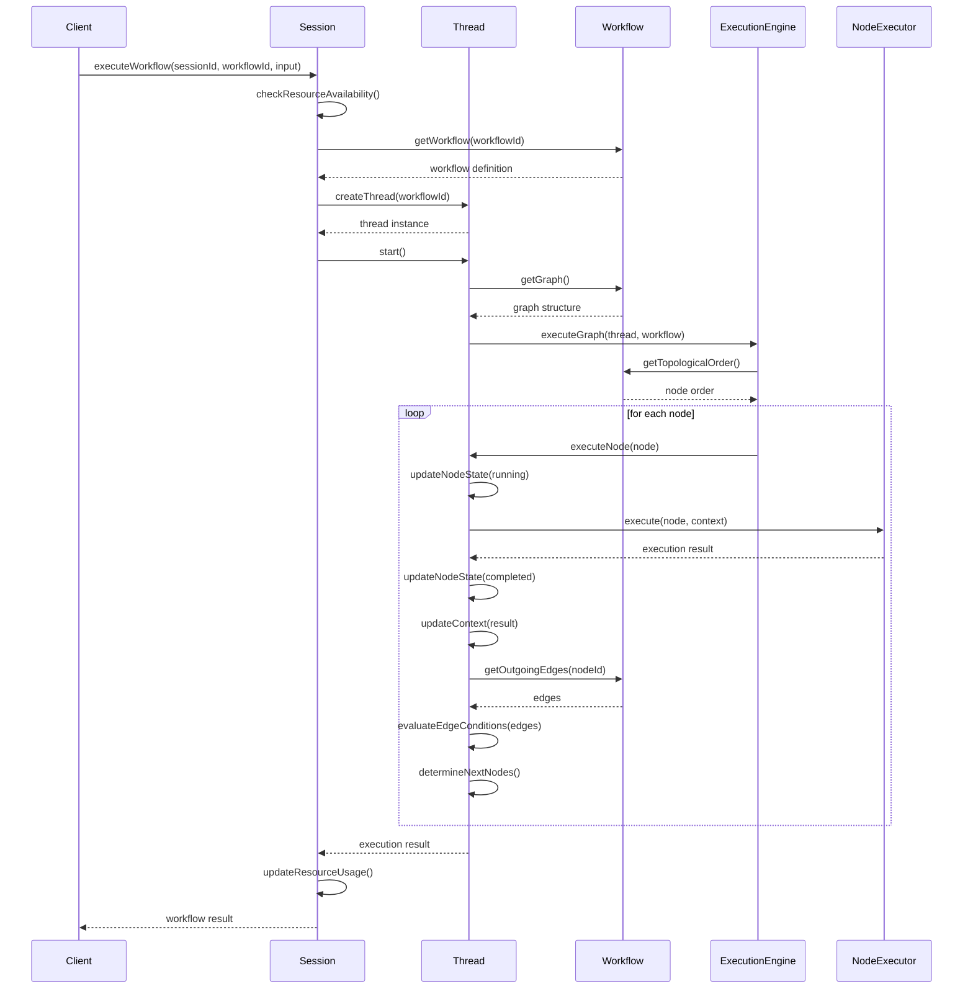
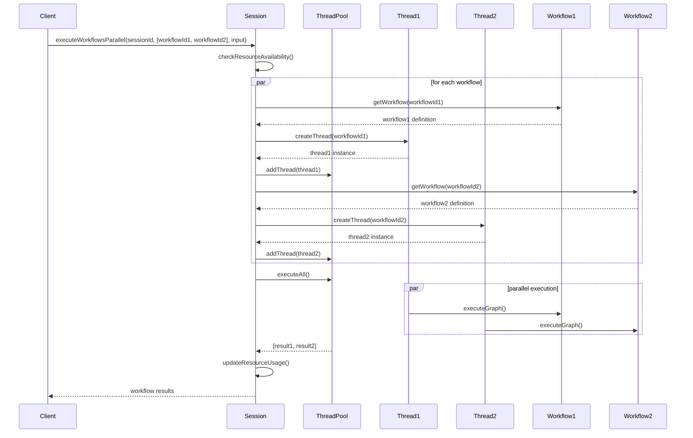
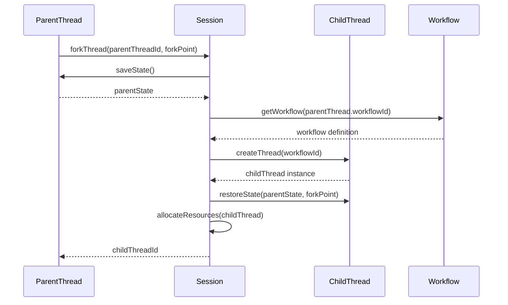

# Workflow、Thread、Session职责划分设计

## 1. 设计理念

基于现有架构和session-thread-workflow-design.md文档，明确三者的职责边界：

- **Workflow**：专注于图结构的定义和验证，作为"蓝图"或"模板"
- **Thread**：专注于图执行流程的协调，作为"执行引擎"
- **Session**：专注于多线程生命周期管理，作为"资源调度器"

## 2. 职责详细划分

### 2.1 Workflow职责（Domain层）

**核心定位**：图工作流定义实体，负责业务逻辑的结构化表达

**主要职责**：
1. **图结构定义**
   - 节点定义（类型、配置、位置）
   - 边定义（连接关系、条件表达式）
   - 图拓扑结构管理

2. **业务逻辑声明**
   - 执行步骤声明（节点顺序依赖）
   - 数据流定义（输入输出规范）
   - 条件分支逻辑（路由规则）

3. **图验证**
   - 结构完整性验证（必填字段、连接有效性）
   - 业务规则验证（循环检测、连通性分析）
   - 配置有效性验证（节点配置、边条件）

4. **不变性保证**
   - 图结构的不可变性（创建后不可修改）
   - 业务规则的一致性
   - 版本管理

**不负责**：
- ❌ 执行状态管理（由Thread负责）
- ❌ 执行顺序控制（由Thread负责）
- ❌ 资源分配（由Session负责）
- ❌ 并行调度（由Session负责）

**代码位置**：
```
src/domain/workflow/entities/workflow.ts
src/domain/workflow/value-objects/
  ├── workflow-definition.ts
  ├── node-data.ts
  ├── edge-data.ts
  └── graph-structure.ts
```

**核心接口**：
```typescript
export class Workflow extends Entity {
  // 图结构访问
  getGraph(): WorkflowGraphData
  getNode(nodeId: NodeId): NodeData
  getEdges(): EdgeData[]
  
  // 图验证
  validateStructure(): ValidationResult
  validateBusinessRules(): ValidationResult
  
  // 拓扑分析
  getTopologicalOrder(): NodeId[]
  hasCycle(): boolean
  
  // 不变性保证
  addNode(node: NodeData): Workflow
  addEdge(edge: EdgeData): Workflow
}
```

### 2.2 Thread职责（Domain层 + Application层）

**核心定位**：图执行协调器，负责将Workflow定义转化为实际执行

**主要职责**：
1. **执行状态管理**
   - 节点执行状态跟踪（pending/running/completed/failed/skipped）
   - 工作流整体状态管理
   - 执行上下文维护（变量、提示词、历史记录）

2. **执行流程协调**
   - 拓扑排序执行（按依赖关系执行节点）
   - 并行节点调度（识别可并行节点）
   - 串行节点控制（顺序执行）

3. **节点路由控制**
   - 边条件评估（决定下一个执行节点）
   - 状态转换管理（更新执行状态）
   - 执行路径记录

4. **错误处理和恢复**
   - 节点执行失败处理（重试、跳过、终止）
   - 错误传播控制
   - 执行恢复（从检查点恢复）

5. **资源管理（单线程内）**
   - 内存使用跟踪
   - 执行时间统计
   - 资源清理

**不负责**：
- ❌ 图结构定义（由Workflow负责）
- ❌ 多线程调度（由Session负责）
- ❌ 跨线程通信（由Session协调）
- ❌ 全局资源分配（由Session负责）

**代码位置**：
```
src/domain/threads/entities/thread.ts
src/application/threads/services/
  ├── thread-execution-service.ts
  ├── thread-state-management-service.ts
  └── thread-routing-service.ts
src/infrastructure/threads/services/
  ├── thread-coordinator-service.ts
  └── thread-lifecycle-service.ts
```

**核心接口**：
```typescript
export class Thread extends Entity {
  // 状态管理
  getExecutionState(): ExecutionState
  updateNodeState(nodeId: NodeId, status: NodeStatus, result?: any): void
  updateContext(variables: Map<string, any>): void
  
  // 执行控制
  start(): void
  pause(reason?: string): void
  resume(): void
  terminate(): void
  
  // 执行协调
  executeNextNodes(currentNodeId: NodeId): Promise<NodeId[]>
  evaluateEdgeConditions(edges: EdgeData[]): Promise<EdgeData[]>
}

export interface ThreadExecutionService {
  // 执行协调
  executeGraph(thread: Thread, workflow: Workflow): Promise<ExecutionResult>
  executeNode(thread: Thread, node: NodeData): Promise<NodeExecutionResult>
  
  // 状态管理
  saveExecutionState(thread: Thread): Promise<void>
  restoreExecutionState(thread: Thread, checkpointId: ID): Promise<void>
}
```

### 2.3 Session职责（Domain层 + Application层）

**核心定位**：多线程管理器，负责Thread的生命周期和资源调度

**主要职责**：
1. **线程生命周期管理**
   - 线程创建（根据Workflow创建Thread）
   - 线程销毁（清理资源）
   - 线程Fork（创建子线程）

2. **并行调度管理**
   - 多线程并行执行协调
   - 资源分配和限制（线程数、内存、执行时间）
   - 优先级调度

3. **资源管理**
   - 全局资源池管理
   - 资源使用统计
   - 配额控制

4. **跨线程协调**
   - 线程间通信（消息传递）
   - 共享状态管理（会话级变量）
   - 同步控制

5. **会话级状态管理**
   - 会话状态跟踪（active/inactive）
   - 会话资源使用统计
   - 会话历史记录

**不负责**：
- ❌ 单个线程内的执行控制（由Thread负责）
- ❌ 图结构验证（由Workflow负责）
- ❌ 节点业务逻辑（由Workflow定义）

**代码位置**：
```
src/domain/sessions/entities/session.ts
src/application/sessions/services/
  ├── session-orchestration-service.ts
  ├── session-resource-service.ts
  └── session-management-service.ts
```

**核心接口**：
```typescript
export class Session extends Entity {
  // 线程管理
  createThread(workflowId: ID, priority?: ThreadPriority): Thread
  destroyThread(threadId: ID): void
  forkThread(parentThreadId: ID, forkPoint?: string): Thread
  
  // 资源管理
  getResourceUsage(): ResourceUsage
  checkResourceAvailability(requirement: ResourceRequirement): boolean
  updateQuotaUsage(usage: ResourceUsage): void
  
  // 状态管理
  getActiveThreads(): Thread[]
  getThreadPoolStatus(): ThreadPoolStatus
}

export interface SessionOrchestrationService {
  // 工作流执行编排
  orchestrateWorkflowExecution(
    sessionId: ID,
    workflowId: ID,
    context: ExecutionContext
  ): Promise<WorkflowExecutionResultDto>
  
  // 并行执行编排
  orchestrateParallelExecution(
    sessionId: ID,
    workflowIds: ID[],
    context: ExecutionContext
  ): Promise<WorkflowExecutionResultDto[]>
  
  // 线程生命周期管理
  createThread(sessionId: ID, workflowId: ID): Promise<ID>
  destroyThread(sessionId: ID, threadId: ID): Promise<void>
  manageThreadLifecycle(sessionId: ID, threadId: ID, action: ThreadAction): Promise<void>
}
```

## 3. 协作流程设计

### 3.1 单工作流执行流程



### 3.2 多工作流并行执行流程



### 3.3 线程Fork流程



## 4. 状态管理职责划分

### 4.1 状态分层

```
Session级状态（会话级共享）
├── 会话基本信息（id, userId, status）
├── 资源使用情况（threadsUsed, memoryUsed, quota）
├── 全局变量（跨线程共享）
└── 线程池状态（activeThreads, threadCount）

Thread级状态（线程内私有）
├── 线程基本信息（id, workflowId, status）
├── 节点执行状态（nodeStates: Map<NodeId, NodeExecutionState>）
├── 执行上下文（variables, promptContext, history）
├── 执行统计（startTime, endTime, progress）
└── 资源使用（memoryUsed, executionTime）

Workflow级状态（定义级，只读）
├── 图结构（nodes, edges）
├── 节点配置（properties）
├── 边条件（conditions）
└── 版本信息（version, createdAt）
```

### 4.2 状态转换规则

**Session状态转换**：
```
active → inactive（会话超时）
active → terminated（手动终止）
inactive → active（重新激活）
```

**Thread状态转换**：
```
pending → running（开始执行）
running → paused（暂停）
running → completed（执行完成）
running → failed（执行失败）
running → terminated（终止执行）
paused → running（恢复执行）
paused → terminated（终止）
```

**Node状态转换**：
```
pending → running（开始执行）
running → completed（执行成功）
running → failed（执行失败）
running → skipped（条件不满足）
failed → running（重试）
```

## 5. 错误处理职责划分

### 5.1 分层错误处理

**Node级别（Thread处理）**：
- 节点执行失败
- 重试机制（配置重试次数）
- 超时控制
- 错误传播到Thread

**Thread级别（Thread处理）**：
- 执行策略失败（并行/串行）
- 状态转换失败
- 资源不足
- 错误处理策略（stop/skip/continue）

**Session级别（Session处理）**：
- 线程创建失败
- 资源分配失败
- 配额超限
- 会话级错误处理

**Workflow级别（Workflow验证）**：
- 图结构无效
- 业务规则违反
- 配置错误（在启动前发现）

### 5.2 错误传播流程

```
NodeExecutor → ThreadExecutionService → Thread → Session → Client
     ↓              ↓                    ↓        ↓
   重试/跳过    状态更新/策略应用    日志/监控  资源清理
```

## 6. 配置驱动职责划分

### 6.1 Workflow配置（结构定义）

```toml
[workflow]
name = "示例工作流"
type = "graph"
description = "图工作流示例"

[workflow.graph]
# 图结构配置
validation_enabled = true
cycle_detection = true

[[workflow.nodes]]
id = "llm_node"
type = "llm"
config.model = "gpt-4"
config.prompt_template = "请分析: {{input}}"

[[workflow.edges]]
from = "llm_node"
to = "tool_node"
condition = "{{llm_node.result.success}} == true"
```

### 6.2 Thread配置（执行行为）

```toml
[thread]
# 执行策略
execution_strategy = "parallel"  # parallel/sequential/conditional
max_parallel_nodes = 5

# 错误处理
error_handling = "stop_on_error"  # stop_on_error/skip_node/continue
max_retries = 3
retry_delay = 1000

# 状态管理
state_persistence = true
checkpoint_interval = 60000  # 每60秒保存检查点

# 资源限制
max_execution_time = 300000  # 5分钟
max_memory_usage = "512MB"
```

### 6.3 Session配置（资源管理）

```toml
[session]
# 资源配额
max_threads = 10
max_memory = "2GB"
max_execution_time = "1h"

# 线程池
thread_pool_enabled = true
thread_pool_size = 5

# 调度策略
scheduling_policy = "priority"  # priority/fifo/round_robin
```

## 7. 扩展点职责划分

### 7.1 Workflow扩展点

**Plugins**：
- 自定义节点类型（扩展图结构）
- 自定义边条件（扩展路由逻辑）
- 图验证规则（扩展验证逻辑）

**配置位置**：
```toml
[[workflow.plugins]]
type = "node_type"
name = "custom_node"
class = "CustomNodeExecutor"
```

### 7.2 Thread扩展点

**Hooks**：
- 节点执行前后（pre/post node execution）
- 状态转换前后（pre/post state transition）
- 上下文更新前后（pre/post context update）

**配置位置**：
```toml
[[thread.hooks]]
point = "pre_node_execution"
name = "validate_input"
priority = 100
```

### 7.3 Session扩展点

**Triggers**：
- 资源阈值触发（resource threshold）
- 会话超时触发（session timeout）
- 线程失败触发（thread failure）

**配置位置**：
```toml
[[session.triggers]]
type = "resource_threshold"
threshold = 80  # 80%资源使用率
action = "scale_down"
```

## 8. 监控和日志职责划分

### 8.1 Workflow监控

**监控内容**：
- 图复杂度指标
- 节点类型分布
- 边条件复杂度
- 验证失败次数

**日志级别**：INFO（结构变更）

### 8.2 Thread监控

**监控内容**：
- 节点执行时间
- 状态转换次数
- 错误率和重试次数
- 资源使用情况
- 执行路径跟踪

**日志级别**：DEBUG（详细执行）

### 8.3 Session监控

**监控内容**：
- 活跃线程数
- 资源使用率
- 会话生命周期
- 跨线程通信量

**日志级别**：INFO（生命周期事件）

## 9. 测试职责划分

### 9.1 Workflow测试

**测试内容**：
- 图结构验证
- 业务规则验证
- 配置解析
- 不变性保证

**测试类型**：单元测试、集成测试

### 9.2 Thread测试

**测试内容**：
- 节点执行逻辑
- 状态转换
- 路由决策
- 错误处理
- 恢复机制

**测试类型**：单元测试、集成测试、性能测试

### 9.3 Session测试

**测试内容**：
- 线程生命周期管理
- 资源调度
- 并行执行
- 配额控制
- 跨线程通信

**测试类型**：集成测试、端到端测试、压力测试

## 10. 总结

### 10.1 职责边界清晰化

| 职责 | Workflow | Thread | Session |
|------|----------|--------|---------|
| 图结构定义 | ✅ | ❌ | ❌ |
| 业务逻辑声明 | ✅ | ❌ | ❌ |
| 图验证 | ✅ | ❌ | ❌ |
| 节点执行 | ❌ | ✅ | ❌ |
| 状态管理 | ❌ | ✅ | ❌ |
| 路由控制 | ❌ | ✅ | ❌ |
| 多线程调度 | ❌ | ❌ | ✅ |
| 资源管理 | ❌ | ❌ | ✅ |
| 生命周期管理 | ❌ | 单线程 | 多线程 |

### 10.2 协作优势

1. **关注点分离**：每个组件职责单一，易于理解和维护
2. **可测试性**：各层可以独立测试，降低测试复杂度
3. **可扩展性**：可以在各层独立扩展，不影响其他层
4. **性能优化**：Thread专注单线程执行，Session专注多线程调度
5. **资源管理**：Session统一管理资源，避免资源竞争

### 10.3 实现建议

1. **先实现Workflow**：定义清晰的图结构和验证逻辑
2. **再实现Thread**：基于Workflow定义实现执行引擎
3. **最后实现Session**：基于Thread实现多线程管理和资源调度
4. **逐步集成**：先单线程，再并行，最后复杂场景
5. **充分测试**：各层独立测试后再进行集成测试