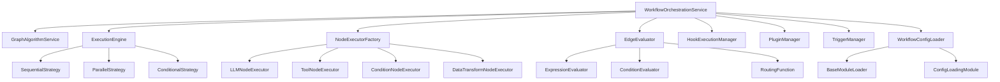

# 图工作流实现设计文档

## 概述

基于现有的Modular Agent Framework工作流模块，设计完整的图工作流实现方案。当前系统已有基础的工作流实体、图算法服务、扩展系统（hooks、plugins、triggers）和部分执行策略，需要设计执行引擎、节点执行器、边条件评估器等核心组件，并集成现有的扩展功能。

## 架构设计

### 分层架构

```
Interface Layer (src/interfaces/)
    ↓
Application Layer (src/application/)
    ↓
Infrastructure Layer (src/infrastructure/) ← Domain Layer (src/domain/)
```

**依赖关系说明**：
- Application层依赖Domain层和Infrastructure层
- Infrastructure层依赖Domain层
- Interface层依赖Application层
- Domain层不依赖任何其他层

### 核心组件架构



## 组件设计

### 1. 执行引擎 (ExecutionEngine)

**位置**: `src/infrastructure/workflow/execution/execution-engine.ts`

**职责**:
- 协调工作流图的执行流程
- 管理执行策略的选择和切换
- 维护执行上下文状态
- 处理节点执行和边评估

**核心接口**:
```typescript
interface ExecutionEngine {
  execute(workflow: Workflow, context: ExecutionContext): Promise<ExecutionResult>;
  setStrategy(strategy: ExecutionStrategy): void;
  getExecutionStatus(): ExecutionStatus;
}
```

### 2. 节点执行器系统

**位置**: `src/infrastructure/workflow/nodes/executors/`

**现有基础**:
- LLM节点执行器 (llm-node-executor.ts)
- 条件节点执行器 (condition-node-executor.ts)
- 工具节点执行器 (tool-node-executor.ts)
- 等待节点执行器 (wait-node-executor.ts)

**需要完善**:
- 数据转换节点执行器
- 人类中继节点执行器
- 节点执行器工厂

### 3. 边条件评估系统

**位置**: `src/infrastructure/workflow/edges/evaluators/`

**现有基础**:
- 条件评估器 (condition-evaluator.ts) - 已实现完整功能
- 表达式评估器 (expression-evaluator.ts)
- 转换评估器 (transition-evaluator.ts)

**设计要点**:
- 支持预定义的路由函数
- 避免过度设计，只允许使用预定义的条件类型
- 集成现有的conditional-routing.function.ts

### 4. 执行策略

**位置**: `src/infrastructure/workflow/strategies/`

**现有基础**:
- 串行策略 (sequential-strategy.ts)
- 并行策略 (parallel-strategy.ts)
- 条件策略 (conditional-strategy.ts)

**设计要点**:
- 策略模式实现
- 支持动态策略切换
- 集成triggers系统

### 5. 扩展系统集成

#### Hooks系统
**位置**: `src/infrastructure/workflow/extensions/hooks/`

**集成方式**:
- 在执行关键节点调用hooks
- 支持pre-execution、post-execution等钩子点
- 优先级管理

#### Plugins系统
**位置**: `src/infrastructure/workflow/extensions/plugins/`

**集成方式**:
- 插件化扩展节点类型
- 插件化扩展边条件
- 生命周期管理

#### Triggers系统
**位置**: `src/infrastructure/workflow/extensions/triggers/`

**集成方式**:
- 触发条件控制执行流程
- 事件驱动的工作流执行
- 状态管理

## 配置驱动设计

### 基于现有配置系统

现有的配置系统采用模块化加载架构，支持：
- **模块化配置加载**: 基于BaseModuleLoader的继承体系
- **优先级管理**: 配置文件按优先级排序加载
- **环境变量注入**: 支持${ENV_VAR}语法
- **继承处理**: 支持配置继承和覆盖
- **Schema验证**: 使用Zod进行配置验证

### Workflow配置加载器设计

**位置**: `src/infrastructure/config/loading/loaders/workflow-loader.ts`

**设计要点**:
- 继承BaseModuleLoader
- 支持workflow模块类型
- 按优先级加载配置文件
- 支持节点、边、hooks、triggers的配置

**配置结构**:
```toml
# workflow/__registry__.toml - 注册表配置（优先级最高）
[metadata]
name = "workflow_registry"
version = "1.0.0"

[workflow_types]
sequential = { description = "串行工作流" }
parallel = { description = "并行工作流" }
conditional = { description = "条件工作流" }

[node_types]
llm = { description = "LLM节点" }
tool = { description = "工具节点" }
condition = { description = "条件节点" }

[edge_types]
direct = { description = "直接边" }
conditional = { description = "条件边" }
```

### 节点配置设计

**位置**: `configs/workflow/nodes/`

**配置示例**:
```toml
# workflow/nodes/llm-node.toml
[node]
name = "llm_node"
type = "llm"
description = "LLM处理节点"

[node.config]
model = "${LLM_MODEL:-gpt-4}"
temperature = 0.7
max_tokens = 1000

[node.hooks]
pre_execution = ["validate_input", "log_execution"]
post_execution = ["validate_output", "cache_result"]

[node.triggers]
[[node.triggers.timeout]]
type = "timeout"
duration = 30000
action = "skip"
```

### 边配置设计

**位置**: `configs/workflow/edges/`

**配置示例**:
```toml
# workflow/edges/conditional-edge.toml
[edge]
name = "conditional_edge"
type = "conditional"
description = "条件边"

[edge.config]
condition_type = "expression"
expression = "{{previous_node.result.success}} == true"

[edge.routing]
type = "conditional"
match_mode = "first"
default_target = "error_node"

[[edge.routing.conditions]]
name = "success_condition"
value = "{{previous_node.result.success}}"
operator = "equals"
target = "success_node"

[[edge.routing.conditions]]
name = "error_condition"
value = "{{previous_node.result.error}}"
operator = "not_equals"
target = "error_node"
```

### Hooks配置设计

**位置**: `configs/workflow/hooks/`

**配置示例**:
```toml
# workflow/hooks/log-hook.toml
[hook]
name = "log_execution"
hook_point = "pre_execution"
priority = 100
enabled = true

[hook.config]
level = "info"
format = "json"

[hook.conditions]
node_types = ["llm", "tool"]
workflow_types = ["sequential", "parallel"]
```

### Triggers配置设计

**位置**: `configs/workflow/triggers/`

**配置示例**:
```toml
# workflow/triggers/timeout-trigger.toml
[trigger]
name = "timeout_trigger"
type = "timeout"
enabled = true

[trigger.config]
duration = 30000
action = "skip"

[trigger.conditions]
node_types = ["llm"]
workflow_status = ["running"]
```

### 工作流定义配置

**位置**: `configs/workflow/workflows/`

**配置示例**:
```toml
# workflow/workflows/example-workflow.toml
[workflow]
name = "示例工作流"
type = "sequential"
description = "一个简单的示例工作流"

[workflow.config]
error_handling = "stop_on_error"
max_retries = 3
timeout = 60000

[[workflow.nodes]]
id = "start_node"
type = "llm"
name = "开始节点"

[workflow.nodes.config]
model = "gpt-4"
prompt = "请分析以下内容: {{input}}"

[[workflow.nodes]]
id = "process_node"
type = "tool"
name = "处理节点"

[workflow.nodes.config]
tool_name = "calculator"

[[workflow.edges]]
from = "start_node"
to = "process_node"
condition = "{{start_node.result.success}} == true"

[workflow.hooks]
pre_execution = ["validate_workflow", "log_start"]
post_execution = ["cleanup_resources", "log_completion"]

[workflow.triggers]
[[workflow.triggers.timeout]]
type = "timeout"
duration = 30000
action = "abort"
```

## 数据模型

### 工作流图数据模型

```typescript
interface WorkflowGraphData {
  nodes: Map<string, NodeData>;
  edges: Map<string, EdgeData>;
}

interface NodeData {
  id: NodeId;
  type: NodeType;
  name?: string;
  description?: string;
  position?: { x: number; y: number };
  properties: Record<string, unknown>;
}

interface EdgeData {
  id: EdgeId;
  type: EdgeType;
  fromNodeId: NodeId;
  toNodeId: NodeId;
  condition?: string;
  weight?: number;
  properties: Record<string, unknown>;
}
```

### 执行上下文模型

```typescript
interface ExecutionContext {
  executionId: string;
  workflowId: string;
  data: Record<string, any>;
  metadata?: Record<string, any>;
  getWorkflow(): Workflow;
  getVariable(path: string): any;
  setVariable(path: string, value: any): void;
}
```

## 条件路由实现

### 基于现有conditional-routing.function.ts

**匹配模式**:
- `first`: 第一个匹配的条件
- `all`: 所有条件都匹配
- `any`: 任意条件匹配

**配置示例**:
```toml
[[workflow.routing]]
type = "conditional"
match_mode = "first"
default_node = "default_node"

[[workflow.routing.conditions]]
name = "success_condition"
value = "{{previous_node.result.success}}"
operator = "equals"
target = "success_node"

[[workflow.routing.conditions]]
name = "error_condition"
value = "{{previous_node.result.error}}"
operator = "not_equals"
target = "error_node"
```

## 错误处理策略

### 分层错误处理

1. **节点级别错误处理**:
   - 重试机制
   - 超时控制
   - 错误传播配置

2. **工作流级别错误处理**:
   - 停止执行
   - 跳过错误节点
   - 回滚机制

3. **系统级别错误处理**:
   - 日志记录
   - 监控告警
   - 恢复机制

### 错误处理配置

```toml
[workflow.error_handling]
strategy = "stop_on_error"
max_retries = 3
retry_delay = 1000
timeout = 30000
```

## 执行状态管理

### 状态跟踪

```typescript
interface ExecutionStatus {
  workflowId: string;
  executionId: string;
  status: 'pending' | 'running' | 'completed' | 'failed' | 'cancelled';
  currentNode?: string;
  progress: number;
  startTime: Date;
  endTime?: Date;
  results: Map<string, NodeExecutionResult>;
}
```

### 历史记录

- 执行结果持久化
- 性能指标收集
- 审计日志记录

## 测试策略

### 单元测试
- 节点执行器测试
- 边条件评估测试
- 图算法测试

### 集成测试
- 工作流执行流程测试
- 扩展系统集成测试
- 配置驱动测试

### 端到端测试
- 完整工作流执行测试
- 错误处理场景测试
- 性能基准测试

## 性能考虑

### 优化策略
- 节点执行并行化
- 结果缓存机制
- 懒加载配置

### 监控指标
- 执行时间
- 资源使用
- 错误率统计

## 安全考虑

### 配置安全
- 环境变量加密
- 配置验证
- 权限控制

### 执行安全
- 输入验证
- 资源限制
- 审计追踪