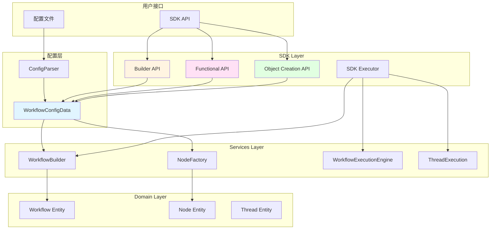
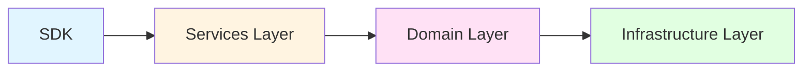
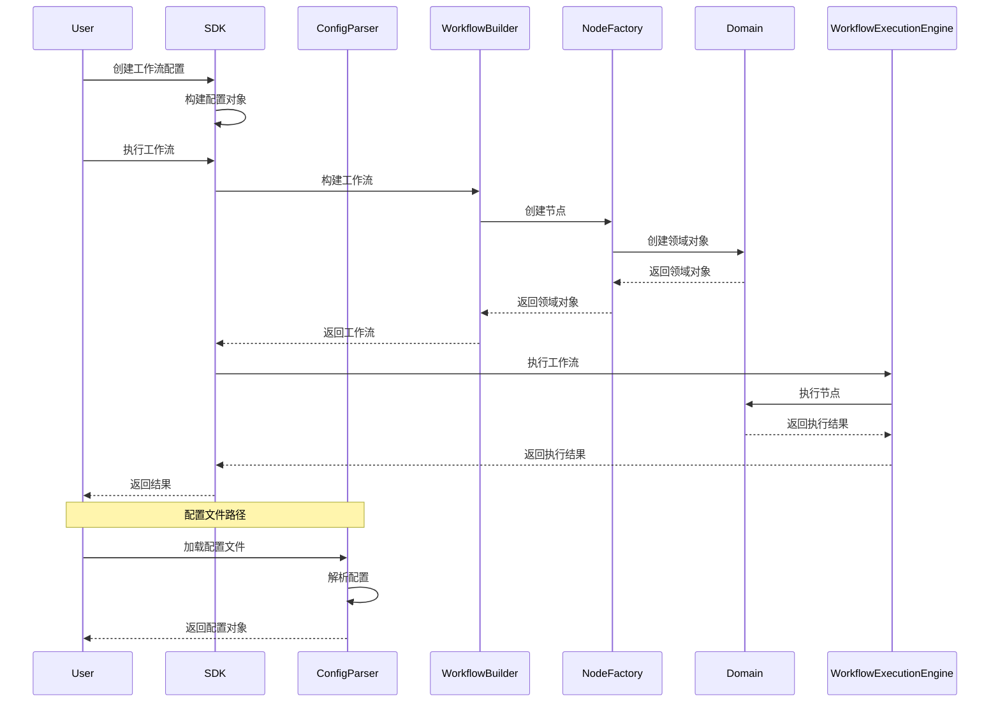
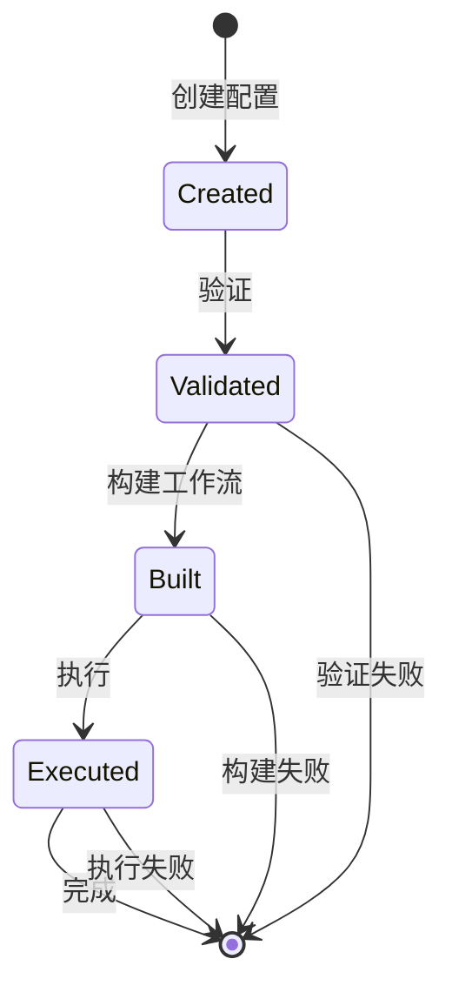

# Graph Agent SDK 设计文档

## 1. 概述

### 1.1 设计目标

Graph Agent SDK 是一个为 Graph Agent 框架提供的编程式 API，旨在简化工作流的创建、配置和执行。SDK 提供三种不同的 API 风格（Builder API、函数式 API、对象创建 API），以满足不同场景下的开发需求。

### 1.2 核心原则

1. **统一配置对象**：SDK 直接使用 Service 层的配置对象（`NodeConfig`、`WorkflowConfigData`）
2. **类型安全**：提供完整的 TypeScript 类型支持
3. **兼容性**：与现有配置驱动系统无缝集成
4. **灵活性**：支持多种编程范式
5. **可测试性**：易于编写单元测试和集成测试

### 1.3 设计决策

- **直接复用 Service 层配置对象**：SDK 不定义自己的配置对象，直接使用 `NodeConfig` 和 `WorkflowConfigData`
- **配置解析器作为辅助**：配置文件通过 `ConfigParser` 解析为统一的配置对象
- **依赖注入**：通过依赖注入获取 Services 层的服务
- **不可变对象**：配置对象使用不可变设计
- **流式 API**：Builder API 使用链式调用提供流畅的开发体验

## 2. 架构设计

### 2.1 整体架构



### 2.2 模块划分

SDK 模块位于 `src/application/sdk/`，包含以下子模块：

```
src/application/sdk/
├── index.ts                          # 主入口
├── types/                            # 类型定义（复用 Service 层）
│   └── index.ts                      # 导出 Service 层类型
├── builders/                         # Builder API
│   ├── workflow-builder.ts
│   ├── node-builder.ts
│   ├── edge-builder.ts
│   └── thread-builder.ts
├── functional/                       # 函数式 API
│   ├── index.ts
│   ├── workflow.ts
│   ├── node.ts
│   ├── edge.ts
│   └── operators.ts
├── creators/                         # 对象创建 API
│   ├── index.ts
│   ├── workflow.ts
│   ├── node.ts
│   └── edge.ts
├── executor/                         # 执行器
│   ├── sdk-executor.ts
│   └── execution-context.ts
└── utils/                            # 工具函数
    ├── index.ts
    ├── validators.ts
    └── helpers.ts
```

### 2.3 依赖关系



**重要约束**：
- SDK 只能依赖 Services 层
- SDK 不能直接依赖 Domain 层或 Infrastructure 层
- SDK 直接使用 Service 层的配置对象（`NodeConfig`、`WorkflowConfigData`）
- 所有领域对象必须通过 Services 层获取或创建

## 3. 组件和接口

### 3.1 类型系统（复用 Service 层）

SDK 直接复用 Service 层的类型定义，不重复定义：

```typescript
// src/application/sdk/types/index.ts

// 从 Service 层导入配置类型
export type {
  NodeConfig,
  StartNodeConfig,
  EndNodeConfig,
  LLMNodeConfig,
  ToolCallNodeConfig,
  ConditionNodeConfig,
  DataTransformNodeConfig,
  ContextProcessorNodeConfig
} from '../../services/workflow/nodes/node-factory';

export type {
  WorkflowConfigData,
  EdgeConfig,
  EdgeConditionConfig,
  SubWorkflowReferenceConfig
} from '../../services/workflow/config-parser';

// SDK 特有的类型
export interface SDKConfig {
  enableLogging?: boolean;
  defaultTimeout?: number;
  defaultCheckpointInterval?: number;
}

export interface ThreadConfig {
  id: string;
  workflow: WorkflowConfigData;
  inputData?: Record<string, any>;
  options?: {
    enableCheckpoints?: boolean;
    checkpointInterval?: number;
    timeout?: number;
    maxSteps?: number;
  };
}
```

### 3.2 Builder API

#### 3.2.1 WorkflowBuilder

```typescript
export class WorkflowBuilder {
  private config: Partial<WorkflowConfigData['workflow']>;
  private nodes: NodeConfig[];
  private edges: EdgeConfig[];

  private constructor(id: string);

  public static create(id: string): WorkflowBuilder;

  public name(name: string): WorkflowBuilder;

  public description(description: string): WorkflowBuilder;

  public type(type: string): WorkflowBuilder;

  public status(status: string): WorkflowBuilder;

  public addNode(node: NodeConfig): WorkflowBuilder;

  public addEdge(edge: EdgeConfig): WorkflowBuilder;

  public addTag(tag: string): WorkflowBuilder;

  public metadata(metadata: Record<string, any>): WorkflowBuilder;

  public build(): WorkflowConfigData;
}
```

#### 3.2.2 NodeBuilder

```typescript
export class NodeBuilder {
  private config: Partial<BaseNodeConfig>;

  private constructor(type: string, id: string);

  public static start(id: string): NodeBuilder;

  public static llm(id: string): NodeBuilder;

  public static tool(id: string): NodeBuilder;

  public static condition(id: string): NodeBuilder;

  public static transform(id: string): NodeBuilder;

  public static contextProcessor(id: string): NodeBuilder;

  public static end(id: string): NodeBuilder;

  public name(name: string): NodeBuilder;

  public description(description: string): NodeBuilder;

  public position(x: number, y: number): NodeBuilder;

  public initialVariables(variables: Record<string, any>): NodeBuilder;

  public wrapperConfig(wrapper: WrapperConfig): NodeBuilder;

  public wrapperType(type: 'pool' | 'group' | 'direct'): NodeBuilder;

  public wrapperName(name: string): NodeBuilder;

  public wrapperProvider(provider: string): NodeBuilder;

  public wrapperModel(model: string): NodeBuilder;

  public prompt(prompt: PromptSource): NodeBuilder;

  public systemPrompt(prompt: PromptSource): NodeBuilder;

  public contextProcessorName(name: string): NodeBuilder;

  public temperature(temperature: number): NodeBuilder;

  public maxTokens(maxTokens: number): NodeBuilder;

  public stream(stream: boolean): NodeBuilder;

  public toolName(toolName: string): NodeBuilder;

  public toolParameters(parameters: Record<string, any>): NodeBuilder;

  public timeout(timeout: number): NodeBuilder;

  public condition(condition: string): NodeBuilder;

  public variables(variables: Record<string, any>): NodeBuilder;

  public transformType(type: 'map' | 'filter' | 'reduce' | 'sort' | 'group'): NodeBuilder;

  public sourceData(sourceData: string): NodeBuilder;

  public targetVariable(targetVariable: string): NodeBuilder;

  public transformConfig(config: Record<string, any>): NodeBuilder;

  public processorName(name: string): NodeBuilder;

  public processorConfig(config: Record<string, any>): NodeBuilder;

  public returnVariables(variables: string[]): NodeBuilder;

  public collectResults(collect: boolean): NodeBuilder;

  public cleanupResources(cleanup: boolean): NodeBuilder;

  public build(): NodeConfig;
}
```

#### 3.2.3 EdgeBuilder

```typescript
export class EdgeBuilder {
  private config: Partial<EdgeConfig>;

  private constructor();

  public static create(): EdgeBuilder;

  public from(from: string): EdgeBuilder;

  public to(to: string): EdgeBuilder;

  public type(type: string): EdgeBuilder;

  public condition(condition: EdgeConditionConfig): EdgeBuilder;

  public weight(weight: number): EdgeBuilder;

  public properties(properties: Record<string, any>): EdgeBuilder;

  public build(): EdgeConfig;
}
```

#### 3.2.4 ThreadBuilder

```typescript
export class ThreadBuilder {
  private config: Partial<ThreadConfig>;

  private constructor(id: string);

  public static create(id: string): ThreadBuilder;

  public workflow(workflow: WorkflowConfigData): ThreadBuilder;

  public inputData(data: Record<string, any>): ThreadBuilder;

  public options(options: ThreadConfig['options']): ThreadBuilder;

  public build(): ThreadConfig;
}
```

### 3.3 函数式 API

#### 3.3.1 workflow 函数

```typescript
export function workflow(
  id: string,
  config: {
    name?: string;
    description?: string;
    type?: string;
    status?: string;
    nodes: NodeConfig[];
    edges: EdgeConfig[];
    tags?: string[];
    metadata?: Record<string, any>;
  }
): WorkflowConfigData;
```

#### 3.3.2 node 函数集合

```typescript
export const node = {
  start: (id: string, config?: Partial<StartNodeConfig>): NodeConfig,
  llm: (id: string, config: Partial<LLMNodeConfig>): NodeConfig,
  tool: (id: string, config: Partial<ToolCallNodeConfig>): NodeConfig,
  condition: (id: string, config: Partial<ConditionNodeConfig>): NodeConfig,
  transform: (id: string, config: Partial<DataTransformNodeConfig>): NodeConfig,
  contextProcessor: (id: string, config: Partial<ContextProcessorNodeConfig>): NodeConfig,
  end: (id: string, config?: Partial<EndNodeConfig>): NodeConfig
};
```

#### 3.3.3 edge 函数

```typescript
export function edge(
  from: string,
  to: string,
  config?: {
    type?: string;
    condition?: EdgeConditionConfig;
    weight?: number;
    properties?: Record<string, any>;
  }
): EdgeConfig;
```

#### 3.3.4 pipe 函数

```typescript
export function pipe(...nodes: NodeConfig[]): WorkflowConfigData;
```

#### 3.3.5 高阶函数

```typescript
export function map<T, R>(items: T[], fn: (item: T) => R): R[];

export function filter<T>(items: T[], predicate: (item: T) => boolean): T[];

export function reduce<T, R>(items: T[], initial: R, fn: (acc: R, item: T) => R): R;
```

### 3.4 对象创建 API

#### 3.4.1 createWorkflow

```typescript
export function createWorkflow(config: WorkflowConfigData): WorkflowConfigData;
```

#### 3.4.2 createNode

```typescript
export const createNode = {
  start: (id: string, config?: Partial<StartNodeConfig>): NodeConfig,
  llm: (id: string, config: Partial<LLMNodeConfig>): NodeConfig,
  tool: (id: string, config: Partial<ToolCallNodeConfig>): NodeConfig,
  condition: (id: string, config: Partial<ConditionNodeConfig>): NodeConfig,
  transform: (id: string, config: Partial<DataTransformNodeConfig>): NodeConfig,
  contextProcessor: (id: string, config: Partial<ContextProcessorNodeConfig>): NodeConfig,
  end: (id: string, config?: Partial<EndNodeConfig>): NodeConfig,
  quickLLM: (id: string, prompt: PromptSource, config?: { provider?: string; model?: string; temperature?: number }): NodeConfig,
  quickTool: (id: string, toolName: string, parameters?: Record<string, any>): NodeConfig,
  quickBranch: (id: string, condition: string, trueBranch: string, falseBranch: string): NodeConfig
};
```

#### 3.4.3 createEdge

```typescript
export function createEdge(
  from: string,
  to: string,
  config?: {
    type?: string;
    condition?: EdgeConditionConfig;
    weight?: number;
    properties?: Record<string, any>;
  }
): EdgeConfig;
```

### 3.5 执行器模块

#### 3.5.1 SDKExecutor

```typescript
export class SDKExecutor {
  constructor(
    private readonly workflowBuilder: WorkflowBuilder,
    private readonly workflowExecutionEngine: WorkflowExecutionEngine,
    private readonly threadExecution: ThreadExecution,
    private readonly logger: ILogger,
    private readonly config: SDKConfig = {}
  );

  public async executeWorkflow(
    workflowConfig: WorkflowConfigData,
    inputData?: Record<string, any>
  ): Promise<WorkflowExecutionResult>;

  public async executeThread(
    threadConfig: ThreadConfig
  ): Promise<ThreadExecutionResult>;
}
```

#### 3.5.2 ExecutionContext

```typescript
export class ExecutionContext {
  public static create(
    executionId: string,
    workflowId: string
  ): ExecutionContext;

  public getVariable(name: string): any;

  public setVariable(name: string, value: any): void;

  public getVariables(): Record<string, any>;

  public getExecutionId(): string;

  public getWorkflowId(): string;
}
```

### 3.6 工具函数模块

#### 3.6.1 Validators

```typescript
export class Validators {
  public static validateWorkflowConfig(config: WorkflowConfigData): ValidationResult;

  public static validateNodeConfig(config: NodeConfig): ValidationResult;

  public static validateEdgeConfig(config: EdgeConfig): ValidationResult;
}
```

#### 3.6.2 Helpers

```typescript
export class Helpers {
  public static generateId(prefix?: string): string;

  public static deepClone<T>(obj: T): T;

  public static mergeDeep<T extends object>(target: T, source: Partial<T>): T;
}
```

## 4. 数据模型

### 4.1 数据流



### 4.2 配置对象生命周期



### 4.3 类型映射

| SDK 类型 | Service 类型 | Domain 类型 |
|---------|------------|------------|
| WorkflowConfigData | WorkflowConfigData | Workflow |
| NodeConfig | NodeConfig | Node |
| EdgeConfig | EdgeConfig | EdgeValueObject |
| ThreadConfig | - | Thread |

**重要**：SDK 直接使用 Service 层的配置对象，不需要转换。

## 5. 错误处理

### 5.1 错误类型

```typescript
export class SDKError extends Error {
  constructor(
    message: string,
    public readonly code: string,
    public readonly details?: any
  );
}

export class ValidationError extends SDKError {
  constructor(message: string, public readonly validationErrors: string[]);
}

export class BuildError extends SDKError {
  constructor(message: string, public readonly config: any);
}

export class ExecutionError extends SDKError {
  constructor(message: string, public readonly executionId: string);
}
```

### 5.2 错误处理策略

1. **验证错误**：在构建配置时立即抛出
2. **构建错误**：在构建工作流时抛出
3. **执行错误**：在执行过程中捕获并返回错误信息
4. **超时错误**：使用超时机制处理长时间运行的操作

### 5.3 错误恢复

```typescript
try {
  const result = await executor.executeWorkflow(workflowConfig, inputData);
  if (!result.success) {
    // 处理执行失败
    console.error('执行失败:', result.error);
  }
} catch (error) {
  if (error instanceof ValidationError) {
    // 处理验证错误
    console.error('验证错误:', error.validationErrors);
  } else if (error instanceof BuildError) {
    // 处理构建错误
    console.error('构建错误:', error.message);
  } else {
    // 处理其他错误
    console.error('未知错误:', error);
  }
}
```

## 6. 测试策略

### 6.1 单元测试

#### 6.1.1 Builder API 测试

```typescript
describe('WorkflowBuilder', () => {
  it('should create a workflow with basic configuration', () => {
    const workflow = WorkflowBuilder.create('test-workflow')
      .name('Test Workflow')
      .build();

    expect(workflow.workflow.id).toBe('test-workflow');
    expect(workflow.workflow.name).toBe('Test Workflow');
  });

  it('should add nodes to workflow', () => {
    const workflow = WorkflowBuilder.create('test-workflow')
      .addNode(NodeBuilder.start('start').build())
      .build();

    expect(workflow.workflow.nodes).toHaveLength(1);
  });
});
```

#### 6.1.2 执行器测试

```typescript
describe('SDKExecutor', () => {
  it('should execute workflow successfully', async () => {
    const executor = new SDKExecutor(
      mockWorkflowBuilder,
      mockWorkflowExecutionEngine,
      mockThreadExecution,
      mockLogger
    );

    const result = await executor.executeWorkflow(workflowConfig, inputData);

    expect(result.success).toBe(true);
  });
});
```

### 6.2 集成测试

```typescript
describe('SDK Integration', () => {
  it('should create and execute a complete workflow', async () => {
    const workflow = WorkflowBuilder.create('integration-test')
      .addNode(NodeBuilder.start('start').build())
      .addNode(
        NodeBuilder.llm('llm')
          .wrapperType('direct')
          .wrapperProvider('mock')
          .wrapperModel('test')
          .prompt({ type: 'direct', content: 'test' })
          .build()
      )
      .addNode(NodeBuilder.end('end').build())
      .addEdge(EdgeBuilder.create().from('start').to('llm').build())
      .addEdge(EdgeBuilder.create().from('llm').to('end').build())
      .build();

    const result = await executor.executeWorkflow(workflow, {});

    expect(result.success).toBe(true);
  });
});
```

### 6.3 测试覆盖率目标

- 单元测试覆盖率：≥ 80%
- 集成测试覆盖率：≥ 60%
- 关键路径覆盖率：100%

## 7. 性能考虑

### 7.1 性能优化策略

1. **配置缓存**：缓存已构建的工作流
2. **延迟构建**：只在需要时才构建工作流
3. **批量操作**：支持批量添加节点和边
4. **类型推断优化**：优化 TypeScript 类型推断性能

### 7.2 性能指标

- 工作流配置创建：< 10ms
- 工作流构建：< 50ms
- 简单工作流执行：< 100ms
- 复杂工作流执行：< 1s

## 8. 安全考虑

### 8.1 输入验证

- 验证所有输入参数
- 防止注入攻击
- 限制配置大小

### 8.2 权限控制

- 遵循现有的权限系统
- 验证用户权限
- 记录操作日志

## 9. 扩展性

### 9.1 扩展点

1. **自定义节点类型**：通过扩展 `NodeConfig` 支持新的节点类型
2. **自定义边类型**：通过扩展 `EdgeConfig` 支持新的边类型
3. **自定义执行器**：通过扩展 `SDKExecutor` 支持自定义执行逻辑

### 9.2 插件机制

```typescript
export interface SDKPlugin {
  name: string;
  version: string;
  install(sdk: SDK): void;
}

export class SDK {
  private plugins: SDKPlugin[] = [];

  public use(plugin: SDKPlugin): void {
    this.plugins.push(plugin);
    plugin.install(this);
  }
}
```

## 10. 文档和示例

### 10.1 API 文档

- 使用 TypeScript 类型定义作为文档
- 提供详细的 JSDoc 注释
- 包含使用示例

### 10.2 示例代码

- 快速开始示例
- Builder API 示例
- 函数式 API 示例
- 对象创建 API 示例
- 高级用法示例

## 11. 设计决策记录

### 11.1 为什么直接复用 Service 层配置对象？

**决策**：SDK 直接使用 Service 层的 `NodeConfig` 和 `WorkflowConfigData`。

**理由**：
1. Service 层已经重构为编程驱动，配置对象已经优化
2. 避免维护两套配置对象
3. 减少类型转换的复杂度
4. 保持架构的一致性
5. 降低维护成本

### 11.2 为什么提供三种 API 风格？

**决策**：提供 Builder API、函数式 API 和对象创建 API 三种风格。

**理由**：
1. 满足不同开发者的偏好
2. 适应不同的使用场景
3. 提供灵活的选择
4. 保持向后兼容

### 11.3 为什么 SDK 位于 Application 层？

**决策**：SDK 严格位于 Application 层，只依赖 Services 层。

**理由**：
1. 遵循项目的分层架构
2. 保持架构的一致性
3. 避免直接依赖 Domain 层
4. 便于维护和扩展

### 11.4 为什么使用不可变对象？

**决策**：配置对象使用不可变设计。

**理由**：
1. 避免意外的修改
2. 提高代码的可预测性
3. 支持函数式编程
4. 便于测试和调试

## 12. 未来改进

### 12.1 短期改进

1. 添加更多节点类型支持
2. 优化性能
3. 改进错误消息
4. 增加更多示例

### 12.2 长期改进

1. 支持可视化工作流编辑器
2. 提供工作流模板库
3. 支持工作流版本管理
4. 提供工作流性能分析工具

## 13. 总结

Graph Agent SDK 提供了一个强大而灵活的编程式 API，用于创建、配置和执行工作流。通过提供三种不同的 API 风格，SDK 能够满足不同场景下的开发需求。严格遵循项目的分层架构，SDK 作为 Application 层的外部接口，只依赖 Services 层，直接使用 Service 层的配置对象（`NodeConfig`、`WorkflowConfigData`），与现有的配置驱动系统完全兼容。

设计文档涵盖了 SDK 的所有核心组件和接口，包括类型系统（复用 Service 层）、Builder API、函数式 API、对象创建 API、执行器和工具函数。通过详细的架构设计、数据模型、错误处理和测试策略，确保 SDK 的质量和可维护性。

**关键优势**：
- ✅ 统一的配置对象，避免重复定义
- ✅ 简洁的架构，不需要适配器层
- ✅ 更好的类型安全，直接使用 Service 层类型
- ✅ 更低的维护成本，只需维护一套配置对象
- ✅ 更好的开发体验，统一的编程式 API