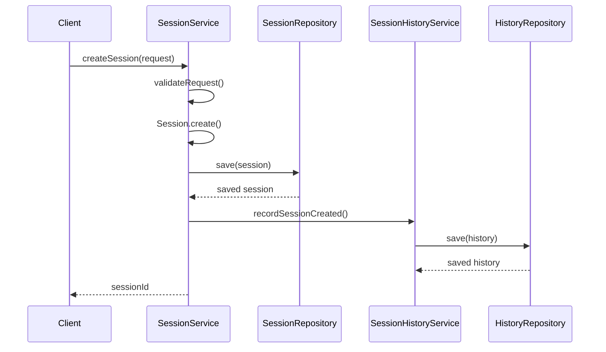
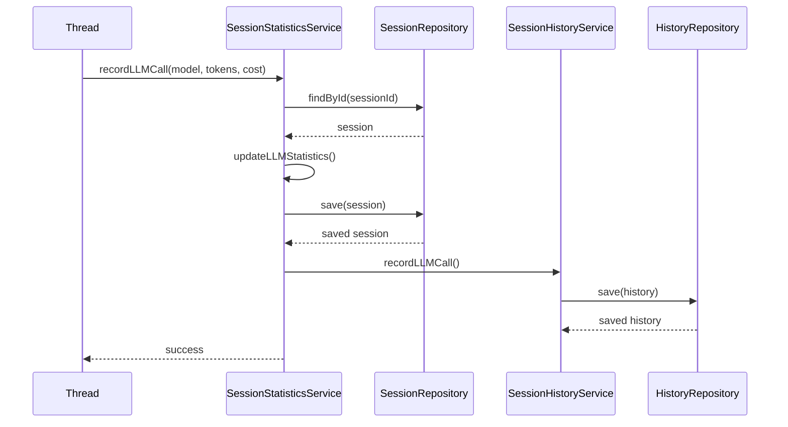
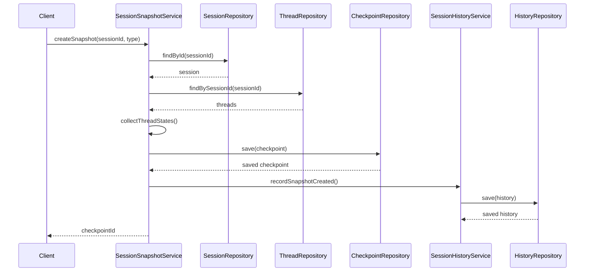
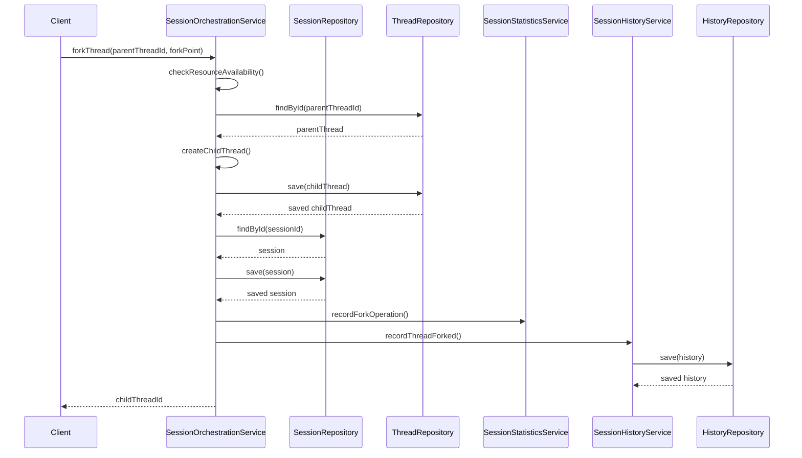
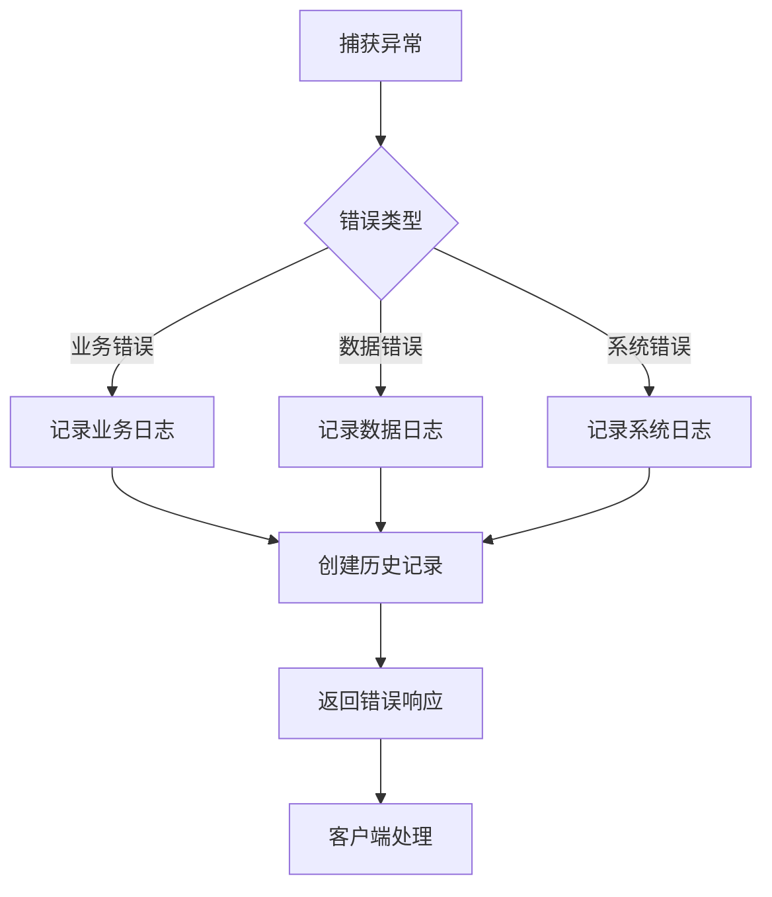

# Session模块设计文档

## 1. 概述

Session模块作为多线程管理器，负责会话级别的协调、统计、历史记录和快照管理。本文档详细描述Session模块的架构设计、组件划分、数据流和实现策略。

## 2. 架构设计

### 2.1 整体架构

Session模块遵循项目的3层架构原则：

```
┌─────────────────────────────────────────────────────────┐
│                    Interface Layer                       │
│  (HTTP API, gRPC, CLI - 外部接口适配)                    │
└─────────────────────────────────────────────────────────┘
                            ↓
┌─────────────────────────────────────────────────────────┐
│                  Application Layer                       │
│  (业务逻辑编排、应用服务、DTO转换)                         │
│  - SessionService (会话生命周期管理)                      │
│  - SessionStatisticsService (统计服务)                   │
│  - SessionHistoryService (历史记录服务)                  │
│  - SessionSnapshotService (快照管理服务)                 │
│  - SessionOrchestrationService (会话编排服务)            │
└─────────────────────────────────────────────────────────┘
                            ↓
┌─────────────────────────────────────────────────────────┐
│                    Domain Layer                          │
│  (业务实体、值对象、仓储接口)                             │
│  - Session (会话实体)                                    │
│  - SessionActivity (会话活动值对象)                      │
│  - LLMStatistics (LLM统计值对象)                         │
│  - PerformanceStatistics (性能统计值对象)                │
│  - ResourceUsage (资源使用值对象)                        │
│  - OperationStatistics (操作统计值对象)                  │
│  - History (历史实体)                                    │
│  - Checkpoint (检查点实体)                               │
│  - SessionRepository (仓储接口)                          │
│  - HistoryRepository (仓储接口)                          │
│  - CheckpointRepository (仓储接口)                       │
└─────────────────────────────────────────────────────────┘
                            ↓
┌─────────────────────────────────────────────────────────┐
│                Infrastructure Layer                      │
│  (技术实现、数据持久化、外部依赖)                         │
│  - SessionRepositoryImpl (仓储实现)                      │
│  - HistoryRepositoryImpl (仓储实现)                      │
│  - CheckpointRepositoryImpl (仓储实现)                   │
│  - SessionStatisticsCollector (统计收集器)               │
│  - SessionHistoryRecorder (历史记录器)                   │
│  - SessionSnapshotManager (快照管理器)                   │
│  - Database Models (数据模型)                            │
└─────────────────────────────────────────────────────────┘
```

### 2.2 层次依赖关系

```
Interface Layer
    ↓ depends on
Application Layer
    ↓ depends on
Domain Layer
    ↑ depends on
Infrastructure Layer
```

**关键约束**：
- Infrastructure层只能依赖Domain层
- Application层只能依赖Domain层
- Interface层只能依赖Application层
- 所有层都不能跨层依赖

## 3. 组件设计

### 3.1 Domain层组件

#### 3.1.1 Session实体（已实现）

**职责**：
- 会话生命周期管理
- 状态转换验证
- 业务不变性保证

**关键方法**：
- `create()`: 创建新会话
- `changeStatus()`: 更改会话状态
- `incrementMessageCount()`: 增加消息数量
- `incrementThreadCount()`: 增加线程数量
- `updateLastActivity()`: 更新最后活动时间
- `isTimeout()`: 检查会话是否超时
- `isExpired()`: 检查会话是否过期

#### 3.1.2 SessionActivity值对象（已实现）

**职责**：
- 表示会话的活动状态和统计数据
- 包含基础统计、LLM使用统计、性能统计、资源监控和操作统计

**组成**：
- `lastActivityAt`: 最后活动时间
- `messageCount`: 消息数量
- `threadCount`: 线程数量
- `llmStatistics`: LLM统计信息
- `performance`: 性能统计信息
- `resourceUsage`: 资源使用情况
- `operationStatistics`: 操作统计信息

#### 3.1.3 统计值对象（已实现）

**LLMStatistics**：
- 记录LLM调用的token使用量和成本
- 支持按模型统计
- 支持时间序列数据
- 支持成本分析

**PerformanceStatistics**：
- 记录执行时间统计
- 计算平均、最大、最小执行时间
- 计算成功率和失败率

**ResourceUsage**：
- 记录内存、CPU、磁盘、网络使用情况
- 记录峰值资源使用

**OperationStatistics**：
- 记录fork、copy等操作统计
- 按策略分类统计
- 记录成功和失败数

#### 3.1.4 History实体（已实现）

**职责**：
- 记录会话的所有重要事件
- 支持审计和问题追踪

**关键属性**：
- `sessionId`: 会话ID
- `threadId`: 线程ID
- `workflowId`: 工作流ID
- `type`: 历史类型
- `details`: 详细信息
- `metadata`: 元数据

#### 3.1.5 Checkpoint实体（已实现）

**职责**：
- 表示线程执行过程中的检查点
- 支持状态保存和恢复

**关键属性**：
- `threadId`: 线程ID
- `type`: 检查点类型
- `stateData`: 状态数据
- `tags`: 标签

### 3.2 Application层组件

#### 3.2.1 SessionService（已实现）

**职责**：
- 会话生命周期管理
- 会话状态转换
- 会话配置管理
- 会话清理和维护

**关键方法**：
- `createSession()`: 创建会话
- `activateSession()`: 激活会话
- `suspendSession()`: 暂停会话
- `terminateSession()`: 终止会话
- `updateSessionConfig()`: 更新配置
- `cleanupTimeoutSessions()`: 清理超时会话
- `cleanupExpiredSessions()`: 清理过期会话

#### 3.2.2 SessionStatisticsService（需新增）

**职责**：
- 收集和更新统计数据
- 提供统计查询接口
- 生成统计报告

**关键方法**：
- `recordLLMCall()`: 记录LLM调用
- `recordExecution()`: 记录执行
- `updateResourceUsage()`: 更新资源使用
- `recordForkOperation()`: 记录fork操作
- `recordCopyOperation()`: 记录copy操作
- `getStatistics()`: 获取统计信息
- `getCostAnalysis()`: 获取成本分析
- `getPerformanceReport()`: 获取性能报告

**依赖**：
- SessionRepository
- HistoryRepository
- ILogger

#### 3.2.3 SessionHistoryService（需新增）

**职责**：
- 记录会话事件
- 查询历史记录
- 生成审计报告

**关键方法**：
- `recordSessionCreated()`: 记录会话创建
- `recordStatusChanged()`: 记录状态变更
- `recordThreadCreated()`: 记录线程创建
- `recordThreadForked()`: 记录线程fork
- `recordThreadCopied()`: 记录线程copy
- `recordThreadDestroyed()`: 记录线程销毁
- `recordLLMCall()`: 记录LLM调用
- `recordError()`: 记录错误
- `recordConfigChanged()`: 记录配置变更
- `queryHistory()`: 查询历史记录
- `getAuditReport()`: 获取审计报告

**依赖**：
- HistoryRepository
- SessionRepository
- ILogger

#### 3.2.4 SessionSnapshotService（需新增）

**职责**：
- 创建会话快照
- 管理快照生命周期
- 支持快照恢复

**关键方法**：
- `createSnapshot()`: 创建快照
- `createAutoSnapshot()`: 创建自动快照
- `createErrorSnapshot()`: 创建错误恢复快照
- `getSnapshots()`: 获取快照列表
- `getSnapshotById()`: 根据ID获取快照
- `deleteSnapshot()`: 删除快照
- `restoreFromSnapshot()`: 从快照恢复
- `addSnapshotTag()`: 添加快照标签
- `removeSnapshotTag()`: 移除快照标签

**依赖**：
- CheckpointRepository
- SessionRepository
- ThreadRepository
- HistoryRepository
- ILogger

#### 3.2.5 SessionOrchestrationService（需新增）

**职责**：
- 协调会话中的多个线程
- 管理线程创建、fork、copy、销毁
- 协调线程间通信
- 资源分配和调度

**关键方法**：
- `createThread()`: 创建线程
- `forkThread()`: fork线程
- `copyThread()`: copy线程
- `destroyThread()`: 销毁线程
- `coordinateThreads()`: 协调线程
- `allocateResources()`: 分配资源
- `releaseResources()`: 释放资源
- `checkResourceAvailability()`: 检查资源可用性

**依赖**：
- SessionRepository
- ThreadRepository
- SessionStatisticsService
- SessionHistoryService
- ILogger

### 3.3 Infrastructure层组件

#### 3.3.1 SessionRepositoryImpl（已实现）

**职责**：
- 实现SessionRepository接口
- 处理Session实体的持久化
- 提供会话查询功能

**关键方法**：
- `save()`: 保存会话
- `findById()`: 根据ID查找会话
- `findActiveSessionsForUser()`: 查找用户的活跃会话
- `findSessionsNeedingCleanup()`: 查找需要清理的会话
- `batchUpdateSessionStatus()`: 批量更新会话状态

#### 3.3.2 HistoryRepositoryImpl（已实现）

**职责**：
- 实现HistoryRepository接口
- 处理History实体的持久化
- 提供历史记录查询功能

#### 3.3.3 CheckpointRepositoryImpl（已实现）

**职责**：
- 实现CheckpointRepository接口
- 处理Checkpoint实体的持久化
- 提供快照查询功能

#### 3.3.4 SessionStatisticsCollector（需新增）

**职责**：
- 收集统计数据
- 聚合统计信息
- 优化统计查询性能

**关键方法**：
- `collectLLMStatistics()`: 收集LLM统计
- `collectPerformanceStatistics()`: 收集性能统计
- `collectResourceUsage()`: 收集资源使用
- `collectOperationStatistics()`: 收集操作统计
- `aggregateStatistics()`: 聚合统计信息
- `cacheStatistics()`: 缓存统计信息

**依赖**：
- SessionRepository
- HistoryRepository
- Cache（可选）

#### 3.3.5 SessionHistoryRecorder（需新增）

**职责**：
- 记录历史事件
- 批量写入历史记录
- 优化历史记录写入性能

**关键方法**：
- `recordEvent()`: 记录事件
- `batchRecordEvents()`: 批量记录事件
- `flushEvents()`: 刷新事件队列
- `compressHistory()`: 压缩历史记录

**依赖**：
- HistoryRepository
- EventQueue（可选）

#### 3.3.6 SessionSnapshotManager（需新增）

**职责**：
- 管理快照生命周期
- 优化快照存储
- 支持快照压缩和归档

**关键方法**：
- `createSnapshot()`: 创建快照
- `compressSnapshot()`: 压缩快照
- `archiveSnapshot()`: 归档快照
- `deleteOldSnapshots()`: 删除旧快照
- `validateSnapshot()`: 验证快照完整性

**依赖**：
- CheckpointRepository
- SessionRepository
- ThreadRepository
- StorageService（可选）

## 4. 数据模型

### 4.1 Session数据模型（已实现）

```typescript
interface SessionModel {
  id: string;
  userId?: string;
  state: string;
  context: Record<string, unknown>;
  version: string;
  createdAt: Date;
  updatedAt: Date;
  metadata: {
    title?: string;
    messageCount: number;
    threadCount: number;
    isDeleted: boolean;
    config: Record<string, unknown>;
    llmStatistics?: LLMStatisticsData;
    performance?: PerformanceStatisticsData;
    resourceUsage?: ResourceUsageData;
    operationStatistics?: OperationStatisticsData;
  };
  threadIds: string[];
}
```

### 4.2 History数据模型（已实现）

```typescript
interface HistoryModel {
  id: string;
  sessionId?: string;
  threadId?: string;
  workflowId?: string;
  type: string;
  title?: string;
  description?: string;
  details: Record<string, unknown>;
  metadata: Record<string, unknown>;
  createdAt: Date;
  updatedAt: Date;
  version: string;
  isDeleted: boolean;
}
```

### 4.3 Checkpoint数据模型（已实现）

```typescript
interface CheckpointModel {
  id: string;
  threadId: string;
  type: string;
  title?: string;
  description?: string;
  stateData: Record<string, unknown>;
  tags: string[];
  metadata: Record<string, unknown>;
  createdAt: Date;
  updatedAt: Date;
  version: string;
  isDeleted: boolean;
}
```

## 5. 数据流设计

### 5.1 会话创建流程



### 5.2 统计数据更新流程



### 5.3 快照创建流程



### 5.4 线程Fork流程



## 6. 错误处理策略

### 6.1 错误分类

1. **业务错误**：
   - 状态转换错误
   - 资源不足错误
   - 配置验证错误

2. **数据错误**：
   - 实体不存在错误
   - 数据一致性错误
   - 数据验证错误

3. **系统错误**：
   - 数据库连接错误
   - 网络错误
   - 资源耗尽错误

### 6.2 错误处理流程



### 6.3 错误恢复策略

1. **重试机制**：
   - 数据库连接失败：最多重试3次
   - 网络请求失败：最多重试5次
   - 指数退避策略

2. **降级策略**：
   - 统计数据更新失败：记录到队列，异步重试
   - 历史记录写入失败：记录到本地日志
   - 快照创建失败：记录错误，不影响主流程

3. **回滚策略**：
   - 会话创建失败：回滚所有相关操作
   - 线程创建失败：回滚线程创建，更新会话状态
   - 快照创建失败：删除部分创建的快照数据

## 7. 性能优化策略

### 7.1 统计数据优化

1. **批量更新**：
   - 累积多个统计更新，批量写入数据库
   - 使用批量更新API减少数据库往返

2. **缓存策略**：
   - 缓存热点统计数据
   - 使用Redis缓存统计结果
   - 设置合理的缓存过期时间

3. **异步处理**：
   - 统计数据更新异步化
   - 使用消息队列解耦
   - 后台任务处理聚合统计

### 7.2 历史记录优化

1. **批量写入**：
   - 累积多个历史记录，批量写入
   - 使用批量插入API

2. **压缩存储**：
   - 压缩历史记录的details字段
   - 使用JSON压缩算法

3. **分区存储**：
   - 按时间分区存储历史记录
   - 定期归档旧数据

### 7.3 快照优化

1. **增量快照**：
   - 只保存变化的状态数据
   - 使用差分算法

2. **压缩存储**：
   - 压缩快照数据
   - 使用高效的压缩算法

3. **异步创建**：
   - 快照创建异步化
   - 后台任务处理

## 8. 测试策略

### 8.1 单元测试

1. **Domain层测试**：
   - Session实体测试
   - 统计值对象测试
   - History实体测试
   - Checkpoint实体测试

2. **Application层测试**：
   - SessionService测试
   - SessionStatisticsService测试
   - SessionHistoryService测试
   - SessionSnapshotService测试
   - SessionOrchestrationService测试

3. **Infrastructure层测试**：
   - Repository实现测试
   - 统计收集器测试
   - 历史记录器测试
   - 快照管理器测试

### 8.2 集成测试

1. **会话生命周期集成测试**：
   - 创建、激活、暂停、终止完整流程
   - 状态转换验证
   - 并发操作测试

2. **统计功能集成测试**：
   - 统计数据收集和更新
   - 统计查询和报告生成
   - 成本分析功能

3. **历史记录集成测试**：
   - 事件记录和查询
   - 审计报告生成
   - 历史记录归档

4. **快照功能集成测试**：
   - 快照创建和恢复
   - 快照压缩和归档
   - 快照查询和管理

### 8.3 性能测试

1. **并发测试**：
   - 多会话并发创建
   - 多线程并发操作
   - 统计数据并发更新

2. **压力测试**：
   - 大量会话创建
   - 大量历史记录写入
   - 大量快照创建

3. **负载测试**：
   - 长时间运行测试
   - 资源使用监控
   - 性能指标收集

## 9. 部署策略

### 9.1 数据库部署

1. **表结构**：
   - sessions表
   - history表
   - checkpoints表
   - 索引优化

2. **分区策略**：
   - 按时间分区history表
   - 按会话ID分区checkpoints表

3. **备份策略**：
   - 定期全量备份
   - 增量备份
   - 异地备份

### 9.2 缓存部署

1. **Redis配置**：
   - 统计数据缓存
   - 会话状态缓存
   - 快照元数据缓存

2. **缓存策略**：
   - LRU淘汰策略
   - 合理的过期时间
   - 缓存预热

### 9.3 监控部署

1. **指标监控**：
   - 会话数量统计
   - 统计数据更新延迟
   - 历史记录写入延迟
   - 快照创建延迟

2. **日志监控**：
   - 错误日志
   - 性能日志
   - 审计日志

3. **告警配置**：
   - 错误率告警
   - 性能告警
   - 资源使用告警

## 10. 迁移策略

### 10.1 数据迁移

1. **现有数据迁移**：
   - 迁移现有会话数据
   - 迁移现有历史记录
   - 迁移现有快照数据

2. **数据验证**：
   - 数据完整性验证
   - 数据一致性验证
   - 业务逻辑验证

### 10.2 功能迁移

1. **逐步迁移**：
   - 先迁移基础功能
   - 再迁移统计功能
   - 最后迁移快照功能

2. **兼容性保证**：
   - 保持API兼容性
   - 保持数据格式兼容性
   - 提供迁移工具

## 11. 总结

Session模块的设计遵循了项目的3层架构原则，明确了各层的职责和依赖关系。通过引入SessionStatisticsService、SessionHistoryService、SessionSnapshotService和SessionOrchestrationService，实现了会话级别的统计、历史记录、快照管理和线程协调功能。

Infrastructure层需要补充SessionStatisticsCollector、SessionHistoryRecorder和SessionSnapshotManager等组件，以提供高效的数据收集、记录和管理能力。

整个设计考虑了性能优化、错误处理、测试策略和部署策略，确保系统的可靠性、可扩展性和可维护性。