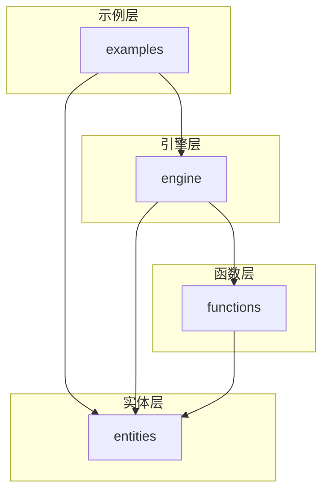
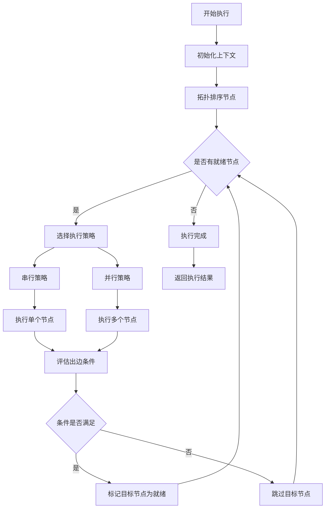
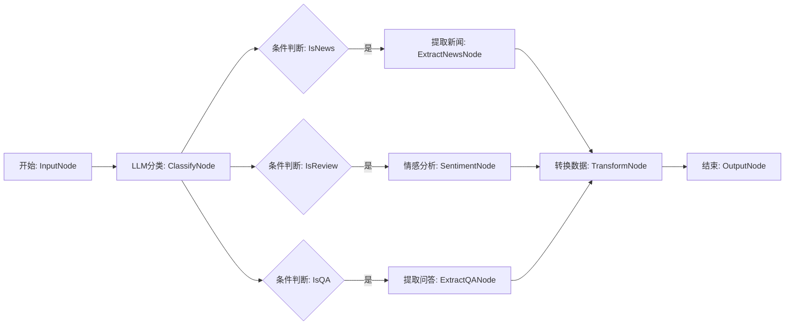

# 图工作流示例设计文档

## 概述

本文档描述一个简化的、硬编码的图工作流示例的设计方案。该示例演示图工作流的核心概念：节点、边、触发器的独立实体定义，以及通过函数式编程实现具体逻辑。设计遵循模块化原则，但不使用DDD分层架构，以提供清晰的功能演示。

## 架构设计

### 模块拆分

```
src/workflow-example/
├── entities/              # 实体定义模块
│   ├── node.ts           # 节点实体
│   ├── edge.ts           # 边实体
│   └── trigger.ts        # 触发器实体
├── functions/            # 函数实现模块
│   ├── nodes/            # 节点函数
│   ├── edges/            # 边条件函数
│   └── triggers/         # 触发器函数
├── engine/               # 执行引擎模块
│   ├── workflow-engine.ts    # 工作流执行引擎
│   └── execution-context.ts  # 执行上下文
└── examples/             # 示例模块
    └── text-analysis-workflow.ts  # 文本分析工作流示例
```

### 模块依赖关系



## 实体设计

### 1. 节点实体（Node）

#### 数据结构

```typescript
// 节点ID类型
interface NodeId {
  value: string;
  toString(): string;
}

// 节点类型枚举
enum NodeType {
  LLM = 'llm',
  TOOL = 'tool',
  CONDITION = 'condition',
  TRANSFORM = 'transform',
  START = 'start',
  END = 'end'
}

// 节点状态枚举
enum NodeStatus {
  PENDING = 'pending',
  RUNNING = 'running',
  COMPLETED = 'completed',
  FAILED = 'failed',
  SKIPPED = 'skipped'
}

// 节点配置接口
interface NodeConfig {
  [key: string]: any;
}

// 节点实体接口
interface Node {
  id: NodeId;
  type: NodeType;
  name: string;
  description?: string;
  config: NodeConfig;
  status: NodeStatus;
  
  // 方法
  updateStatus(status: NodeStatus): void;
  getInputSchema(): Record<string, any>;
  getOutputSchema(): Record<string, any>;
}
```

#### 节点类型设计

**LLM节点**
- 输入：prompt（字符串）、model（字符串）、temperature（数字）
- 输出：response（字符串）、tokens（数字）、model（字符串）
- 配置：maxTokens、timeout等

**工具调用节点**
- 输入：toolName（字符串）、parameters（对象）
- 输出：result（任意类型）、executionTime（数字）
- 配置：timeout、retry次数等

**条件检查节点**
- 输入：condition（表达式）、data（对象）
- 输出：result（布尔值）、evaluatedExpression（字符串）
- 配置：无特殊配置

**数据转换节点**
- 输入：input（任意类型）、transformRules（对象）
- 输出：output（任意类型）
- 配置：转换规则配置

### 2. 边实体（Edge）

#### 数据结构

```typescript
// 边ID类型
interface EdgeId {
  value: string;
  toString(): string;
}

// 边类型枚举
enum EdgeType {
  DIRECT = 'direct',
  CONDITIONAL = 'conditional'
}

// 条件运算符枚举
enum ConditionOperator {
  EQUALS = 'equals',
  NOT_EQUALS = 'not_equals',
  GREATER_THAN = 'greater_than',
  LESS_THAN = 'less_than',
  GREATER_EQUALS = 'greater_equals',
  LESS_EQUALS = 'less_equals',
  EXISTS = 'exists',
  NOT_EXISTS = 'not_exists'
}

// 条件接口
interface EdgeCondition {
  expression: string;  // 条件表达式，如 "{{node.result.success}} == true"
  operator: ConditionOperator;
  expectedValue?: any;
}

// 边实体接口
interface Edge {
  id: EdgeId;
  type: EdgeType;
  fromNodeId: NodeId;
  toNodeId: NodeId;
  condition?: EdgeCondition;
  weight: number;  // 权重，用于执行优先级
  
  // 方法
  evaluateCondition(context: ExecutionContext): Promise<boolean>;
  getConditionExpression(): string | undefined;
}
```

#### 边类型设计

**直接边**
- 无条件，总是允许执行
- 用于确定性的流程控制
- 权重用于执行顺序控制

**条件边**
- 包含条件表达式
- 根据上下文数据评估条件
- 支持复杂逻辑组合

### 3. 触发器实体（Trigger）

#### 数据结构

```typescript
// 触发器ID类型
interface TriggerId {
  value: string;
  toString(): string;
}

// 触发器类型枚举
enum TriggerType {
  TIME = 'time',
  EVENT = 'event',
  STATE = 'state'
}

// 触发器动作枚举
enum TriggerAction {
  START = 'start',
  STOP = 'stop',
  PAUSE = 'pause',
  RESUME = 'resume',
  SKIP_NODE = 'skip_node'
}

// 触发器状态枚举
enum TriggerStatus {
  ENABLED = 'enabled',
  DISABLED = 'disabled',
  TRIGGERED = 'triggered'
}

// 时间触发器配置
interface TimeTriggerConfig {
  delay?: number;      // 延迟毫秒数
  interval?: number;   // 间隔毫秒数
  cron?: string;       // cron表达式
}

// 事件触发器配置
interface EventTriggerConfig {
  eventType: string;
  eventDataPattern?: Record<string, any>;
}

// 状态触发器配置
interface StateTriggerConfig {
  statePath: string;
  expectedValue: any;
}

// 触发器实体接口
interface Trigger {
  id: TriggerId;
  type: TriggerType;
  name: string;
  config: TimeTriggerConfig | EventTriggerConfig | StateTriggerConfig;
  action: TriggerAction;
  targetNodeId?: NodeId;  // 目标节点ID（用于SKIP_NODE等动作）
  status: TriggerStatus;
  
  // 方法
  evaluate(context: ExecutionContext): Promise<boolean>;
  executeAction(engine: WorkflowEngine): Promise<void>;
  enable(): void;
  disable(): void;
}
```

#### 触发器类型设计

**时间触发器**
- 延迟触发：等待指定时间后触发
- 定时触发：按照cron表达式定期触发
- 间隔触发：每隔指定时间触发一次

**事件触发器**
- 监听特定类型的事件
- 支持事件数据模式匹配
- 可用于外部系统集成

**状态触发器**
- 监控工作流状态变化
- 当状态达到期望值时触发
- 支持复杂状态路径访问

## 函数式设计

### 1. 节点函数

#### 函数签名

```typescript
// 节点函数类型
type NodeFunction = (
  input: NodeInput,
  config: NodeConfig,
  context: ExecutionContext
) => Promise<NodeOutput>;

// 节点输入
interface NodeInput {
  [key: string]: any;
}

// 节点输出
interface NodeOutput {
  success: boolean;
  data?: any;
  error?: string;
  metadata?: Record<string, any>;
}
```

#### 具体函数实现

**LLM节点函数**
```typescript
const llmNodeFunction: NodeFunction = async (input, config, context) => {
  // 1. 提取参数
  const { prompt, model = 'gpt-3.5-turbo', temperature = 0.7 } = config;
  
  // 2. 调用LLM（模拟）
  const response = await simulateLLMCall(prompt, model, temperature);
  
  // 3. 返回结果
  return {
    success: true,
    data: {
      response,
      model,
      tokens: estimateTokens(response)
    },
    metadata: {
      executionTime: Date.now() - startTime
    }
  };
};
```

**工具调用节点函数**
```typescript
const toolNodeFunction: NodeFunction = async (input, config, context) => {
  const { toolName, parameters } = config;
  
  // 调用工具（模拟）
  const result = await simulateToolCall(toolName, parameters);
  
  return {
    success: true,
    data: result
  };
};
```

**条件检查节点函数**
```typescript
const conditionNodeFunction: NodeFunction = async (input, config, context) => {
  const { condition, data } = config;
  
  // 评估条件
  const result = evaluateCondition(condition, data, context);
  
  return {
    success: true,
    data: { result, condition }
  };
};
```

**数据转换节点函数**
```typescript
const transformNodeFunction: NodeFunction = async (input, config, context) => {
  const { transformRules } = config;
  
  // 应用转换规则
  const output = applyTransformRules(input, transformRules);
  
  return {
    success: true,
    data: output
  };
};
```

### 2. 边条件函数

#### 函数签名

```typescript
// 条件评估函数类型
type ConditionEvaluator = (
  expression: string,
  context: ExecutionContext
) => Promise<boolean>;

// 表达式求值函数
type ExpressionEvaluator = (
  expression: string,
  data: Record<string, any>
) => any;
```

#### 具体函数实现

**表达式求值函数**
```typescript
const evaluateExpression: ExpressionEvaluator = (expression, data) => {
  // 1. 替换变量占位符
  //    {{node.result}} -> 从data中获取实际值
  const processedExpr = replacePlaceholders(expression, data);
  
  // 2. 安全求值
  //    不支持任意代码执行，只支持预定义操作
  return safeEvaluate(processedExpr);
};
```

**条件评估函数**
```typescript
const evaluateEdgeCondition: ConditionEvaluator = async (expression, context) => {
  // 1. 从上下文获取数据
  const data = context.getAllData();
  
  // 2. 评估表达式
  const result = evaluateExpression(expression, data);
  
  // 3. 返回布尔结果
  return Boolean(result);
};
```

### 3. 触发器函数

#### 函数签名

```typescript
// 触发器评估函数类型
type TriggerEvaluator = (
  config: TriggerConfig,
  context: ExecutionContext
) => Promise<boolean>;

// 触发器动作函数类型
type TriggerActionExecutor = (
  action: TriggerAction,
  target: string | undefined,
  engine: WorkflowEngine
) => Promise<void>;
```

#### 具体函数实现

**时间触发器评估**
```typescript
const evaluateTimeTrigger: TriggerEvaluator = async (config, context) => {
  const { delay, interval, cron } = config as TimeTriggerConfig;
  
  if (delay) {
    // 检查是否达到延迟时间
    return checkDelayMet(delay, context);
  }
  
  if (interval) {
    // 检查是否达到间隔时间
    return checkIntervalMet(interval, context);
  }
  
  if (cron) {
    // 检查cron表达式是否匹配
    return checkCronMatch(cron);
  }
  
  return false;
};
```

**事件触发器评估**
```typescript
const evaluateEventTrigger: TriggerEvaluator = async (config, context) => {
  const { eventType, eventDataPattern } = config as EventTriggerConfig;
  
  // 获取最近的事件
  const recentEvent = context.getRecentEvent(eventType);
  
  if (!recentEvent) {
    return false;
  }
  
  // 检查事件数据是否匹配模式
  return matchEventData(recentEvent.data, eventDataPattern);
};
```

**状态触发器评估**
```typescript
const evaluateStateTrigger: TriggerEvaluator = async (config, context) => {
  const { statePath, expectedValue } = config as StateTriggerConfig;
  
  // 从上下文获取状态值
  const actualValue = context.getVariable(statePath);
  
  // 比较状态值
  return actualValue === expectedValue;
};
```

## 执行引擎设计

### 1. 执行上下文

#### 数据结构

```typescript
// 执行上下文接口
interface ExecutionContext {
  // 工作流ID和执行ID
  workflowId: string;
  executionId: string;
  
  // 数据存储
  private data: Map<string, any>;
  private nodeResults: Map<string, NodeOutput>;
  
  // 方法
  setVariable(path: string, value: any): void;
  getVariable(path: string): any;
  getAllData(): Record<string, any>;
  
  setNodeResult(nodeId: string, result: NodeOutput): void;
  getNodeResult(nodeId: string): NodeOutput | undefined;
  
  getRecentEvent(eventType: string): any;
  setRecentEvent(eventType: string, event: any): void;
}
```

#### 数据访问路径

- `{{node.<nodeId>.data}}` - 访问节点输出数据
- `{{node.<nodeId>.success}}` - 访问节点执行状态
- `{{var.<variableName>}}` - 访问上下文变量
- `{{event.<eventType>}}` - 访问事件数据

### 2. 工作流执行引擎

#### 核心功能

```typescript
interface WorkflowEngine {
  // 执行工作流
  execute(workflow: WorkflowGraph, input: any): Promise<ExecutionResult>;
  
  // 控制执行
  pause(): void;
  resume(): void;
  stop(): void;
  
  // 状态查询
  getStatus(): WorkflowStatus;
  getCurrentNode(): Node | undefined;
  getExecutionHistory(): ExecutionHistory;
}
```

#### 执行流程



#### 执行策略

**串行执行策略**
- 每次只执行一个就绪节点
- 等待节点完成后评估出边
- 简单可靠，易于调试

**并行执行策略**
- 识别所有无依赖的就绪节点
- 同时执行多个节点
- 提高执行效率

### 3. 工作流图结构

#### 数据结构

```typescript
interface WorkflowGraph {
  nodes: Map<string, Node>;
  edges: Map<string, Edge>;
  triggers: Trigger[];
  
  // 方法
  addNode(node: Node): void;
  addEdge(edge: Edge): void;
  addTrigger(trigger: Trigger): void;
  
  getNode(nodeId: string): Node | undefined;
  getEdgesFrom(nodeId: string): Edge[];
  getEdgesTo(nodeId: string): Edge[];
  
  getReadyNodes(executedNodes: Set<string>): Node[];
}
```

## 硬编码示例设计

### 示例场景：智能文本分析工作流

#### 工作流图结构



#### 节点定义

**1. 输入节点（InputNode）**
- 类型：START
- 功能：接收输入文本
- 配置：无
- 输出：{ text: string }

**2. LLM分类节点（ClassifyNode）**
- 类型：LLM
- 功能：使用LLM对文本进行分类
- 配置：
  ```typescript
  {
    prompt: "请判断以下文本的类型：新闻、评论、问答。文本：{{input.text}}",
    model: 'gpt-3.5-turbo',
    temperature: 0.3
  }
  ```
- 输出：{ classification: 'news' | 'review' | 'qa' }

**3. 条件判断节点（IsNews/IsReview/IsQA）**
- 类型：CONDITION
- 功能：判断分类结果
- 配置：
  ```typescript
  // IsNews
  {
    condition: "{{ClassifyNode.classification}} == 'news'",
    data: { classification: '{{ClassifyNode.classification}}' }
  }
  ```
- 输出：{ result: boolean }

**4. 信息提取节点（ExtractNewsNode）**
- 类型：LLM
- 功能：提取新闻关键信息
- 配置：
  ```typescript
  {
    prompt: "从以下新闻文本中提取标题、时间、地点：{{input.text}}",
    model: 'gpt-3.5-turbo'
  }
  ```
- 输出：{ title: string, time: string, location: string }

**5. 情感分析节点（SentimentNode）**
- 类型：LLM
- 功能：分析评论情感
- 配置：
  ```typescript
  {
    prompt: "分析以下评论的情感（积极/消极/中性）：{{input.text}}",
    model: 'gpt-3.5-turbo'
  }
  ```
- 输出：{ sentiment: 'positive' | 'negative' | 'neutral' }

**6. 问答提取节点（ExtractQANode）**
- 类型：LLM
- 功能：提取问答内容
- 配置：
  ```typescript
  {
    prompt: "从以下文本中提取问题和答案：{{input.text}}",
    model: 'gpt-3.5-turbo'
  }
  ```
- 输出：{ question: string, answer: string }

**7. 数据转换节点（TransformNode）**
- 类型：TRANSFORM
- 功能：统一输出格式
- 配置：
  ```typescript
  {
    transformRules: {
      type: '{{ClassifyNode.classification}}',
      result: '{{node.result}}',  // 根据路径不同而不同
      timestamp: '{{currentTime}}'
    }
  }
  ```
- 输出：{ type: string, result: any, timestamp: number }

**8. 输出节点（OutputNode）**
- 类型：END
- 功能：返回最终结果
- 配置：无
- 输出：工作流最终结果

#### 边条件定义

**从ClassifyNode到IsNews**
```typescript
{
  condition: {
    expression: "{{ClassifyNode.classification}} == 'news'",
    operator: ConditionOperator.EQUALS,
    expectedValue: true
  }
}
```

**从ClassifyNode到IsReview**
```typescript
{
  condition: {
    expression: "{{ClassifyNode.classification}} == 'review'",
    operator: ConditionOperator.EQUALS,
    expectedValue: true
  }
}
```

**从ClassifyNode到IsQA**
```typescript
{
  condition: {
    expression: "{{ClassifyNode.classification}} == 'qa'",
    operator: ConditionOperator.EQUALS,
    expectedValue: true
  }
}
```

**从各提取节点到TransformNode**
- 直接边，无条件
- 权重：1（执行优先级）

#### 触发器定义

**超时触发器**
```typescript
{
  type: TriggerType.TIME,
  config: {
    delay: 30000  // 30秒超时
  },
  action: TriggerAction.SKIP_NODE,
  targetNodeId: 'ClassifyNode'
}
```

**错误触发器**
```typescript
{
  type: TriggerType.STATE,
  config: {
    statePath: 'ClassifyNode.status',
    expectedValue: 'failed'
  },
  action: TriggerAction.STOP
}
```

### 执行流程示例

#### 输入示例

```typescript
const inputText = "北京时间2024年1月1日，新年庆祝活动在北京天安门广场举行。数万名市民聚集在一起，共同迎接新年的到来。";
```

#### 执行步骤

1. **初始化**
   - 创建工作流图
   - 添加所有节点和边
   - 初始化执行上下文

2. **执行InputNode**
   - 接收输入文本
   - 存储到上下文：`{{input.text}}`

3. **执行ClassifyNode**
   - 调用LLM进行分类
   - 假设返回：`{ classification: 'news' }`
   - 存储到上下文：`{{ClassifyNode.classification}}`

4. **评估边条件**
   - IsNews边：`{{ClassifyNode.classification}} == 'news'` → true
   - IsReview边：false
   - IsQA边：false

5. **执行ExtractNewsNode**
   - 调用LLM提取新闻信息
   - 假设返回：`{ title: '新年庆祝活动', time: '2024年1月1日', location: '北京天安门广场' }`
   - 存储到上下文

6. **执行TransformNode**
   - 接收ExtractNewsNode的结果
   - 应用转换规则
   - 输出：`{ type: 'news', result: { title: '...', time: '...', location: '...' }, timestamp: 1234567890 }`

7. **执行OutputNode**
   - 返回最终结果

8. **完成执行**
   - 更新工作流状态为completed
   - 返回执行结果

#### 预期输出

```typescript
{
  success: true,
  data: {
    type: 'news',
    result: {
      title: '新年庆祝活动',
      time: '2024年1月1日',
      location: '北京天安门广场'
    },
    timestamp: 1234567890
  },
  metadata: {
    executionTime: 5000,
    executedNodes: ['InputNode', 'ClassifyNode', 'ExtractNewsNode', 'TransformNode', 'OutputNode'],
    skippedNodes: ['SentimentNode', 'ExtractQANode']
  }
}
```

## 类型安全设计

### 1. 类型定义文件

```typescript
// types/workflow-types.ts

// 节点相关类型
export type NodeId = string & { readonly _brand: 'NodeId' };
export type NodeType = 'llm' | 'tool' | 'condition' | 'transform' | 'start' | 'end';
export type NodeStatus = 'pending' | 'running' | 'completed' | 'failed' | 'skipped';

// 边相关类型
export type EdgeId = string & { readonly _brand: 'EdgeId' };
export type EdgeType = 'direct' | 'conditional';
export type ConditionOperator = 'equals' | 'not_equals' | 'greater_than' | 'less_than' | 'greater_equals' | 'less_equals' | 'exists' | 'not_exists';

// 触发器相关类型
export type TriggerId = string & { readonly _brand: 'TriggerId' };
export type TriggerType = 'time' | 'event' | 'state';
export type TriggerAction = 'start' | 'stop' | 'pause' | 'resume' | 'skip_node';
export type TriggerStatus = 'enabled' | 'disabled' | 'triggered';

// 工作流状态
export type WorkflowStatus = 'pending' | 'running' | 'completed' | 'failed' | 'cancelled';
```

### 2. 类型守卫函数

```typescript
// utils/type-guards.ts

export function isNodeType(type: string): type is NodeType {
  return ['llm', 'tool', 'condition', 'transform', 'start', 'end'].includes(type);
}

export function isEdgeType(type: string): type is EdgeType {
  return ['direct', 'conditional'].includes(type);
}

export function isTriggerType(type: string): type is TriggerType {
  return ['time', 'event', 'state'].includes(type);
}
```

## 错误处理设计

### 1. 错误类型定义

```typescript
// errors/workflow-errors.ts

export class WorkflowError extends Error {
  constructor(
    message: string,
    public readonly code: string,
    public readonly nodeId?: string,
    public readonly cause?: Error
  ) {
    super(message);
    this.name = 'WorkflowError';
  }
}

export class NodeExecutionError extends WorkflowError {
  constructor(
    message: string,
    nodeId: string,
    cause?: Error
  ) {
    super(message, 'NODE_EXECUTION_ERROR', nodeId, cause);
    this.name = 'NodeExecutionError';
  }
}

export class ConditionEvaluationError extends WorkflowError {
  constructor(
    message: string,
    nodeId: string,
    cause?: Error
  ) {
    super(message, 'CONDITION_EVALUATION_ERROR', nodeId, cause);
    this.name = 'ConditionEvaluationError';
  }
}

export class TriggerEvaluationError extends WorkflowError {
  constructor(
    message: string,
    triggerId: string,
    cause?: Error
  ) {
    super(message, 'TRIGGER_EVALUATION_ERROR', triggerId, cause);
    this.name = 'TriggerEvaluationError';
  }
}
```

### 2. 错误处理策略

**节点执行错误**
- 捕获函数执行异常
- 记录错误信息和堆栈
- 标记节点状态为failed
- 根据配置决定继续执行或停止

**条件评估错误**
- 表达式解析错误
- 变量访问错误
- 运算符不支持错误
- 默认返回false（条件不满足）

**触发器错误**
- 触发器评估失败不影响主流程
- 记录错误日志
- 触发器状态保持不变

## 测试策略

### 1. 单元测试

**节点函数测试**
```typescript
describe('llmNodeFunction', () => {
  it('should process text with LLM', async () => {
    const input = { text: 'Hello world' };
    const config = { prompt: 'Analyze: {{text}}' };
    const context = createMockContext();
    
    const result = await llmNodeFunction(input, config, context);
    
    expect(result.success).toBe(true);
    expect(result.data).toBeDefined();
  });
});
```

**条件评估测试**
```typescript
describe('evaluateEdgeCondition', () => {
  it('should evaluate simple equality', async () => {
    const expression = "{{value}} == 'test'";
    const context = createMockContext({ value: 'test' });
    
    const result = await evaluateEdgeCondition(expression, context);
    
    expect(result).toBe(true);
  });
});
```

### 2. 集成测试

**工作流执行测试**
```typescript
describe('WorkflowEngine', () => {
  it('should execute text analysis workflow', async () => {
    const workflow = createTextAnalysisWorkflow();
    const engine = new WorkflowEngine();
    
    const input = { text: 'Sample news article...' };
    const result = await engine.execute(workflow, input);
    
    expect(result.success).toBe(true);
    expect(result.data.type).toBe('news');
  });
});
```

### 3. 端到端测试

**完整流程测试**
```typescript
describe('Text Analysis Workflow E2E', () => {
  it('should process news text end-to-end', async () => {
    // 1. 创建工作流
    const workflow = createTextAnalysisWorkflow();
    
    // 2. 创建引擎
    const engine = new WorkflowEngine();
    
    // 3. 准备输入
    const input = {
      text: '北京时间2024年1月1日，新年庆祝活动在北京举行。'
    };
    
    // 4. 执行工作流
    const result = await engine.execute(workflow, input);
    
    // 5. 验证结果
    expect(result.success).toBe(true);
    expect(result.data.type).toBe('news');
    expect(result.data.result).toHaveProperty('title');
    expect(result.data.result).toHaveProperty('time');
    expect(result.data.result).toHaveProperty('location');
  });
});
```

## 性能考虑

### 1. 执行优化

**节点执行缓存**
- 对相同输入的节点执行结果进行缓存
- 使用LRU缓存策略
- 缓存键：节点ID + 输入哈希

**并行执行优化**
- 识别独立的节点集合
- 使用Promise.all并行执行
- 控制并发数量（防止资源耗尽）

### 2. 内存管理

**上下文数据清理**
- 定期清理过期的上下文数据
- 限制历史记录大小
- 使用WeakMap存储临时数据

**大对象处理**
- 流式处理大文本数据
- 分块处理大文件
- 及时释放不再使用的对象

## 安全考虑

### 1. 表达式求值安全

**禁止任意代码执行**
- 不支持eval()或类似功能
- 只支持预定义的运算符和函数
- 使用白名单机制限制表达式语法

**变量访问控制**
- 只能访问上下文中的数据
- 不能访问全局变量和函数
- 敏感数据需要明确授权才能访问

### 2. 资源限制

**执行超时控制**
- 每个节点设置最大执行时间
- 超时后自动终止执行
- 防止无限循环和资源耗尽

**内存使用限制**
- 监控上下文数据大小
- 限制单个节点输出大小
- 防止内存泄漏

## 扩展性设计

### 1. 添加新节点类型

**步骤**
1. 定义节点配置接口
2. 实现节点函数
3. 注册到节点函数注册表
4. 更新类型定义

**示例**
```typescript
// 1. 定义配置接口
interface CustomNodeConfig extends NodeConfig {
  customParam: string;
}

// 2. 实现函数
const customNodeFunction: NodeFunction = async (input, config, context) => {
  // 实现逻辑
};

// 3. 注册
registerNodeFunction('custom', customNodeFunction);
```

### 2. 添加新条件运算符

**步骤**
1. 定义运算符配置
2. 实现评估逻辑
3. 注册到运算符注册表

**示例**
```typescript
// 1. 定义运算符
const customOperator: ConditionOperator = {
  name: 'contains',
  evaluate: (actual: any, expected: any) => {
    return String(actual).includes(String(expected));
  }
};

// 2. 注册
registerConditionOperator('contains', customOperator);
```

### 3. 添加新触发器类型

**步骤**
1. 定义触发器配置接口
2. 实现评估函数
3. 注册到触发器注册表

**示例**
```typescript
// 1. 定义配置
interface CustomTriggerConfig {
  customTriggerParam: string;
}

// 2. 实现评估函数
const customTriggerEvaluator: TriggerEvaluator = async (config, context) => {
  // 实现逻辑
};

// 3. 注册
registerTriggerEvaluator('custom', customTriggerEvaluator);
```

## 总结

本设计文档详细描述了图工作流示例的架构和实现方案。通过模块化的设计，清晰的实体定义，以及函数式的实现方式，创建了一个易于理解和扩展的图工作流演示系统。示例场景"智能文本分析工作流"展示了如何使用不同类型的节点、边条件和触发器来构建复杂的工作流逻辑。设计充分考虑了类型安全、错误处理、性能优化和安全性，为实际应用提供了可靠的基础。